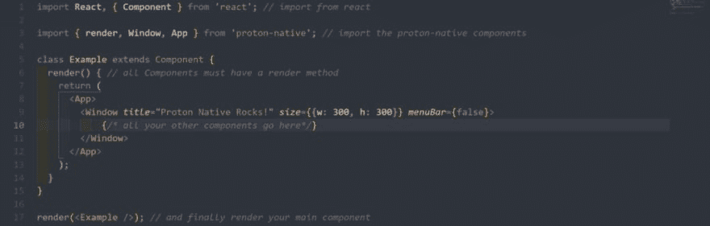
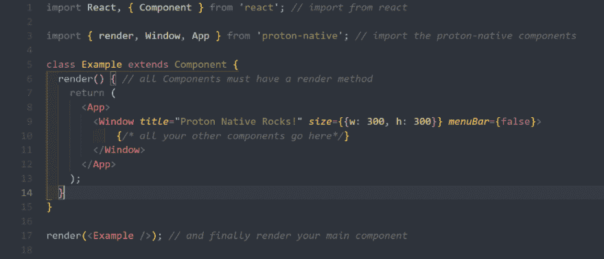
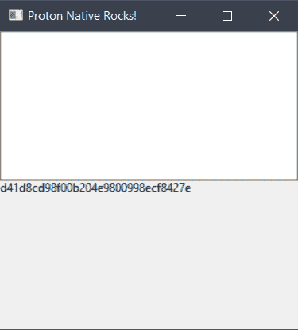
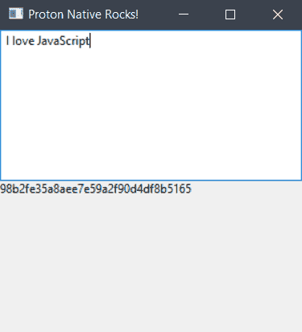

# 如何用 JavaScript 构建原生桌面应用

> 原文：<https://dev.to/msal/build-native-desktop-apps-with-javascript-1gjm>

> 阿特伍德定律:任何可以用 JavaScript 编写的应用程序，最终都会用 JavaScript 编写。杰夫·阿特伍德

[](https://res.cloudinary.com/practicaldev/image/fetch/s--EOGb6wJ5--/c_limit%2Cf_auto%2Cfl_progressive%2Cq_auto%2Cw_880/https://cdn-images-1.medium.com/max/1024/1%2AXyeRix8Z-yOcpRlpubtyuA.png) 

<figcaption>质子原生项目- index.js</figcaption>

今天我们要看看[质子原生](https://proton-native.js.org)并用它做一个简单的哈希应用。

与**电子**应用不同，用**质子原生**构建的应用实际上是**原生**(因此得名)而不是基于 chromium 的网络。

质子原生版类似于**反应原生版**，但是对于桌面，它编译成本原生平台代码，所以看起来和执行起来像原生应用。

## 窗口

通过运行
`npm install --global --production windows-build-tools`安装构建工具

## Linux

您将需要这些库:

*   libgtk-3-dev
*   构建-基本

## Mac

你什么都不需要。

现在运行`npm i -g create-proton-app`，和`create-proton-app my-app`做一个新项目。

用您喜欢的代码编辑器打开项目目录，该目录应该如下所示:

```
└───node\_modules
├───.babelrc
├───index.js
├───package.json
└───package-lock.json 
```

`index.js`应该是这样的:

[](https://res.cloudinary.com/practicaldev/image/fetch/s--HE6kCKeA--/c_limit%2Cf_auto%2Cfl_progressive%2Cq_auto%2Cw_880/https://cdn-images-1.medium.com/max/1024/1%2ABUgjpvWtCCZNPJ__qrQxig.png) 

<figcaption>*正如你所看到的样子 React/React 原生文件*</figcaption>

就像任何 react 或 React 原生项目一样，我们导入 React 库并创建一个类组件。

元素只是一个保存窗口和菜单的容器，`Window`有三个道具；`title`(窗口标题)、`size`(获取包含窗口宽度和高度的对象)、`menuBar`(设置为 false，因为我们不想要菜单栏)。

在我们开始编码之前，让我们使用`npm`安装`crypto`:

`npm i crypto`

我们将使用加密*将文本散列为 md5。*

### index.js

```
import React, { Component } from "react";
import { render, Window, App, Box, Text, TextInput } from "proton-native";
import crypto from "crypto";

class Example extends Component {
state = { text: "", md5: "" };

hash = text => {
    this.setState({ text });

    let md5 = crypto
    .createHash("md5")
    .update(text, "utf8")
    .digest("hex");

    this.setState({ md5 });
};
render() {
    return (
    <App>
        <Window
        title="Proton Native Rocks!"
        size=
        menuBar={false}
        >
        <Box>
            <TextInput onChange={text => this.hash(text)} />
            <Text>{this.state.md5}</Text>
        </Box>
        </Window>
    </App>
    );
}
}

render(<Example />); 
```

我首先导入了`Text`和`TextInput`以便以后使用，然后在`class`中将状态对象中的`text`和`md5`设置为空字符串后，我创建了一个接受文本参数的函数`hash`。

在散列函数中，我们将`state`设置为`text`，并声明`md5`来存储散列文本

```
this.setState({ md5});
let md5 = crypto.createHash("md5")
.update(text, "utf8").digest("hex"); 
```

并将状态对象设置为更新后的 md5。

```
this.setState({ md5 }); 
```

`render`方法返回一些 jsx 元素，`Box`元素就像 React 中的`div`或 React Native 中的`View`，它们持有`TextInput`和`Text`，因为 window 元素不允许有多个子元素(这是什么中国啊…抱歉)。

`TextInput`有一个`onChange`属性，每次文本改变时都会被调用，所以我们将它设置为一个胖箭头函数，它接受一个`text`参数并返回我们之前创建的`hash`函数。

所以现在每次文本改变时`text`都使用`md5`散列。

现在如果我们用

`npm run start`

这个窗口应该会弹出

[T2】](https://res.cloudinary.com/practicaldev/image/fetch/s--23PJYY2O--/c_limit%2Cf_auto%2Cfl_progressive%2Cq_auto%2Cw_880/https://cdn-images-1.medium.com/max/375/1%2AD_fBTxyGSpUbIVPcyt3Kzw.png)

如果我们输入一些文本，它会被哈希到 md5

[T2】](https://res.cloudinary.com/practicaldev/image/fetch/s--w2HfMEdm--/c_limit%2Cf_auto%2Cfl_progressive%2Cq_auto%2Cw_880/https://cdn-images-1.medium.com/max/375/1%2AazNLC0SBkJs85SK-fj15fw.png)

你可能会说“它看起来很丑，让我们给它添加一些样式”好吧…在写这篇文章的时候，Proton Native 仍处于起步阶段，有很多错误，它还不支持样式，但它是一个有趣的项目。

如果你想为这个项目做贡献，请查看[回购](https://github.com/kusti8/proton-native)

如果您有任何问题或建议，请随时发表评论或通过 [Twitter](https://twitter.com/4msal4) 联系我，不要忘记点击那个鼓掌按钮:)

查看之前的文章

[如何用 React Native 搭建新闻 app](https://dev.to/msal4/how-to-build-a-news-app-with-react-native-4ifd)

* * *