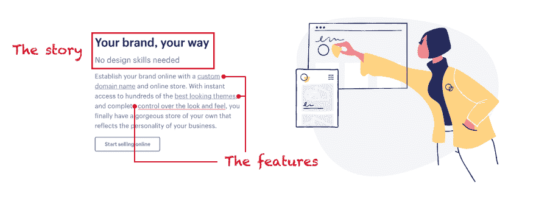

# 构建故事，而不是功能

> 原文：<https://dev.to/tability/build-stories-not-features-2cjl>

我们都希望我们的数据受到保护。解决这个问题的一个方法是拥有一个受密码保护的帐户，但是没有人会对拥有另一套凭证来管理的想法感到兴奋。安全是*的故事*，有密码是*的特色*。

## 故事与特色

几乎应用程序中的每个功能都可以被描述为一个特性。您创建一个帐户，添加内容，与您的朋友联系，等等。应用程序由几十个、几百个甚至几千个部分组成，这些部分相互交互，帮助用户实现特定的目标。

然而，如果我们想要成功地交付伟大的体验，在抽象的层面上思考是很重要的。我们需要把我们的视野定得足够高，这样对于我们试图解决的问题就有许多可能的答案。这些答案将最终成为我们实现的功能。

如果我们看看 [Shopify](https://www.shopify.com/) 的例子，他们在网站上做得很好，强调他们的故事，然后在下面列出相关的功能。

[T2】](https://res.cloudinary.com/practicaldev/image/fetch/s--s3JqST9Y--/c_limit%2Cf_auto%2Cfl_progressive%2Cq_auto%2Cw_880/https://blog.squadlytics.com/conteimg/2018/08/story_vs_features.png)

*   **故事:**你可以控制你的品牌
*   **功能:**自定义域名，主题，可定制 CSS

当你想到一个特性时，一个简单的方法就是使用 [5 个为什么](https://en.wikipedia.org/wiki/5_Whys)。这自然会迫使你回到你需要解决的根本问题。

## 为什么重要

我们总是有计划的。但是许多事情会延迟或停止项目。这可能是管理不善，一些不可预见的技术限制，或同步多个工作流的困难。所以，如果你想继续为你的用户提供价值，你就需要灵活性。如果你使用敏捷方法，当你偏离轨道时，它会帮助你更快地实现。但这只有在你能根据这些信息采取行动时才有帮助。

有一个支配性的故事来指导你的路线图将会使改变范围或转换优先级变得更容易。就 Shopify 而言，一个目标是帮助顾客随身携带他们的品牌。如果某个特定的特性碰巧比预期的更复杂，那么有很多选择。您仍然可以在更改交付给用户的功能集的同时实现最初的目标。

用故事的方式思考也会帮助你在解决方案中更有创造性。今天，我们可以只看着我们的手机解锁-我们用我们的脸作为密码，不再需要输入东西。当然，我们必须等待合适的技术出现。但也是因为有人站在更高的角度看问题。

## 故事很有力量

在 Squadlytics，我们在早期花了很多时间来定义我们的目的是什么: ***帮助团队保持他们项目的脉搏*** 。在第一次迭代中，我们发布了一些非常酷的东西。但我们很快意识到，它并没有朝着正确的方向发展。

我敢肯定，如果没有这种愿景，我们会一直低着头，发布一个又一个功能，并创建一个解决方案来寻找问题。相反，我们能够回到绘图板，设计一个更好的平台。

故事将阐明你的信息，叙述远比一长串的能力清单更有说服力和鼓舞人心。