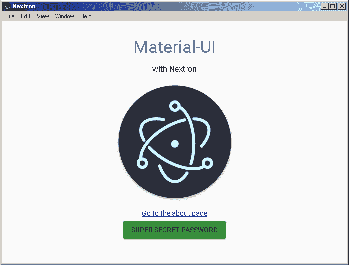
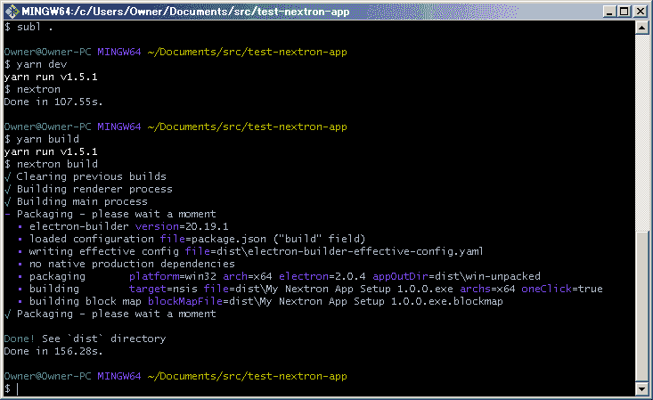
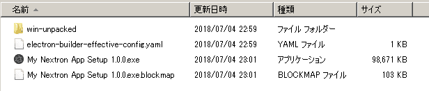

# 用 3 个步骤构建一个电子+ Next.js 应用程序

> 原文：<https://dev.to/saltyshiomix/build-the-electron--nextjs-app-for-3-steps-5g2p>

```
# 1\. Install
$ npm i -g nextron

# 2\. Create nextron app (with template of `examples/with-javascript-material-ui`)
$ nextron init test-app --template with-javascript-material-ui

# 3\. Run development mode
$ cd test-app
$ yarn (or `npm install`)
$ yarn dev (or `npm run dev`) 
```

Enter fullscreen mode Exit fullscreen mode

[T2】](https://res.cloudinary.com/practicaldev/image/fetch/s--RuNoh_oR--/c_limit%2Cf_auto%2Cfl_progressive%2Cq_auto%2Cw_880/https://i.imgur.com/trvnMJ6.png)

## 刚刚上映`nextron@0.7.5`。

*   [npm](https://npm.im/nextron)
*   [GitHub](https://github.com/saltyshiomix/nextron)

## 主要变化

*   修复几乎所有的错误
*   升级到`electron@^2.0.4`
*   升级到`next@6.1.1`
*   较小的依赖性
*   简单的 cli like `nextron init test-app`
*   更多例子(上面的截图是`examples/with-javascript-material-ui`的一个首页)

## 用法

### 安装

```
$ npm install --global nextron 
```

Enter fullscreen mode Exit fullscreen mode

### 创建应用程序

要创建`<MY-APP>`，只需运行下面的命令:

```
$ nextron init <MY-APP> 
```

Enter fullscreen mode Exit fullscreen mode

### 用模板创建应用程序

您可以使用`examples/*`示例应用程序作为模板。

要创建`example/with-typescript`应用程序，运行下面的命令:

```
$ nextron init <MY-APP> --template with-typescript 
```

Enter fullscreen mode Exit fullscreen mode

### 用开发模式运行电子

运行`npm run dev`，nextron 自动启动电子 app。

```
{  "scripts":  {  "dev":  "nextron"  }  } 
```

Enter fullscreen mode Exit fullscreen mode

### 生产构建

运行`npm run build`，nextron 在`dist`文件夹下输出打包好的 bundles。

```
{  "scripts":  {  "build":  "nextron build"  }  } 
```

Enter fullscreen mode Exit fullscreen mode

[T2】](https://res.cloudinary.com/practicaldev/image/fetch/s--NRABRFLm--/c_limit%2Cf_auto%2Cfl_progressive%2Cq_auto%2Cw_880/https://thepracticaldev.s3.amazonaws.com/i/xub4oeadjgrqc4lngzxn.png)

[T2】](https://res.cloudinary.com/practicaldev/image/fetch/s--zqagAAnZ--/c_limit%2Cf_auto%2Cfl_progressive%2Cq_auto%2Cw_880/https://thepracticaldev.s3.amazonaws.com/i/4vrv7b66dr3iededpphp.png)

## 待办事宜

*   更多示例
*   更多 CLI 选项
    *   例 1。)`nextron build --all`
    *   ex2。)`nextron build --ia32 --win`
*   观察主进程和渲染器进程的变化和热重装