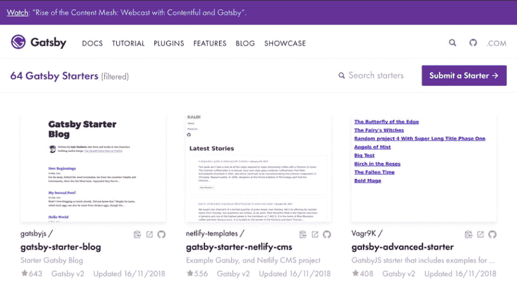

# 用 Gatsby.js 建博客

> 原文：<https://dev.to/alexhyettdev/building-a-blog-with-gatsby-js-h76>

> 披露:这个帖子可能包含附属链接，这意味着如果你决定通过我的链接购买，我会得到一笔佣金，对你来说是免费的。请阅读我的[披露](https://www.alexhyett.com/affiliate-disclaimer)了解更多信息。

我多年来一直是 WordPress 的忠实用户，现在仍有许多网站在 WordPress 上运行。事实上，WordPress 驱动了 30%的网络。然而，对于这个网站，我想尝试一些不同的东西。

## 我如何开始使用静态站点生成器

我第一次涉足静态网站实际上是从 WordPress 开始的。为了加快你的 WordPress 站点的速度，你可以下载一些插件。其中一个叫做 W3 Total Cache，它的工作原理是缩小你的 JavaScript 和 CSS，然后将文章和页面转换成静态 HTML，这样它们就可以被缓存了。

这大大加快了我的网站的速度，让我在 Pingdom 中获得了 A 级。然而，我仍然不得不登录我的 WordPress 系统来写博客。我当时的主机提供商很便宜，但也很慢，这意味着写博客很痛苦。(注意，我现在用 [SiteGround](https://geni.us/aOq9) 做我的 WordPress 网站，它们现在快多了。)

为了解决登录我的网站写文章的速度问题，我尝试了一些离线的 Wordpress 编辑器，比如 [Desk](https://www.producthunt.com/posts/desk-3-0) 和 [Blogo](https://www.getblogo.com/) 。这些还可以，但我发现我要么不喜欢这个界面，要么它们不能完全工作，因此我仍然不得不登录来发布我的帖子。

要记住的另一个问题是安全性。即使对于我的小网站，我一天也会收到几封来自黑客的失败登录尝试的电子邮件(小提示，永远不要把你的用户命名为 admin 或在你的网站名称之后)。

当开发 Wordpress 主题时，我在 Docker 容器中运行所有的东西[,然后 WordPress 总是响应迅速。所以我想为什么不创建一个静态版本的网站并使用它。我用](https://github.com/alexhyett/wordpress-node)[简单静态](https://wordpress.org/plugins/simply-static/) WordPress 插件创建了我网站的静态版本，然后把它全部上传到 S3。

这对于所有的静态网站都是正确的，但是如果你打算静态化，有几个问题你必须考虑。

### 动态的东西不起作用

很明显，对于一个静态的站点，它下面没有数据库，所以任何调用它的东西都不会工作。

搜索是显而易见的。所以我不得不移除搜索框。我的大部分流量来自搜索引擎和社交媒体，所以损失并不大。使用谷歌分析，我发现我的搜索框在去年只被使用过一次！

重定向插件，我有几个插件处理重定向网址，这些也停止工作。如果你不使用很多插件，那么你应该没问题。

评论。没有数据库，就没有地方存放插件。这可以通过使用 Disqus 之类的东西来解决。

总的来说效果不错，但是总的来说我不太喜欢用 WordPress 写博客。幸运的是，现在有大量的静态站点生成器可用。

## 静止站点发电机的兴起

当研究静态站点生成器时，出现了很多。这些是主要的:

*   这是最广为人知的静态站点生成器之一，主要由开发人员使用。
*   [Hugo](https://gohugo.io/) -一个用 go 写的静态站点生成器。
*   如果你喜欢使用 Vue.js，那么你可能会考虑 Vue.js。虽然你可以用它来创建一个博客，但它主要用于网络应用。
*   [Gatsby.js](https://www.gatsbyjs.org/) -基于 React.js 的网站生成器。

我想对我的网站有相当多的控制。我不仅想要一个伟大的设计，我还想在未来建立定制的工具。

Nuxt.js 是一个候选网站，但是在我看来，它对于一个博客来说太过了。

Hugo 有能力编写插件，但它是用我不熟悉的 go 语言编写的。

你需要为任何定制的东西编写插件。

我最终选择了 Gatsby.js，因为我熟悉 React，这给了我创建复杂组件的灵活性，可以将这些组件添加到帖子和页面中。

## Gatsby . js 入门

最简单的开始方式是从其他人已经创建的大量起始项目开始。

[T2】](///static/e9c1c74862b912c9c9082f43b09e48df/69d6b/starter-library.png)

在 Gatsby 网站上查看[初学者库](https://www.gatsbyjs.org/starters/?v=2)。

我打算从头开始设计网站，所以我只需要最基本的模板。所以我选择了盖茨比博客。

请确保您选择的是基于 v2(或最新版本)的版本，因为自 v1 以来有很多变化，并且它们不兼容。

我使用[布尔玛](https://bulma.io/)作为我的 CSS 框架，虽然有一个盖茨比布尔玛启动器，但它是基于 v1 的，所以我不想使用它。但是，您可以选择您想要的任何框架。

要开始，你需要确保你已经安装了 gatsby。

```
npm install -g gatsby 
```

Enter fullscreen mode Exit fullscreen mode

然后你可以简单地用这个启动器创建一个新站点:

```
gatsby new gatsby-blog https://github.com/gatsbyjs/gatsby-starter-blog 
```

Enter fullscreen mode Exit fullscreen mode

要安装所有程序，请运行:

```
yarn install 
```

Enter fullscreen mode Exit fullscreen mode

然后启动你的网站:

```
gatsby develop 
```

Enter fullscreen mode Exit fullscreen mode

这将在 localhost:8000 上运行一个 web 服务器，它将在您做出更改时自动更新。

一旦你的网站准备好了，你就可以用
来构建一个产品版本

```
gatsby build 
```

Enter fullscreen mode Exit fullscreen mode

你的网站将被创建在一个公共文件夹中，然后可以被上传到类似亚马逊 S3 这样的地方。

如果您想预览生产版本，只需输入:

```
gatsby serve 
```

Enter fullscreen mode Exit fullscreen mode

## Gatsby . js 的好处

我认为 Gatsby.js 有许多优点值得一提。

### 用 Markdown 写的帖子

一个很大的好处是你可以在 Markdown 中写你所有的文章。我现在用 Visual Studio 代码写我所有的帖子和代码，“一个编辑器来管理它们”。

不仅在 Markdown 中写文章比在 WordPress 中写文章更有效率，而且现在都有 Git 支持！

### 伟大的外挂

Gatsby.js 有很多很棒的插件，用于谷歌分析(gatsby-plugin-google-analytics)、RSS 提要(gatsby-plugin-feed)、站点地图(gatsby-plugin-sitemap)等等。我最喜欢的一个是 gatsby-transformer-sharp，它可以自动优化我在减价文件中使用的所有图片。

### 页写在 React 上

当然，最棒的是我所有的页面都是用 react 写的，这意味着我也可以使用所有可用的 react 组件。

## 结论

对于喜欢用 React 编写的开发人员，我强烈建议尝试一下 Gatsby.js。如果你不是开发者，那么 Gatsby 不适合你，Wordpress 可能是你最好的选择。