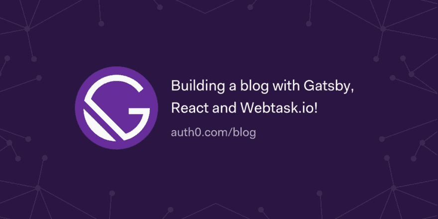

# 用 Gatsby，React 和 Webtask.io 建博客！

> 原文：<https://dev.to/auth0/building-a-blog-with-gatsby-react-and-webtaskio--302k>

Gatsby 是一个现代的基于 React 的静态内容生成器，它拥有令人印象深刻的开箱即用特性列表。在本文中，我们将构建一个博客，并添加额外的功能，如分页、使用 Auth0.js 的用户认证以及使用构建在 [Webtask.io](https://webtask.io/) 上的 API 端点订阅时事通讯。

[开始行动🚀](https://auth0.com/blog/building-a-blog-with-gatsby-react-and-webtask/?utm_source=dev&utm_medium=sc&utm_campaign=gatsby_blog)

[T2】](https://res.cloudinary.com/practicaldev/image/fetch/s--yllT_KqC--/c_limit%2Cf_auto%2Cfl_progressive%2Cq_auto%2Cw_880/https://thepracticaldev.s3.amazonaws.com/i/66eggyslj6s2a8eu9xmw.png)