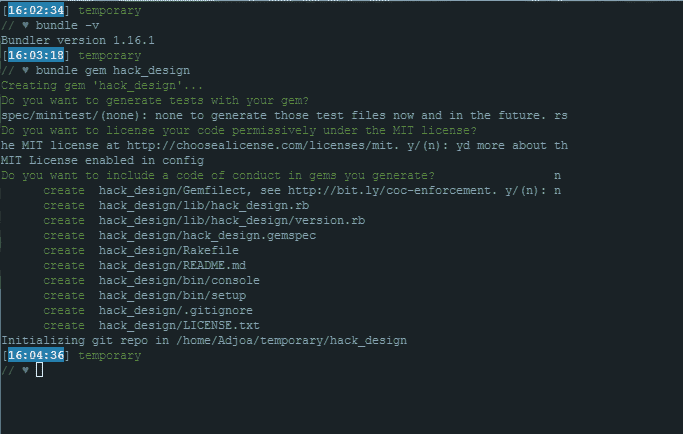

# 用 Ruby 构建命令行界面

> 原文：<https://dev.to/adjoa/building-a-command-line-interface-with-ruby--370k>

在这篇文章中，我将讲述我用 Ruby 构建命令行界面应用程序的经历；生成一个 gem 目录，用 Nokogiri 抓取数据，并组装用户界面。

## 绘制自己的地图

通过几周的学习，我逐渐提高了使用 Ruby 的技能，这是我的第一个个人项目——命令行界面应用。在之前的练习中，有通过或失败的测试，来告诉我什么时候我确实朝着正确的方向前进。但是这一次，我唯一的指导是我对最终结果的设想和这些项目需求:

*   提供一个 CLI。
*   CLI 必须提供对网页数据的访问。
*   提供的数据必须至少深入一个级别，通常是通过向用户显示可用数据的列表，然后能够深入到特定的项目。
*   使用好的面向对象设计模式。

## 寻北

在我能写一行代码之前，我需要选择一个网站来刮。这将决定我的应用程序将提供访问的数据类型，即其用途。而且，我需要选择一些我可以不太困难地刮下来的东西。

谢天谢地，我有一个网站在我的后口袋里，我怀疑会工作得很好。黑客设计网站提供各种类别的设计课程。它的页面适合所需的一层深度模型。而且它们是通过静态 HTML 呈现的，把它们放在我希望的难度范围内。能够从命令行的最小环境中获得这些经验，我觉得是一个很酷的想法。因此，在粗略评估了我是否能够收集到我需要的内容后，我决定尝试一下。

## 设置

我从一开始就知道，我希望能够将我的应用程序包装成自包含的、可分发的 gem 格式。 [Bundler](http://bundler.io/v1.16/guides/creating_gem.html#getting-started) 让脚手架目录的入门变得简单。

[T2】](https://res.cloudinary.com/practicaldev/image/fetch/s--SY_wr794--/c_limit%2Cf_auto%2Cfl_progressive%2Cq_auto%2Cw_880/https://raw.githubusercontent.com/Adjoa/words-with-pictures/master/pictures/bundler.PNG)

第一次运行`bundle gem`命令时，您可以选择包含一个`CODE_OF_CONDUCT.md`和`LICENSE.txt`。我选择了许可证。我更新了我的`.gemspec`文件，详细介绍了我的宝石:我的宝石将会做什么的简短总结和更详细的描述。当我向前推进它的功能时，我添加了一个其他 gem 的简短列表，它将依赖于这些 gem 来运行。

## 目的地的景色

我从编写模拟应用程序预期行为的用户界面代码开始。用户会收到一条欢迎消息和选项:查看类别、查看课程、查看随机课程或退出。我还没有任何类别或课程，所以我扔在一些填充物开始。这个代码存在于`lib/hack_design/cli.rb`中。我会在一个名为`bin/hack-design`的可执行文件中调用这段代码，并运行我的程序。

我没有做过任何测试，但是我知道我期望我的代码做什么。调试是我走向成功的一个不断尝试和出错的过程。这项技术将带我完成应用程序的开发。

## 断断续续

我打算将数据分成两层——一节课中提供内容(包括练习),一个类别中提供内容。从我构建的 UI 中得到启示，我创建了类来模拟一个`Category`、一个`Lesson`、一个`Exercise`和一个`Scraper`。我使用`./bin/console`通过寻找预期的行为来测试这些类。然而，当我开始教我的`Scraper`如何寻找和收集类别时，生活扔给我一些曲线球，这有效地拖延了我大约 2 周的进度。

当我回来时，我为失去的时间而焦虑。对我的`Scraper`中的数据进行更仔细的调查后，很快发现搜集每个类别比我最初想象的要困难得多。所以，我想了想。首先，我想为用户提供课程内容。列出类别对于应用程序的目的真的那么重要吗？我决定不要，开始简化。

我扔掉了`Category`和`Exercise`类。我只剩下了我需要的东西:一个`Lesson`类，它的对象将组织每节课的数据，一个`Scraper`从网站收集这些数据，一个`CLI`管理用户界面。我重构了 UI 以反映这些变化。它会列出可供选择的课程，而不是类别。而且，数据现在只有一层深度。

## 关闭你的数据源

随着我的 UI 的启动和运行，是时候为它提供真实的数据了。我知道要做几次尝试才能找到正确的搜索查询。从我之前的尝试中，我也知道太多的查询很可能会阻塞我。我决定通过将我要抓取的页面复制到 fixtures 文件夹来解决这个问题。这将允许我把我对现场的请求保持在最低限度。

Hack Design 的设置方式，全部 51 课都可以在一个课[主页](https://hackdesign.org/lessons)上找到。在该页面中，每节课都链接到它自己的页面。通过使用 [cURL](https://curl.haxx.se/docs/manpage.html) 获取 HTML 并将其放入一个新文件，复制主页的源代码就简单地完成了。

```
curl http://hackdesign.org/lessons/ >> fixtures/site/lessons.html 
```

Enter fullscreen mode Exit fullscreen mode

然而，其他 51 页将构成更大的挑战。我绝不会浏览每一页，并为 51 个单独的文件复制数百行 HTML。我写了一个 Bash 脚本来代替它。

```
#!/bin/bash
#get-lesson.sh

typeset -i - END
let END=50 i=0
while ((i<=END)); do echo “Script starting now…”
  curl https://hackdesign.org/lessons/$i -O
  let i++
done echo “Done” 
```

Enter fullscreen mode Exit fullscreen mode

## 用 Nokogiri 向前刮

没多久，我就有了所有需要的文件。对于这个任务，我使用了一个名为 Nokogiri 的 HTML 解析器。它能够使用 CSS 搜索文档。我使用 CSS 选择器聚焦于包含我想要的数据的 HTML 元素。为了与黑客设计网站的设置保持一致，`Scraper`有两种方法。

`::scrape_lessons_page`抓取课程主页。为每个课程创建一个哈希，将课程标题和 url 添加到该哈希中，然后将该哈希添加到所有课程的数组中。

`::scrape_lesson`抓取课程的内容页面。它将特定课程的教师姓名和其他内容添加到哈希中，并返回结果。

## 同学会:返回 CLI

`CLI`是`Scraper`和`Lesson`类联合起来产生`Lesson`对象的地方，这些对象对充满内容的单个课程进行建模。在这里，散列充当了`Scraper`和`Lesson`类之间的粘合剂，将数据从`Scraper`传送到`Lesson`，允许它们在保持独立和专注的同时一起工作。

创建一个`Lesson`对象只需要一个标题和一个 URL。我通过迭代来自`::scrape_lessons_page`的散列数组创建了 51 个`Lesson`对象。然后我将每个`Lesson`对象的 URL 传递给`::scrape_lesson`，后者返回一个数据散列，我可以将它添加到现成的`Lesson`对象中。这个过程很顺利，直到……没有。

其中一页弄坏了我的。通过使用 Pry 和对我的代码进行一些临时的调整，我能够追踪到引起麻烦的页面。原来[第 41 课](https://hackdesign.org/lessons/41)的一个练习中有一个列表。然而，我的`Scraper`是将练习确定为列表项目。当在一个列表中发现这个列表时，它会将列表项分类为另一个练习，然后当它在列表中没有找到一个练习的典型内容时就会崩溃。它需要一种方法来区分练习及其内容。为此，我将 CSS 选择器做得更具体一些。我很高兴调试这个。

51 个已完成的`Lesson`对象使得填写用户界面非常简单。我可以遍历所有的`Lesson`对象，并相应地显示它们包含的信息。我添加了一些方法来实现从一个课程内容到另一个课程内容的导航，而不用返回列表，并且用[着色](https://github.com/fazibear/colorize)宝石添加了一点颜色。然后，我就完了。我已经构建了一个 Ruby 命令行应用程序！

最后，我打包、安装并测试了我的 gem。Bundler 让[包装和发布你的宝石](http://bundler.io/v1.16/guides/creating_gem.html#releasing-the-gem)就像开始一样简单。我选择不发布我的 gem，但是我已经包含了如何在本地打包和安装它的说明。查看我的代码，[这里](http://github.com/Adjoa/hack_design-cli-app)。

## 深情的告别

完成这个项目是对抗失败恐惧的一次练习。每一步都绝对值得。我为这个更简单的最终产品感到自豪，并对接下来的产品感到兴奋。

感谢你花时间阅读这篇文章。下一集再见！

封面艺术:[松本刚美](https://matsumayu.deviantart.com/)