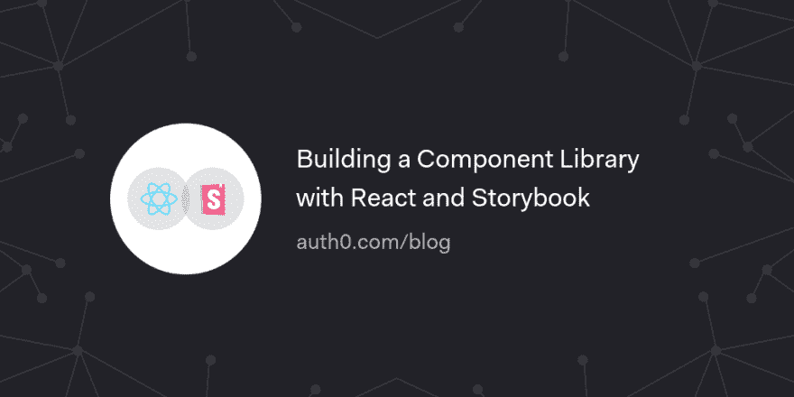

# 用 React 和 Storybook 构建组件库

> 原文：<https://dev.to/auth0/building-a-component-library-with-react-and-storybook-2l5n>

了解如何使用 React 和 Storybook 构建组件库，以创建可跨项目共享的模块化和可重用组件。

[读读⚛️📕](https://auth0.com/blog/building-a-component-library-with-react-and-storybook/?utm_source=dev&utm_medium=sc&utm_campaign=react_storybook)

[T2】](https://res.cloudinary.com/practicaldev/image/fetch/s--i8Y5RmaK--/c_limit%2Cf_auto%2Cfl_progressive%2Cq_auto%2Cw_880/https://thepracticaldev.s3.amazonaws.com/i/pdzwyi26cps3wuqy3hg2.png)