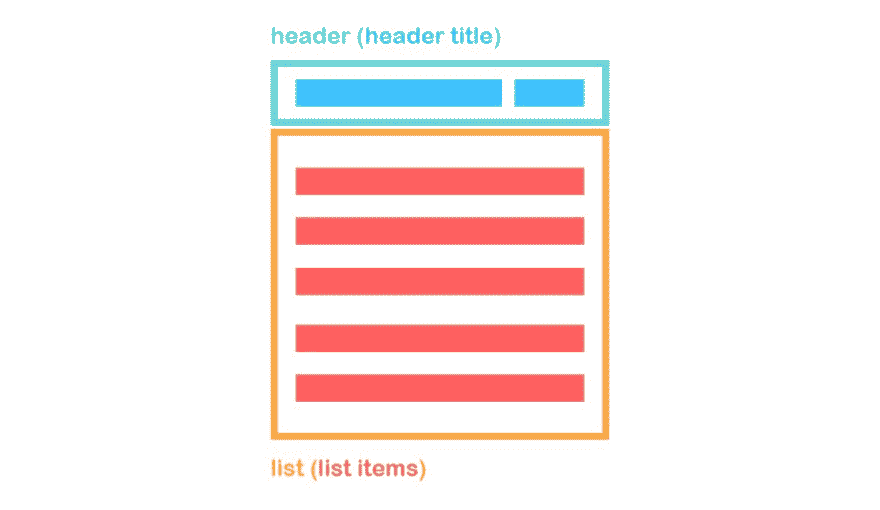
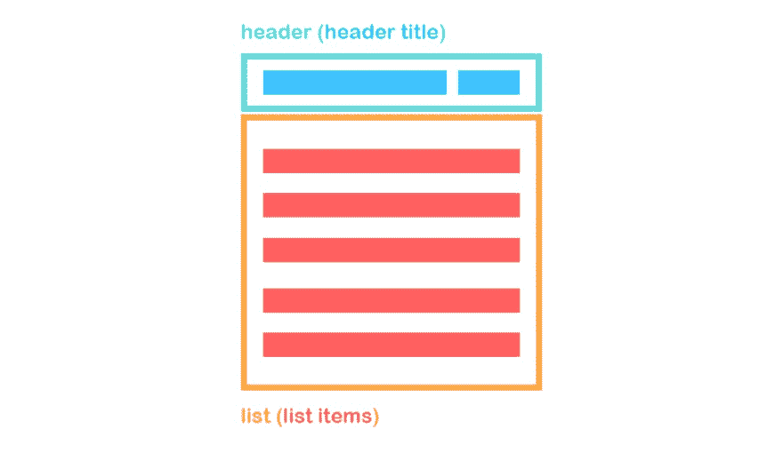
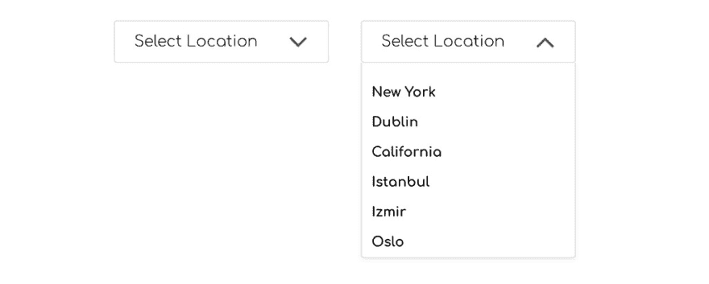
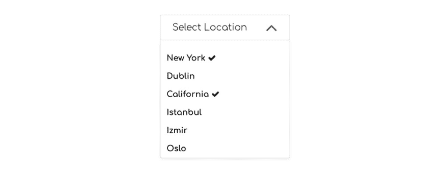
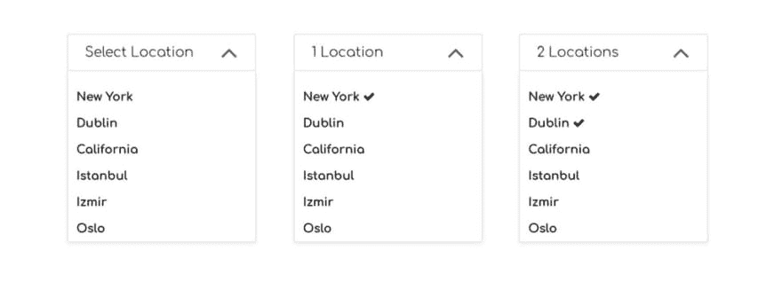

# 为 React 构建自定义下拉菜单组件

> 原文：<https://dev.to/bnevilleoneill/building-a-custom-dropdown-menu-component-for-react-9mg>

[T2】](https://res.cloudinary.com/practicaldev/image/fetch/s--bwPnStB8--/c_limit%2Cf_auto%2Cfl_progressive%2Cq_auto%2Cw_880/https://cdn-images-1.medium.com/max/1024/1%2AW9T0Y0rhnfYyUHHEmjKQCw.jpeg)

的确，当涉及到特定的需求和样式时，将现有的组件应用到您的项目中可能并不总是像您希望的那样顺利。在这种情况下，考虑到在适应过程中花费的时间，构建您自己的组件可能是您最感兴趣的。

本文将向您介绍我在个人项目中使用的方法，在 React 中创建一个自定义下拉菜单组件。

### **视觉结构**

在深入技术内容之前，让我们快速查看一下下拉菜单组件的视觉结构，并确定需求。

<figure>[](https://res.cloudinary.com/practicaldev/image/fetch/s--NQTJcr_q--/c_limit%2Cf_auto%2Cfl_progressive%2Cq_auto%2Cw_880/https://cdn-images-1.medium.com/max/1024/1%2A-TnLNBE384Cy2G0bsbUZkA.jpeg) 

<figcaption>一个下拉组件的可视化结构</figcaption>

</figure>

下拉菜单由四个基本组件组成:

*   **割台**包装
*   **标题标题**
*   **列表**包装
*   **列表项**

相应的 HTML 可能是这样的:

```
<div className="dd-wrapper">
  <div className="dd-header">
    <div className="dd-header-title"></div>
  </div>
  <ul className="dd-list">
    <li className="dd-list-item"></li>
    <li className="dd-list-item"></li>
    <li className="dd-list-item"></li>
  </ul>
</div> 
```

Enter fullscreen mode Exit fullscreen mode

*   我们需要能够在点击 **dd-header** 时切换 **dd-list** ，并在 **dd-wrapper** 外点击时关闭它
*   我们需要根据数据自动填充 *<李>* 标签
*   我们需要能够控制标题

在我们开始满足这些需求之前，我们必须决定是使用功能组件还是类组件。

### **功能构件还是类构件？**

在 React 16 的最新版本中，功能组件变得更快。

然而，当您需要组件或任何组件生命周期挂钩中的状态定义时，并不总是能够利用这一点。

对于这个具体的例子，没有状态定义或生命周期挂钩也可以实现，但是部署它们会使事情变得更加整洁和简单。

使用功能组件需要传递一些变量作为道具。当我们与下拉菜单交互时，我们会改变这些道具。从子组件更改父组件的属性需要将函数作为属性从父组件传递到子组件，以便您可以控制父组件的状态。

如果你做过头了，事情会很快变得复杂。所以，总有需要考虑的权衡。

我们将部署一个带有状态和生命周期挂钩的类组件，而我们也将使用函数作为道具来控制父状态。

[T2】](https://logrocket.com/?cid=banner_b)

### 组件关系

一个父组件拥有一个或多个下拉菜单，由于每个下拉菜单都有一个独特的内容，我们需要通过将信息作为道具传递来参数化它。

假设我们有一个下拉菜单，在这里我们选择多个位置。

考虑父组件中的以下状态变量:

```
constructor(){
  super()
  this.state = {
    location: [
      {
          id: 0,
          title: 'New York',
          selected: false,
          key: 'location'
      },
      {
        id: 1,
        title: 'Dublin',
        selected: false,
        key: 'location'
      },
      {
        id: 2,
        title: 'California',
        selected: false,
        key: 'location'
      },
      {
        id: 3,
        title: 'Istanbul',
        selected: false,
        key: 'location'
      },
      {
        id: 4,
        title: 'Izmir',
        selected: false,
        key: 'location'
      },
      {
        id: 5,
        title: 'Oslo',
        selected: false,
        key: 'location'
      }
    ]
  }
} 
```

Enter fullscreen mode Exit fullscreen mode

在填充位置数组时，我们有一个唯一的 id 用于映射方法的键属性；列表中每个项目的标题；一个名为 selected 的布尔变量，用于切换列表中的选定项目(在下拉菜单中有多个选择的情况下)和一个键变量。

Key 变量在与 **setState** 函数一起使用时非常方便。我稍后会谈到这一点。

现在让我们看看到目前为止我们传递给 **Dropdown** 组件的道具，并相应地塑造组件。下面你会看到在父组件中使用的**下拉列表**组件。

```
<Dropdown
  title="Select location"
  list={this.state.location}
/> 
```

Enter fullscreen mode Exit fullscreen mode

我们要显示一个标题和一组数据。

在编辑 **render()** 方法之前，我们需要一个组件状态定义。

```
constructor(props){
  super(props)
  this.state = {
    listOpen: false,
    headerTitle: this.props.title
  }
} 
```

Enter fullscreen mode Exit fullscreen mode

这里我们有一个用于切换菜单列表的 listOpen 布尔变量和一个 headerTitle，它相当于 title prop。

下面请看当前配置的 **render()** 方法，以及分别在 **dd-wrapper** 外点击时切换列表和关闭列表的 **toggleList()** 和 **handleClickOutside()** 方法。

注意 **handleClickOutside()** 来自名为[**react-onclickoutside**](https://github.com/Pomax/react-onclickoutside)**的第三方 HOC(高阶组件)。**

而且， [**FontAwesome**](https://www.npmjs.com/package/react-fontawesome) 是一个封装了 font-awesome 图标库的组件。

```
handleClickOutside(){
  this.setState({
    listOpen: false
  })
}
toggleList(){
  this.setState(prevState => ({
    listOpen: !prevState.listOpen
  }))
}
render(){
  const{list} = this.props
  const{listOpen, headerTitle} = this.state
  return(
    <div className="dd-wrapper">
    <div className="dd-header" onClick={() => this.toggleList()}>
        <div className="dd-header-title">{headerTitle}</div>
        {listOpen
          ? <FontAwesome name="angle-up" size="2x"/>
          : <FontAwesome name="angle-down" size="2x"/>
        }
    </div>
     {listOpen && <ul className="dd-list">
       {list.map((item) => (
         <li className="dd-list-item" key={item.id} >{item.title}</li>
        ))}
      </ul>}
    </div>
  )
} 
```

Enter fullscreen mode Exit fullscreen mode

应用样式后，我们得到以下结果。

注意，我们还部署了 listOpen，通过使用条件(三元)操作符来上下切换箭头图标。

<figure>[](https://res.cloudinary.com/practicaldev/image/fetch/s--7kxtOJqJ--/c_limit%2Cf_auto%2Cfl_progressive%2Cq_auto%2Cw_880/https://cdn-images-1.medium.com/max/1024/1%2Ah01tLGftHBfRkqT_-PkWGA.jpeg) 

<figcaption>下拉菜单，关闭并打开</figcaption>

</figure>

### 从子控制父状态

当您将某个东西作为道具传递给子组件时，您只能使用该数据，并且不能更改它，除非您部署了额外的道具。

传递一个使用 **setState** 作为道具的函数使你能够控制其他道具。

您所做的基本上是从您的子组件调用一个在父组件中定义的函数来触发 **setState** ，这将改变最初作为道具传递的状态。

在下拉菜单的情况下，当单击列表元素时，我们需要能够在位置状态下切换相应对象的选定键。

### 控制父功能

在父组件中定义以下函数，并将其作为道具传递给子组件，即 **Dropdown** 组件，这将使我们能够将所需信息控制在所需状态。

```
toggleSelected(id, key){
  let temp = this.state[key]
  temp[id].selected = !temp[id].selected
  this.setState({
    [key]: temp
  })
} 
```

Enter fullscreen mode Exit fullscreen mode

注意，我们为 **toggleSelected()** 函数提供了 id 和键参数。

记住，我们为位置数组中的每个对象定义了一个名为 key 的键/值对，现在是时候使用它了。

通过使用这个键，我们可以告诉 **toggleSelected()** 函数要改变哪个状态变量。

```
key = "location"
//These two refers to the same state variable
- this.state.location
- this.state[key] 
```

Enter fullscreen mode Exit fullscreen mode

同样，id 告诉 location 数组变量中要引用哪个对象。

把它当道具传的时候:

```
<Dropdown
  title="Select location"
  list={this.state.location}
  toggleItem={this.toggleSelected}
/> 
```

Enter fullscreen mode Exit fullscreen mode

里面叫它 *<李>* 标签:

```
<li className="dd-list-item" key={item.title} onClick={() => toggleItem(item.id, item.key)}>{item.title} {item.selected && <FontAwesome name="check"/>}</li> 
```

Enter fullscreen mode Exit fullscreen mode

另外，请注意，我根据 item.selected 的值添加了一个图标，以指示该项已被选中。

<figure>[](https://res.cloudinary.com/practicaldev/image/fetch/s--gfnvLfTx--/c_limit%2Cf_auto%2Cfl_progressive%2Cq_auto%2Cw_880/https://cdn-images-1.medium.com/max/1024/1%2AYjsDfY4LQIbmU-3OKl82Kw.jpeg) 

<figcaption>在列表中选择多个项目</figcaption>

</figure>

### 动态标题标题

我最后想要的是一个动态的标题，它会根据所选项目的数量而变化。

我们需要做的就是计算有多少选择的键/值对是真的，然后相应地改变 **Dropdown** 组件中的 headerTitle 状态。

当位置属性改变时，我们应该更新组件状态。为了做到这一点，我们需要通过生命周期钩子来监听适当的更新。

静态 getDerivedStateFromProps()是我们需要的。

这是一个新的生命周期挂钩，取代了旧的 componentWillReceiveProps()方法。

因为它是一个静态方法，所以它不能访问这个。这将使我们无法使用 this.setState 和 this.props。

使用这种新方法，要么返回 null 表示没有变化，要么直接返回状态修改。此外，由于静态方法的原因，您无法访问 this.props，因此您应该将之前的属性存储在一个状态中，然后通过 prevState 访问它们。

静态 getDerivedStateFromProps(next props，prevState)

我们需要再向 **Dropdown** 组件传递一个属性来控制标题。

```
<Dropdown
  titleHelper="Location"
  title="Select location"
  list={this.state.location}
  toggleItem={this.toggleSelected}
/> 
```

Enter fullscreen mode Exit fullscreen mode

* * *

```
static getDerivedStateFromProps(nextProps){
    const count = nextProps.list.filter(function(a) { return a.selected; }).length;
    console.log(count)
if(count === 0){
      return {headerTitle: nextProps.title}
    }
    else if(count === 1){
      return {headerTitle: `${count}  ${nextProps.titleHelper}`}
    }
    else if(count > 1){
      return {headerTitle: `${count}  ${nextProps.titleHelper}s`}
    }
  } 
```

Enter fullscreen mode Exit fullscreen mode

标题根据列表中选定项目的数量而变化，如下所示:

<figure>[](https://res.cloudinary.com/practicaldev/image/fetch/s--erJXiwFN--/c_limit%2Cf_auto%2Cfl_progressive%2Cq_auto%2Cw_880/https://cdn-images-1.medium.com/max/1024/1%2A-YgUT8_GfQQIMOSkfN_gBg.jpeg) 

<figcaption>动态标题</figcaption>

</figure>

### 结论

在我为一个项目实现下拉菜单组件的过程中，我基本上是将下拉菜单内容数据保存在包装的父组件中，并将其作为一个道具传递。传递一个函数作为道具是控制父状态的技巧，父状态最终是在 **Dropdown** 组件中使用的数据。

使用静态 getDerivedStateFromProps()有助于根据与下拉菜单的交互来控制标题。

### Plug: [LogRocket](http://logrocket.com) ，一款适用于网络应用的 DVR

[T2】](http://logrocket.com)

LogRocket 是一个前端日志工具，可以让你回放问题，就像它们发生在你自己的浏览器中一样。LogRocket 不需要猜测错误发生的原因，也不需要向用户询问截图和日志转储，而是让您重放会话以快速了解哪里出错了。它可以与任何应用程序完美配合，不管是什么框架，并且有插件可以记录来自 Redux、Vuex 和@ngrx/store 的额外上下文。

除了记录 Redux 操作和状态，LogRocket 还记录控制台日志、JavaScript 错误、堆栈跟踪、带有头+正文的网络请求/响应、浏览器元数据和自定义日志。它还使用 DOM 来记录页面上的 HTML 和 CSS，甚至为最复杂的单页面应用程序重新创建像素级完美视频。

免费试用。

* * *