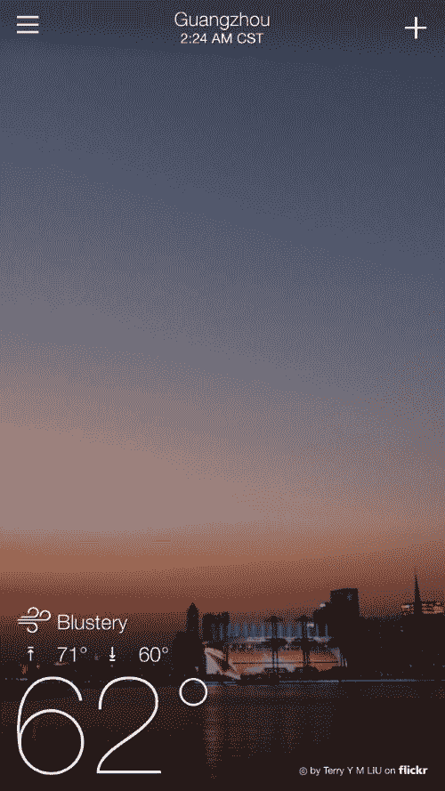
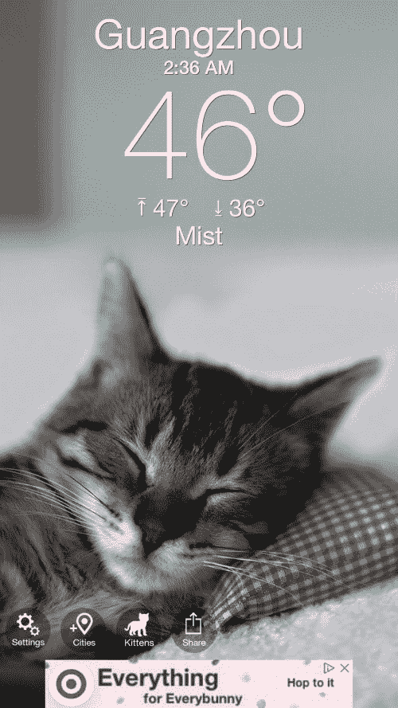
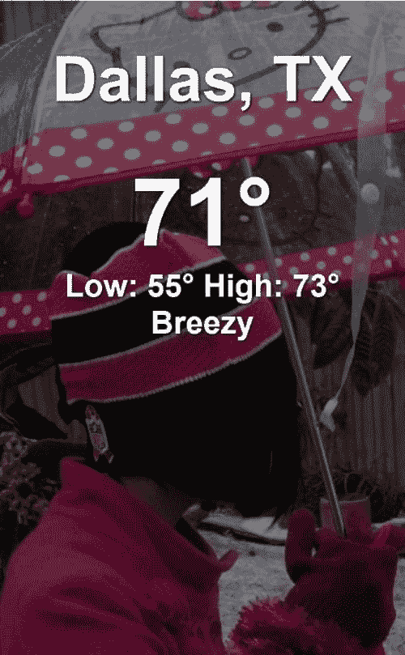
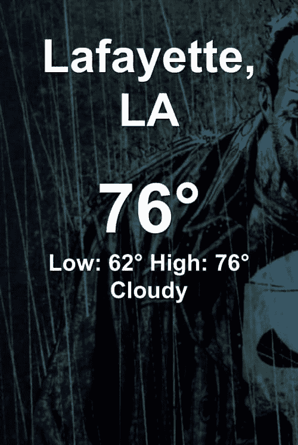

# 在 Vue.js 中构建可定制的天气应用程序

> 原文：<https://dev.to/raymondcamden/building-a-customizable-weather-app-in-vuejs-2jn>

我是一个天气应用收集者。尽管它们基本上都给出了完全相同的信息，但我对天气的美丽渲染情有独钟。我的默认天气应用程序雅虎天气有时会令人震惊。

[T2】](https://res.cloudinary.com/practicaldev/image/fetch/s--vLOx5lg4--/c_limit%2Cf_auto%2Cfl_progressive%2Cq_auto%2Cw_880/https://static.raymondcamden.cimg/2018/03/yahooweather3.jpg)

几天前，我发现了我的新宠- [天气小猫](http://weatherkittyapp.com/)。

[T2】](https://res.cloudinary.com/practicaldev/image/fetch/s--1tHrhON7--/c_limit%2Cf_auto%2Cfl_progressive%2Cq_auto%2Cw_880/https://static.raymondcamden.cimg/2018/03/weatherkitty.jpg)

你也猜到了，还有一只[天气小狗](http://weatherpuppy.com/)，很可爱，但不是猫可爱。抱歉，没有什么能打败它。我在看 kitty 的应用程序，意识到你可以在*任何*话题上做一个天气应用程序，然后疯狂地生产应用程序。因为“像疯了一样”是我建造东西的主要动力，我认为这会很有趣(而且有教育意义！)在 Vue 中搭建一个天气 app。但不是所有的天气应用。一个你可以很容易地(我的意思是访问代码)放入你自己的照片。例如，一个和你的孩子:

[T2】](https://res.cloudinary.com/practicaldev/image/fetch/s--7zpR3j3U--/c_limit%2Cf_auto%2Cfl_progressive%2Cq_auto%2Cw_880/https://static.raymondcamden.cimg/2018/03/kids2.jpg)

甚至是漫威漫画，为什么不呢？

[T2】](https://res.cloudinary.com/practicaldev/image/fetch/s--yaAazaEq--/c_limit%2Cf_auto%2Cfl_progressive%2Cq_auto%2Cw_880/https://static.raymondcamden.cimg/2018/03/marvel.jpg)

总的来说，所有这些应用程序都倾向于遵循一个相似的模式——获取天气信息，并尝试显示适当的图片。在雅虎应用程序的情况下，它是来自同一地理位置的图片。对于其他人来说，这只是一个与当前天气相匹配的图片。

我在这里的最终目标是创建一个应用程序，你可以简单地提供图片。你需要把它们分类(这里是晴天的照片，这里是雨天的照片)，然后你就可以走了。你可以把代码放到网站上，然后在浏览器上运行应用程序。(当然，如果你愿意，你也可以构建一个混合移动应用，但是为什么呢？)

对于代码的第一次迭代，我专注于获取天气并将其渲染到硬编码的图片上。在下一个版本中(可能需要一段时间——我还有一周的旅程),我会按照“下雨了，找到最好的图片”的逻辑工作。可以在这里找到当前的代码库:[https://github . com/cfjedimaster/web demos/tree/master/vue weather/v1](https://github.com/cfjedimaster/webdemos/tree/master/vueweather/v1)。我没有上传图片，所以一定要提供你自己的。好了，让我们来看看各个组件。首先，HTML。

```
<!DOCTYPE html>
<html>
<head>
    <meta charset="utf-8" />
    <meta http-equiv="X-UA-Compatible" content="IE=edge">
    Weather Demo 1
    <meta name="viewport" content="width=device-width, initial-scale=1">
    <link rel="stylesheet" type="text/css" media="screen" href="main.css" />
</head>
<body class="darken">

    <div id="app" v-cloak>
        <div v-if="loading">
            <h1>Loading...</h1>
        </div>
        <div id="content" v-else>
            <h1>{{location}}</h1>
            <p>
                <span class="temp">{{temp}}&deg;</span><br/>
                Low: {{temp_low}}&deg; High: {{temp_high}}&deg;<br/>
                {{desc}}
            </p>
        </div>
    </div>

    <script src="https://cdn.jsdelivr.net/npm/vue"></script>
    <script src="https://unpkg.com/axios/dist/axios.min.js"></script>
    <script src="main.js"></script>
</body>
</html> 
```

Enter fullscreen mode Exit fullscreen mode

这里没什么。基本上，我有一个加载 div(当接收到数据时，它将消失)和几个用于预测的块。大多数天气应用程序支持添加多个城市的方式，我对如何支持这一点有一些想法，但我将推迟到以后。还要注意，我已经加载了[轴](https://github.com/axios/axios)。Axios 是一个 HTTP 客户端，似乎很受 Vue 开发者的欢迎。我认为强迫自己尝试一下会很好，而且在很大程度上，这看起来是个好主意。但是不到五分钟我就碰到了一个[的 bug](https://github.com/axios/axios/issues/1000) ，里面有一个核心特性，所以我可能不会再用了。(这听起来可能有点刻薄，但是如果我马上遇到一个与库有关的问题，我不认为这是一个好的迹象。)

我通常不分享 CSS，但我会在这里这样做。让背景图片和文字正确排列有点困难。我 100%相信这可以做得更好:

```
.darken {
    background-image:linear-gradient(
        rgba(0,0,0,0.5),
        rgba(0,0,0,0.5)
    ), url(rainkids.jpg);
}

body {
    background-size:contain;
    background:url(rainkids.jpg);
}

#content {
    width: 100%;
    text-align: center;
    font-weight: bold;
    text-shadow: 1px 1px 2px black; 
    font-size: 2em;
}

.temp {
    font-size: 3em;
}

body {
    color: white;
    font-family: Arial, Helvetica, sans-serif;
}

[v-cloak] {display: none}; 
```

Enter fullscreen mode Exit fullscreen mode

注意渐变的使用。这样做是为了稍微加深背景，让文字看起来更清晰。后来，我需要使背景图片(这是两次使用)的东西，我可以通过 JavaScript 编辑。说到 JavaScript...

```
const app = new Vue({
    el:'#app',
    data:{
        loading:true,
        lat:null,
        lon:null,
        location:null,
        temp:null,
        temp_low:null,
        temp_high:null,
        images:{
            "rain":[
                "clouds.jpg"
            ]
        }
    },
    created() {

        navigator.geolocation.getCurrentPosition(pos => {
            console.log('got coordinates', pos.coords);
            this.lat = pos.coords.latitude;
            this.lon = pos.coords.longitude;
            this.loadWeather();
        });

    },
    methods:{
        loadWeather() {

            axios.get(`https://query.yahooapis.com/v1/public/yql?q=select%20*%20from%20weather.forecast%20where%20woeid%20in%20(SELECT%20woeid%20FROM%20geo.places%20WHERE%20text%3D%22(${this.lat}%2C${this.lon})%22)&format=json&env=store%3A%2F%2Fdatatables.org%2Falltableswithkeys`)
            .then(res => {
                let weather = res.data.query.results.channel;
                console.log('response',weather);

                this.location = weather.location.city + ", " + weather.location.region;
                this.temp = weather.item.condition.temp;
                this.temp_low = weather.item.forecast[0].low;
                this.temp_high = weather.item.forecast[0].high;
                this.desc = weather.item.condition.text;
                this.loading = false;

            })
            .catch(e => {
                console.error(e);
            });

        }
    }

}); 
```

Enter fullscreen mode Exit fullscreen mode

我首先定义我的 Vue 实例和一些我将在应用中使用的基本变量。我认为唯一可能令人困惑的是`images`块，它将在以后被充实，让你为你的应用程序定义图像。

当触发`created`事件时，我发出一个地理定位请求。我没有正确处理错误状态，但这当然可以添加。请注意，现代浏览器需要 https 服务器才能使用该功能。虽然您肯定可以在本地主机上测试这一点，但是如果您部署到生产环境中，请注意这一限制。(而且就他妈的用 https！)

接下来是`loadWeather`函数。我在多个不同的天气 API 提供商之间来回奔波，但最终选择了雅虎天气 API 。这是*不是*一个我很崇拜的粉丝，但是它是免费的，不需要钥匙。但是看网址。恶心。(我知道这很难看，因为它使用了嵌入式 YQL 字符串，而且 YQL 总体上很酷，但是...恶心！)

一旦完成，我只需上传我的价值观，就这样。想测试一下吗？我在 Surge 上推了一下这里:[https://adhesive-flavor . Surge . sh](https://adhesive-flavor.surge.sh)。

正如我上面所说的，下一步是开始加载图像。我想要的是能够为每个条件提供多个图像(这样你就不会总是看到相同的东西)和一个“后退”选项，这样如果你不能为每个条件找到图片，你至少可以显示一些东西。我当然也欢迎更多的建议——请在下面的评论中告诉我！