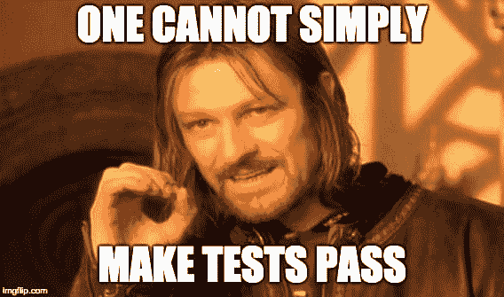

# 使用 Go 和 TDD 构建财务跟踪 REST API 第 2 部分

> 原文：<https://dev.to/alirezabashiri/building-a-finance-tracking-rest-api-using-go-with-tdd---part-2-1i70>

你好朋友们。在这一部分中，我们将完成预算 API，我也将告诉你，在最近几天，我已经想出了一个很好的工具组合来构建比这个更像 MVC 的 REST APIs，我将在接下来的帖子中写这些。

我刚刚完成了一个预算 API 的验收测试，但是在这里我要声明各种测试用例应该覆盖几乎 100%的预算 API 行为。那么我们开始吧:

```
// budgets_test.go
package main

import (
    "net/http"
    "os"
    "testing"

    "github.com/azbshiri/common/test"
    "github.com/go-pg/pg"
    "github.com/go-pg/pg/orm"
    "github.com/gorilla/mux"
    "github.com/pquerna/ffjson/ffjson"
    "github.com/stretchr/testify/assert"
)

var testServer *server
var badServer *server

func TestMain(m *testing.M) {
    testServer = newServer(
        pg.Connect(&pg.Options{
            User:     "alireza",
            Password: "alireza",
            Database: "alireza_test",
        }),
        mux.NewRouter(),
    )

    badServer = newServer(
        pg.Connect(&pg.Options{
            User:     "not_found",
            Password: "alireza",
            Database: "alireza",
        }),
        mux.NewRouter(),
    )

        // Here we create a temporary table to store each test case
        // data and follow isolation which would be dropped after.
    testServer.db.CreateTable(&budget{}, &orm.CreateTableOptions{
        Temp: true,
    })

    os.Exit(m.Run())
}

func TestGetBudgets_EmptyResponse(t *testing.T) {
    var body []budget
    res, err := test.DoRequest(testServer, "GET", BudgetPath, nil)

    ffjson.NewDecoder().DecodeReader(res.Body, &body)
    assert.NoError(t, err)
    assert.Len(t, body, 0)
    assert.Equal(t, res.Code, http.StatusOK)
}

func TestGetBudgets_NormalResponse(t *testing.T) {
    var body []budget
    budgets, err := CreateBudgetListFactory(testServer.db, 10)
    assert.NoError(t, err)

    res, err := test.DoRequest(testServer, "GET", BudgetPath, nil)
    assert.Equal(t, http.StatusOK, res.Code)
    assert.NoError(t, err)

    ffjson.NewDecoder().DecodeReader(res.Body, &body)
    assert.Len(t, body, 10)
    assert.Equal(t, budgets, &body)
}

func TestGetBudgets_DatabaseError(t *testing.T) {
    var body Error
    res, err := test.DoRequest(badServer, "GET", BudgetPath, nil)

    ffjson.NewDecoder().DecodeReader(res.Body, &body)
    assert.NoError(t, err)
    assert.Equal(t, DatabaseError, &body)
    assert.Equal(t, http.StatusInternalServerError, res.Code)
} 
```

Enter fullscreen mode Exit fullscreen mode

我定义了三个测试用例:正常响应、空响应和当出现数据库错误时，我们模拟使用不存在的数据库用户名使数据库不可用。正如您注意到的，有一个`DatabaseError`常量，它断言以确保错误是可读的。我创建了一个`errors.go`文件，其中有一个新的错误类型叫做`Error`，如下:

```
package main

import "net/http"

type Error struct {
    Message string `json:"message"`
    Status  int    `json:"status"`
}

func Err(message string, status int) *Error {
    return &Error{message, status}
}

var DatabaseError = Err("Your request failed due to a database error.", http.StatusInternalServerError) 
```

Enter fullscreen mode Exit fullscreen mode

它携带一条消息和一个相应的 HTTP 代码，以便更容易地处理错误。现在一切都在正确的位置上，我们应该通过或测试在当前状态下失败。

所以我们首先在`budgets.go`文件中创建一个 HTTP 处理函数:

```
// budgets.go
package main

import (
    "net/http"

    "github.com/azbshiri/common/db"
)

type budget struct {
    db.Model
    Amount float64 `json:"amount"`
}

func (s *server) getBudgets(w http.ResponseWriter, r *http.Request) {
} 
```

Enter fullscreen mode Exit fullscreen mode

然后在`routes.go` :
中注册 HTTP 句柄

```
// routes.go
package main

const BudgetPath = "/api/budgets"

func (s *server) routes() {
    s.mux.HandleFunc(BudgetPath, s.getBudgets).Methods("GET")
} 
```

Enter fullscreen mode Exit fullscreen mode

注意:我定义了`BudgetPath`常量，以便能够在包括测试在内的各种地方使用预算 API 路径。测试仍然失败，所以我们应该从数据库中获得预算，并向消费者返回一个可接受的响应。此外，我在`factories.go`文件中创建了一个`CreateBudgetListFactory`工厂，以使数据库填充更容易。

```
// factories.go
package main

import (
    "math/rand"
    "time"

    "github.com/go-pg/pg"
)

func CreateBudgetListFactory(db *pg.DB, length int) (*[]budget, error) {
    budgets := make([]budget, length)
    for _, budget := range budgets {
        budget.Amount = rand.Float64()
        budget.CreatedAt = time.Now()
    }

    err := db.Insert(&budgets)
    if err != nil {
        return nil, err
    }

    return &budgets, nil
} 
```

Enter fullscreen mode Exit fullscreen mode

```
// budgets.go
package main

import (
    "encoding/json"
    "net/http"

    "github.com/azbshiri/common/db"
    "github.com/pquerna/ffjson/ffjson"
)

type budget struct {
    db.Model
    Amount float64 `json:"amount"`
}

func (s *server) getBudgets(w http.ResponseWriter, r *http.Request) {
    var budgets []*budget
    err := s.db.Model(&budgets).Select()
    if err != nil {
        w.WriteHeader(http.StatusInternalServerError)
        json.NewEncoder(w).Encode(DatabaseError)
        return
    }

    ffjson.NewEncoder(w).Encode(budgets)
} 
```

Enter fullscreen mode Exit fullscreen mode

现在我们是绿色的:

```
=== RUN   TestGetBudgets_EmptyResponse
-------- PASS: TestGetBudgets_EmptyResponse (0.00s)
=== RUN   TestGetBudgets_NormalResponse
-------- PASS: TestGetBudgets_NormalResponse (0.00s)
=== RUN   TestGetBudgets_DatabaseError
-------- PASS: TestGetBudgets_DatabaseError (0.00s)
PASS
ok      github.com/azbshiri/budget-api  0.040s 
```

Enter fullscreen mode Exit fullscreen mode

[T2】](https://res.cloudinary.com/practicaldev/image/fetch/s--M_0AQXcW--/c_limit%2Cf_auto%2Cfl_progressive%2Cq_auto%2Cw_880/https://i.imgflip.com/2i56ol.jpg)

好了，现在我们重复同样的步骤来创建一个新的预算 API:

```
// budgets_test.go
package main

import (
    "bytes"
    "net/http"
    "os"
    "testing"

    "github.com/azbshiri/common/test"
    "github.com/go-pg/pg"
    "github.com/go-pg/pg/orm"
    "github.com/gorilla/mux"
    "github.com/pquerna/ffjson/ffjson"
    "github.com/stretchr/testify/assert"
)

var testServer *server
var badServer *server

func TestMain(m *testing.M) {
    testServer = newServer(
        pg.Connect(&pg.Options{
            User:     "alireza",
            Password: "alireza",
            Database: "alireza_test",
        }),
        mux.NewRouter(),
    )

    badServer = newServer(
        pg.Connect(&pg.Options{
            User:     "not_found",
            Password: "alireza",
            Database: "alireza",
        }),
        mux.NewRouter(),
    )

    testServer.db.CreateTable(&budget{}, &orm.CreateTableOptions{
        Temp: true,
    })

    os.Exit(m.Run())
}

func TestGetBudgets_EmptyResponse(t *testing.T) {
    var body []budget
    res, err := test.DoRequest(testServer, "GET", BudgetPath, nil)

    ffjson.NewDecoder().DecodeReader(res.Body, &body)
    assert.NoError(t, err)
    assert.Len(t, body, 0)
    assert.Equal(t, res.Code, http.StatusOK)
}

func TestGetBudgets_NormalResponse(t *testing.T) {
    var body []budget
    budgets, err := CreateBudgetListFactory(testServer.db, 10)
    assert.NoError(t, err)

    res, err := test.DoRequest(testServer, "GET", BudgetPath, nil)
    assert.Equal(t, http.StatusOK, res.Code)
    assert.NoError(t, err)

    ffjson.NewDecoder().DecodeReader(res.Body, &body)
    assert.Len(t, body, 10)
    assert.Equal(t, budgets, &body)
}

func TestGetBudgets_DatabaseError(t *testing.T) {
    var body Error
    res, err := test.DoRequest(badServer, "GET", BudgetPath, nil)

    ffjson.NewDecoder().DecodeReader(res.Body, &body)
    assert.NoError(t, err)
    assert.Equal(t, DatabaseError, &body)
    assert.Equal(t, http.StatusInternalServerError, res.Code)
}

func TestCreateBudget(t *testing.T) {
    var body budget
    byt, err := ffjson.Marshal(&budget{Amount: 1000.4})
    rdr := bytes.NewReader(byt)

    res, err := test.DoRequest(testServer, "POST", BudgetPath, rdr)

    ffjson.NewDecoder().DecodeReader(res.Body, &body)
    assert.NoError(t, err)
    assert.Equal(t, 1000.4, body.Amount)
    assert.Equal(t, http.StatusOK, res.Code)
}

func TestCreateBudget_BadParamError(t *testing.T) {
    var body Error
    res, err := test.DoRequest(testServer, "POST", BudgetPath,
        bytes.NewReader([]byte{}))

    ffjson.NewDecoder().DecodeReader(res.Body, &body)
    assert.NoError(t, err)
    assert.Equal(t, BadParamError, &body)
    assert.Equal(t, http.StatusBadRequest, res.Code)
}

func TestCreateBudget_DatabaseError(t *testing.T) {
    var body Error
    byt, err := ffjson.Marshal(&budget{Amount: 1000.4})
    rdr := bytes.NewReader(byt)

    res, err := test.DoRequest(badServer, "POST", BudgetPath, rdr)

    ffjson.NewDecoder().DecodeReader(res.Body, &body)
    assert.NoError(t, err)
    assert.Equal(t, DatabaseError, &body)
    assert.Equal(t, http.StatusInternalServerError, res.Code)
} 
```

Enter fullscreen mode Exit fullscreen mode

为新 API 创建新的 HTTP 句柄函数:

```
// budgets.go
package main

import (
    "encoding/json"
    "net/http"

    "github.com/azbshiri/common/db"
    "github.com/pquerna/ffjson/ffjson"
)

type budget struct {
    db.Model
    Amount float64 `json:"amount"`
}

func (s *server) getBudgets(w http.ResponseWriter, r *http.Request) {
    var budgets []*budget
    err := s.db.Model(&budgets).Select()
    if err != nil {
        w.WriteHeader(http.StatusInternalServerError)
        json.NewEncoder(w).Encode(DatabaseError)
        return
    }

    ffjson.NewEncoder(w).Encode(budgets)
}

func (s *server) createBudget(w http.ResponseWriter, r *http.Request) {
    var param struct {
        Amount float64 `json:"amount"`
    }
    err := ffjson.NewDecoder().DecodeReader(r.Body, &param)
    if err != nil {
        w.WriteHeader(http.StatusBadRequest)
        json.NewEncoder(w).Encode(BadParamError)
        return
    }

    budget := budget{Amount: param.Amount}
    err = s.db.Insert(&budget)
    if err != nil {
        w.WriteHeader(http.StatusInternalServerError)
        json.NewEncoder(w).Encode(DatabaseError)
        return
    }

    ffjson.NewEncoder(w).Encode(budget)
} 
```

Enter fullscreen mode Exit fullscreen mode

注意:我使用 DTO 概念来解码发送到预算创建 API 的参数，这是一个很好的方法。

我们完成了:

```
=== RUN   TestGetBudgets_EmptyResponse
-------- PASS: TestGetBudgets_EmptyResponse (0.01s)
=== RUN   TestGetBudgets_NormalResponse
-------- PASS: TestGetBudgets_NormalResponse (0.00s)
=== RUN   TestGetBudgets_DatabaseError
-------- PASS: TestGetBudgets_DatabaseError (0.00s)
=== RUN   TestCreateBudget
-------- PASS: TestCreateBudget (0.00s)
=== RUN   TestCreateBudget_BadParamError
-------- PASS: TestCreateBudget_BadParamError (0.00s)
=== RUN   TestCreateBudget_DatabaseError
-------- PASS: TestCreateBudget_DatabaseError (0.00s)
PASS
ok      github.com/azbshiri/budget-api  (cached) 
```

Enter fullscreen mode Exit fullscreen mode

请在下面添加您的评论，如果您发现这些信息丰富，请不要忘记给我:D 留下一颗心