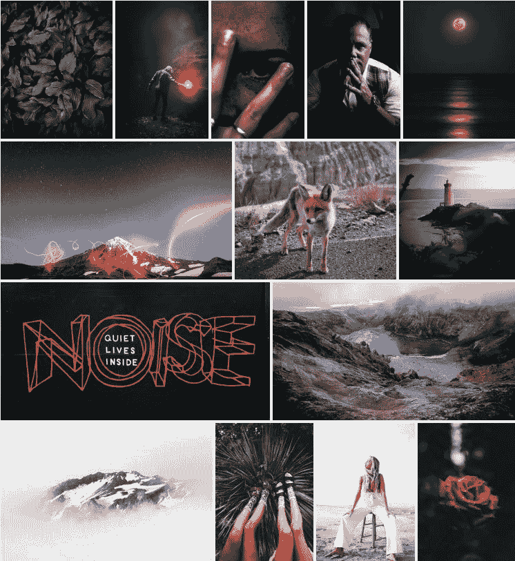

# 为 Hugo 构建基于文件夹的画廊

> 原文：<https://dev.to/sarmis/building-a-folder-based-gallery-for-hugo-4i8c>

一个自定义的 hugo shortcode，从文件夹中的图像构建一个图像库

## 源代码

图像发现和图库布局

```
 <!-- "site root"\layouts\shortcodes\foldergallery.html -->

    <style>
        div.gallery {
            display: flex;
            flex-wrap: wrap;
        }
        div.gallery a {
            flex-grow: 1;
            object-fit: cover;
            margin: 2px;
            display: flex;
        }

        div.gallery a img {            
            height: 200px;
            object-fit: cover;
            flex-grow: 1;
        }

    </style>

    <link rel="stylesheet" href="https://cdnjs.cloudflare.com/ajax/libs/fancybox/3.4.0/jquery.fancybox.min.css" />

    <div class="gallery">
        {{ $path := print "content\\" .Page.Dir (.Get "src") }}
        {{ $url  := print .Page.URL (.Get "src") }}
        {{ range (readDir $path)  }}            
            {{ $src := print $url "/" .Name }}                
            <a data-fancybox="gallery" href="{{ $src }}">
                  <br/>            
            </a>
        {{ end }}
    </div> 
```

Enter fullscreen mode Exit fullscreen mode

fancybox

```
 <!--
1\. Replace theme's jquery with 3.3.1 version
2\. Add the fancybox3 script
-->
<script src="https://code.jquery.com/jquery-3.3.1.min.js" integrity="sha256-FgpCb/KJQlLNfOu91ta32o/NMZxltwRo8QtmkMRdAu8=" crossorigin="anonymous"></script>
<script src="https://cdnjs.cloudflare.com/ajax/libs/fancybox/3.4.0/jquery.fancybox.min.js"></script> 
```

Enter fullscreen mode Exit fullscreen mode

## 用法

```
 { {< foldergallery src="imgs" >} } 
```

Enter fullscreen mode Exit fullscreen mode

将使用 imgs 文件夹中的图像创建图片库

## 样品

[T2】](https://res.cloudinary.com/practicaldev/image/fetch/s--XBGBaI04--/c_limit%2Cf_auto%2Cfl_progressive%2Cq_auto%2Cw_880/https://thepracticaldev.s3.amazonaws.com/i/9ctf6sxaksoxvb94e8vr.jpg)

最初发布于[希腊开发商](https://greekdeveloper.com/post/2018/2018-08-29-hugo-gallery-shortcode)