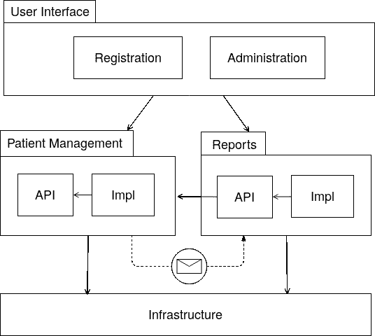
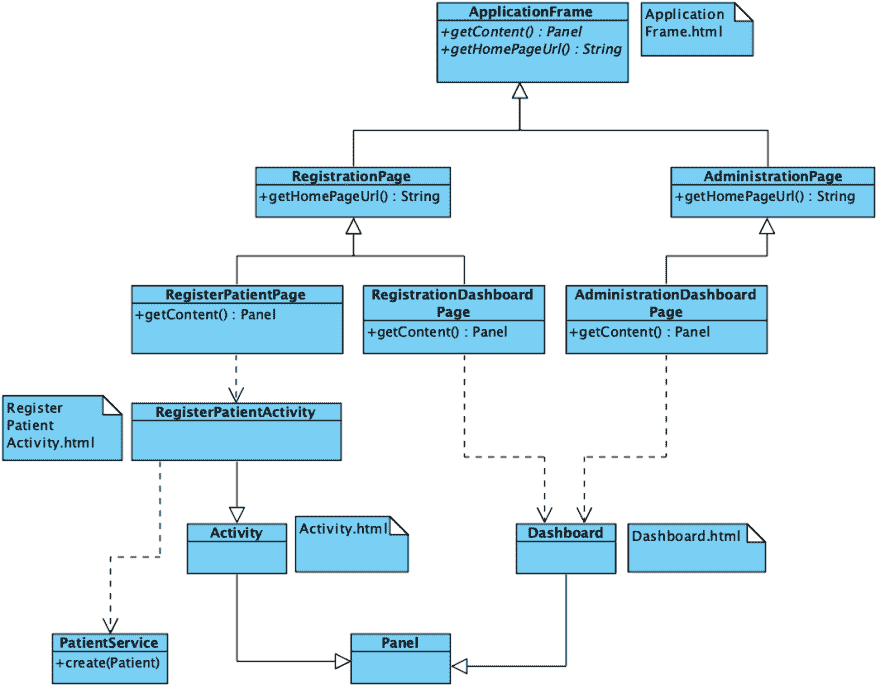

# 用 Java、Spring Boot、Apache Wicket 和 Gradle 构建绿地医院信息系统

> 原文：<https://dev.to/janux_de/building-a-greenfield-hospital-information-system-with-java-spring-boot-apache-wicket-and-gradle-4np1>

[https://www.youtube.com/embed/qZZu7z2d1HY](https://www.youtube.com/embed/qZZu7z2d1HY)

Kirpal Sagar 慈善医院是印度旁遮普省的一所小医院，大约有 30 到 50 张病床。在接下来的几十年里，预计可以增加到 500 个床位。为了处理这种规模的内部流程，需要一个医疗保健信息系统。虽然已经有了一个软件系统，但它没有为这种增长方式提供可选的支持。

实现这一目标的一个选择是从头构建一个定制的解决方案。与调整医院流程的一些标准软件相反，这种方法允许根据特定要求调整软件。例如，根据患者的生活环境，计费需要支持范围从 0 到 100%的折扣方案。此外，在某些时候，患者记录应该与 [Kirpal Sagar 学院](http://kirpalsagaracademy.com/)的学生账户同步，等等。

这篇博客文章描述了这种方法的架构原型。

# 技术

该程序是一个基于 [Java](https://en.wikipedia.org/wiki/Java_(programming_language)) 的 web 应用程序，将部署在医院的局域网中。做出这一选择的原因是，Java 是目前企业应用程序最常见的解决方案之一。此外，它有一个包含大量开源工具和库的大型生态系统。最后但同样重要的是，有关于 Java 的书籍和教程。

由于应用框架[正在使用 Spring](https://spring.io/projects) 。Spring 核心框架提供了依赖注入、数据访问和事务管理等特性。使用 Spring，可以指定特定 URL 的安全访问规则。Spring Data 为数据库提供了一个抽象层。Spring Boot 项目通过为常用库提供自动配置和依赖管理等特性，简化了 Spring 的使用。

为了创建 HTML 页面[，Apache Wicket](https://wicket.apache.org/) 被应用。这使得应用程序可以部署在单个包中，因此只需要监视一个应用程序进程和数据库服务器。Wicket 的另一个优点是允许使用面向对象的设计技术来组合 web 元素。这些 HTML 组件可以由网页设计师独立开发，因为这不需要后端知识。除此之外，Wicket 还提供了广泛的特性来构建高级的 web 应用程序，例如用户会话、基于角色的认证、缓存和使用 AJAX 的动态页面更新。

# 模块化

随着时间的推移，软件系统往往会变得极其复杂。为了控制这种复杂性，需要对它们进行适当的结构化。在日常生活中，各种各样的方法被用来保持事物有序。螺丝存放在小盒子里。不同种类的螺丝钉一起放在大盒子里。那些大箱子与其他材料和工具一起放在架子上。下一个粒度级别是相关货架所在的房间。多个房间组成了一个专用于特定目的的建筑。

在不同的粒度级别内，也有不同的方法来构建 Java 应用程序。最精细的结构是方法。相关的方法和变量一起保存在类中。提供某些功能的多个类被分组到包中。通过 [Java 平台模块系统](https://jaxenter.com/java-9-modules-jpms-basics-135885.html) (JPMS)、 [OSGi 捆绑包](https://www.osgi.org/developer/architecture/)、 [Maven 多模块项目](https://openliberty.io/guides/maven-multimodules.html)或 [Gradle 多项目构建](https://docs.gradle.org/current/userguide/multi_project_builds.html)将属于某个方面的多个包捆绑成模块。然后，应用程序作为一个整体为一个业务领域提供一组功能。

这个应用程序的理想情况是，方法和类是用[可靠的设计原则](https://medium.com/@trekhleb/solid-principles-around-you-6db2f0e12139)构造的。然后，这些类按照特性模式用[包进行分组，以保持对业务领域的关注。为了分离不同的上下文，应用了基于梯度的选项。这提供了比 JPMS 和 OSGi 更好的 Spring 集成，同时仍然可以通过](http://www.javapractices.com/topic/TopicAction.do?Id=205) [Java 库插件](https://docs.gradle.org/current/userguide/java_library_plugin.html)隐藏模块的实现细节。

[T2】](https://res.cloudinary.com/practicaldev/image/fetch/s--z1xEhf-m--/c_limit%2Cf_auto%2Cfl_progressive%2Cq_auto%2Cw_880/https://thepracticaldev.s3.amazonaws.com/i/n48jes2pll2gd76kuitp.png)

该应用程序的核心是领域模块，它们代表医院临床服务和管理功能的不同领域。每个模块都有两个嵌套的子模块。一个是模块的接口(API ),所有其他模块都可以访问它。另一个是实现细节(Impl)。在这里，像数据库访问和业务逻辑计算这样的事情正在发生，而其他模块对此一无所知。因此，实现细节可以改变，而不会对模块 API 的客户端产生任何影响。例如，数据存储可能会从 PostgreSQL 更改为 MongoDB 数据库。

当一个模块知道另一个模块的内容时，我们称之为对它有依赖性。Gradle 禁止循环依赖；彼此都了解对方。如果他们仍然需要协作，他们可以使用[发布-订阅交互模型](https://en.wikipedia.org/wiki/Publish%E2%80%93subscribe_pattern)。有了它，一个组件可以向第三方发布消息，另一个组件可以在那里订阅，以获得关于它感兴趣的消息类型的通知。这可以在[观察者设计模式](https://www.tutorialspoint.com/design_pattern/observer_pattern.htm)的帮助下实现。然而，通过使用 [Spring Application Events](https://spring.io/blog/2015/02/11/better-application-events-in-spring-framework-4-2) 特性，可以应用这个概念，而不需要从头开始实现它。例如，患者管理模块可以在新患者注册时发布一个`PatientCreatedEvent`。当这种情况发生时，报告模块可以请求获得通知，并据此对其进行处理。以这种方式，报告模块可以被潜在地重构，而不需要改变患者管理模块中的任何东西。

用户界面模块包含医院中每个计算机工作站的软件包。它可以利用来自所有领域模块的 API 来编排工作流。由于技术原因，Spring 应用程序类及其配置也放在那里。

# 前端

Wicket 通过命名约定连接 Java 类和 HTML 文件。对于每个网页类，它试图找到一个同名的 HTML 文件。如果不存在，它会尝试查找一个带有父类名称的 HTML 文件，等等。使用面向对象的编程技术，可以通过组合和继承来安排页面。当最终呈现一个页面或组件时，带有 Wicket ID 属性的 HTML 元素从 Java 类中相应的指令中获取信息。在 Spring 框架的帮助下，域服务是可用的。

[T2】](https://res.cloudinary.com/practicaldev/image/fetch/s--CiyDerBf--/c_limit%2Cf_auto%2Cfl_progressive%2Cq_auto%2Cw_880/https://thepracticaldev.s3.amazonaws.com/i/5ckebub3cuvq2rxqxpr2.png)

为了在任何地方都应用相同的外观和感觉，所有网页都有一个公共基类([ApplicationFrame.java](https://github.com/ksch-workflows/ksch-workflows/blob/9362b0c019835db063b921015977bf8a004ce7ff/user-interface/src/main/java/ksch/ApplicationFrame.java)/【ApplicationFrame.html】T2)。由此衍生出每个工作站的基础页面，为“主页”图标中的链接提供了[模板方法](https://sourcemaking.com/design_patterns/template_method)(例如[RegistrationPage.java](https://github.com/ksch-workflows/ksch-workflows/blob/9362b0c019835db063b921015977bf8a004ce7ff/user-interface/src/main/java/ksch/registration/RegistrationPage.java))。一个工作站的所有页面都是从那里导出的(例如[RegisterPatientPage.java](https://github.com/ksch-workflows/ksch-workflows/blob/9362b0c019835db063b921015977bf8a004ce7ff/user-interface/src/main/java/ksch/registration/RegisterPatientPage.java))。叶页面本身并不指定 HTML，而是实例化组件，然后通过另一个模板方法将它们作为页面内容提供。然后，父类的 HTML 将填充这些组件，即仪表板([Dashboard.java](https://github.com/ksch-workflows/ksch-workflows/blob/9362b0c019835db063b921015977bf8a004ce7ff/user-interface/src/main/java/ksch/Dashboard.java)/[Dashboard.html](https://github.com/ksch-workflows/ksch-workflows/blob/9362b0c019835db063b921015977bf8a004ce7ff/user-interface/src/main/resources/static/ksch/Dashboard.html))或活动([Activity.java](https://github.com/ksch-workflows/ksch-workflows/blob/9362b0c019835db063b921015977bf8a004ce7ff/user-interface/src/main/java/ksch/Activity.java)/[Activity.html](https://github.com/ksch-workflows/ksch-workflows/blob/9362b0c019835db063b921015977bf8a004ce7ff/user-interface/src/main/resources/static/ksch/Activity.html))。

# 结论

开发医院信息系统实际上是一项重大的事业，而不是一项终身任务。因此，也许使用现有的开源系统更好，比如 bah mni T1，并付钱给顾问来介绍、定制和维护它。然而，鉴于已经有两个定制开发的程序用于学校管理和库存管理，为医院添加第三个程序似乎并不不现实。这样就有机会拥有一个针对设施要求而优化的系统。

你对这种方法的印象是什么？你认为我们能走多远？你在哪里看到它的优点和缺点？

任何形式的建设性反馈都是最受欢迎的。

# 参考文献

*   [https://github.com/ksch-workflows/ksch-workflows](https://github.com/ksch-workflows/ksch-workflows)
*   雄伟的模块化巨石柱 -阿克塞尔·方丹
*   [建造进化的建筑](https://books.google.de/books?id=pYI2DwAAQBAJ&printsec=frontcover&dq=Building+Evolutionary+Architectures&hl=en&sa=X&ved=0ahUKEwjGstz415XeAhWJDywKHdZCDn8Q6AEIJzAA#v=onepage&q&f=false)，第 53 页及其后。——尼尔·福特·丽贝卡·帕森斯&帕特里克·夸