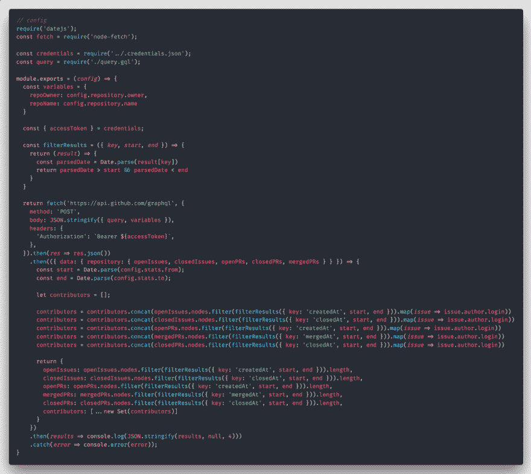
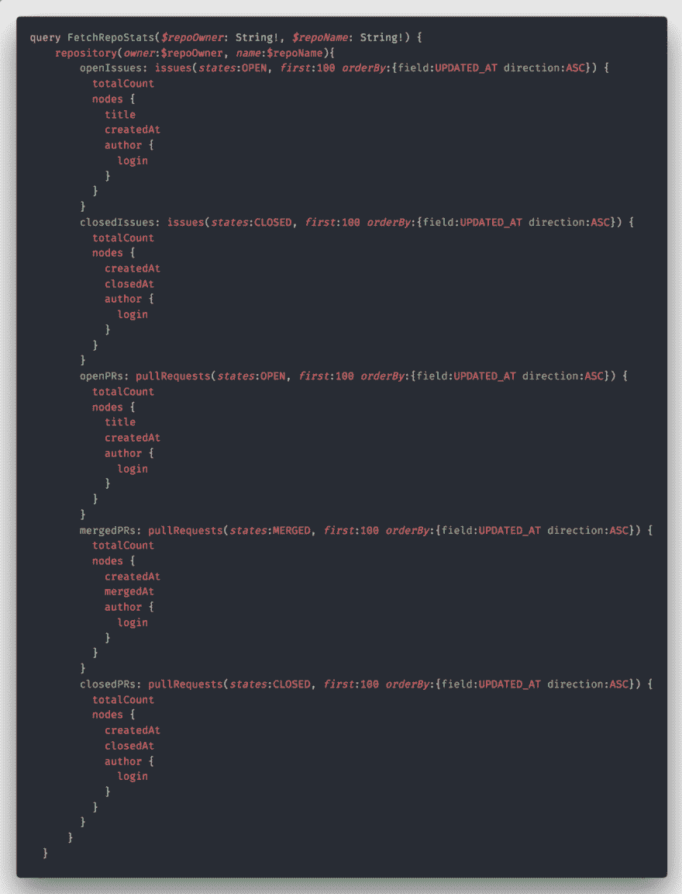
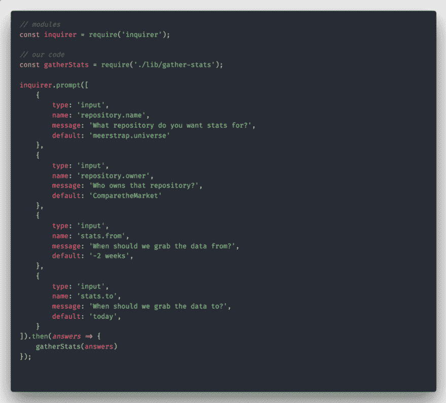

# 用 Node.js 构建人性化的命令行界面

> 原文：<https://dev.to/psyked/building-a-humanised-command-line-interface-with-node-js-4813>

<figure>[](https://res.cloudinary.com/practicaldev/image/fetch/s--AFd45W9R--/c_limit%2Cf_auto%2Cfl_progressive%2Cq_auto%2Cw_880/https://cdn-images-1.medium.com/max/1024/1%2Ah89l_KJR8w2NrzQXtPCAmw.jpeg) 

<figcaption>照片由[摇滚猴子](https://unsplash.com/photos/R4WCbazrD1g?utm_source=unsplash&utm_medium=referral&utm_content=creditCopyText)上 [Unsplash](https://unsplash.com/search/photos/robot-face?utm_source=unsplash&utm_medium=referral&utm_content=creditCopyText)</figcaption>

</figure>

#### 因为配置管理烂。

### 背景

作为我日常软件开发工作的副产品，我创建了许多特定任务的自动化脚本。如果有一个任务我需要定期执行，它包含多个步骤，并且*可以*自动化，我*将*(最终)给自己写一个脚本来自动化它。

我这样做是因为——总的来说——我喜欢编写脚本，因为将平凡的任务抽象成这些脚本减少了认知开销，让我有时间思考日常工作的其他方面。

#### 可配置代码

众所周知，将值硬编码到代码中会立即降低代码的可重用性，将这些值提取到代码变量中是合乎逻辑的，因为这样可以更容易地对代码进行大范围的修改。

要使脚本可重用而不需要每次都编辑源代码，有两种常用策略。其中一个是在命令行上将配置作为参数传递，另一个是创建和编辑一个配置文件，该文件以更持久的格式存储选项。命令行参数适用于一次性命令，配置文件适用于相同设置的重复使用。

#### 问题

命令行参数和配置文件都需要可用选项的知识和准备措施——它们都不像 GUI(图形用户界面)那样简单，而且它们通常都没有直观的界面。

我总是假设，在几个月的时间里，我将完全忘记如何配置我的脚本的一切，并且没有希望在 StackOverflow 或 Google 上找到帮助，我需要确保我使它们直截了当并且对操作者友好。

### 人性化的体验🤖

本质上，我希望我的命令行界面在与我的交互中更人性化一点，表现得更像 Alexa 或 Siri 这样的人工助手，而不像电脑。那是一种*人性化的体验。*

事不宜迟，让我们制作一个更人性化的简单脚本*。*

#### 核心代码

(下图)我有一个 Node.js 脚本，它与 GitHub API 通信来检索关于存储库的统计信息。它目前被设置为接受 JSON 格式的配置文件，并以 JSON 格式返回输出。

<figure>[](https://res.cloudinary.com/practicaldev/image/fetch/s--HFDdft3e--/c_limit%2Cf_auto%2Cfl_progressive%2Cq_auto%2Cw_880/https://cdn-images-1.medium.com/max/1024/1%2A9wYVk5O73upqdOuwzQRhsg.png)

<figcaption>getstats . JSON</figcaption>

</figure>

上面的代码所做的是使用 **node-fetch** 模块向 GitHub GraphQL API 发出请求，然后从该 API 获取响应，并对响应进行一些处理，然后将它们作为字符串返回。

源代码中没有的由配置文件提供的信息是**存储库所有者**、**存储库名称**、**开始日期**和**结束日期**，所有这些信息都用于标识目标存储库和过滤响应数据。

为了完整起见，使用的 GraphQL 查询如下所示:

<figure>[](https://res.cloudinary.com/practicaldev/image/fetch/s--JceksDgk--/c_limit%2Cf_auto%2Cfl_progressive%2Cq_auto%2Cw_880/https://cdn-images-1.medium.com/max/1024/1%2AWgKscWyWBMi_hdV0cR26Ew.png)

<figcaption>query . gql</figcaption>

</figure>

现在我们已经得到了代码，我们如何实际执行它并获取数据呢？

#### 使用命令行选项执行脚本

如果没有人性化的旅程，我会使用如下命令来执行我的脚本，返回存储库统计数据:

```
node index.js psyked psyked.github.io 2018-08-08 2018-08-12 
```

#### 用配置文件执行脚本

如果我采用配置文件方法，我会用中的那些设置创建一个. json 文件，在同一个目录中将其保存为 psyked-config.json，然后使用下面的命令运行它:

```
node index.js ./psyked-config.json 
```

每次执行时输入的内容要少一些，而且确实保证了每次的选项都是相同的，但是仍然不够用户友好。

#### 人性化命令行体验

人性化的方法只从最简单的命令开始(如下):

```
node index.js 
```

从那时起，它切换到一个交互式的体验，看起来像这样(如下)——问问题，提示响应，最后将输入映射到一个适当的配置文件中存在的相同的数据结构。

[T2】](https://res.cloudinary.com/practicaldev/image/fetch/s--8KMOepIA--/c_limit%2Cf_auto%2Cfl_progressive%2Cq_66%2Cw_880/https://cdn-images-1.medium.com/max/975/1%2Aa5eNNjsXIESU_a1EsTpqUA.gif)

这种体验都是由一个名为 **Inquirer** 的模块促成的，该模块添加了一个非常简单的代码层，支持命令行中几种常见类型的问题。

[SBoudrias/Inquirer.js](https://github.com/SBoudrias/Inquirer.js)

查询者可以提示几种类型的数据，将问题链接在一起，验证回答等等。为了回答上面屏幕截图中的问题，我使用了下面的代码:

<figure>[T3】

<figcaption>index . js</figcaption>](https://res.cloudinary.com/practicaldev/image/fetch/s--gq9JymQv--/c_limit%2Cf_auto%2Cfl_progressive%2Cq_auto%2Cw_880/https://cdn-images-1.medium.com/max/1024/1%2AIRQ0WOaSRF9lV_-gu4ydbQ.png) </figure>

…就这些了。Node.js 人性化的命令行界面

与其他选择相比，这种方法的最大优势是处理数据更容易。将所有的值放在一行感觉像是一个艰巨的过程，尤其是如果你犯了一个错误。创建和编辑多个配置文件几乎是一样的，但是遵循一种老派的向导方法来运行脚本？那很有趣。🎩

### 结论？

模块使得命令行界面更容易操作。编写问题并将结果映射到我们的代码中是很简单的，并且结果的体验远远超过了配置模块所花费的努力。

* * *