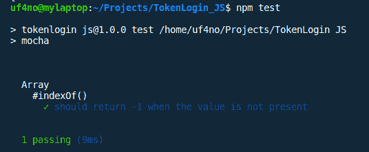
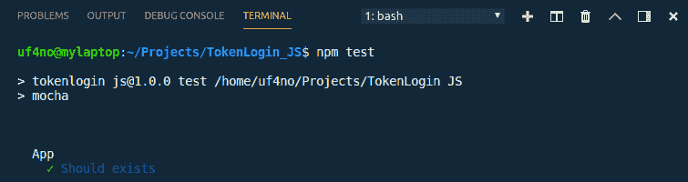
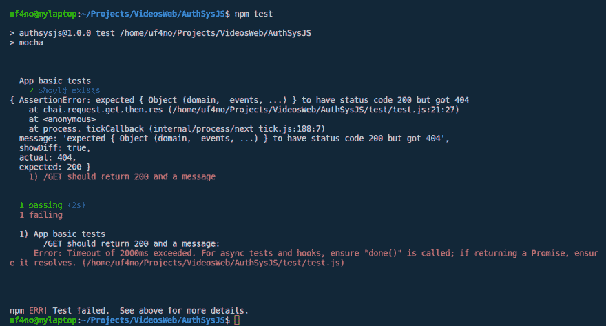

# 使用 TDD 构建 JavaScript 认证系统(第 1 部分)

> 原文：<https://dev.to/uf4no/building-a-javascript-auth-system-using-tdd-part-1-1e42>

每次我想学习一门新的编程语言或框架时，我都会尝试做几个基本的应用程序，比如待办事项列表，然后转向一些我可以在未来项目中重用的东西，比如用户注册和认证系统。在本文中，我将解释如何用 JavaScript 创建一个使用 Json Web 令牌(JWT)的 API(用 Express 构建)的认证系统。此外，我将遵循一种测试驱动的开发方法，使用 Mocha 作为测试框架，使用 Chai 作为断言库。

TDD 在创建新项目时有很多好处，因为它帮助我们更快地识别错误(快速失败)，这将帮助我们持续集成/交付，此外，测试将作为应用程序的文档。你可以在下一篇文章的[中读到更多关于 TDD 的好处。](https://www.madetech.com/blog/9-benefits-of-test-driven-development "Benefits of Test Driven Development")

使用 TDD 时要遵循的基本步骤是:

*   需求被转化为测试
*   运行并未通过测试
*   写代码
*   运行并通过测试
*   再次重构代码/通过测试
*   重复

你可以在 GitLab 下面的库[中找到本文的所有代码(包括测试)。](https://gitlab.com/uF4No/authsysjs/tree/article-part-1 "Repository with the code")

我们走吧！

### 设置

像往常一样，我用 **$npm init** 启动了一个节点应用程序，它为应用程序创建了 package.json。下面列出了我们的应用程序在第一部分中需要的所有模块:

*   [express](https://www.npmjs.com/package/express) :我们应用的框架
*   [body-parser](https://www.npmjs.com/package/body-parser "body parser in NPM") :作为 JSON 处理传入请求的中间件。
*   [摩卡](https://www.npmjs.com/package/mocha "Mocha in NPM"):测试框架。
*   [柴](https://www.npmjs.com/package/chai "chai in NPM"):摩卡断言库。
*   chai-http :从我们的测试中发送请求到我们的 API。
*   [jsonwebtoken](https://www.npmjs.com/package/jsonwebtoken "jwt in NPM") :生成 JWT。
*   *[摩根](https://www.npmjs.com/package/morgan "morgan in NPM"):去调试(可选)*
*   *[nodemon](https://www.npmjs.com/package/nodemon "nodemon in NPM") :当文件改变时自动重启服务器(可选)*

你可以使用**$ NPM install*module _ name*T3】来安装它们**

由于我们将遵循 TDD 方法，首先要做的是确保我们的测试框架(mocha)按预期工作。如[官方文档中所述，](https://mochajs.org/#getting-started)让我们用一个名为 *test.js* 的文件创建一个*‘test’*文件夹，其中将包含一个简单的测试，如下所示:

```
 var assert = require('assert');
describe('Array', function() {
  describe('#indexOf()', function() {
    it('should return -1 when the value is not present', function() {
      assert.equal([1,2,3].indexOf(4), -1);
    });
  });
}); 
```

在 package.json 中配置测试脚本来启动 mocha。

```
 /**
 * package.json
 * node app properties
 */

"scripts": {

  "test": "mocha", 

  "start": "nodemon server.js"

},
```

*注意:您可以通过向 mocha 传递不同的参数，将测试脚本配置为针对特定的文件夹、递归文件夹或特定的文件类型(如 spec.js)。您可以在文档的本节中找到更多信息。

一旦我们配置好测试和 mocha，我们只需运行 **$npm 测试**，我们将得到以下输出:

[T2】](https://res.cloudinary.com/practicaldev/image/fetch/s---55KGElH--/c_limit%2Cf_auto%2Cfl_progressive%2Cq_auto%2Cw_880/http://www.antonioufano.com/image_uploads/test_0.png)

我们准备好了:)

### 创建快速应用程序

这个小项目的基础将是一个基于 express 的 API，它处理存储新用户(/register)、验证新用户(/login)和返回有效令牌(JWT)的请求，这些令牌用于访问应用程序的受保护路由。我们的 API 将有以下端点:

*   GET / -返回一个简单的消息。公共的。
*   POST /register -在数据库中存储新用户
*   POST /login -验证用户/通行证并返回令牌
*   GET /protected -需要有效的令牌，返回用户信息。

遵循 TDD 方法，让我们创建第一个测试，该测试将验证我们的应用程序是否存在:

```
/**
 * test/test.js
 * Basic tests for Auth system API
 */
const chai = require('chai');
const expect = chai.expect;

//start app
const app = require('../app');

describe('App', () => {
  it('Should exists', () => {
    expect(app).to.be.a('function');})
}) 
```

注意，我使用了 chai 模块中的 expect 断言。在 mocha 中， *describe()* 用于对测试进行分组，例如，来自相同功能或资源/域的测试，每个测试都由 *it()* 函数定义，该函数接收包含所有断言的描述和函数。如果我们运行上面的测试，我们会得到一个非常描述性的错误“错误:找不到模块”../app '”。因此，要解决这个问题，让我们在项目的根目录下创建一个名为“app.js”的文件。该文件应导出我们的 express 应用程序，该应用程序可以通过以下代码轻松创建:

```
/**
 * api/app.js
 * exports an express app.
 */

const express = require('express')
//initializes express app
const app = express();

module.exports = app; 
```

现在我们的考验将会通过。

[T2】](https://res.cloudinary.com/practicaldev/image/fetch/s--7X25w3n1--/c_limit%2Cf_auto%2Cfl_progressive%2Cq_auto%2Cw_880/http://www.antonioufano.com/image_uploads/firstTestOK.png)

显然，我们的应用程序没有做任何事情，所以让我们添加更多的测试。我们需要我们的应用程序监听之前定义的所有端点中的请求，所以让我们从最简单的开始，在/中获取请求。为了测试 HTTP 请求，我们必须添加 chai-http 模块。然后我们可以使用 *chai.request()* 方法来发起请求。这个方法后面是我们要发送的请求类型(get、post、put、delete..)并且它将在收到响应时解决/拒绝承诺，因此我们可以使用*。然后()/。catch()* 处理来自我们应用程序的响应:

```
 /**
 * test/test.js
 * Basic tests for Auth system API
 */

//import chai-http to send requests to the app
const http = require('chai-http');
chai.use(http);

describe('App basics', () => {
  it('Should exists', () => {
    expect(app).to.be.a('function');
  })

  it('GET / should return 200 and message', (done) => {
    //send request to the app
    chai.request(app).get('/')
      .then((res) => {
        //assertions
        //console.log(res.body);
        expect(res).to.have.status(200);
        expect(res.body.message).to.contain('Yabadabadooo');
        done();
    }).catch(err => {
      console.log(err.message);
    })
  });
})
```

请注意，当我们向箭头函数添加参数( *done* )时， *it()* 将其作为参数接收。这表明测试是异步的(*chai . request()*launch async requests)，并且直到我们在最后通过调用 *done()* 来手动指示它时才会完成。你可以在文档的[部分](https://mochajs.org/#asynchronous-code)找到更多关于用 mocha 进行 asnyc 测试的信息。如果我们运行这个测试，它将失败。

[](https://res.cloudinary.com/practicaldev/image/fetch/s--K41CEjdO--/c_limit%2Cf_auto%2Cfl_progressive%2Cq_auto%2Cw_880/http://www.antonioufano.com/image_uploads/404.png)T3】

这是因为我们的应用程序正在运行，但没有在任何端点侦听传入的请求，因为我们还没有定义任何路由，所以它会返回一个错误。为了解决这个问题，我们只需添加主体解析器中间件，并在我们的 express 应用程序中定义端点路由。它看起来会像这样:

```
/**
 * api/app.js
 * exports an express app started.
 */

const express = require('express')
const app = express();

const bodyParser = require('body-parser');

//middleware to parse requests of extended urlencoded
app.use(bodyParser.urlencoded({ extended: false }))
//middleware to parse requests of content-type - application/json
app.use(bodyParser.json())

//endpoints
app.get('/', (req, res) => {
  res.send({message:'Yabadabadooo'});
});

module.exports = app; 
```

现在我们的测试应该通过了:)我们已经在 TDD 后面编写了第一个端点。首先，我们创建测试，测试失败，然后添加代码，直到测试通过。

完成其中一个端点后，让我们创建其余的端点。

### 注册新用户

和前面一样，首先要做的是创建一个测试。注册新用户的目标端点将是 POST /register，它将接收用户详细信息(姓名、电子邮件和密码)。我们的应用程序将验证用户的详细信息，一旦完成，它将返回一个 201 状态代码和一条消息“用户创建”。这一功能的测试是这样的:

```
 /**
 * test/test.js
 * Basic tests for Auth system API
 */

...........

describe('User registration', () => {

  it('Should return 201 and confirmation for valid input', (done) => {
    //mock valid user input
    const new_user = {
      "name"  : "John Wick",
      "email": "john@wick.com",
      "password": "secret"
    }
    //send request to the app
    chai.request(app).post('/register')
      .send(new_user)
        .then((res) => {
          //console.log(res.body);
          //assertions
          expect(res).to.have.status(201);
          expect(res.body.message).to.be.equal("User created!");
          expect(res.body.errors.length).to.be.equal(0);
          done();
        }).catch(err => {
          console.log(err.message);
        })
  });

}) 
```

我已经创建了一个新的 *describe()* 块来对这个端点的不同测试进行分组。我们做的第一件事是在一个包含用户名、电子邮件和密码的对象中模拟用户输入。然后，我们使用 *chai.request()* 将这些信息发送到我们的应用程序，并使用 *send()* 方法将用户输入附加到请求中。一旦请求被解决(*)。然后()*)我们验证响应的主体( *res.body* )具有正确的状态代码和消息。

如果我们运行这个测试，我们将得到一个 404 错误，类似于我们之前得到的错误，因为我们还没有定义/register 端点。让我们创建一个 routes.js 文件，并在其中包含以下代码，而不是直接将其添加到我们的 app.js 文件中:

```
/**
 * /api/routes.js
 * exports an express router.
 */ 

const express = require('express');
//create the express router that will have all endpoints
const router = express.Router();

router.post('/register', (req, res, next) => {
  let hasErrors = false ;
  let errors = [];

  if(!req.body.name){
  //validate name presence in the request
    errors.push({'name': 'Name not received'})
    hasErrors = true;
  }
  if(!req.body.email){
    //validate email presence in the request
    errors.push({'email': 'Email not received'})
    hasErrors = true;
  }
  if(!req.body.password){
    //validate password presence in the request
    errors.push({'password': 'Password not received'})
    hasErrors = true;
  }

  if(hasErrors){
    //if there is any missing field
    res.status(422).json({
      message: "Invalid input",
      errors: errors
    });

  }else{
    res.status(201).json({
        message: 'User created!',
        errors: errors
      });
  }

});

module.exports = router;
```

可以看到，端点接收 3 个参数， *req* (请求)、 *res* (响应)和 *next* (下一个动作)。请求将包含用户发送的数据，在我们的例子中是一个带有名称、电子邮件和密码的 json，而响应是应用程序将发回的内容，在我们的例子中是一条消息(“用户创建的”/“无效输入”)和一组错误。我们要做的第一件事是验证请求体是否包含每个期望的字段，如果不包含，则将标志 *hasErrors* 更改为 true，并将错误添加到错误数组中。最后，我们根据已经完成的验证修改响应状态，并将消息和错误作为 JSON 对象包含进来。

如果我们再次运行测试，它仍然会失败。这是因为我们已经在 routes.js 文件中定义了新的端点，但是还没有将其导入到我们的 express 应用程序(app.js 文件)中。我们可以用 *require* 导入它，并通过 *use()* 方法将其作为中间件附加到我们的应用程序中。

```
/**
 * api/app.js
 * exports an express app started.
 */
............
//import router with endpoints definitions
const routes = require('./api/routes');
//attach router as a middleware
app.use(routes);
```

现在我们的测试应该通过了。

虽然测试通过了，但是我们的应用程序并没有做太多的事情，只是返回了一条消息和一个 JSON 对象，但是这足以演示这个例子了。理想情况下，我会添加更多的测试来验证我们不允许用户注册一个已经在数据库中的电子邮件，电子邮件和名称格式，或者密码应该包含数字和字母。

我将在后续文章中解释如何使用 bcrypt 加密密码，以及如何将用户保存在 Mongo 数据库中。现在，让我们转到登录端点。

### 登录用户

与前面的端点一样，首先要做的是创建一个测试。在这个场景中，我们将向/login 发送一个 POST 请求，我们希望收到一个成功的状态代码(200)、一条消息“Auth OK”和一个将用于访问受保护路由的 JWT 令牌。我们的测试将是这样的:

```
/**
 * test/test.js
 * Basic tests for Auth system API
 */
  ...........

  describe('User login', () => {
    it('should return 200 and token for valid credentials', (done) => {
      //mock invalid user input
      const valid_input = {
        "email": "john@wick.com",
        "password": "secret"
      }
      //send request to the app
      chai.request(app).post('/login')
        .send(valid_input)
          .then((res) => {
            //console.log(res.body);
            //assertions
            expect(res).to.have.status(200);
            expect(res.body.token).to.exist;
            expect(res.body.message).to.be.equal("Auth OK");
            expect(res.body.errors.length).to.be.equal(0);
            done();
          }).catch(err => {
            console.log(err.message);
          })
    });
  });
```

我们再次运行我们的测试套件，它将失败，因为我们的应用程序将返回 404 状态代码，因为我们尚未定义/login 端点。让我们继续努力。我们可以用几行代码添加端点:

```
/**
 * /api/routes.js
 * exports an express router.
 */ 

..............

router.post('/login', (req, res, next) => {
  res.status(200);
});
```

如果我们再次运行测试，我们将通过状态断言，但它仍然会失败，因为我们既没有返回令牌也没有返回消息。为了生成 JWT 令牌，我们首先需要验证我们已经收到了请求正文中的用户和密码( *req.body* )，然后验证它们是有效的，最后我们将生成令牌。由于我们还没有准备好将注册用户存储在数据库中的代码，我们现在只需检查电子邮件和通行证是否为“john@wick.com”和“secret”。如果电子邮件和密码不匹配，我们将返回状态代码 401 和消息“验证错误”。我们的登录路径如下所示:

```
/**
 * /api/routes.js
 * exports an express router.
 */ 

..............

router.post('/login', (req, res, next) => {
  let hasErrors = false ;
  let errors = [];

  //validate presence of email and password
  if(!req.body.email){
    errors.push({'email': 'Email not received'})
    hasErrors = true;
  }
  if(!req.body.password){
    errors.push({'password': 'Password not received'})
    hasErrors = true;
  }

  if(hasErrors){
  //return error code an info
    res.status(422).json({
      message: "Invalid input",
      errors: errors
    });

  }else{
  //check if credentials are valid
    if(req.body.email == 'john@wick.com' && req.body.password == 'secret'){
      //return 200 and message OK
      res.status(200).json({
        message: 'Auth OK',
        errors: errors

      });
    }else{
      //return 401 and message KO
      res.status(401).json({
        message: "Auth error"
      }) 
    }  
  }
```

唯一阻止我们的测试通过所有断言的是返回一个令牌。如果你不熟悉 JWT 代币，你可以在 [jwt.io](http://www.jwt.io "jwt.io webpage") 获得一些信息。

为了生成 JWT 令牌，我们必须安装并导入 **jsonwebtoken** 模块。如 [its 文档](https://github.com/auth0/node-jsonwebtoken "jsonwebtoken documentation github")中所述，我们可以使用 *jwt.sign()* 方法来生成令牌。该方法接收 3 个参数:有效负载(存储在令牌中的信息)、对其进行编码的密钥和带有选项的对象(如到期时间)。最重要的是关键。因为它将用于编码我们的令牌，所以我们必须将它存储在一个安全的位置，比如一个环境变量，可以从我们的代码中用*process . env . variable _ NAME*访问它。在我们的例子中，让我们将变量命名为 JWT_KEY，并用我们想要的任何值直接加载到我们的 *app.js* 文件的开头:

```
/**
 * api/app.js
 * exports an express app started.
 */
...............
process.env.JWT_KEY = "thisIsMyJwtKeyUsedToEncodeTheTokens";
............... 
```

现在回到我们的 *routes.js* 文件，一旦我们验证了来自 *request.body* 的电子邮件和密码，我们将生成令牌，这样我们就可以将它包含在我们的响应中:

```
/**
 * /api/routes.js
 * exports an express router.
 */ 

..............

router.post('/login', (req, res, next) => {
  let hasErrors = false ;
  let errors = [];

  //validate presence of email and password
  if(!req.body.email){
    errors.push({'email': 'Email not received'})
    hasErrors = true;
  }
  if(!req.body.password){
    errors.push({'password': 'Password not received'})
    hasErrors = true;
  }

  if(hasErrors){
  //return error code an info
    res.status(422).json({
      message: "Invalid input",
      errors: errors
    });

  }else{
  //check if credentials are valid
    if(req.body.email == 'john@wick.com' && req.body.password == 'secret'){
      //generate JWT token. jwt.sing() receives payload, key and opts.
      const token = jwt.sign(
        {
          email: req.body.email, 
        }, 
        process.env.JWT_KEY, 
        {
          expiresIn: "1h"
        }
      );
      //validation OK
      res.status(200).json({
        message: 'Auth OK',
        token: token,
        errors: errors
      })
    }else{
      //return 401 and message KO
      res.status(401).json({
        message: "Auth error"
      }) 
    }  
  }
});
```

现在我们所有的断言都应该通过。我们发回了状态码 200、消息“Auth OK”、JWT 令牌和一个空的错误数组。

## 结论

虽然还有很多地方需要改进，但是我们已经使用 TDD 建立了一个基本的注册和认证系统。在下一篇文章中，我将介绍与 Mongo 数据库的集成，并在将用户密码存储到数据库之前使用 bcrypt 模块对其进行加密。一旦我们在数据库中保存了注册用户，我们就能够在登录方法中正确地验证凭证。

完整的代码可以在 [GitLab](https://gitlab.com/uF4No/authsysjs/tree/master "Repository in gilab") 中找到。

我希望这篇文章能帮助你理解 TDD 的好处。在编写一行代码之前创建测试将有助于我们在任何时候向应用程序添加新功能，就好像与以前的功能有任何不兼容，我们的测试将会失败。当建立持续集成/持续交付管道时，这也是有帮助的。此外，拥有一套好的测试也将帮助其他开发人员理解应用程序做了什么，甚至不用看代码。

.

下一集见。

本文原载于[我的网站](https://antonioufano.com/articles/building-a-javascript-jwt-auth-system-using-tdd-part-1-13)。请随时访问我，并在[联系人](http://antonioufano.com/contact)部分给我一些反馈。

快乐的编码！