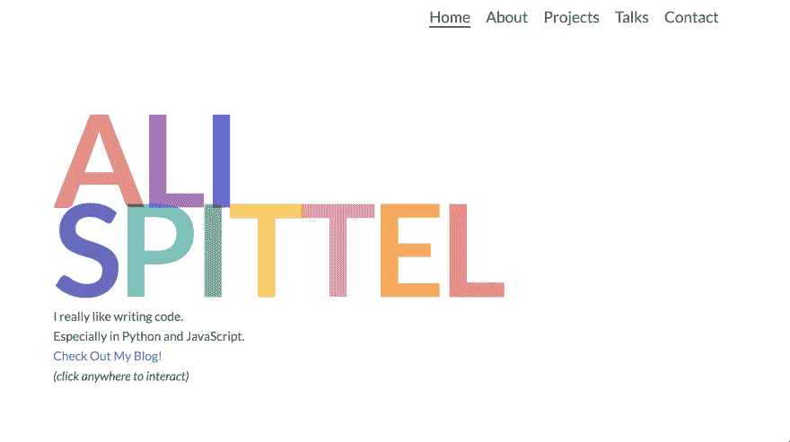

# 构建一流的投资组合

> 原文：<https://dev.to/aspittel/building-a-kickass-portfolio-28ph>

据 GitHub 报道，我从 2016 年 9 月 1 日起就有了一个作品集网站。根据谷歌分析，从 2016 年 9 月到 2017 年 10 月，我的投资组合的两次迭代只有不到 300 次浏览。2017 年 10 月，我对[我的网站](https://www.alispit.tel)做了一次彻底的重写，结果相当戏剧化。第一个月我就获得了 1861 次浏览，从那以后，我平均每个月都有大约 1000 次点击。当然，相关性不是因果关系，但我认为重新设计肯定有积极的影响。这不完全是脸书，但对于一个除了我的信息之外什么都不向浏览者提供的投资组合网站来说，我认为这些数字相当不错！

[T2】](https://res.cloudinary.com/practicaldev/image/fetch/s--sU93sXvy--/c_limit%2Cf_auto%2Cfl_progressive%2Cq_auto%2Cw_880/https://thepracticaldev.s3.amazonaws.com/i/i08xlos0r72yfoq0ss6k.png)

在这篇文章中，我将深入探讨什么对我有用，什么没用，我建立一个令人敬畏的投资组合的技巧，以及我喜欢的其他人的投资组合。

## 什么没起作用

在我开始我目前真正喜欢的作品之前，我想谈谈我的前两个网站。

### 我的第一个作品集

第一个是 Jekyll 网站，使用了 SASS 和 Pug。出于怀旧的原因，我在这里部署了它——看看这些项目——它们都来自大学，而且大多数都是 C++！

[T2】](https://res.cloudinary.com/practicaldev/image/fetch/s--9dsUPkZ2--/c_limit%2Cf_auto%2Cfl_progressive%2Cq_auto%2Cw_880/https://thepracticaldev.s3.amazonaws.com/i/1s3a76idhc82y92qv4vh.png)

对于网站的实际内容来说，这种设置是不必要的复杂。对于这样一个简单的页面，我使用了 Jekyll、MaterializeCSS、SASS 和 Pug 我认为 Gulp 设置比实际需要的 CSS 要长！我刚刚过渡到以任何身份编写前端代码，所以这对我来说是一个使用 SASS 和 Gulp 的学习机会。我也不需要 Jekyll 我只列出了几个项目，而且只有一页。

此外，控制台中显示了一堆 404，用于查找未找到的资源。如果我是一个正在浏览网站的开发者，我肯定会对此提出批评。

[T2】](https://res.cloudinary.com/practicaldev/image/fetch/s--2UjfZYz0--/c_limit%2Cf_auto%2Cfl_progressive%2Cq_auto%2Cw_880/https://thepracticaldev.s3.amazonaws.com/i/tkpgohcpmifnhf4rru08.png)

我的项目截图不是很好。它们要么是编码的，要么是以非最佳方式裁剪的。

[T2】](https://res.cloudinary.com/practicaldev/image/fetch/s--lDstvHCQ--/c_limit%2Cf_auto%2Cfl_progressive%2Cq_auto%2Cw_880/https://thepracticaldev.s3.amazonaws.com/i/gvorql3zoufxscjqogck.png)

字体也太小，很难阅读文本。我的社交偶像并不是最突出的，这意味着他们可能没有太高的参与率。

不过，有些事情我做得很好。我真的很喜欢简历中突出显示的单词——它吸引用户去看那些关键词，即使他们没有阅读整个简历。我也很欣赏这个网站的响应性，这样用户就可以在不同大小的屏幕上浏览这个网站。目前，我大约有 1/3 的流量来自移动端，所以记住这些用户很重要！

### 我的第二个作品集

[T2】](https://res.cloudinary.com/practicaldev/image/fetch/s--ikL4VzB2--/c_limit%2Cf_auto%2Cfl_progressive%2Cq_auto%2Cw_880/https://thepracticaldev.s3.amazonaws.com/i/nm540c6dvldzneow431w.png)

第二次迭代是一个 HTML 和 CSS 网站，背景是移动的圆点。你可以点击查看[。我承认，我仍然对这个投资组合情有独钟。](http://third-match.surge.sh/)

我真的很喜欢移动的气泡，以及它们如何随着用户交互而变化。我也喜欢这个网站的简约风格。我认为主页上的快速简历很有效，很好地表达了我的兴趣。

同样，字体有点小，不得不去一个新的 HTML 页面查看关于我的任何信息可能不是最好的。此外，将我的演讲和我的代码项目放在同一页上会导致不平衡。

总的来说，虽然你可以在我目前的作品中看到这个作品的很多主题。

## 什么奏效了

[T2】](https://res.cloudinary.com/practicaldev/image/fetch/s--RoUTASsY--/c_limit%2Cf_auto%2Cfl_progressive%2Cq_auto%2Cw_880/https://thepracticaldev.s3.amazonaws.com/i/1z743q9sb89tp3nzjd1a.png)

去年 10 月，我从零开始，建立了一个有点与众不同的[投资组合](https://www.alispit.tel)。**你的作品集是你将建立的唯一一个完全创造性表达自己的网站，没有任何限制。**所以，我全力以赴，交互性、动画，凡是你能想到的，它都有。

如果你点击主页上的任何地方，就会出现一个随机的形状。如果你将鼠标悬停在字母上，它们会显示动画。如果你把鼠标悬停在我的照片上，它就会旋转。

[T2】](https://res.cloudinary.com/practicaldev/image/fetch/s--6dSUNHcx--/c_limit%2Cf_auto%2Cfl_progressive%2Cq_auto%2Cw_880/https://thepracticaldev.s3.amazonaws.com/i/bgdyl2qu9flsn5f8pt3a.png)

我在这个作品集里使用了 Vue，所以它可以无缝地从一页过渡到另一页。我还增加了字体大小，这样读者可以更快更容易地收集信息。我的联系人页面提供了大按钮，可以在互联网上的任何地方关注我。

这种设计的最初版本是用 HTML、CSS 和几行 JavaScript 构建的。就我的技术需求而言，这完全没问题。出于我自己的可维护性需要，我想转移到 Vue 重新配置的设置使得添加新项目变得容易得多。我也喜欢 Vue Router 提供的平滑路由，而不是导航到一个实际的新页面。

这个设计抓住了人们的注意力，他们停留在网站上是为了与之互动。此外，人们联系我，谈论我的网站，如果我在找工作，这将是非常棒的！

### 我还能做得更好

至于将人们转化到我的其他社交媒体的有效性，我可以在每个页面上都有我的网站的链接，而不仅仅是联系页面。我可能还需要筛选我的项目，选择几个来展示，而不是列出 26 个个人项目！我也没有我的项目截图-这是故意的，但如果我把图片放在上面，我可能会得到更多的流量。我不喜欢在我的程序截图中添加不同的调色板。还有，我没有太多的项目让我觉得它们本身非常令人印象深刻。在大多数情况下，它们都很小，我创建它们是为了学习一些东西。我可以进一步优化我的网站，但现在，我真的很喜欢它的位置。

## 我关于建立一个优秀投资组合的建议

*   制作一个真实表达自己的作品集。编程在很多方面都是一个创造性的领域，所以发挥你的创造力吧！
*   让网站具有互动性，这样人们就会想呆在你的网站上，并且记住它。
*   买一个域名——我从 aspittel.github.io 转到了 alispit.tel，我真的很喜欢我名字上的玩法，你可以用相当便宜的价格得到很多域名。我使用 NameCheap，它完全值得这个域名每年 8 美元的费用。
*   确保你没有控制台错误——许多技术雇主都在寻找这种错误，所以确保你的网站没有错误！
*   不要仅仅为了使用某项技术而使用它。如果你有一个超级简约的个人网站，不要为了使用而使用重型框架或库。
*   确保你的网站能在手机上运行，我鼓励让它为使用分屏设置的用户运行。
*   我会避免使用网上找到的模板——对我来说，当这些被使用时，它是非常明显的。我理解非 web 开发人员使用它们，但是如果你是 web 开发人员，就展示你的技能吧！
*   用它来推销你自己——如果你想向雇主炫耀特定的技能，确保这些技能在你的网站上有所体现。我想让人们访问我的博客，所以我把它放在了我的主页上。我也想做更多的演讲，所以我有一整页的篇幅来做我的演讲。我不想再专业地写 C++代码，所以我把这些项目从我的网站上删除了。
*   请确保您的链接没有断开。在某些方面，我完全犯了罪，但它看起来并不好，然后你的观众就看不到那个目的地了！
*   更新你的作品集——我也为没有经常这样做而感到内疚，但我至少每隔几个月就会尝试在我的网站上添加新的项目和讲座。
*   用批判的眼光，有意识地进行设计。在进入代码之前，我用草图来绘制我的网站。
*   想想页面速度——我对我所有的网站都进行了 lighthouse 测试，以确保它们的性能。

## 我最喜欢的几个投资组合

*   提莫·贝克尔(Timo Becker)——你把点点滴滴连接起来，创造出不同的插图——只要玩玩它，就棒极了。
*   Ben Halpern -这个网站是如此令人难忘和有趣。
*   朱莉娅·库塞诺娃(Julia Khusainova)——这个网站非常简约，但传达了重点。
*   Nik Papic——又一个简单却漂亮的。
*   罗比·莱昂纳迪 -一份游戏简历！
*   [Dinesh Pandiyan](https://flexdinesh.github.io/) -颜色变化是一个非常酷的功能，我喜欢极简主义的设计。

    ## [迪内什 潘迪言](/flexdinesh)

    [工程师|演讲人|博主| OSS |我造事☕](/flexdinesh)