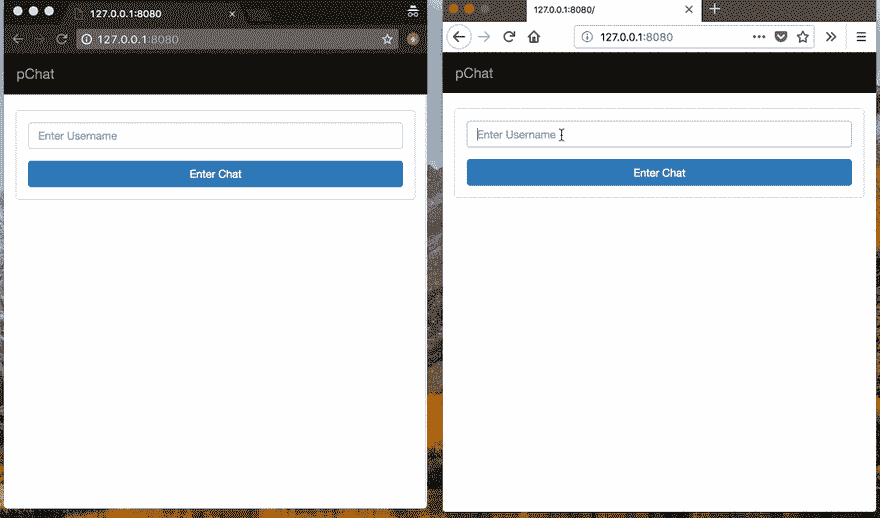
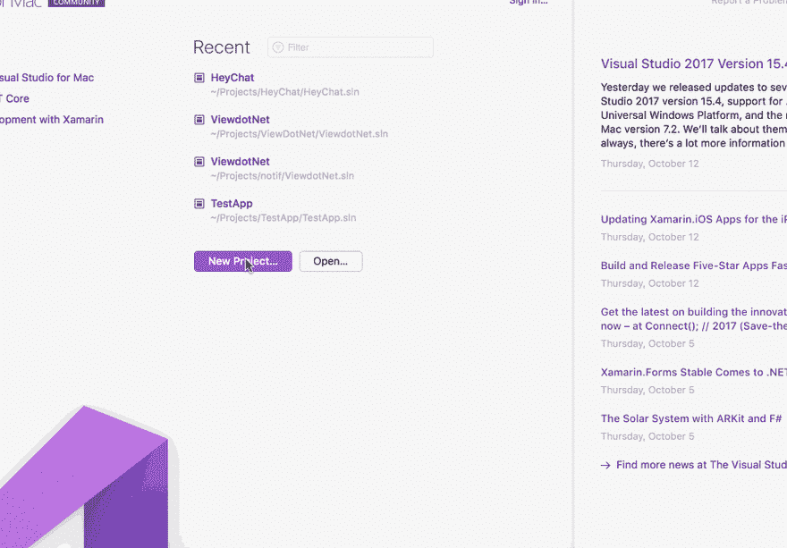

# 使用构建 messenger 应用程序。网

> 原文：<https://dev.to/neo/building-a-messenger-app-using-net--46n>

我们当今时代的交流主要是数字化的，而最流行的数字化交流形式是即时通讯。

一些应用程序包括某种形式的聊天工具，如 Slack 或脸书。在本教程中，我们将考虑如何使用 C# .NET 构建一个聊天应用程序。

要跟随本教程，您将需要:
–Visual Studio，一个广泛用于构建的 IDE。NET 项目。点击查看安装细节[。
–c#基础知识。
——基础知识。净 MVC。
–JavaScript(jQuery)基础知识。](https://www.visualstudio.com/)

[T2】](https://res.cloudinary.com/practicaldev/image/fetch/s--rgwdAeQ1--/c_limit%2Cf_auto%2Cfl_progressive%2Cq_66%2Cw_880/https://blog.pusher.com/wp-content/uploads/2018/01/building-messenger-app-using-net-1.gif)

# 设置我们的聊天项目

使用我们的 Visual Studio IDE，我们将按照 **New Project** 向导创建我们的聊天项目。

我们将:
–将 C#设为我们要使用的语言。
–选择。NET MVC 项目作为模板。
–填写项目名称，例如 HeyChat。
–填写解决方案名称，即应用程序名称。

[T2】](https://res.cloudinary.com/practicaldev/image/fetch/s--sL09LC0b--/c_limit%2Cf_auto%2Cfl_progressive%2Cq_66%2Cw_880/https://blog.pusher.com/wp-content/uploads/2018/01/building-messenger-app-using-net-2.gif)

## 创建我们的聊天应用

### 定义页面和路线

出于本教程的目的，我们的聊天应用程序将由 2 个页面组成:
-首页-用户注册的地方。
–聊天视图–用户选择一个联系人并交换消息。

为了实现这些视图，我们将需要以下路径:
–呈现首页的路径。
–实现登录的路径。
–渲染聊天页面的路径。

> 💡这些路由仅呈现视图并实现用户登录。我们会继续增加更多的路线。

将这些路线添加到我们的`RouteConfig.cs`文件中，我们将得到:

```
 routes.MapRoute(
        name: "Home",
        url: "",
        defaults: new { controller = "Home", action = "Index" }
    );

    routes.MapRoute(
        name: "Login",
        url: "login",
        defaults: new { controller = "Auth", action = "Login" }
    );

    routes.MapRoute(
        name: "ChatRoom",
        url: "chat",
        defaults: new { controller = "Chat", action="Index"}
    ); 
```

这些路线定义指定了路线模式和处理它的**控制器**和**动作**。

> 💡用 Visual Studio 创建我们的项目会自动创建带有`Index`动作的`HomeContoller.cs`文件。我们将用它作为回家的路线。

在我们的`HomeController.cs`中，我们将呈现首页，用户可以使用
登录

```
 //HomeController.cs

    // ...
    Using System.Web.Mvc;
    // ...
    public class HomeController : Controller
    {
        public ActionResult Index()
        {
            if ( Session["user"] != null ) {
                return Redirect("/chat");
            }

            return View();
        }
    } 
```

> 💡**`**View**`**函数创建一个我们返回的视图响应。当它被调用时，C#寻找调用控制器类的默认视图。这个默认视图是视图目录中的** `**index.cshtml**` **文件，该目录与控制器同名，即 HomeController 类的默认视图将是** `**Views/Home/index.cshtml**` **文件。****

 **### 设置我们的数据库

为了实现我们的登录功能，我们需要一个数据库来存储用户。有几个数据库驱动程序可供选择，但是在本教程中，我们将使用 MySQL 数据库驱动程序和一个名为实体框架的. NET ORM。

我们将从通过 NuGet 安装`MySql.Data.Entities`包开始。NET 的包管理器)。然后，我们将通过 NuGet 安装**实体**** * * * *框架* *包，为我们提供 ORM 功能。

> 💡**要使用 NuGet 安装包，在我们的项目解决方案中右键单击 packages 文件夹；选择** `**Add Package**` **选项；并搜索和选择您想要的包。**

一旦我们的包被安装，我们将开始设置我们的数据库连接和通信。

首先，我们将把数据库连接凭证添加到解决方案文件夹中的`Web.config`文件中。在`Web.config`中，我们将添加:

```
 <connectionStrings>
        <add name="YourConnectionName" connectionString="Server=localhost;Database=database_name;Uid=root;Pwd=YourPassword;" providerName="MySql.Data.MySqlClient" />
    </connectionStrings> 
```

> ⚠️ **您需要用实际的数据库值替换上面代码片段中的占位符值。**

`Web.config`文件是一个 **XML** 文件，上面的`connectionStrings`元素将被添加到文件的`configuration`元素的主体中。

接下来，我们将在我们的解决方案文件夹中创建一个`Models`文件夹(与`Controllers`在同一文件夹级别)。在这个文件夹中，我们将创建我们的模型类——这个类代表我们的表。对于登录功能，我们将创建`User.cs`文件。在这个类文件中，我们将添加模型的属性:

```
 // File: User.cs file

    using System;
    using System.Collections.Generic;
    namespace HeyChat.Models
    {
        public class User
        {
            public User()
            {
            }

            public int id { get; set; }
            public string name { get; set; }
            public DateTime created_at { get; set; }
        }
    } 
```

> 💡**创建一个模型类，右击模型文件夹，选择** `**Add**` **和** `**New File**` **选项，然后在** `**Empty Class**` **选项中填入类名。**

我们的`User`模型为我们的 users 表定义了唯一标识 ID、用户名和用户的创建日期。

最后，我们将添加数据库上下文类。这个类读入我们在`Web.config`文件中定义的数据库连接配置，并获取它应该应用配置的模型类(数据集)。

我们将在我们的`Models`文件夹中创建我们的上下文类，遵循创建一个新的空类的相同步骤，我们将它命名为`ChatContext.cs`。在其中，我们将添加以下内容:

```
 // File: ChatContext.cs

    using System;
    using System.Data.Entity;
    namespace HeyChat.Models
    {
        public class ChatContext: DbContext
        {
            public ChatContext() : base("YourConnectionName")
            {
            }

            public static ChatContext Create()
            {
                return new ChatContext();
            }

            public DbSet<User> Users { get; set; }
        }
    } 
```

> 💡**我们是** **使用代码优先的方法实现实体** **框架 ORM。这种方法包括编写定义模型(表)的代码，而不需要任何现有的数据库或表。使用这种方法，当我们的应用程序代码被执行时，数据库和表将被创建。**

### 登录我们的用户

由于我们的数据库连接和模型(尽管随着我们的深入，可能会引入更多的模型)已经创建，我们可以继续我们的登录功能。

从`HomeController`呈现的首页将包含一个接受用户名的表单。该表单将被提交到我们之前定义的`/` `login`路线。按照我们的路由定义，这个请求将由`AuthController`和它的`Login`动作方法来处理。

我们将创建`AuthController`类，并添加用于存储或检索用户详细信息的代码。存储或检索的选项将基于用户名是否已经存在于我们的`Users`表中。`AuthController`的代码如下:

```
 // File: AuthController

    // ...
    using HeyChat.Models;
    public class AuthController : Controller
    {
        [HttpPost]
        public ActionResult Login()
        {
            string user_name = Request.Form["username"];

            if (user_name.Trim() == "") {
                return Redirect("/");
            }

            using (var db = new Models.ChatContext()) {

                User user = db.Users.FirstOrDefault(u => u.name == user_name);

                if (user == null) {
                    user = new User { name = user_name };

                    db.Users.Add(user);
                    db.SaveChanges();
                }

                Session["user"] = user;
            }

            return Redirect("/chat");
        }
    } 
```

在上面的代码中，我们使用这个名称检查用户是否存在。如果存在，我们检索用户的详细信息，如果不存在，我们首先创建一个新记录。然后，我们将用户的详细信息分配到一个`session`对象中，供整个应用程序使用。最后，我们将用户重定向到聊天页面。

### 渲染聊天页面

大多数聊天应用程序的一个特点是能够选择和谁聊天。出于本教程的目的，我们将假设所有注册用户可以互相聊天，因此我们的聊天页面将提供与存储在我们数据库中的任何用户聊天的可能性。

前面，我们定义了我们的聊天路线，并将其分配给了`ChatController`类及其`Index`动作方法。

让我们创建`ChatController`并实现包含可用联系人的聊天页面的呈现。将下面的代码粘贴到`ChatController` :

```
 // File: ChatController

    // ...
    using HeyChat.Models;

    namespace HeyChat.Controllers
    {
        public class ChatController : Controller
        {
            public ActionResult Index()
            {
                if (Session["user"] == null) {
                    return Redirect("/");
                }

                var currentUser = (Models.User) Session["user"];

                using ( var db = new Models.ChatContext() ) {

                    ViewBag.allUsers = db.Users.Where(u => u.name != currentUser.name )
                                     .ToList();
                }

                ViewBag.currentUser = currentUser;

                return View ();
            }
        }
    } 
```

为了获得可用的联系人，我们读取数据库中除当前用户之外的所有用户。使用`ViewBag`将这些用户传递到我们的客户端。我们还使用`ViewBag`传递当前用户。

现在，我们已经将所有可用的联系人检索到了`ViewBag`对象中，我们将创建用于向用户显示这些联系人和聊天页面其余部分的标记。为了创建我们聊天页面的视图文件，我们在`Views`文件夹中创建了一个`Chat`文件夹。

接下来，右击`Chat`文件夹，选择选项`Add` → `Views`，选择 Razor 模板引擎，将文件命名为`index.cshtml`。将下面的代码粘贴到文件中:

```
 <html>
      <head>
        pChat &mdash; Private Chatroom
        <link rel="stylesheet" href="@Url.Content("~/Content/app.css")">
      </head>
      <body>

        <nav class="navbar navbar-inverse">
          <div class="container-fluid">
            <div class="navbar-header">
              <a class="navbar-brand" href="#">pChat - @ViewBag.currentUser.name </a>
            </div>
            <ul class="nav navbar-nav navbar-right">
              <li><a href="#">Log Out</a></li>
            </ul>
          </div>
        </nav>

        <div class="container">
          <div class="row">
            <div class="col-xs-12 col-md-3">
              <aside class="main visible-md visible-lg">
                <div class="row">
                  <div class="col-xs-12">
                    <div class="panel panel-default users__bar">
                      <div class="panel-heading users__heading">
                        Contacts (@ViewBag.allUsers.Count)
                      </div>
                      <div class="__no__chat__">
                          <p>Select a contact to chat with</p>
                      </div>
                      <div class="panel-body users__body">
                        <ul id="contacts" class="list-group"> 
                        @foreach( var user in @ViewBag.allUsers ) {
                            <a class="user__item contact-@user.id" href="#" data-contact-id="@user.id" data-contact-name="@user.name">
                                <li>
                                  <div class="avatar">
                                     
                                  </div>
                                  <span>@user.name</span>
                                  <div class="status-bar"></div>
                                </li>
                            </a>
                        }
                        </ul>
                      </div>
                    </div>
                  </div>
                </div>
              </aside>

            </div>
            <div class="col-xs-12 col-md-9 chat__body">
              <div class="row">
                <div class="col-xs-12">
                  <ul class="list-group chat__main"> 
                  </ul>
                </div>
                <div class="chat__type__body">
                  <div class="chat__type">
                    <textarea id="msg_box" placeholder="Type your message"></textarea>
                    <button class="btn btn-primary" id="sendMessage">Send</button>
                  </div>
                </div>
                <div class="chat__typing">
                  <span id="typerDisplay"></span>
                </div>
              </div>
            </div>
          </div>
        </div>
        <script src="@Url.Content("~/Content/app.js")"></script>
      </body>
    </html> 
```

> 💡`**@Url.Content("~/Content/app.css")**`**`**@Url.Content("~/Content/app.js")**`**从我们的** `**Content**` **文件夹中加载一些之前捆绑的 JavaScript 和 CSS 依赖，比如 jQuery 和 Bootstrap。****

 **在我们的视图文件中，我们创建了一个侧边栏，并遍历传递给`ViewBag`的用户，使用 Razor 的`@foreach`指令来指示可用的联系人。我们还添加了一个文本区域来输入和发送消息给这些联系人。

### 选择联系人并发送消息

当我们的用户选择一个联系人进行聊天时，我们希望检索用户和所选联系人之间以前的消息。为了实现这一点，我们需要一个用于存储用户间消息的表和这个表的模型。

让我们在`Models`文件夹中创建一个名为`Conversations`的模型。它将由唯一的`id`、`sender_id`、`receiver_id`、`message`、`status`和`created_at`日期组成。模型的代码如下:

```
 // File: Conversation.cs

    using System;
    namespace HeyChat.Models
    {
        public class Conversation
        {
            public Conversation()
            {
                status = messageStatus.Sent;
            }

            public enum messageStatus
            {
                Sent, 
                Delivered
            }

            public int id { get; set; }
            public int sender_id { get; set; }
            public int receiver_id { get; set; }
            public string message { get; set; }
            public messageStatus status { get; set; }
            public DateTime created_at { get; set; }
        }
    } 
```

创建完`Conversation`模型后，我们将把它添加到`ChatContext`文件中，如下所示:

```
 // File: ChatContext.cs
    using System;
    using System.Data.Entity;

    namespace HeyChat.Models
    {
        public class ChatContext: DbContext
        {
            public ChatContext() : base("MySqlConnection")
            {
            }

            public static ChatContext Create()
            {
                return new ChatContext();
            }

            public DbSet<User> Users { get; set; }
            public DbSet<Conversation> Conversations { get; set; }
        }
    } 
```

为了检索消息，我们将为`/contact` `/conversations/{contact}`创建一条路由。该路由将接受联系人 ID，检索当前用户和联系人之间的消息，然后在 JSON 响应中返回消息。

将由`ConversationWithContact`动作方法中的`ChatController`处理，如下图:

```
 //ChatController.cs

    ...
    public JsonResult ConversationWithContact(int contact)
    {
        if (Session["user"] == null)
        {
            return Json(new { status = "error", message = "User is not logged in" });
        }

        var currentUser = (Models.User)Session["user"];

        var conversations = new List<Models.Conversation>();

        using (var db = new Models.ChatContext())
        {
            conversations = db.Conversations.
                              Where(c => (c.receiver_id == currentUser.id 
                                  && c.sender_id == contact) || 
                                  (c.receiver_id == contact 
                                  && c.sender_id == currentUser.id))
                              .OrderBy(c => c.created_at)
                              .ToList();
        }

        return Json(
            new { status = "success", data = conversations }, 
            JsonRequestBehavior.AllowGet
        );
    } 
```

现在我们有了检索旧消息的路径，我们将使用一些 jQuery 来选择用户、获取消息并在页面上显示它们。
在我们的视图文件中，我们将创建一个`script`标签来保存我们的 JavaScript 和 jQuery 函数。在里面，我们会加上:

```
 ...
    <script>
    let currentContact = null; // Holds current contact
    let newMessageTpl = 
    `<div>
        <div id="msg-{{id}}" class="row __chat__par__">
          <div class="__chat__">
            <p>{{body}}</p>
            <p class="delivery-status">Delivered</p>
          </div>
        </div>
     </div>`;
    ...
    // select contact to chat with
    $('.user__item').click( function(e) {
        e.preventDefault();

        currentContact = {
            id: $(this).data('contact-id'),
            name: $(this).data('contact-name'),
        };

        $('#contacts').find('li').removeClass('active');

        $('#contacts .contact-' + currentContact.id).find('li').addClass('active');
        getChat(currentContact.id);
    });

    // get chat data 
    function getChat( contact_id ) {
        $.get("/contact/conversations/" + contact_id )
         .done( function(resp) {         
            var chat_data = resp.data || [];
            loadChat( chat_data );         
         });
    }

    //load chat data into view
    function loadChat( chat_data ) {

        chat_data.forEach( function(data) {
            displayMessage(data);
        });

        $('.chat__body').show();
        $('.__no__chat__').hide();
    }

    function displayMessage( message_obj ) {
        const msg_id = message_obj.id;
        const msg_body = message_obj.message;

        let template = $(newMessageTpl).html();

        template = template.replace("{{id}}", msg_id);
        template = template.replace("{{body}}", msg_body);

        template = $(template);

        if ( message_obj.sender_id == @ViewBag.currentUser.id ) {
            template.find('.__chat__').addClass('from__chat');
        } else {
            template.find('.__chat__').addClass('receive__chat');
        }

        if ( message_obj.status == 1 ) {
            template.find('.delivery-status').show();
        }

        $('.chat__main').append(template);
    } 
```

既然选择一个联系人可以检索以前的消息，我们需要用户能够发送新消息。为了实现这一点，我们将创建一个路由，该路由接受正在发送的消息并将其保存到数据库中，然后使用一些 jQuery 从`textarea`字段中读取消息文本并发送到该路由。

```
 //RouteConfig.cs

    ...
    routes.MapRoute(
        name: "SendMessage",
        url: "send_message",
        defaults: new { controller = "Chat", action = "SendMessage" }
    ); 
```

按照`RouteConfig`文件的规定，该路线将由`ChatController`的`SendMessage`动作方式处理。

```
 //ChatController.cs

    ...
    [HttpPost]
    public JsonResult SendMessage() 
    {
        if (Session["user"] == null)
        {
            return Json(new { status = "error", message = "User is not logged in" });
        }

        var currentUser = (User)Session["user"];

        string socket_id = Request.Form["socket_id"];

        Conversation convo = new Conversation
        {
            sender_id = currentUser.id,
            message = Request.Form["message"],
            receiver_id = Convert.ToInt32(Request.Form["contact"])
        };

        using ( var db = new Models.ChatContext() ) {
            db.Conversations.Add(convo);
            db.SaveChanges();
        }

        return Json(convo);
    } 
```

### 添加实时功能

聊天应用程序有几个需要实时功能的特性，其中一些是:
-接收实时发送的消息。
–收到即将响应的通知–“用户正在输入”功能。
–获取消息传递状态。
–联系人离线或在线时的即时通知。

在实现这些功能时，我们将使用[推杆](http://pusher.com)。要继续，让我们前往推动器[仪表板](https://dashboard.pusher.com/)并创建一个应用程序。如果你还没有账户，你可以[免费注册](https://pusher.com/signup?plan=sandbox)。用要求的信息填写创建应用程序表单。接下来，我们将使用 NuGet 在 C#代码中安装 **Pusher 服务器**包。

为了实现我们所说的一些实时特性，我们需要能够在客户端触发事件。为了在这个应用程序中触发客户端事件，我们将使用私有通道。

当联系人被选中时，我们将创建我们的私人频道。该通道将用于在登录用户和他正在发送消息的联系人之间传输消息。

私有通道需要来自服务器端代码的认证端点可用，因为当通道被实例化时，推送器将尝试认证客户端对通道的有效访问。

Pusher 认证请求的默认路由是`/pusher/auth`，因此我们将创建该路由并实现认证。

首先，在我们的`RouteConfig.cs`文件中，我们将添加路由定义:

```
 routes.MapRoute(
        name: "PusherAuth",
        url:  "pusher/auth",
        defaults: new { controller = "Auth", action = "AuthForChannel"}
    ); 
```

然后，正如我们上面定义的，在`AuthController`类文件中我们将创建`AuthForChannel`动作方法并添加:

```
 public JsonResult AuthForChannel(string channel_name, string socket_id)
    {
        if (Session["user"] == null)
        {
            return Json(new { status = "error", message = "User is not logged in" });
        }
        var currentUser = (Models.User)Session["user"];

        var options = new PusherOptions();
        options.Cluster = "PUSHER_APP_CLUSTER";

        var pusher = new Pusher(
        "PUSHER_APP_ID",
        "PUSHER_APP_KEY",
        "PUSHER_APP_SECRET", options);

        if (channel_name.IndexOf(currentUser.id.ToString()) == -1)
        {
            return Json(
              new { status = "error", message = "User cannot join channel" }
            );
        }

        var auth = pusher.Authenticate(channel_name, socket_id);

        return Json(auth);
    } 
```

上面，我们的身份验证端点采用了通道的名称和客户端的套接字 ID，这是 Pusher 在连接尝试时发送的。

> 💡我们将使用对话参与者(即发送者和接收者)的 id 来命名我们的私有通道。我们将用它来限制消息向不在特定对话中的 Messenger 应用程序的其他用户传播。

使用。NET 库，我们通过传递通道名和套接字 ID 来验证用户。然后，我们通过 JSON 返回身份验证的结果对象。

有关客户活动和私人渠道的更多信息，请查看 Pusher [文档](https://pusher.com/docs/client_api_guide/client_presence_channels)。

> 💡客户端事件只能由私有通道或存在通道触发。

在视图的脚本部分，我们将实例化私有通道的变量。我们还将调整我们的联系人选择片段，以创建发送消息、输入和发送通知的渠道:

```
 ...
    <script>
    ...

    let currentContact = null; // Holds contact currently being chatted with
    let socketId = null;
    let currentconversationChannel = null;
    let conversationChannelName = null;

    //Pusher client side setup
    const pusher = new Pusher('PUSHER_APP_ID', {
        cluster:'PUSHER_APP_CLUSTER'
    });

    pusher.connection.bind('connected', function() {
      socketId = pusher.connection.socket_id;
    });

    // select contact to chat with
    $('.user__item').click( function(e) {
        e.preventDefault();

        currentContact = {
            id: $(this).data('contact-id'),
            name: $(this).data('contact-name'),
        };

        if ( conversationChannelName ) {
            pusher.unsubscribe( conversationChannelName );
        }

        conversationChannelName = getConvoChannel( 
                                      (@ViewBag.currentUser.id * 1) ,  
                                      (currentContact.id * 1) 
                                  );

        currentconversationChannel = pusher.subscribe(conversationChannelName);

        bind_client_events();

        $('#contacts').find('li').removeClass('active');

        $('#contacts .contact-' + currentContact.id).find('li').addClass('active');
        getChat(currentContact.id);
    });

    function getConvoChannel(user_id, contact_id) {
        if ( user_id > contact_id ) {
            return 'private-chat-' + contact_id + '-' + user_id;
        }

        return 'private-chat-' + user_id + '-' + contact_id;
    }

    function bind_client_events(){
      //bind private channel events here 

      currentconversationChannel.bind("new_message", function(msg) {
          //add code here
      });

      currentconversationChannel.bind("message_delivered", function(msg) {
          $('#msg-' + msg.id).find('.delivery-status').show();
      });
    } 
```

我们还将用于连接通道的`socket_id`保存在一个变量中。这个以后会派上用场的。

**接收实时发送的消息**
之前，我们添加了一个路由来保存用户和联系人之间的对话发送的消息。

但是，在保存这些消息后，我们希望将这些消息添加到用户和联系人的屏幕上。

为了实现这一点，在我们的 C#代码中，在存储消息后，我们将通过 Pusher 私有通道触发一个事件。然后，我们的客户将监听这些事件，并通过将它们携带的消息添加到屏幕上来响应它们。

在我们的`ChatController`类文件中，保存对话后，我们将添加以下内容:

```
 private Pusher pusher;

    //class constructor
    public ChatController() 
    {
        var options = new PusherOptions();
        options.Cluster = "PUSHER_APP_CLUSTER";

        pusher = new Pusher(
           "PUSHER_APP_ID",
           "PUSHER_APP_KEY",
           "PUSHER_APP_SECRET",
           options
       );
    }

    [HttpPost]
    public JsonResult SendMessage() 
    {
        if (Session["user"] == null)
        {
            return Json(new { status = "error", message = "User is not logged in" });
        }

        var currentUser = (User)Session["user"];

        string socket_id = Request.Form["socket_id"];

        Conversation convo = new Conversation
        {
            sender_id = currentUser.id,
            message = Request.Form["message"],
            receiver_id = Convert.ToInt32(Request.Form["contact"])
        };

        using ( var db = new Models.ChatContext() ) {
            db.Conversations.Add(convo);
            db.SaveChanges();
        }

        var conversationChannel = getConvoChannel( currentUser.id, contact);

        pusher.TriggerAsync(
          conversationChannel,
          "new_message",
          convo,
          new TriggerOptions() { SocketId = socket_id });

        return Json(convo);
    }

    private String getConvoChannel(int user_id, int contact_id)
    {
        if (user_id > contact_id)
        {
            return "private-chat-" + contact_id + "-" + user_id;
        }

        return "private-chat-" + user_id + "-" + contact_id;
    } 
```

为了利用 Pusher 服务器端功能，我们将把`using PusherServer;`添加到控制器文件的顶部。

> 💡我们在发送消息时接受了用户的`socket_id`。这样，我们可以指定发送者可以免于收听他们广播的事件。

在我们的视图中，我们将监听`new_message`事件，并使用它向我们的视图添加新消息。

```
 //index.cshtml

    ...
    <script>
    ...
    //Send button's click event
    $('#sendMessage').click( function() {
        $.post("/send_message", {
            message: $('#msg_box').val(),
            contact: currentContact.id,
            socket_id: socketId,
        }).done( function (data) {
            //display the message immediately on the view of the sender
            displayMessage(data); 
            $('#msg_box').val('');
        });
    });

    function bind_client_events(){
        //listening to the message_sent event by the message's recipient
        currentconversationChannel.bind("new_message", function(msg) {
                if ( msg.receiver_id == @ViewBag.currentUser.id ) {
                    displayMessage(msg);
                }
        });
    } 
```

**实现“用户正在键入”功能**
该功能使用户意识到对话是活跃的并且正在键入响应。为了实现这一点，我们将监听消息文本区域的`keyup`事件，当这个`keyup`事件发生时，我们将触发一个名为`client-is-typing`的客户端事件。

```
 // index.cshtml

    function bind_client_events(){
        currentconversationChannel.bind("client-is-typing", function(data) {
            if ( data.user_id == currentContact.id && 
                 data.contact_id == @ViewBag.currentUser.id  ) {

                $('#typerDisplay').text( currentContact.name + ' is typing...');

                $('.chat__typing').fadeIn(100, function() {
                    $('.chat__type__body').addClass('typing_display__open');
                }).delay(1000).fadeOut(300, function(){
                    $('.chat__type__body').removeClass('typing_display__open');
                });
            }
        });

        ...
    }

    //User is typing
    var isTypingCallback = function() {
        chatChannel.trigger("client-is-typing", {
            user_id: @ViewBag.currentUser.id,
            contact_id: currentContact.id,
        });
    };

    $('#msg_box').on('keyup',isTypingCallback);
    ... 
```

## 结论

在 jQuery 的帮助下，我们用 C#构建了一个聊天应用程序，并使用 Pusher 实现了一些聊天应用程序中常见的实时特性。这只是在 Pusher 实时功能的帮助下构建 C#应用的一小部分。

我们很想听听你的想法，并开始用 C#和 Pusher 构建应用程序。如果你对本教程的某些部分有任何问题，我们也很乐意倾听。所以拜托，在下面留下评论吧！本教程的全部代码可以在 Github 上找到。

该帖子最先出现在 [Pusher 博客](https://blog.pusher.com/building-a-messenger-app-using-net/)上。****