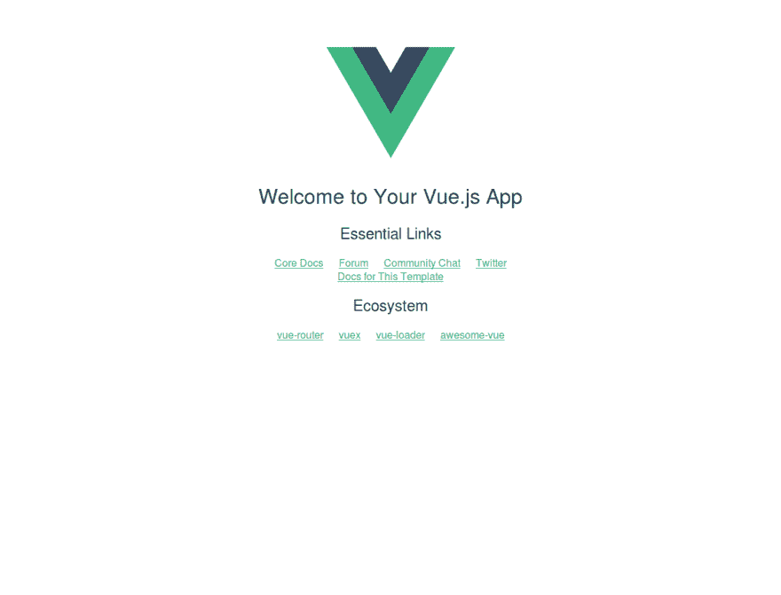
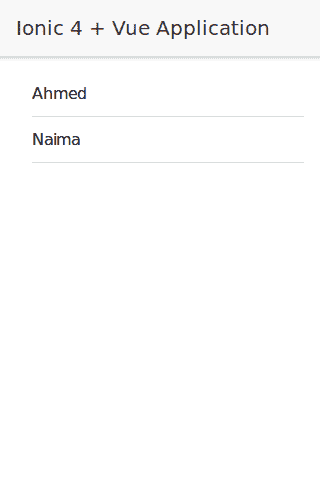
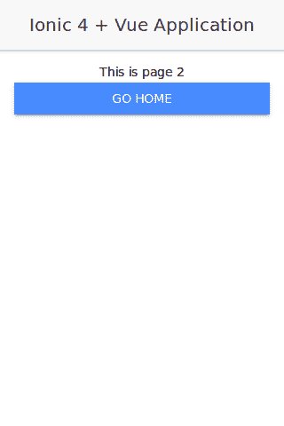

# 使用 Vue、Ionic 4 和 Cordova 构建移动应用程序

> 原文：<https://dev.to/techiediaries/building-a-mobile-application-with-vue-ionic-4-and-cordova-5gk3>

Ionic 4 是 Ionic 的最新版本，由于 Stencil，它使用了 web 组件

Ionic 4 允许您使用任何 JavaScript/TypeScript 前端库或框架，如 Angular、AngularJS、Vue 或 React 等。构建移动应用程序，这样你就不会像以前的版本(如 3.x.x 或以前的版本)那样被迫打字或使用不同的字体。

## 总结

在本教程中，您将学习*如何安装 Vue CLI *如何使用 Vue CLI 生成新的 Vue 项目*如何将 Ionic 4 组件与您的 Vue 应用程序集成

## 生成 Vue 应用

首先确保你已经安装了节点和 NPM，然后开始安装 Vue CLI

```
$ npm install vue-cli -g 
```

Enter fullscreen mode Exit fullscreen mode

这将全局安装 Vue CLI。如果由于权限原因安装失败，您可能希望在命令中添加 *sudo* 。

现在您可以基于 Webpack 模板创建一个新的 Vue.js 项目，所以只需运行下面的命令

```
$ vue init webpack ionic4-vue 
```

Enter fullscreen mode Exit fullscreen mode

Vue CLI 会询问您一些信息，以及您是否想使用一些组件，如 Vue 路由器。回答这些问题，然后等待您的项目生成并安装依赖项。

接下来，在项目根文件夹中导航并运行

```
$ npm run dev 
```

Enter fullscreen mode Exit fullscreen mode

这将在端口 *8080* 上启动 Webpack 开发服务器。您可以使用 web 浏览器导航到 [http://localhost:8080](http://localhost:8080) 来查看您的 Vue 应用程序的启动和运行

[T2】](https://res.cloudinary.com/practicaldev/image/fetch/s--vbdDF97D--/c_limit%2Cf_auto%2Cfl_progressive%2Cq_auto%2Cw_880/https://screenshotscdn.firefoxusercontent.cimg/74239f95-bc6a-4084-8180-cc9a1ccd72c9.png)

## 添加离子 4

要将 Ionic 4 组件添加到 Vue 应用程序中，您必须使用核心 Ionic JS 文件。这是目前唯一的办法，直到离子 4 最终将被释放。

因此，请打开位于 Vue 应用程序根文件夹中的`index.html`,然后添加下面的`<script src='https://unpkg.com/@ionic/core@0.0.2-20/dist/ionic.js'></script>`标签，以包含 Ionic 4 核心文件，该文件包含您通常与 Ionic 一起使用的 UI 组件。

```
<!DOCTYPE html>
<html>
  <head>
    <meta charset="utf-8">
    <meta name="viewport" content="width=device-width,initial-scale=1.0">
    ionic4-vue
    <script src='https://unpkg.com/@ionic/core@0.0.2-20/dist/ionic.js'></script>

  </head>
  <body>
    <div id="app"></div>
    <!-- built files will be auto injected -->
  </body>
</html> 
```

Enter fullscreen mode Exit fullscreen mode

接下来打开`src/components/HelloWorld.vue`组件然后添加以下内容:

```
<template>
  <ion-app>
    <ion-page class="show-page">
      <ion-header>
        <ion-toolbar>
          <ion-title>Ionic 4 + Vue Application </ion-title>
        </ion-toolbar>
      </ion-header>
      <ion-content class="content" padding>
          <ion-list>
            <ion-item v-for="item of items" v-bind:key="item.id">
              <ion-label full></ion-label>
            </ion-item>
          </ion-list>
      </ion-content>
    </ion-page>
  </ion-app>
</template>

<script>
export default {
  name: 'App',
  data () {
    return {
      items: [{id: 0, name:'Ahmed'},{id:1, name: 'Naima'}]
    }
  },  
}
</script> 
```

Enter fullscreen mode Exit fullscreen mode

这利用了`<ion-list>`来显示一组项目

[T2】](https://res.cloudinary.com/practicaldev/image/fetch/s--8Z2rjGkh--/c_limit%2Cf_auto%2Cfl_progressive%2Cq_auto%2Cw_880/https://screenshotscdn.firefoxusercontent.cimg/8fa32336-2315-49e4-a55f-cce0037f5bb9.png)

您还可以使用任何其他 Ionic 4 组件，因此可以随意试验您的演示应用程序，以了解如何在 Vue 中使用 Ionic 组件。

如果你在一个真实的移动设备上运行你的应用程序，你会注意到一个缩放的问题。你可以在手机上解决缩放问题，你所需要做的就是使用一个`<meta>`标签来设置视窗

从 Ionic 应用程序添加这些元标签:

```
<meta name="viewport" content="width=device-width, initial-scale=1.0, minimum-scale=1.0, maximum-scale=1.0, user-scalable=no">
<meta name="format-detection" content="telephone=no">
<meta name="msapplication-tap-highlight" content="no"> 
```

Enter fullscreen mode Exit fullscreen mode

## 添加路线/导航

接下来，您将使用 Vue 路由器在应用程序的不同页面之间导航，因为 Vue 中没有 Ionic 导航控制器(它是一个角度组件)

因此，在`HelloWorld.vue`组件中添加一个 Ionic 4 按钮，并将其 *click* 处理程序绑定到一个 *goToPage2()* 方法

```
<ion-button @click="goToPage2" full>Go To Page II</ion-button> 
```

Enter fullscreen mode Exit fullscreen mode

接下来，在同一个文件中添加以下代码

```
methods: {
    goToPage2 () {
      this.$router.push('page2')
    }
  } 
```

Enter fullscreen mode Exit fullscreen mode

*goToPage2()* 方法使用 Vue 路由器的 *push()* 方法导航到第 2 页(类似于 Ionic/Angular*nav controller*的概念)

现在您需要创建第 2 页组件

在`src/components`中创建文件`Page2.vue`然后添加以下内容

```
<template>
  <ion-app>
    <ion-page class="show-page">
      <ion-header>
        <ion-toolbar>
          <ion-title>Ionic 4 + Vue Application </ion-title>
        </ion-toolbar>
      </ion-header>
      <ion-content class="content" padding>
        This is page 2
      </ion-content>
    </ion-page>
  </ion-app>
</template>

<script>
export default {
  name: 'App',
  data () {
    return {
    }
  },  
  methods: {
  }  
}
</script> 
```

Enter fullscreen mode Exit fullscreen mode

接下来，您需要为这个组件创建一个路由。打开`src/router/index.js`然后更新它以反映变化

```
import Vue from 'vue'
import Router from 'vue-router'
import HelloWorld from '@/components/HelloWorld'
import Page2 from '@/components/Page2'
Vue.use(Router)

export default new Router({
  routes: [
    {
      path: '/',
      name: 'HelloWorld',
      component: HelloWorld
    },
    {
      path: '/page2',
      name: 'Page 2',
      component: Page2      
    }
  ]
}) 
```

Enter fullscreen mode Exit fullscreen mode

我们导入之前创建的 *Page2* 组件，然后添加一条新路线来设置导航。

[T2】](https://res.cloudinary.com/practicaldev/image/fetch/s--ghXL5Hvx--/c_limit%2Cf_auto%2Cfl_progressive%2Cq_auto%2Cw_880/https://screenshotscdn.firefoxusercontent.cimg/7b4073ec-f658-4397-b154-3b874728c257.png)

同样返回到`Page2.vue`并添加一个 Ionic 4 按钮导航回 *HelloWorld* 页面

```
<ion-button @click="goToHome" full>Go Home</ion-button> 
```

Enter fullscreen mode Exit fullscreen mode

接下来将 *goToHome* 方法添加到方法数组
中

```
methods: {
      goToHome(){
          this.$router.push('/')
      }
  } 
```

Enter fullscreen mode Exit fullscreen mode

[T2】](https://res.cloudinary.com/practicaldev/image/fetch/s--T1YcezLf--/c_limit%2Cf_auto%2Cfl_progressive%2Cq_auto%2Cw_880/https://screenshotscdn.firefoxusercontent.cimg/a4a36777-e1bd-4c81-8e5f-d909c7922278.png)

将 Ionic 与 Angular 配合使用时，您可以使用 *NavController* 来为您的应用程序明确定义路线，但将 Ionic 与 Vue 配合使用时，您没有任何 Vue 助手类来实现相同的功能，因此您需要手动定义路线。

## 整合 Vue 与 Cordova

首先，如果您还没有安装 Cordova，让我们从全局安装开始

打开您的终端并运行以下命令

```
npm install -g cordova 
```

Enter fullscreen mode Exit fullscreen mode

接下来，您需要通过运行以下命令来创建一个 Cordova 项目:

```
cordova create ionic-vue-cordova 
```

Enter fullscreen mode Exit fullscreen mode

接下来在项目文件夹中导航，然后将之前创建的 Vue 应用程序的构建文件复制到 Cordova 项目的 **www** 中

还要确保在复制 Vue 文件之前清除所有文件中的 **www** ,并在`index.html`中添加下面一行

将`cordova.js`文件添加到`index.html` :

```
<script type="text/javascript" src="cordova.js"></script> 
```

Enter fullscreen mode Exit fullscreen mode

更好的方法是将 Vue 项目放在 Cordova 项目中，然后设置 Vue Webpack 文件，直接在 Cordova **www** 文件夹中生成构建文件

只需打开`config/index.js`，然后将目标构建文件夹更改为 *www* :

```
build: {
  index: path.resolve(__dirname, '../www/index.html'),
  assetsRoot: path.resolve(__dirname, '../www'),
  assetsSubDirectory: 'static',
  assetsPublicPath: './', 
```

Enter fullscreen mode Exit fullscreen mode

另外， *assetsPublicPath* 从`/.`更改为`./`，这将允许使用 Cordova 加载文件。

### 为 iOS 和 Android 构建

为 Android 或 iOS 构建应用程序与你通常使用 Ionic 的方式相似(因为它也在幕后使用 Cordova)。

所以你首先需要添加一个目标平台

```
cordova platform add ios --save
cordova platform add android --save 
```

Enter fullscreen mode Exit fullscreen mode

接下来你需要构建你的 Vue 应用程序，然后复制 *www* 文件夹
中的文件

```
npm run build 
```

Enter fullscreen mode Exit fullscreen mode

如果您已经将 Vue 应用程序配置为直接输出 *www* 文件夹中的文件，那么您不需要手动复制它们。

接下来，使用以下命令在真实设备中运行您的应用程序

```
cordova run ios --device
cordova run android --device 
```

Enter fullscreen mode Exit fullscreen mode

## 结论

在本教程中，我们看到了如何用 Vue、Ionic 4 和 Cordova 构建一个简单的移动应用程序。