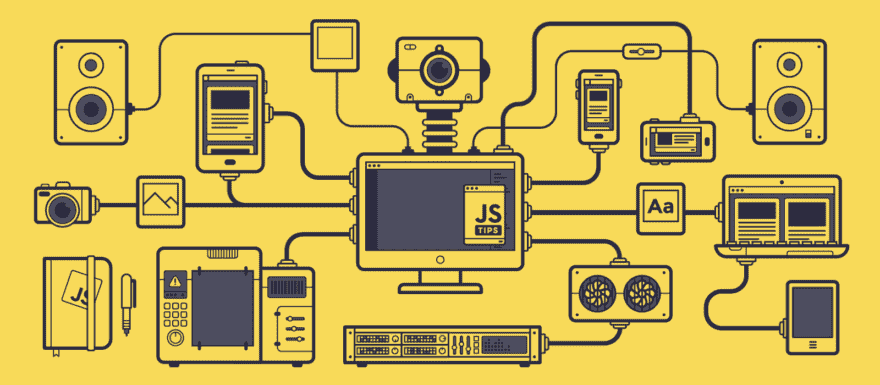
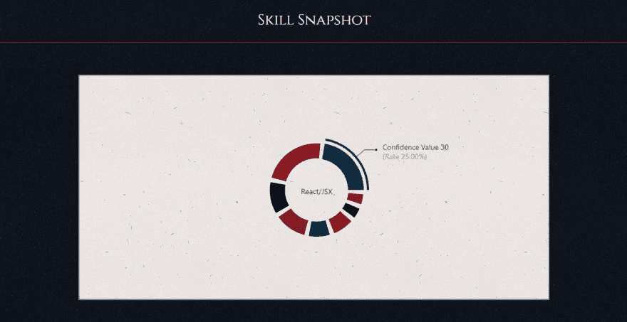
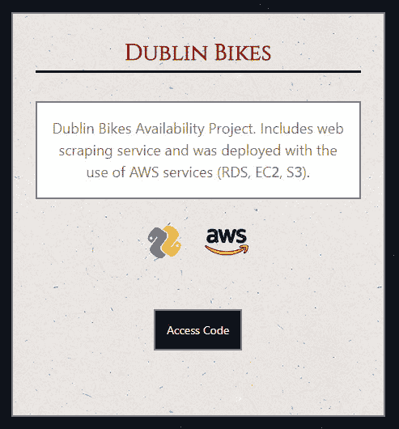
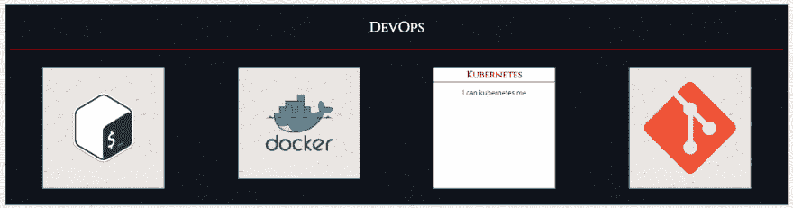

# 建立投资组合:痛苦之路

> 原文：<https://dev.to/dan_mcm_/building-a-portfolio-the-painful-way-3im8>

目标:让我们将我迄今为止学到的所有 JS 和 React 相关的东西结合在一个大项目中！什么会出错？

最终结果:[网站](https://daniel40392.github.io/react-portfolio/) & [代码库](https://github.com/daniel40392/react-portfolio)

[T2】](https://res.cloudinary.com/practicaldev/image/fetch/s--ofBVFpmh--/c_limit%2Cf_auto%2Cfl_progressive%2Cq_66%2Cw_880/https://cdn-images-1.medium.com/max/2000/1%2AOF0xEMkWBv-69zvmNs6RDQ.gif)

## JavaScript 比较复杂...*八九不离十*

在过去一年的工作中，我学到了很多关于 JavaScript 的东西，毫无疑问，这个领域的任何新手都会经历这些东西——这里是我在这个过程中遇到的一些问题，毫无疑问，你们中的一些人可能会有同感，并希望在阅读中得到一些安慰:

*   用 JS 编程应该用什么 IDE？
*   我应该用什么插件来优化我的工作流程？
*   什么是包装经理，纱线和 NPM 之间有什么大不了的？
*   Webpack 到底是什么东西，为什么我已经讨厌它了？
*   ESLINT？当然这在理论上很好，但是你有没有尝试过自己设置配置——很痛苦！
*   酵素、Jest &摩卡——你确定你说的还是 JS？
*   CommonJS、ES6 和 ES2018 有什么区别？

在过去的一年里，我已经适应了这门语言的独特之处，并且可以愉快地与之共事。这在很大程度上仍然是一种爱恨交加的关系，但在处理了从全栈 web 应用程序、chrome 扩展和发布基本节点包等多个项目后，我对自己使用这种语言作为编码媒介的能力更有信心了。

我感到如此自信，以至于我想通过在我的个人 GitHub 上创建一个投资组合网站来展示我的知识和技能，尝试我所学的所有技术，并惊叹会出现什么样的怪物。

## 接吻——保持简单愚蠢

那些在 UX 工作的人会知道，在任何项目开始之前，你都应该做模型设计和用户测试，以提供一个最佳的产品来实现最大的影响。这是一次在不做什么的完美道路上的冒险...一边走一边编吧。

我在一个记事本上有了一个想法(一个粗略的草图),我将把它作为网站结构的基础，并打算从那里开始工作...那么这个过程是如何进行的呢？

## 编码设置

首先，我必须从头开始设置项目。我首先使用了一个基本的 create-react-app 模板。

为了简化开发过程，我在我的 [Atom](https://atom.io/) IDE 中设置了[beautiful](https://prettier.io/)来处理保存时的自动换行，并添加了我最喜欢的[城市之光](http://citylights.xyz/)主题来让这个项目看起来更轻松。

我开始构建一些基本的可重用 React 组件，比如卡片、页眉、页脚和导航栏。为了支持多页面功能，我最终添加了 React Router 和 React DOM——这不是我以前用 create-react-app 模板真正做过的事情。

为了使代码更加清晰，我最终将各个页面视为“容器”,而不是“组件”。这似乎是将愚蠢的无状态组件从更智能的有状态页面组件中分离出来的好方法。

接下来，我想展示一下我在过去一年中使用的一些库，所以我添加了[样式的组件](https://www.styled-components.com/) & [网格样式](http://jxnblk.com/grid-styled/)来帮助构建具有自定义样式的单个页面布局。

我决定在去年遇到的设计库中加入一个致敬，包括 [Ant Design](https://ant.design/) Carousel。我想在不久的将来建立自己的旋转木马，但现在这感觉像一个很好的占位符，最终结果是非常令人满意的。

[T2】](https://res.cloudinary.com/practicaldev/image/fetch/s--5TBl7c59--/c_limit%2Cf_auto%2Cfl_progressive%2Cq_auto%2Cw_880/https://thepracticaldev.s3.amazonaws.com/i/uag9rz15rn6064tda001.png)

我添加了一个甜甜圈图来表示我对我的顶级技能的信心水平，这样网站的登录页面就会给任何对我的技能集感兴趣的人一个我的优势和劣势的快照。

[T2】](https://res.cloudinary.com/practicaldev/image/fetch/s--3JGVUTkL--/c_limit%2Cf_auto%2Cfl_progressive%2Cq_auto%2Cw_880/https://thepracticaldev.s3.amazonaws.com/i/1s8wn365qguaoaga3pfk.png)

## 冒险进入未知领域...css 媒体

我没有接触过使用 css 的动画或过渡，想尝试一些新的东西，所以我浏览了一些其他的 dev.to developers portfolio 站点来寻找灵感。特别是阿里·斯皮特尔的网站让我印象深刻。我喜欢她用卡片展示她所做的一些作品样本。我一直很喜欢她页面上带有旋转图像的“关于”部分的有趣性质，并决定在我自己的项目页面上添加旋转技能图标。

[T2】](https://res.cloudinary.com/practicaldev/image/fetch/s--ozwYZoej--/c_limit%2Cf_auto%2Cfl_progressive%2Cq_auto%2Cw_880/https://thepracticaldev.s3.amazonaws.com/i/m7l2f7nefq78mau9gzrm.png)

我决定将这种媒体探索更进一步，最终在我的主页上包括旋转卡片，以显示每个概述技能的翻转，以包含一些占位符文本。这适用于在浏览器中悬停和在移动设备上点击。我最初是在一个演示牌面朝下的扑克牌的教程中看到这种技术的，这些扑克牌会在鼠标悬停时显示出来。这个想法引起了我的兴趣，所以我忍不住添加它！

[T2】](https://res.cloudinary.com/practicaldev/image/fetch/s--RtaZrs6a--/c_limit%2Cf_auto%2Cfl_progressive%2Cq_auto%2Cw_880/https://thepracticaldev.s3.amazonaws.com/i/8g9cfgcp68cvtk2kuxfo.png)

## 【awwwww yes】功能

我设计的东西中有一些部分让我感到奇怪的自豪，而且以前也没有尝试过实现。我总是纠结于如何处理移动桌面 web 应用程序和控制内容以优化用户体验的概念。当屏幕低于设定的分辨率时，我最终使用了一些自定义的 div 来隐藏环形图和转盘的显示，以便在移动和桌面体验中获得有益的体验。虽然这不是处理这个问题的最佳方式，但它是我喜欢实现的新的和有创造性的东西。

我尝试使用一些定制的 css 灰度特性，允许在联系人页面上使用可悬浮的社交媒体图标，结果相对较好，但可以在以后进行改进。

我为演示我的项目而设置的卡片是我个人的亮点，尤其是看到定制按钮、旋转技能图标和清晰文本和谐显示之间的交互性。

## “超越”痛点

下面的特性对我来说实现起来绝对是一种痛苦，仍然需要一些微调，但我很高兴从头开始经历了这种痛苦。

我开始使用一些定制的 eslinting 规则，并将它们与一些预提交库结合起来，以防止提交代码的能力，除非它通过了林挺参数。传统上，电子打印与定义单个规则的“电子打印”文件一起使用。我以前没有从零开始设置过其中的一个，当我试图处理一个 eslinter 和 [xo](https://github.com/xojs/xo) 库的设置时，结果让我自己非常头疼。最后，我设法得到了一个 xo 库的形式，可以和一些插件一起工作，然而，到目前为止，代码仍然不是 100%正确，然而，到目前为止，已经取得了很好的进展来抵消这个小问题。

## 【待完成】列表

到目前为止，已经对作品集网站的基本轮廓进行了大量的工作，但是仍然需要包括一些基本的缺失功能:

*   Circle CI 与受保护的主分支机构集成
*   更新了登录页面卡片文本
*   有一个测试

我有一些跨多个组件使用的重复的自定义样式，我计划将其合并到一个文件中，并允许导入以防止样式代码的重复。

我想在网站上添加的其他重要内容包括:

*   Redux 的集成
*   切换到使用带有 Express 的服务器端呈现来提供内容。
*   画布元素的集成(也许展示了一些 [p5.js](https://p5js.org/) 知识)

虽然这将是一个很好的方式来展示我的技能，但我觉得网站的静态性质使这些额外的功能暂时变得多余。

## 最后的想法

虽然该网站是一个正在进行中的持续工作，这里是我对这个项目的一些想法

*   构建我自己的可重用响应组件很有趣，这可能是我考虑扩展为可重用组件库项目的事情。

*   媒体-css 的修改很有趣，同时只增加了一些小的动画和交互性，这肯定是我在未来的 webdev 工作中要探索的东西

*   在开始这个项目之前，我肯定会在 UX 的考虑上投入更多的精力，因为目前形式的网站在开发过程中已经经历了许多设计变更。我可能会考虑使用 marvelapp 或 sketch 进行未来的线框设计

*   像 SquareSpace 这样的静态站点生成器在站点布局上更具艺术性，全屏登陆页面、更干净的颜色和更多的分层元素创造了一种更具视觉吸引力的风格。我觉得在不同的项目中采用这种更加面向设计的方法将会是一个有趣的挑战。

*   虽然在 React 中做这些很有趣，但我不禁想到，在 Bootstrap 中创建类似的东西会更快更容易。我甚至停下来考虑开发人员可用的更简单的工具集，从 SquareSpace 和 WordPress 等预定义的网站设计服务

总的来说，这是一个有趣的实验，我很高兴开始，但最终结果并不像我希望的那样干净利落。这是缺乏设计规划的结果。也就是说，我在其中学到了很多东西，在接触 JavaScript 仅一年后，成品还不算太差！

如果你有任何反馈或建议，关于什么可能是一些有用的补充，或者我如何从添加 Redux 到服务中受益，请务必在评论中让我知道。

如果你有过类似的项目，一定要在下面分享-我很想看看！

非常感谢阅读。
下次见！