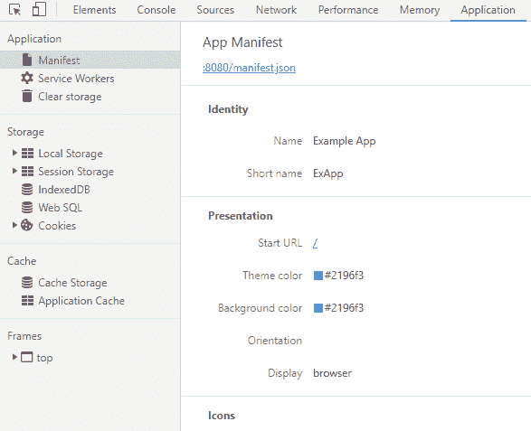
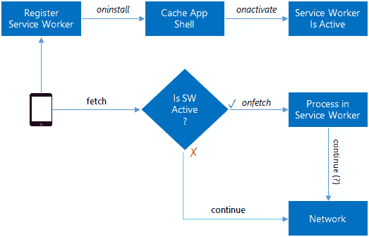
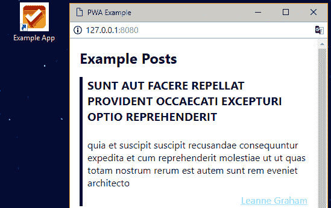

# 构建渐进式 web 应用程序(PWA):无反应、无角度、无 Vue

> 原文：<https://dev.to/bnevilleoneill/building-a-progressive-web-app-pwa-no-react-no-angular-no-vue-40g6>

[T2】](https://res.cloudinary.com/practicaldev/image/fetch/s--BFBiXgsy--/c_limit%2Cf_auto%2Cfl_progressive%2Cq_auto%2Cw_880/https://cdn-images-1.medium.com/max/1024/1%2AXLZEINjl3HInk0Hu8RKILQ.jpeg)

最近，渐进式网络应用(PWAs)获得了更多的关注。部分来说，浏览器(尤其是移动设备)中现有的 API 集就是其中的一部分。

另一方面，人们仍然渴望将一个网络应用程序扩展成一个移动应用程序，既有所有的好处，又没有缺点。这些缺点之一是平台锁定，即满足在平台供应商的商店中列出的要求。

在本文中，我们将探讨如今构建 PWA 需要什么，以及在这个过程中我们面临哪些不利因素或障碍。我们将探索最有用的 API，并获得一个从零到 PWA 的最小示例。

### 历史

让我们从一点历史背景开始。PWA 的主要思想是尽可能多地使用设备的本机功能。这包括各种传感器，如 GPS、加速度计、加速度计等。然而，最重要的是，PWA 也应该离线工作。这意味着脱机时不会出现“找不到页面”或类似的错误。

几年前，离线功能就已经包含在浏览器中了——它是应用缓存或应用清单。在这个规范中，我们需要一个特殊的文件(通常称为 app.cache 或 app.manifest 之类的文件)来描述哪些资源应该可供脱机使用、仅供联机使用，或者在从一种模式切换到另一种模式时被替换。然而，这种方法面临许多问题(特别是在更新清单本身方面)，没有被广泛采用。

[T2】](https://logrocket.com/signup/)

当清单方法失败时，Mozilla 想出了许多新的 API——主要是为他们的 Firefox OS 移动系统。在这一努力中，Mozilla 探索了使用包括网络商店在内的移动应用程序等网络应用程序的可能性，理论上，这也可以被其他平台包括在内，如 Android 或 iOS。不幸的是，Firefox OS 从来没有真正获得过关注，大多数标准的采用也没有变得至关重要。结果是“一个开放的商店”或“一个商店规范”的梦想失败了。

然而，一些 API 继续被指定和采用。

从 Firefox OS 实验中获益良多的 API 之一是服务工作者。很像 web worker，它代表了一个隔离的 JS 执行环境，从底层平台执行和停止。与它交流的唯一方式是通过消息传递。服务人员提供了 web 应用程序(与移动应用程序相比)部分缺失的大量可能性，并允许在离线场景中更灵活地处理缓存。

所有的 API 都在正确的位置上，一些有影响力的人创造了一个新的术语，“Progress Web App”，用于表示 Web 应用程序:

> 可以像本地应用一样使用，但实际上像任何其他 web 应用一样交付——不需要单独的捆绑、分发或任何东西。

根据[维基百科](https://en.wikipedia.org/wiki/Progressive_Web_Apps)存在以下特征:

*   **渐进式**:适用于所有用户，无论他们选择何种浏览器，因为他们以渐进式改进为核心原则。
*   **响应迅速**:适合任何外形规格:台式机、手机、平板电脑或尚未出现的外形。
*   **独立连接**:服务人员允许离线工作，或在低质量网络上工作。
*   **类应用**:给用户一种应用的感觉，具有应用风格的交互和导航。
*   **新鲜**:得益于服务人员的更新流程，始终保持最新。
*   **安全**:通过 HTTPS 提供，防止窥探，确保内容不被篡改。
*   **可发现的**:由于 W3C 清单和服务工作者注册范围允许搜索引擎找到它们，它们可以被识别为“应用程序”。
*   **重新参与**:通过推送通知等功能使重新参与变得容易。
*   可安装的(Installable):允许用户在主屏幕上“保留”他们认为最有用的应用程序，而没有应用程序商店的麻烦。
*   **可链接**:通过 URL 轻松共享，不需要复杂的安装。

但是实现是什么样子的呢？好问题。让我们回顾一下每个特征。

为了让事情新鲜一点，我们将在一个示例应用程序的上下文中解释每个部分。

前面要点的顺序已经调整，以遵循更自然的实施流程。

### 举例

由于我们来自网络背景，我们假设所有这些点都被隐式处理了。因此，我们将省略明显的点，例如，渐进部分、安全部分和可链接部分。安全部分仅表明我们的 web 应用程序来自安全的来源。它通过 TLS 提供，并显示绿色挂锁(没有活动的混合内容)。

我们的示例从三个处于简单基本状态的文件开始:

*   *index.html*包含 HTML 定义
*   布局的 *style.css*
*   *app.js* 描述逻辑

我们的示例应用程序的当前逻辑如下所示:

```
(function () {
  const app = document.querySelector('#app');
  const container = app.querySelector('.entry-container');
  const loadMore = app.querySelector('.load-more');

  async function getPosts(page = 1) {
    const result = await fetch('https://jsonplaceholder.typicode.com/posts?_page=' + page);
    return await result.json();
  }

  async function getUsers() {
    const result = await fetch('https://jsonplaceholder.typicode.com/users');
    return await result.json();
  }

  async function loadEntries(page = 1) {
    const  = await Promise.all([getUsers(), getPosts(page)]);
    return posts.map(post => {
      const user = users.filter(u => u.id === post.userId)[0];
      return `<section class="entry"><h2 class="entry-title">${post.title}</h2><article class="entry-body">${post.body}</article><div class="entry-author"><a href="mailto:${user.email}">${user.name}</a></div></section>`;
    }).join('');
  }

  function appendEntries(entries) {
    const output = container.querySelector('output') || container.appendChild(document.createElement('output'));
    output.outerHTML = entries + '<output></output>';
  }

  (async function() {
    let page = 1;

    async function loadMoreEntries() {
      loadMore.disabled = true;
      const entries = await loadEntries(page++);
      appendEntries(entries);
      loadMore.disabled = false;
    }

    loadMore.addEventListener('click', loadMoreEntries, false);
    loadMoreEntries();
  })();
})(); 
```

没有反应，没有棱角，没有 Vue。只是用一些更新的 API(比如 fetch)和 JS 规范(比如使用 async / await)直接进行 DOM 操作。为了简单起见，我们甚至不捆绑(例如优化、聚合填充和最小化)这个应用程序。

逻辑是简单地加载一些初始条目，并通过单击一个按钮加载更多的功能。对于这个例子，我们使用了 *jsonplaceholder* 服务，它为我们提供了一些样本数据。

事不宜迟，让我们直接进入细节。

### 可发现的

由于 W3C 清单和服务工作者注册范围，我们的 web 应用程序可以被识别为“应用程序”。因此，这使得搜索引擎很容易找到(阅读“发现”)它。

引用至少具有四个关键属性的 web 应用程序清单:

*   `name`，
*   `short_name`，
*   `start_url`，以及
*   `display`(值为“独立”或“全屏”)。

要引用 web 应用程序清单，我们只需要两样东西。一方面，一个有效的 web 应用清单(例如，我们的 web 应用的根文件夹中一个名为 *manifest.json* 的文件)和我们的 HTML 页面中的一个链接:

```
<link href="manifest.json" rel="manifest"> 
```

内容可以简单到:

```
{
  "name": "Example App",
  "short_name": "ExApp",
  "theme_color": "#2196f3",
  "background_color": "#2196f3",
  "display": "browser",
  "scope": "/",
  "start_url": "/"
} 
```

有几个不错的清单生成器；无论是以专用 web 应用程序的形式，还是作为我们构建管道的一部分。后者非常方便，比如使用 Webpack 构建来自动生成内容一致的清单。

一个好的 web 应用程序生成有效清单的例子是 [Web 应用程序清单生成器](https://app-manifest.firebaseapp.com/)。

要检测我们的清单是否有效并被正确提取，我们可以使用我们选择的浏览器的调试工具。在 Chrome 中，目前如下所示:

[](https://res.cloudinary.com/practicaldev/image/fetch/s--LVAx0so7--/c_limit%2Cf_auto%2Cfl_progressive%2Cq_auto%2Cw_880/https://cdn-images-1.medium.com/max/587/1%2AzRVvPPO3O2s0dJAvl_wdew.png)

<figcaption>Chrome“应用清单”调试器工具。</figcaption>

### 可安装

> 允许用户在主屏幕上“保留”他们认为最有用的应用程序，而不需要像应用商店那样麻烦。

清单中至少包含一个 png 格式的 144×144 大图标:

```
"icons": [
  {
    "src":img/icon-144.png",
    "sizes": "144x144",
    "type": "image/png"
  }
] 
```

关于前面提到的生成器的伟大之处在于，它们中的大多数已经为我们创建了图标数组。更好的是，我们只需要提供一个(更大的)基本图像，这将导致所有其他图标。

大多数情况下，installable 指的是安装一个服务人员(稍后会详细介绍)并可以从主屏幕启动，这使得应用程序也像 app 一样。

### 类 App

对用户来说就像一个应用程序，具有应用程序风格的交互和导航。虽然我们永远不会成为真正的本地应用，但我们应该接受触摸手势和手机友好的使用模式。

最重要的是，正如已经讨论过的，我们希望可以从主屏幕上启动。一些浏览器允许我们显示添加到主屏幕提示。这只需要侦听 beforeinstallprompt 事件。最重要的是，已经提到的清单需要包括一些特定的图标(例如，一个 192x192 的大图标)。

简而言之，我们可以监听事件，并通过显示浏览器的默认提示做出反应。或者，我们也可以捕获事件参数，并在自定义 UI 中使用它们。一切都取决于我们。因此，一个简单的实现可能如下所示:

```
window.addEventListener('beforeinstallprompt', e => {
  e.preventDefault();
  e.prompt();
}); 
```

关于这个功能的更多信息可以在谷歌的文档中找到。

### 反应灵敏

适合任何外形:台式机、手机、平板电脑或尚未出现的外形。请记住，响应式设计并不是对不同屏幕尺寸做出反应的限制，它还意味着对不同形式的输入和/或输出做出反应。

当然，瞄准所有存在的东西(智能音箱、智能手表、手机、平板电脑等等)可能是不可能的，甚至是不想要的。因此，在做出任何类型的响应设计努力之前，首先查看期望的目标平台是有意义的。

创建响应式设计可以通过许多不同的方式实现:

*   使用具有相对(例如百分比)测量值的流体布局
*   使用现代布局技术，例如带调整的 Flexbox 或 Grid 布局
*   使用屏幕大小相对媒体查询
*   为更复杂的断点逻辑或容器大小相对条件使用脚本

每一点都有优点和缺点，但它主要取决于我们的问题描述(例如，想要的设计看起来像什么，我们是否需要支持遗留浏览器)。

我们的例子已经遵循了流体设计。我们仍然可以在这一领域进行一些改进，但是由于本文的重点更多地放在连接特性上，所以我们将跳过这一领域的具体步骤。

### 连通性独立

服务人员允许离线工作，或者在低质量的网络上工作。介绍一个服务人员很简单，通常维护/正确使用要困难得多。

脱机时加载(即使只是自定义脱机页)。言下之意，这意味着进步的网络应用需要服务人员。

服务人员需要两样东西:

1.  代表服务人员的独立脚本
2.  我们的主(应用程序)脚本中的一部分，用于注册服务人员(独立脚本)

后者看起来应该类似于

```
// check for support
if ('serviceWorker' in navigator) {
  try {
    // calls navigator.serviceWorker.register('sw.js');
    registerServiceWorker();
  } catch (e) {
    console.error(e);
  }
} 
```

其中 *sw.js* 指服务人员。最好的情况是 *sw.js* 放在我们应用程序的根目录下，否则它不能处理所有内容。

服务人员只能对事件做出反应，而不能访问 DOM。我们关心的主要事件是

*   安装以查明服务人员是否已注册
*   提取以检测网络请求/对网络请求做出正确反应

下图说明了这两个事件在我们的 web 应用程序中的作用。

[](https://res.cloudinary.com/practicaldev/image/fetch/s--0KlI-dP6--/c_limit%2Cf_auto%2Cfl_progressive%2Cq_auto%2Cw_880/https://cdn-images-1.medium.com/max/523/1%2AS2jR21bc4Ob36sqV5dYo-A.png) 

<figcaption>使用服务工作者的例子流程。</figcaption>

此外，我们可能希望跟进成功的服务人员安装。

```
async function registerServiceWorker() {
  try {
    const registration = await navigator.serviceWorker.register('sw.js');
    // do something with registration, e.g., registration.scope
  } catch (e) {
    console.error('ServiceWorker failed', e);
  }
} 
```

关于服务工作者的内容，可以简单到监听安装和获取事件。

```
self.addEventListener('install', e => {
  // Perform install steps
});

self.addEventListener('fetch', e => {
  // Empty for now
}); 
```

在这个阶段，我们的应用程序已经可以独立运行，并像应用程序一样添加到主屏幕(例如，Windows 上的桌面)中。

[](https://res.cloudinary.com/practicaldev/image/fetch/s--u0ZBy6a7--/c_limit%2Cf_auto%2Cfl_progressive%2Cq_auto%2Cw_880/https://cdn-images-1.medium.com/max/549/1%2AJ8cUgqW-btAjbkLbmOCyaQ.png) 

<figcaption>独立运行以特殊窗口模式启动 Chrome。</figcaption>

现在是时候让应用程序更有趣一点了。

### 重新订婚

通过推送通知等功能，轻松实现再次合作。推送通知与其本机计数器部分相似。当用户不使用我们的 web 应用程序，并且他们需要明确的许可才能这样做时，可能会发生这种情况。它们的尺寸也有限(最大。4 kB)并且必须被加密。

虽然权限请求会在需要时自动显示，但我们也可以手动触发请求(推荐):

```
Notification.requestPermission(result => {
  if (result !== 'granted') {
    //handle permissions deny
  }
}); 
```

在我们的服务人员中，我们可以订阅新的推送通知。为此，我们使用跟踪成功服务人员注册的功能:

```
async function subscribeToPushNotifications(registration) {
  const options = {
    userVisibleOnly: true,
    applicationServerKey: btoa('...'),
  };
  const subscription = await registration.pushManager.subscribe(options);
  //Received subscription
} 
```

应用服务器密钥是解密来自我们的消息的公共密钥。启用 Node.js 的 web 推送通知的实现是例如 [Web 推送](https://github.com/web-push-libs/web-push)。

关于 applicationServerKey 的正确值，我们可以在规范中找到以下信息:

> 一个 Base64 编码的 DOMString 或 ArrayBuffer，包含一个 ECDSA P-256 公钥，推送服务器将使用该公钥来验证您的应用服务器。如果指定，来自应用程序服务器的所有消息都必须使用 VAPID 身份验证方案，并包括用相应私钥签名的 JWT。

因此，为了实现这一点，我们需要提供一个 base-64 值来匹配我们的 push 服务器的公钥。然而，实际上，一些较老的浏览器实现需要一个 ArrayBuffer。因此，唯一安全的选择是自己从 base64 字符串进行转换(要寻找的要点是称为 urlBase64ToUint8Array)。

### 新鲜

由于服务人员的更新过程，始终保持最新状态。要查看服务人员的状态，我们应该使用浏览器的调试工具(例如，在 Chrome 中通过应用程序选项卡)。确保在开发模式中选中“重新加载时更新”，否则我们需要手动更新注册的服务人员(避免“跳过等待”确认消息)。潜在的原因是浏览器只允许我们的页面中有一个活动的服务工作者。

好了，废话不多说，让我们直接进入实现这一目标所需的步骤。首先，我们需要为安装和获取事件提供一些实现。在最简单的形式中，我们只在安装事件中将静态文件添加到缓存中。

```
const files = [
  './',
  './app.js',
  './style.css',
];

self.addEventListener('install', async e => {
  const cache = await caches.open('files');
  cache.addAll(files);
}); 
```

caches 对象为我们提供了一个 API 来创建命名缓存(对于调试和驱逐策略非常有用)、解析请求和显式缓存文件。在这个实现中，我们实际上是告诉浏览器从数组中获取 URL，并将它们放入缓存中。服务工作器本身是隐式缓存的。

获取事件可能会变得非常复杂。我们的示例项目的一个非常简单的实现可能如下所示:

```
self.addEventListener('fetch', async e => {
  const req = e.request;
  const res = isApiCall(req) ? getFromNetwork(req) : getFromCache(req);
  await e.respondWith(res);
}); 
```

很好，所以本质上我们只是确定我们当前是获取(静态)文件还是进行 API 调用。在前一种情况下，我们直接进入缓存，在后一种情况下，我们首先尝试网络。最后，我们用给定的响应(来自缓存或网络)进行响应。唯一的区别在于缓存策略。

实施网络优先策略是为了使用另一个命名缓存(“数据”)。这个解决方案非常简单，唯一重要的一点是离线模式下的获取会抛出一个异常，并且响应在被放入缓存之前需要被克隆。原因是一个响应只能读取一次。

```
async function getFromNetwork(req) {
  const cache = await caches.open('data');

  try {
    const res = await fetch(req);
    cache.put(req, res.clone());
    return res;
  } catch (e) {
    const res = await cache.match(req);
    return res || getFallback(req);
  }
} 
```

getFallback 函数使用仅缓存策略，使用最初添加到静态文件缓存中的回退数据。

给定的解决方案并非没有问题。如果问题域非常简单，它可能会工作，但是，如果，例如，我们有一个不断增长的文件集要处理，我们需要一个好的缓存过期策略。此外，随着多个 API 请求和外部静态文件进入我们的问题域，我们可能会面临新的挑战。

应对这些潜在挑战的一个很好的解决方案是来自谷歌的 workbox-sw。它负责整个更新过程，并在标准获取事件上提供了一个很好的抽象层。

### 结论

pwa 只不过是我们的标准 web 应用程序，通过使用一些最近引入的 API 来改进一般 UX。“渐进”这个名称表明该技术不需要硬切割。实际上，我们可以决定什么是有意义的，什么应该被包括在内。

如果您想按照完整的示例步骤进行操作，可以随意克隆和使用位于 [GitHub — PWA Example](https://github.com/FlorianRappl/pwa-example) 的存储库。自述文件将引导您浏览各个分支。

你已经增强了你的网络应用了吗？你喜欢哪些部分，目前缺少什么？在处理 PWAs 时，你最喜欢的库是什么？请在评论中告诉我们！

### 参考文献

[2]: [工具箱文档](https://developers.google.com/web/tools/workbox/modules/workbox-sw)

* * *

### Plug: [LogRocket](https://logrocket.com/signup/) ，一款适用于网络应用的 DVR

[](https://logrocket.com/signup/)

<figcaption>[https://logrocket.com/signup/](https://logrocket.com/signup/)</figcaption>

LogRocket 是一个前端日志工具，可以让你回放问题，就像它们发生在你自己的浏览器中一样。LogRocket 不需要猜测错误发生的原因，也不需要向用户询问截图和日志转储，而是让您重放会话以快速了解哪里出错了。它可以与任何应用程序完美配合，不管是什么框架，并且有插件可以记录来自 Redux、Vuex 和@ngrx/store 的额外上下文。

除了记录 Redux 操作和状态，LogRocket 还记录控制台日志、JavaScript 错误、堆栈跟踪、带有头+正文的网络请求/响应、浏览器元数据和自定义日志。它还使用 DOM 来记录页面上的 HTML 和 CSS，甚至为最复杂的单页面应用程序重新创建像素级完美视频。

免费试用。

* * *

帖子[构建渐进式网络应用(PWA): No React，no Angular，no Vue](https://blog.logrocket.com/building-a-progressive-web-app-pwa-no-react-no-angular-no-vue-aefdded3b5e/) 最先出现在[博客](https://blog.logrocket.com)上。