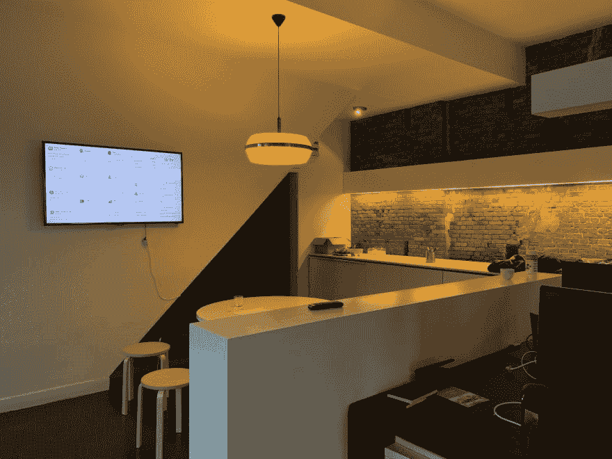

# ★构建由 Laravel、Vue、Pusher 和 Tailwind 驱动的实时仪表盘(2018 版)

> 原文：<https://dev.to/freekmurze/building-a-realtime-dashboard-powered-by-laravel-vue-pusher-and-tailwind-2018-edition-1efk>

在 [Spatie](https://spatie.be) 我们有一个靠墙的电视屏幕，显示一个仪表盘。这个仪表板显示了我们团队应该完成的任务、近期的重要事件、我们每个团队成员应该完成的任务、他们正在听的音乐等等。它看起来是这样的:

[T2】](https://res.cloudinary.com/practicaldev/image/fetch/s--0A-HLO6h--/c_limit%2Cf_auto%2Cfl_progressive%2Cq_auto%2Cw_880/https://freek.dev/uploads/media/dashboard-2018/dashboard.png)

我们已经开源了我们的仪表板，所以你可以在 GitHub 上查看完整的源代码[。内置](https://github.com/spatie/dashboard.spatie.be) [Laravel 5.7](https://laravel.com) 、 [Vue](https://vuejs.com) 和[顺风 CSS](https://tailwindcss.com/) 。

这个仪表板并不是全新的。最初的版本是几年前出版的。在我们公司，我们喜欢摆弄新东西。这就是为什么我们每年都要对源代码进行一次大清理。我们还会更新所有依赖项和使用的技术。今年我们专注于更新设计。仪表板现在使用 [Tailwind CSS](https://tailwindcss.com/) 。在这篇博文中，这是对[上一篇](https://freek.dev/building-a-realtime-dashboard-powered-by-laravel-and-vue-2017-edition)的更新，我想解释一下这个仪表板是如何构建的。

你需要熟悉拉勒维尔和 T2，才能从这篇文章中获得最大的收获。如果你需要复习你的 Vue 知识，我可以强烈推荐 [Laracasts 关于 Vue](http://vuecasts.com) 的课程。

## 历史

我们在斯帕蒂有一个仪表板已经有一段时间了。在我们当前的基于 Laravel 的框架之前，我们使用了 [Dashing](http://dashing.io) ，一个快速构建仪表板的框架。这个框架是由 [Shopify](https://www.shopify.com/) 的人创建的，在引擎盖下使用了 Ruby。

几年前，当我第一次构建我们的仪表板时，我们正处于与我们公司的十字路口。PHP 世界没有太多的动力，我们在考虑转换到 Ruby。这个想法是，通过玩 Dashing，我们可以获得一些语言经验。后来 Composer 和 Laravel 出现了，我们决定继续使用 PHP(鉴于 PHP 生态系统的现状，我们一点也不后悔这个选择)。

当[对 Dashing 的支持已经正式停止](http://dashing.io)时，我认为这是一个使用 Laravel 和 Vue 完全重建仪表板的好时机。

## 瓷砖

让我们仔细看看仪表板上显示的内容。上面屏幕截图中的已配置控制面板具有以下图块:

*   显示所有引用`@spatie_be`的 Twitter 磁贴
*   我们团队的每个成员都有一块专用瓷砖。每个区块显示该成员本周的任务。这些任务是从 GitHub 上的私人回购中的一些降价文件中提取的。这块瓷砖还有点问题。稍后会详细介绍。
*   我们在 GitHub 上众多公共存储库的一些统计数据。这些数据来自 GitHub 和[包装商 API](https://packagist.org/)
*   一个团队日历，从谷歌日历中提取事件。
*   显示当前日期的时钟。以及一些天气情况，从[雅虎天气 API](https://developer.yahoo.com/weather/) 中检索。我们还显示办公室内的温度。这些数据来自温度传感器(非常感谢[亚历克斯](https://alexvanderbist.com)添加了这个)
*   在我们的家乡安特卫普，有一个名为 [Vélo](https://www.velo-antwerpen.be/en) 的共享自行车系统。自行车图标显示我们办公室附近最近的自行车点有多少辆自行车。

为了帮助每个人保持“状态”，我们为整个团队购买了 [Bose QuietComfort 耳机](https://www.bose.com/en_us/products/headphones/over_ear_headphones/quietcomfort-35-wireless-ii.html)。仪表板在其团队成员板块上显示每个团队成员的当前轨迹。头像会被专辑的美术图代替。我们利用 [last.fm](https://www.last.fm) 的 API 来获取这些信息。

[T2】](https://res.cloudinary.com/practicaldev/image/fetch/s--w4AZrmto--/c_limit%2Cf_auto%2Cfl_progressive%2Cq_auto%2Cw_880/https://freek.dev/uploads/media/dashboard-2018/music.png)

团队成员 tile 也会在某人生日时展示一个小皇冠？

[T2】](https://res.cloudinary.com/practicaldev/image/fetch/s--W9Bo7M46--/c_limit%2Cf_auto%2Cfl_progressive%2Cq_auto%2Cw_880/https://freek.dev/uploads/media/dashboard-2018/birthday.png)

团队成员经常在家工作。当一天不在办公室工作时，我们习惯于将我们的状态设置为“在家工作”。当团队成员在 Slack 中设置该状态时，我们将显示一个漂亮的小帐篷表情符号。

[T2】](https://res.cloudinary.com/practicaldev/image/fetch/s--NCKuDk86--/c_limit%2Cf_auto%2Cfl_progressive%2Cq_auto%2Cw_880/https://freek.dev/uploads/media/dashboard-2018/remote.png)

## 高层概述

在浏览器第一次显示仪表板后，我们将不再刷新页面。WebSockets 和 Vue 正用于更新磁贴。这样做可以避免刷新页面，从而避免屏幕闪烁。

每个图块都有自己的 Vue 组件。Laravel 的默认[调度器](https://laravel.com/docs/5.7/scheduling)用于[定期从](https://github.com/spatie/dashboard.spatie.be/blob/3230de8b3eeb6450d2207ffddc8adcac0bc72907/app/Console/Kernel.php#L10-L21)[谷歌日历](https://github.com/spatie/laravel-google-calendar)、 [Last.fm](https://github.com/spatie/last-fm-now-playing) 等 API 中获取一些数据...当 Laravel 收到来自这些服务中任何一个的响应时，就会向[推送器](https://pusher.com/)触发一个广播事件。这个强大的服务利用 webSockets 将服务器事件实时传递给客户机。在客户端，我们将使用 [Laravel Echo](https://laravel.com/docs/5.7/broadcasting#installing-laravel-echo) 。这个 JavaScript 库使得处理这些 Pusher 事件变得非常容易。仍然在客户端，每个 Vue 组件将监听传入的事件以更新显示的图块。

## 网格

在深入 Laravel 和 Vue 代码之前，我想解释一下网格系统是如何工作的。网格系统允许您轻松地指定图块在仪表板上的位置以及它应该有多大。

这是呈现仪表板页面的[实际刀片视图](https://github.com/spatie/dashboard.spatie.be/blob/e7a1668841663870aeca8b5ea92f2c8d2eb92948/resources/views/dashboard.blade.php)的 HTML。

```
<dashboard class="font-sans">
    <twitter :initial-tweets="{{ json_encode($initialTweets) }}" position="a1:a12"></twitter>
    <uptime position="a1:a12"></uptime>
    <team-member name="adriaan" avatar="{{ gravatar('adriaan@spatie.be') }}" birthday="1995-10-22" position="b1:b4"></team-member>
    <team-member name="alex" avatar="{{ gravatar('alex@spatie.be') }}" birthday="1996-02-05" position="c1:c4"></team-member>
    <team-member name="brent" avatar="{{ gravatar('brent@spatie.be') }}" birthday="1994-07-30" position="b5:b8"></team-member>
    <team-member name="freek" avatar="{{ gravatar('freek@spatie.be') }}" birthday="1979-09-22" position="c5:c8"></team-member>
    <team-member name="ruben" avatar="{{ gravatar('ruben@spatie.be') }}" birthday="1994-05-16" position="b9:b12"></team-member>
    <team-member name="seb" avatar="{{ gravatar('sebastian@spatie.be') }}" birthday="1992-02-01" position="c9:c12"></team-member>
    <team-member name="willem" avatar="{{ gravatar('willem@spatie.be') }}" birthday="1975-09-04" position="d9:d12"></team-member>
    <team-member name="jef" avatar="{{ gravatar('jef@spatie.be') }}" birthday="1975-03-28" position="d7"></team-member>
    <team-member name="wouter" avatar="{{ gravatar('wouter@spatie.be') }}" birthday="1991-03-15" position="d8"></team-member>
    <statistics position="d1:d6"></statistics>
    <time-weather position="e1:e3" date-format="ddd DD/MM" time-zone="Europe/Brussels" weather-city="Antwerp"></time-weather>
    <calendar position="e4:e9"></calendar>
    <velo position="e10:e12"></velo>
    <internet-connection position="e1:e3"></internet-connection>
</dashboard> 
```

网格列用字母命名，行用数字命名，就像电子表格一样。平铺的大小和位置由接受列名和行号的每个组件的`position`属性决定。`a1`将在第一列的第一行呈现组件。如果您查看第一个`team-member`组件，您会看到`b1:b4`，正如您在仪表板截图中看到的，该组件将显示在从第一行开始的第二列中，它有 4 个位置长。

我们的仪表板使用 5 列 12 行。想要更改仪表板的大小吗？没问题:继续添加磁贴即可。所需的行数和列数是自动推断出来的。

大多数现代电视使用 16:9 的比例，但我们已经付出了额外的努力，使布局完全响应，所以它仍然可以在不同比例的电视和显示器上工作。

我的同事威廉姆设计了外观，并做了所有的顺风工作。他确实做了令人敬畏的工作使它看起来非常漂亮。

## 互联网连接组件

让我们更深入地了解一个组件，以掌握大致流程。一个简单的例子是`internet-connection`磁贴，它会在互联网连接中断时通知我们。

默认情况下，它不会显示。当没有互联网连接时，右上角会显示一个小通知。这是它的样子:

[T2】](https://res.cloudinary.com/practicaldev/image/fetch/s---p4MtZ75--/c_limit%2Cf_auto%2Cfl_progressive%2Cq_auto%2Cw_880/https://freek.dev/uploads/media/dashboard-2018/no-connection.png)

它通过监听服务器每分钟发出的一个名为`Heartbeat`的事件来工作。当它在几分钟内没有得到一个事件时，它将确定我们的互联网连接中断了(尽管这也可能意味着运行仪表板的服务器有问题)。

### 服务器端

在 Laravel 应用程序中，你会看到一个保存所有事件的目录`app/Events`。它包含仪表板每个组件的子目录。从服务器发送到客户端的所有事件都驻留在那里。在`app/Events`目录中，您还会看到一个名为 [`DashboardEvent`](https://github.com/spatie/dashboard.spatie.be/blob/e7a1668841663870aeca8b5ea92f2c8d2eb92948/app/Events/DashboardEvent.php) 的文件，它用于通过事件将数据从服务器传输到客户端。

```
namespace App\Events;

use Illuminate\Broadcasting\PrivateChannel;
use Illuminate\Contracts\Broadcasting\ShouldBroadcast;

abstract class DashboardEvent implements ShouldBroadcast
{
    public function broadcastOn()
    {
        return new PrivateChannel('dashboard');
    }
} 
```

那个`ShouldBroadcast`接口是由 Laravel 提供的[。所有事件都将在名为`dashboard`的私人频道上播出。客户端将监听该频道上的所有事件。使用`PrivateChannel`类将确保所有数据都以安全的方式发送，这样就没有人能够监听。稍后会详细介绍。](https://laravel.com/docs/5.7/broadcasting#defining-broadcast-events)

让我们看看`app/Console/Components`目录。服务器为仪表板获取数据所需的几乎所有逻辑都在这里。如果打开该目录，您会看到每个组件都有自己的子目录。在每个子目录中，您会发现一个可以调度的 Artisan 命令。在我们的例子中，`App\Console\Components\SendHeartbeatCommand`类[包含](https://github.com/spatie/dashboard.spatie.be/blob/e7a1668841663870aeca8b5ea92f2c8d2eb92948/app/Console/Components/Dashboard/SendHeartbeatCommand.php)这个代码:

```
namespace App\Console\Components\Dashboard;

use Illuminate\Console\Command;
use App\Events\Dashboard\Heartbeat;

class SendHeartbeatCommand extends Command
{
    protected $signature = 'dashboard:send-heartbeat';

    protected $description = 'Send a heartbeat to the internet connection tile';

    public function handle()
    {
        $this->info('Sending heartbeat...');

        event(new Heartbeat());

        $this->info('All done!');
    }
} 
```

这段代码唯一做的事情就是发出一个`HeartBeat`-事件。这个命令被安排在控制台内核中每分钟运行一次。

### 客户端

仪表板使用的所有 JavaScript 代码都位于`resources/assets/js`目录中。在`resources/assets/js/app.js`中，您看到主 Vue 实例正在 body 元素上初始化:

```
new Vue({
    el: '#dashboard',

    components: {
        Dashboard,
        Calendar,
        Statistics,
        InternetConnection,
        TeamMember,
        TimeWeather,
        Twitter,
        Uptime,
        Velo,
    },

    created() {
        this.echo = new Echo({
            broadcaster: 'pusher',
            key: window.dashboard.pusherKey,
            cluster: window.dashboard.pusherCluster,
        });
    },
}); 
```

组件本身位于`resources/assets/js/components`目录中。这是目录中`InternetConnection.vue`的代码:

```
<template>
    <tile :position="position" class="z-10" style="--bg-tile: transparent">
        <div v-if="offline" class="flex">
            <div class="px-4 py-2 mx-auto font-black text-invers bg-error rounded-full shadow-lg">
                No connection
            </div>
        </div>
    </tile> </template> 
<script>
import echo from '../mixins/echo';
import moment from 'moment';
import Tile from './atoms/Tile';

export default {
    components: {
        Tile,
    },

    mixins: [echo],

    props: ['position'],

    data() {
        return {
            offline: false,
            lastHeartBeatReceivedAt: moment(),
        };
    },

    created() {
        setInterval(this.determineConnectionStatus, 1000);
    },

    methods: {
        determineConnectionStatus() {
            const lastHeartBeatReceivedSecondsAgo = moment().diff(
                this.lastHeartBeatReceivedAt,
                'seconds'
            );

            this.offline = lastHeartBeatReceivedSecondsAgo > 125;
        },

        getEventHandlers() {
            return {
                'Dashboard.Heartbeat': () => {
                    this.lastHeartBeatReceivedAt = moment();
                },
            };
        },
    },
};
</script> 
```

这段代码中有很多内容。我们来分解一下。标签之间的所有内容都是实际呈现的 HTML 代码。这个`v-if`指令确保了`section`只在状态变量`offline`为真时才被呈现。同样，如果你对此有疑问，请查看[Laracasts](https://vuecasts.com)上的 Vue 系列。

在 Vue 组件一创建就被触发的`created`方法中，我们将确保 Vue 实例上名为`determineConnectionStatus`的方法每秒被触发一次。该函数负责确定`online`的值。如果最后一次接收到的心跳小于 125 秒前，`online`为真，否则为假。

让我们回顾一下如何收听事件。在上面的代码中，你会看到一个名为`getEventHandlers`的方法。它需要一个属性名称是事件名称的对象。事件名是服务器(`App\Events\InternetConnection\Heartbeat`)发出的事件的完全限定类名，但是没有`App\Events`，并且用`.`代替了`\`。因此，在我们的示例中，这将成为`InternetConnection.Heartbeat`。该对象的属性值应该是一个函数，每当该事件从服务器传入时，就会执行该函数。

每当`InternetConnectionStatus.Heartbeat.HeartBeat`事件到来时，我们将把`lastHeartBeatReceivedAt`的状态设置为当前时间。因此，如果这个事件发生，`determineConnectionStatus`函数将确定我们在接下来的 125 秒内在线。

你注意到组件使用了一个`Echo` mixin 了吗？混合可以比作 PHP 世界中的一个特征。一个 mixin 包含一些函数。每个使用 mixin 的组件都将获得这些功能。所以，就像一个特征一样，mixin 是捆绑可重用代码的一种方式。

`Echo` mixin 负责将 [Laravel Echo](https://laravel.com/docs/5.7/broadcasting#installing-laravel-echo) 的功率添加到组件中。Laravel Echo 是一个 JavaScript 库，可以轻松处理 webSockets。它将处理与推送器的所有认证和通信。Echo 正在 [app.js](https://github.com/spatie/dashboard.spatie.be/blob/master/resources/js/app.js#L31-L45) 中设置

Laravel Echo 可以处理多个广播公司，我们将在这里使用 Pusher。那个`key`是和 Pusher 沟通需要的公共值。

让我们回去看看`Echo` mixin 的代码。

```
import { forIn } from 'lodash';

export default {
    created() {
        forIn(this.getEventHandlers(), (handler, eventName) => {
            this.$root.echo
                .private('dashboard')
                .listen(`.App.Events.${eventName}`, response => handler(response));
        });
    },
}; 
```

每当使用 mixin 的组件被创建时，就会执行`created`函数。它将处理来自组件本身的`getEventHandlers`函数的输出。首先，我们将构建完全限定的事件名称。然后，我们将让 Echo 在私有的`dashboard`频道上监听具有该名称的事件。每当有正确名称的事件进来时，我们将把`response`传递给处理程序并执行它。

## 统计组件

让我们看看另一个组件。在仪表板的截图中，您可以看到显示了一些关于我们的包被下载的次数[的统计数据。](https://spatie.be/open-source)

位于`app/Console/Components/Statistics/FetchPackagistTotalsCommand`中的`FetchPackagistTotalsCommand`类负责通过 Packagist API 获取包统计信息，并将其转换为一个数组。之后，它将触发一个事件，通知 Vue 端有新数据可用。

```
namespace App\Console\Components\Statistics;

use GuzzleHttp\Client;
use Illuminate\Console\Command;
use Spatie\Packagist\Packagist;
use App\Events\Statistics\PackagistTotalsFetched;

class FetchPackagistTotalsCommand extends Command
{
    protected $signature = 'dashboard:fetch-packagist-totals';

    protected $description = 'Fetch totals for all our PHP packages';

    public function handle()
    {
        $this->info('Fetching packagist totals...');

        $packagist = new Packagist(new Client());

        $totals = collect($packagist->getPackagesByVendor(config('services.packagist.vendor'))['packageNames'])
                ->map(function ($packageName) use ($packagist) {
                    return $packagist->findPackageByName($packageName)['package'];
                })
                ->pipe(function ($packageProperties) {
                    return [
                        'monthly' => $packageProperties->sum('downloads.monthly'),
                        'total' => $packageProperties->sum('downloads.total'),
                    ];
                });
        event(new PackagistTotalsFetched($totals));

        $this->info('All done!');
    }
} 
```

大部分代码应该是不言自明的。它也被安排定期运行。让我们来看看正在发出的`PackagistTotalsFetched`事件:

```
namespace App\Events\Statistics;

use App\Events\DashboardEvent;

class PackagistTotalsFetched extends DashboardEvent
{
    /** @var int */
    public $monthly;

    /** @var int */
    public $total;

    public function __construct(array $totals)
    {
        $this->monthly = $totals['monthly'];

        $this->total = $totals['total'];
    }
} 
```

当在 Laravel 中广播事件时，事件的所有公共属性也被广播。所以使用这段代码，Vue 组件可以很容易地得到`$monthly`和`$total`的值。

下面是在仪表板上呈现磁贴的 Vue 组件:

```
<template>
    <tile :position="position">
        <div class="grid gap-padding h-full markup">
            <ul class="align-self-center">
                <li>
                    <span v-html="emoji('✨')" />
                    <span class="font-bold">{{ formatNumber(githubStars) }}</span>
                </li>
                <li>
                    <span>Contributors</span>
                    <span class="font-bold">{{ formatNumber(githubContributors) }}</span>
                </li>
                <li>
                    <span>Issues</span>
                    <span class="font-bold">{{ formatNumber(githubIssues) }}</span>
                </li>
                <li>
                    <span>Pull Requests</span>
                    <span class="font-bold">{{ formatNumber(githubPullRequests) }}</span>
                </li>
                <li>
                    <span>30 days</span>
                    <span class="font-bold">{{ formatNumber(packagistMonthly) }}</span>
                </li>
                <li>
                    <span>Total</span>
                    <span class="font-bold">{{ formatNumber(packagistTotal) }}</span>
                </li>
            </ul>
        </div>
    </tile> </template> 
<script>
import { emoji, formatNumber } from '../helpers';
import echo from '../mixins/echo';
import Tile from './atoms/Tile';
import saveState from 'vue-save-state';

export default {
    components: {
        Tile,
    },

    mixins: [echo, saveState],

    props: ['position'],

    data() {
        return {
            githubStars: 0,
            githubIssues: 0,
            githubPullRequests: 0,
            githubContributors: 0,

            packagistTotal: 0,
            packagistMonthly: 0,
        };
    },

    methods: {
        emoji,
        formatNumber,

        getEventHandlers() {
            return {
                'Statistics.GitHubTotalsFetched': response => {
                    this.githubStars = response.stars;
                    this.githubIssues = response.issues;
                    this.githubPullRequests = response.pullRequests;
                    this.githubContributors = response.contributors;
                },

                'Statistics.PackagistTotalsFetched': response => {
                    this.packagistTotal = response.total;
                    this.packagistMonthly = response.monthly;
                },
            };
        },

        getSaveStateConfig() {
            return {
                cacheKey: 'statistics',
            };
        },
    },
};
</script> 
```

注意，在`getEventHandlers`函数中，我们将状态变量`packagistTotal`和`packagistMonthly`更新为从`PackagistTotalsFetched`事件中获得的值。

## 黑暗模式

今年我们在仪表盘上增加了一个新功能，那就是黑暗模式。当太阳下山时，黑暗模式将被激活。这是外面黑暗时仪表板的样子。

[](https://res.cloudinary.com/practicaldev/image/fetch/s--nNLAMNCh--/c_limit%2Cf_auto%2Cfl_progressive%2Cq_auto%2Cw_880/https://freek.dev/uploads/media/dashboard-2018/dark.png) 。

要确定太阳何时升起或落下，不需要调用外部 web 服务。PHP 有一些晦涩的内置函数来确定日出和日落。

下面是 [`DetermineAppearanceCommand`](https://github.com/spatie/dashboard.spatie.be/blob/9baec67153bdc443534bb4d4cec558323a7132d1/app/Console/Components/Dashboard/DetermineAppearanceCommand.php) 的内容，预定每分钟发射一次。

```
namespace App\Console\Components\Dashboard;

use Carbon\Carbon;
use Illuminate\Console\Command;
use App\Events\Dashboard\UpdateAppearance;

class DetermineAppearanceCommand extends Command
{
    protected $signature = 'dashboard:determine-appearance';

    protected $description = 'Determine the looks of the dashboard';

    /** @var float */
    protected $antwerpLat = 51.260197;

    /** @var float */
    protected $antwerpLng = 4.402771;

    public function handle()
    {
        $this->info('Determining dashboard appearance...');

        $appearance = $this->sunIsUp()
            ? 'light-mode'
            : 'dark-mode';

        event(new UpdateAppearance($appearance));

        $this->info('All done!');
    }

    public function sunIsUp(): bool
    {
        $sunriseTimestamp = date_sunrise(
            now()->timestamp,
            SUNFUNCS_RET_TIMESTAMP,
            $this->antwerpLat,
            $this->antwerpLng
        );
        $sunrise = Carbon::createFromTimestamp($sunriseTimestamp);

        $sunsetTimestamp = date_sunset(
            now()->timestamp,
            SUNFUNCS_RET_TIMESTAMP,
            $this->antwerpLat,
            $this->antwerpLng
        );
        $sunset = Carbon::createFromTimestamp($sunsetTimestamp);

        return now()->between($sunrise, $sunset);
    }
} 
```

执行该命令将触发一个名为`UpdateAppearance`的事件。该事件将由`light-mode`或`dark-mode`初始化。

客户端我们有一个`Dashboard`组件来监听事件。它将`light-mode`或`dark-mode`设置为仪表板上的 css 类。

```
<template>
    <div
        class="fixed pin grid gap-spacing w-screen h-screen p-spacing font-normal leading-normal text-default bg-screen"
        :class="mode"
    >
        <slot></slot>
    </div> </template> 
<script>
import echo from '../mixins/echo';
import saveState from 'vue-save-state';

export default {
    mixins: [echo, saveState],

    data() {
        return {
            mode: 'light-mode',
        };
    },

    methods: {
        getEventHandlers() {
            return {
                'Dashboard.UpdateAppearance': response => {
                    this.mode = response.mode;
                },
            };
        },

        getSaveStateConfig() {
            return {
                cacheKey: `dashboard`,
            };
        },
    },
};
</script> 
```

在我们的 css [中，当那个`dark-mode`类被应用时，我们改变了一些变量](https://github.com/spatie/dashboard.spatie.be/blob/9baec67153bdc443534bb4d4cec558323a7132d1/resources/css/bootstrap.css#L29-L39)。

```
.dark-mode {
    --text-default: var(--text-default-dark);
    --text-dimmed: var(--text-dimmed-dark);
    --text-invers: var(--text-invers-dark);
    --text-accent: var(--text-accent-dark);

    --bg-screen: var(--bg-screen-dark);
    --bg-tile: var(--bg-tile-dark);
    --bg-warn: var(--bg-warn-dark);
    --bg-error: var(--bg-error-dark);
} 
```

## 显示已关闭的站点

仪表板显示的另一件事是关闭的客户端站点的 URL。在幕后，它利用了来自[哎呀！](https://ohdear.app)，这是我和 [Mattias Geniar](https://twitter.com/mattiasgeniar) 不久前推出的一项网站监控服务。

这是当我们的一个或多个客户端站点关闭时，仪表板的外观。

[T2】](https://res.cloudinary.com/practicaldev/image/fetch/s--Nfjgds9X--/c_limit%2Cf_auto%2Cfl_progressive%2Cq_auto%2Cw_880/https://freek.dev/uploads/media/dashboard-2018/downtime.png)

让我们来看看这是如何在幕后工作的。登录时[哎呀！](https://ohdear.app)转到通知屏幕设置网络挂钩。我已经输入了我们仪表板的 URL(截图中的 webhook 秘密不是真正的秘密)。

[T2】](https://res.cloudinary.com/practicaldev/image/fetch/s--fDV-GK9N--/c_limit%2Cf_auto%2Cfl_progressive%2Cq_auto%2Cw_880/https://freek.dev/uploads/media/ohdear-webhooks/webhooks.png)

要轻松处理哦亲爱的！webhook 调用我们的仪表板使用[在](https://github.com/ohdearapp/laravel-ohdear-webhooks) [routes](https://github.com/spatie/dashboard.spatie.be/blob/e7a1668841663870aeca8b5ea92f2c8d2eb92948/routes/web.php#L15) 文件中的 ohdearapp/laravel-ohdear-web hooks 包有一条路线，在那里哦，天哪！将接收事件。

```
Route::ohDearWebhooks('/oh-dear-webhooks'); 
```

当哦亲爱的！检测到它正在监控的一个站点有问题，它将调用`/oh-dear-webhooks`。根据问题的类型，将触发[特定事件](https://ohdearapp.com/docs/webhooks/events)。这是我们仪表板中实际事件订阅者的代码。

```
namespace App\Services\OhDearWebhooks;

use Illuminate\Events\Dispatcher;
use App\Events\Uptime\UptimeCheckFailed;
use App\Events\Uptime\UptimeCheckRecovered;
use OhDear\LaravelWebhooks\OhDearWebhookCall;

class EventSubscriber
{
    public function onUptimeCheckFailed(OhDearWebhookCall $ohDearWebhookCall)
    {
        $site = $ohDearWebhookCall->site();

        event(new UptimeCheckFailed($site['id'], $site['url']));
    }

    public function onUptimeCheckRecovered(OhDearWebhookCall $ohDearWebhookCall)
    {
        $site = $ohDearWebhookCall->site();

        event(new UptimeCheckRecovered($site['id'], $site['url']));
    }

    public function subscribe(Dispatcher $events)
    {
        $events->listen(
            'ohdear-webhooks::uptimeCheckFailed',
            'App\Services\OhDearWebhooks\EventSubscriber@onUptimeCheckFailed'
        );

        $events->listen(
            'ohdear-webhooks::uptimeCheckRecovered',
            'App\Services\OhDearWebhooks\EventSubscriber@onUptimeCheckRecovered'
        );
    }
} 
```

你可以看到，当一个哦，亲爱的！事件进来时(例如`ohdear-webhooks::uptimeCheckFailed`)我们将触发一个我们自己的新事件(例如`UptimeCheckFailed`)。我们自己的事件扩展了 [`DashboardEvent`](https://github.com/spatie/dashboard.spatie.be/blob/9baec67153bdc443534bb4d4cec558323a7132d1/app/Events/DashboardEvent.php) ，如上所述，这意味着它们将通过 Pusher 向浏览器广播。

这是在客户端接收事件的[`Uptime`Vue 组件](https://github.com/spatie/dashboard.spatie.be/blob/e7a1668841663870aeca8b5ea92f2c8d2eb92948/resources/js/components/Uptime.vue)的代码。

```
<template>
    <tile
        v-if="hasFailingUrls"
        :position="position"
        class="markup bg-warn"
    >
        <h1>Downtime</h1>
        <ul>
            <li v-for="failing in failingUrls">
                <div class="truncate">{{ failing.url }}</div>
            </li>
        </ul>
    </tile> </template> 
<script>
import echo from '../mixins/echo';
import Tile from './atoms/Tile';
import { formatDuration } from '../helpers';

export default {
    components: {
        Tile,
    },

    filters: {
        formatDuration,
    },

    mixins: [echo],

    props: ['position'],

    data() {
        return {
            failingUrls: [],
        };
    },

    computed: {
        hasFailingUrls() {
            return this.failingUrls.length > 0;
        },
    },

    methods: {
        getEventHandlers() {
            return {
                'Uptime.UptimeCheckFailed': response => {
                    this.add(response.url);
                },
                'Uptime.UptimeCheckRecovered': response => {
                    this.remove(response.url);
                },
                'Uptime.UptimeCheckSucceeded': response => {
                    this.remove(response.url);
                },
            };
        },

        add(url) {
            this.failingUrls = this.failingUrls.filter(failingUrl => url !== failingUrl.url);

            this.failingUrls.push({ url });
        },

        remove(url) {
            this.failingUrls = this.failingUrls.filter(failingUrl => url !== failingUrl.url);
        },
    },
};
</script> 
```

[只要有一个`failingUrl`](https://github.com/spatie/dashboard.spatie.be/blob/e7a1668841663870aeca8b5ea92f2c8d2eb92948/resources/js/components/Uptime.vue#L3) ，就显示`Uptime`磁贴。

整合哦亲爱的！应用程序中的 webhooks 一点也不困难。你可以在哦，亲爱的！文档。

## 安全

因为显示的是一些半敏感信息(我们团队成员的任务和日历上的事件)，所以我们在仪表板上增加了一些安全性。这就是为什么你不能直接访问[https://dashboard . spatie . be](https://dashboard.spatie.be)的原因。

URL 本身由路由上的一个基本认证过滤器保护。依赖基本身份验证可能有点不安全。因此，如果你要分叉我们的仪表板，一定要选择一个长密码，并做一些限速服务器端，以防止暴力攻击。

通过 webSockets 发送的数据也是安全的。在`Echo` mixin 中，你可能已经注意到[调用了一个`private`方法](https://github.com/spatie/dashboard.spatie.be/blob/9baec67153bdc443534bb4d4cec558323a7132d1/resources/js/mixins/echo.js#L6)。这将确保在引擎盖下，使用一个[私人推送通道](https://pusher.com/docs/client_api_guide/client_private_channels)，这样就没有人能够监听通过 webSockets 发送的内容。

## 在电视上显示仪表盘

在我们的电视后面有一个显示仪表盘的[树莓 Pi 2](https://www.raspberrypi.org/products/raspberry-pi-2-model-b/) 。它由电视上的 USB 端口供电，它有一个[小型 Wifi](https://thepihut.com/products/usb-wifi-adapter-for-the-raspberry-pi) 转换器来连接互联网，所以根本不需要电缆。

[T2】](https://res.cloudinary.com/practicaldev/image/fetch/s---zomes0Q--/c_limit%2Cf_auto%2Cfl_progressive%2Cq_auto%2Cw_880/https://freek.dev/uploads/2016/06/IMG_0938-1.jpg)

Pi 使用默认的 [Raspian 操作系统](https://www.raspberrypi.org/downloads/raspbian/)。开机后会自动启动 [Chromium 56](https://www.raspberrypi.org/forums/viewtopic.php?t=121195) 并显示[https://dashboard . spatie . be](https://dashboard.spatie.be)的内容。

[T2】](https://res.cloudinary.com/practicaldev/image/fetch/s--AvqZjqTR--/c_limit%2Cf_auto%2Cfl_progressive%2Cq_auto%2Cw_880/https://freek.dev/uploads/2016/06/IMG_0939-1.jpg)

## 重装仪表板

对于大多数组件，服务器和客户端之间的通信是单向的。客户端将只通过服务器发出的事件接收数据。客户端永远不会请求数据本身。

当我们最后一名团队成员离开办公室时，他将关闭壁挂式电视。这也将导致 Pi 断电。下一次电视重新通电时，仪表盘上将是空的，等待服务器发出事件。我们不想在电视开机后的第一个小时盯着一个空的仪表盘，让我们来解决这个问题。

每个 Vue 组件都在`data`中保存自己的状态。每当数据发生变化时，保存这些数据不是很好吗？然后，只要仪表板通电，就可以重新加载它。几乎每个 Vue 组件都使用的`SaveState` -mixin 就是这样做的。

mixin 监视它所应用的组件的`data`。每当`data`改变时，它将序列化`data`并将其写入本地存储。之后，当组件被创建时，mixin 将用本地存储中的值恢复它的状态。这意味着当我们打开电视时，保存的数据会立即显示出来。

我们已经将 mixin 提取到它自己的包中，所以你可以在你的项目中使用它: [spatie/vue-save-state](https://github.com/spatie/vue-save-state)

## 使用的包

仪表板从各种来源获取数据:Google Calendar、Packagist、Lastfm，...以下是用于获取数据的包列表:

*   [spatie/last-FM-now-playing](https://github.com/spatie/last-fm-now-playing):获取用户当前正在播放的曲目信息
*   spatie/laravel-google-Calendar:通过 PHP 不仅可以读取而且可以写入 Google 日历的最简单方法。
*   [KnpLabs/github](https://github.com/KnpLabs/php-github-api) :从 github 读取数据。
*   spatie/packagist-api :获取 PHP 包的统计数据。
*   spatie/laravel-twitter-streaming-API:实时收听 Twitter 上的提及和引用。

## 以前的迭代

几年前，我们创建了我们的仪表板。每年我们都迭代它。这里有一些从最初版本到最新版本的截图。

[T2】](https://res.cloudinary.com/practicaldev/image/fetch/s--ohMShjmw--/c_limit%2Cf_auto%2Cfl_progressive%2Cq_auto%2Cw_880/https://freek.dev/uploads/media/dashboard-2018/history/screenshot20160531.png)

[T2】](https://res.cloudinary.com/practicaldev/image/fetch/s--3VmRN2Nr--/c_limit%2Cf_auto%2Cfl_progressive%2Cq_auto%2Cw_880/https://freek.dev/uploads/media/dashboard-2018/history/screenshot20169714.jpg)

[T2】](https://res.cloudinary.com/practicaldev/image/fetch/s--EtnaLD6H--/c_limit%2Cf_auto%2Cfl_progressive%2Cq_auto%2Cw_880/https://freek.dev/uploads/media/dashboard-2018/history/screenshot20170127.jpg)

[T2】](https://res.cloudinary.com/practicaldev/image/fetch/s--E95B4Fe6--/c_limit%2Cf_auto%2Cfl_progressive%2Cq_auto%2Cw_880/https://freek.dev/uploads/media/dashboard-2018/history/screenshot20170620.jpg)

[T2】](https://res.cloudinary.com/practicaldev/image/fetch/s--7a9l29EO--/c_limit%2Cf_auto%2Cfl_progressive%2Cq_auto%2Cw_880/https://freek.dev/uploads/media/dashboard-2018/history/screenshot20181118.png)

## 期末备注

我希望您喜欢我们仪表板后面的代码的这一小段旅程。我不打算为仪表板创建完整的文档，并使其防猴，因为这将需要太多的时间。另一方面，我确实认为，如果你有一些使用 Laravel 和 Vue 的经验，用我们的代码制作自己的仪表板并不困难。

GitHub 上的[提供了完整的源代码。如果你对仪表盘有任何疑问，欢迎在下面的评论中提问。](https://github.com/spatie/dashboard.spatie.be)

[T2】](https://res.cloudinary.com/practicaldev/image/fetch/s--iTjFkpHr--/c_limit%2Cf_auto%2Cfl_progressive%2Cq_auto%2Cw_880/https://freek.dev/uploads/media/dashboard-2018/office.jpeg)