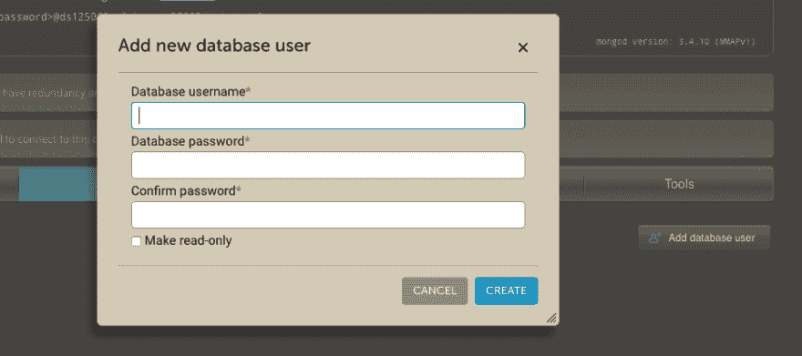
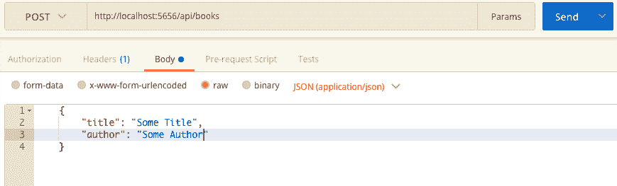

# 用 Express 和 MongoDB 构建 RESTful API

> 原文：<https://dev.to/aurelkurtula/building-a-restful-api-with-express-and-mongodb--3mmh>

今天我们继续探索 Express。在上一个教程中，我们用 Express.js 创建了一个基本的网站。现在我们要用 express 和 mongoDB 构建一个 API。我们将要处理的数据是书籍。在本教程结束时，我们将拥有一个 REST API，它允许我们从 mongo 数据库中读取、写入、编辑和删除内容。在这个过程中，我们将探索与 API 相关的所有主要动词。

Roy Fielding 早在 2000 年就提出了表述性状态转移(REST)这个术语。它列出了一组我们在创建 API 时需要遵循的规则。有了这些规则，意味着最终将使用该 API 的其他开发人员确切地知道会发生什么。

## 我们开始吧

我们需要做的第一件事是通过初始化 npm 并安装我们将要使用的包来设置项目。

```
npm init
npm install --save express mongoose 
```

Enter fullscreen mode Exit fullscreen mode

如果你是 express 的新手，你应该浏览我上面提到的教程，然后回到这里。

为了快速启动项目，我们将使用与上一教程相同的代码。创建一个`server.js`文件并添加下面的

```
import express from 'express';
const app = express();
const port = process.env.PORT || 5656;
// routes go here
app.listen(port, () => {
    console.log(`http://localhost:${port}`)
}) 
```

Enter fullscreen mode Exit fullscreen mode

这正是我们在上一个教程中所做的。如果没有指定替代选项，这将在端口`5656`启动一个服务器。

API 的工作方式是，它们控制发出请求的客户机可以获得什么。

在我们的例子中，我们正在创建一个图书 API，这意味着我们允许其他开发人员访问我们数据库中的图书信息。

## 展示书籍

除此之外，我们还将在 API 收到 GET 请求时提供数据。我们将要响应的数据需要采用 JSON 格式。

```
app.get('/api/books', (req, res) => {
    res.json([
            {
                id: 1,
                title: "Alice's Adventures in Wonderland",
                author: "Charles Lutwidge Dodgson"
            },
            {
                id: 2,
                title: Einstein's Dreams",
                author: "Alan Lightman"
            }
        ])
})
app.get('/api/books/2', (req,res)=>{
    res.json(
            {
                id: 2,
                title: Einstein's Dreams",
                author: "Alan Lightman" }
        )
}) 
```

Enter fullscreen mode Exit fullscreen mode

我们将很快从数据库中获得这些信息，但这只是为了举例说明。`/api/books`返回所有书籍，`/api/books/2`返回 ID 为 2 的书籍。

### 重构代码

在我们继续之前，让我们重构代码，使它在将来更易于管理。

如果我们继续以这种方式添加所有的 API 动词，`server.js`文件将变得非常混乱，代码难以阅读。Express 使我们能够在一个单独的文件中编写我们的路线，并将它们包含在我们的项目中。

让我们在`Routes/bookRouter.js`创建一个文件，并像这样从`server.js`移动两条路线:

```
import express from 'express';
const bookRouter = express.Router();
bookRouter
    .get('/', (req,res) => {
        res.json(...)
    })
    .get('/2', (req,res) => {
        res.json(...)
    })
export default bookRouter; 
```

Enter fullscreen mode Exit fullscreen mode

请注意在`server.js`中，我们如何将两个 GET 路由附加到引用了`express()`的`app`上。Express 给了我们`Router()`精确地组织路线的能力。所以在这种情况下，我们所有的预订路线都会追加到`bookRouter`。

最后，我们需要将该文件导入到`server.js`中，并在我们的 express 应用程序中使用这些路线。

```
import bookRouter from './Routes/bookRouter';
...
app.use('/api/Books', bookRouter); 
```

Enter fullscreen mode Exit fullscreen mode

从这里开始，所有的路线都将被添加到`Routes/bookRouter.js`中。

## 使用 mongoDB

上面我们探索了我们的 API 将采用的基本结构，但实际上，书籍必须存储在数据库中，这个 API 才能发挥作用。

如果您以前从未使用过 mongoDB，那么很可能您的计算机中没有安装它。我强烈建议您这样做，但这超出了本教程的范围。因此，我们将选择另一家供应商:[mlab.com](https://mlab.com/)。当我们向 mlab 注册时，我们得到了一个免费的 mongo 数据库，有足够的空间来存放我们需要的东西。

[T2】](https://res.cloudinary.com/practicaldev/image/fetch/s--Tm1JPyFY--/c_limit%2Cf_auto%2Cfl_progressive%2Cq_auto%2Cw_880/https://thepracticaldev.s3.amazonaws.com/i/t6u0mnvoh1x2pkfxmzzc.png)

它会要求你选择一个提供商(选择三个中的任何一个)，然后选择“沙盒”计划(这是免费的)，然后点击继续。然后要求您选择一个区域。我了解到在一些地区，免费计划并不存在！所以只保留预选区域。

最后，给你的数据库添加一个名字。然后提交您的订单。注意，如果出现错误，要求您选择不同的名称，只需编辑数据库名称。

单击数据库名称，然后选择“用户”。这里需要添加一个用户。该用户将有权访问数据库。

[T2】](https://res.cloudinary.com/practicaldev/image/fetch/s--OcGsqcJI--/c_limit%2Cf_auto%2Cfl_progressive%2Cq_auto%2Cw_880/https://thepracticaldev.s3.amazonaws.com/i/rw34rjc6c6urbg6av6ea.png)

### 连接数据库

我们将使用 mongoose 包来连接和操作数据库。我们一开始就已经装了猫鼬。

为了使用 mongoose 访问数据库，我们需要采取以下步骤:

1.  连接到数据库
2.  建立一个模型
3.  执行操作

本着模块化的精神，我们将连接到`server.js`上的数据库

```
import mongoose from 'mongoose';
const db = mongoose.connect('mongodb://<dbuser>:<dbpassword>@ds125068.mlab.com:25068/api-test2'); 
```

Enter fullscreen mode Exit fullscreen mode

然后在`models/bookModel.js`
在单独的文件中构建模型

```
import mongoose from 'mongoose';
const Schema = mongoose.Schema;
const bookModel = new Schema({
    title: { type: String   },
    author: { type: String }
})
export default mongoose.model('books', bookModel) 
```

Enter fullscreen mode Exit fullscreen mode

MongoDB 使用集合(MySql 有表)。mongoose 模型需要两个参数:集合名和模式。在模式中，我们可以指定数据库集合中需要的字段。正如我们将看到的，上面的设置确保了无论什么数据被传递给 mongoose，它都只接受一个`title`和`author`，而似乎忽略了其他属性。

### 获取:从数据库中获取图书

最后，从这一点开始，对 API 的每个请求都将与数据库通信。让我们改变我们之前在`Routes/bookRouter.js`创建的两条 GET 路线来反映这一点。

```
import express from 'express';
import Book from '../models/bookModel';
const bookRouter = express.Router();
bookRouter.route('/')
    .get((req, res) => {
        Book.find({}, (err, books) => {
            res.json(books)
        })  
    })
bookRouter.route('/:bookId')
    .get((req, res) => {
        Book.findById(req.params.bookId, (err, book) => {
            res.json(book)
        })  
    }) 
```

Enter fullscreen mode Exit fullscreen mode

首先，我们导入模式。然后，该模式为我们提供了与集合相关联的整个 mongo 方法(可以在 [mongo 的文档](https://docs.mongodb.com/manual/reference/method/js-collection/)中找到)。

因为我们将所有的请求方法链接在一起，所以我们使用`route`方法定义路由端点。

在第一个路由器配置中，我们得到了所有的书。`find()`接受两个参数，一个查询和一个回调函数。查询是用于过滤数据的对象。注意，我们传递了一个空白对象，因此，我们得到了所有的书。

第二条 get 路线要有趣得多。`/:bookId`可以描述为占位符我猜。如果我们导航到`/api/books/SomeOtherPage`，那么`/:bookId`可以引用`SomeOtherPage`——这是 express 的一个特性。`req.params.bookId`则等于`SomeOtherPage`。实际上，我们希望图书 ID 与数据库中自动生成的 ID 相匹配。

### POST:向数据库添加内容

POST 用于向数据库添加新内容。在我们的例子中，我们将使用它来添加新书。仍然在`Routes/bookRouter.js`中我们能够将`post()`链在`get()`之后

```
...
bookRouter.route('/')
    .get((req, res) => { ...})
    .post((req, res) => {
        let book = new Book({title: 'The Bull', author: 'Saki'});
        book.save();
        res.status(201).send(book) 
    }) 
```

Enter fullscreen mode Exit fullscreen mode

使使用数据库变得非常容易。我们创建一本新书，保存到数据库中，并将其传递回客户端。

正如你已经注意到的，这不是很有用。理想情况下，应该从请求中检索出`title`和`author`。这些信息应该由 API 用户提供。

为了让我们能够读取请求中的数据，我们需要使用一个 express 中间件来解析传入的数据。解析中间件叫做`body-parser`，它是一个我们需要通过 NPM 安装的包。

```
npm install --save body-parser 
```

Enter fullscreen mode Exit fullscreen mode

现在我们能够在我们的 express 代码中使用这个中间件了。让我们在`./server.js`中这样做。

```
import bodyParser from 'body-parser';
...
app.use(bodyParser.json());
app.use(bodyParser.urlencoded({ extended: true })); 
```

Enter fullscreen mode Exit fullscreen mode

首先，我们导入包。在第二行和第三行，`bodyParser`查看传入的数据，并根据它是 JSON 还是来自表单的数据来解析它。

回到我们的 POST 路由，`body-parser`已经将传入数据附加到请求对象。

```
...
bookRouter.route('/')
    .get((req, res) => { ...})
    .post((req,res) => {
        let book = new Book(req.body); // edited line
        book.save()
        res.status(201).send(book)
    }) 
```

Enter fullscreen mode Exit fullscreen mode

就是这样，只要一个`title`和一个`author`传过来，就加入数据库，同样的书传回来。

记住，mongoose 模式知道它需要从提供的主体内容中得到什么。如果`req.body`的数据超过了 mongoose 模式的需求，那么这些数据将被忽略。比方说，如果`author`在`req.body`中不存在，那么只有标题的对象将被添加到数据库中，`author`将根本不存在，mongo 在这方面非常灵活。

### 放:编辑数据库中的书籍

我们使用 PUT 来编辑特定的条目。在我们的图书中，PUT 用于编辑一本书。因此，我们将`put()`改为`/:bookId`路线

```
bookRouter.route('/:bookId')
    .get(...)
    .put((req,res) => {
        Book.findById(req.params.bookId, (err, book) => {
            book.title = req.body.title;
            book.author = req.body.author;
            book.save()
            res.json(book)
        }) 
    }) 
```

Enter fullscreen mode Exit fullscreen mode

正如我们将看到的，我们在执行不同操作时与数据库交互的方式彼此非常相似。上面我们找到了一本书，我们用随请求一起传递的属性更改了存储在数据库中的 book 对象的属性。

### 补丁:编辑图书属性

补丁将允许用户编辑图书对象的特定属性。这个还连着`bookRouter.route('/:bookId')`。我们从数据库中取出特定的书，并修改所有匹配输入信息的属性

```
bookRouter.route('/:bookId')
    .get(...)
    .put(...)
    .patch((req,res)=>{
        Book.findById(req.params.bookId, (err, book) => {
            if(req.body._id){
                delete req.body._id;
            }
            for( let b in req.body ){
                book[b] = req.body[b];
            }
            book.save();
            res.json(book);
        })
    }) 
```

Enter fullscreen mode Exit fullscreen mode

我们 API 的用户向`/api/books/5a76f7373ec6426aaeb91146`发出一个补丁请求，通过它他们传递想要更改的信息——例如，他们可能想要更改作者的名字。

如果他们传递一个`_id`作为他们想要编辑的属性之一，我们会忽略这个请求，因为 id 是用来组织数据的唯一标识符，不应该被更改。

然后`for`循环遍历来自传入对象的剩余属性，并用来自请求的属性更新数据库中的属性。

### 删除:删除图书

最后，我们希望用户能够删除整本书

```
bookRouter.route('/:bookId')
    .get(...)
    .put(...)
    .patch(...)
    .delete((req,res)=>{
        Book.findById(req.params.bookId, (err, book) => {
            book.remove(err => {
                if(err){
                    res.status(500).send(err)
                }
                else{
                    res.status(204).send('removed')
                }
            })
        })
    })//delete 
```

Enter fullscreen mode Exit fullscreen mode

像往常一样，我们通过 ID 找到特定的书，然后 mongoose 让我们能够简单地通过在找到的书上运行`remove()`方法来删除它。

## 重构:使用定制中间件

在为`/api/books/:bookId`上的`get`、`put`、`patch`和`delete`方法编写代码时，我相信你已经注意到我们重复了与数据库交互的相同代码。我相信看到它重复出现会澄清这样一个事实，即每个方法的代码都以相同的方式从数据库中检索数据。

我们已经在代码中使用了一个中间件- `body-parser`。中间件的工作方式是它们在我们的代码之前运行！

```
bookRouter.use('/:bookId', (req, res, next)=>{
    console.log("I run first")
    next()
})
bookRouter.route('/:bookId')
    .get((req,res)=>{
        Book.findById(req.params.bookId, (err, books) => {
            res.json(books)
        })
    }) 
```

Enter fullscreen mode Exit fullscreen mode

当一个`get`请求被发送到`/api/books/:bookId`时，消息被记录(在终端中),然后我们响应`get`请求的代码运行。

注意，如果我们不包含`next()`方法，`get`请求代码永远不会执行！

让我们利用中间件来做一些有用的东西。

```
bookRouter.use('/:bookId', (req, res, next)=>{
    Book.findById( req.params.bookId, (err,book)=>{
        if(err)
            res.status(500).send(err)
        else {
            req.book = book;
            next()
        }
    })

}) 
```

Enter fullscreen mode Exit fullscreen mode

我们使用中间件从数据库中检索所需的书籍，如果成功，将`book`对象附加到请求对象上。

准备好之后，让我们修改所有与`/:bookId` route 相关的动词。

```
bookRouter.route('/:bookId')
    .get((req, res) => {
        res.json(req.book)
    }) // end get Books/:bookId 
    .put((req,res) => {
        req.book.title = req.body.title;
        req.book.author = req.body.author;
        req.book.save()
        res.json(req.book)
    })
    .patch((req,res)=>{
        if(req.body._id){
            delete req.body._id;
        }
        for( let p in req.body ){
            req.book[p] = req.body[p]
        }
        req.book.save()
        res.json(req.book)
    })//patch
    .delete((req,res)=>{
        req.book.remove(err => {
            if(err){
                res.status(500).send(err)
            }
            else{
                res.status(204).send('removed')
            }
        })
    })//delete 
```

Enter fullscreen mode Exit fullscreen mode

不同之处在于，数据库交互在中间件中被**写入**一次，但是仍然在每个请求上运行。

就是这样。REST API 完成了。

## 邮递员

为了测试是否所有的路线都工作正常，你可以使用 Postman，一个 chrome 应用程序

以下是发布请求的方式

[T2】](https://res.cloudinary.com/practicaldev/image/fetch/s--mtRFyauN--/c_limit%2Cf_auto%2Cfl_progressive%2Cq_auto%2Cw_880/https://thepracticaldev.s3.amazonaws.com/i/my0t5vq3jguo0suxofq7.png)

在顶部，我们选择方法/动词——上面我们选择 POST。然后输入 API 端点。然后简单地选择`Headers`并添加`application/json`作为`Content-Type`，在主体中(选择`raw`选项)，您可以将您想要传递的 JSON 内容传递给 API。在上面的截图中，我们正在传递所需的`title`和`author`。

**感谢阅读**

代码可以从 [github](https://github.com/aurelkurtula/express-api) 下载