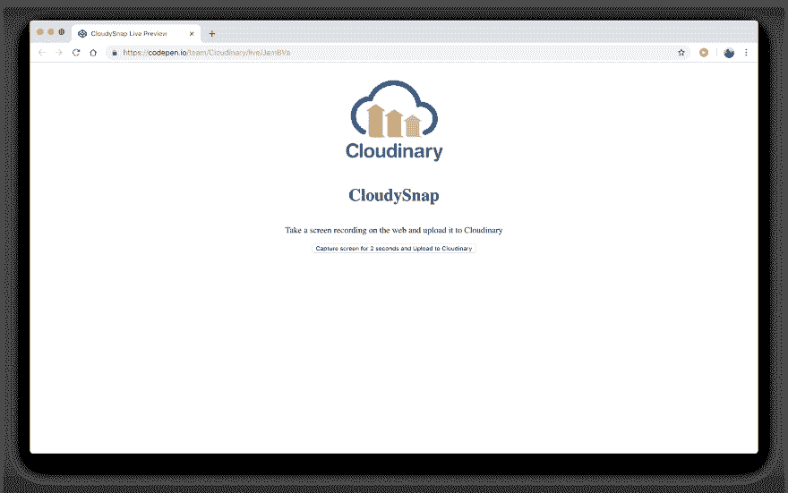

# 用 Cloudinary 在一瞬间为 Web 构建一个屏幕记录器！

> 原文：<https://dev.to/ore/building-a-screen-recorder-for-the-web-with-cloudinary-in-a-jiffy-i6n>

你有没有想过 Google Hangouts 和其他强大的视频通话网络应用程序不仅可以访问你的屏幕，还可以在通话过程中共享屏幕？不再好奇了。继续读下去。

本教程深入研究了它是如何工作的，并向您展示了如何将屏幕记录器集成到 web 应用程序中。最棒的是，你还可以直接将视频馈送发送到 Cloudinary 的图像和视频平台，以便使用 Cloudinary APIs 轻松访问和即时检索。

在本教程结束时，您将构建一个如下所示的演示应用程序:

注意:这是演示 gif 文件所在的位置。

[T2】](https://res.cloudinary.com/practicaldev/image/fetch/s--Kmg-5EAL--/c_limit%2Cf_auto%2Cfl_progressive%2Cq_66%2Cw_880/https://blobscdn.gitbook.com/v0/b/gitbook-28427.appspot.com/o/assets%252F-LREv7W7Z_qUF21S6RL5%252F-LRKX7_vII1hRg-ILQac%252F-LRKlZau1RRL3eFn0cF7%252Fezgif.com-video-to-gif%2520%282%29.gif%3Falt%3Dmedia%26token%3D3a9a4799-4f34-4eda-baaf-ce837e4aece8)

[T2】](https://res.cloudinary.com/practicaldev/image/fetch/s--KO-ZKfx3--/c_limit%2Cf_auto%2Cfl_progressive%2Cq_auto%2Cw_880/https://blobscdn.gitbook.com/v0/b/gitbook-28427.appspot.com/o/assets%252F-LREv7W7Z_qUF21S6RL5%252F-LRKn5SCqltxD2Y02HpI%252F-LRKsCEjAr7939d6j5Pj%252FScreenshot%25202018-11-15%2520at%25205.37.21%2520AM.png%3Falt%3Dmedia%26token%3De5bcd802-cb71-493a-8947-50d6bc980def)

[T2】](https://res.cloudinary.com/practicaldev/image/fetch/s--8OC96atQ--/c_limit%2Cf_auto%2Cfl_progressive%2Cq_auto%2Cw_880/https://blobscdn.gitbook.com/v0/b/gitbook-28427.appspot.com/o/assets%252F-LREv7W7Z_qUF21S6RL5%252F-LRKn5SCqltxD2Y02HpI%252F-LRKtfDlseASTKbtsJFW%252FScreenshot%25202018-11-15%2520at%25205.38.09%2520AM.png%3Falt%3Dmedia%26token%3Dff19c2b2-6e29-4178-b7e9-504c3d9b0c79)

## 把先决条件落实到位

目前，本教程中的一些代码需要一些实验性的功能，这些功能将很快集成到 Chrome 浏览器中。要打开这些功能，请执行以下操作:

1.  在 Chrome 上，前往`chrome://flags`查看当前的 Chrome 标志。

2.  在顶部的搜索栏中键入`Experimental Web Platform features`并按下**键进入**。

Chrome 显示**实验**页面，在**下的**实验网络平台功能**部分可用**。

[T2】](https://res.cloudinary.com/practicaldev/image/fetch/s--WixgweRJ--/c_limit%2Cf_auto%2Cfl_progressive%2Cq_auto%2Cw_880/https://blobscdn.gitbook.com/v0/b/gitbook-28427.appspot.com/o/assets%252F-LREv7W7Z_qUF21S6RL5%252F-LRKOG0WuGtAFEsc6NEX%252F-LRKTIXblpGEo1lE2o-8%252FScreenshot%25202018-11-14%2520at%25202.36.32%2520AM.png%3Falt%3Dmedia%26token%3Dfd9a8f0a-953b-43e9-9323-a906aacc5894)

*   点击**禁用**按钮中的向下箭头选择**启用**，然后点击**重新启动**。

[T2】](https://res.cloudinary.com/practicaldev/image/fetch/s--FJ3_vtC6--/c_limit%2Cf_auto%2Cfl_progressive%2Cq_auto%2Cw_880/https://blobscdn.gitbook.com/v0/b/gitbook-28427.appspot.com/o/assets%252F-LREv7W7Z_qUF21S6RL5%252F-LRKOG0WuGtAFEsc6NEX%252F-LRKTYse64SWZDNLV15g%252FScreenshot%25202018-11-14%2520at%25202.36.40%2520AM.png%3Falt%3Dmedia%26token%3D053de878-b53d-404f-9e91-d3cee767b822)

## 建筑界面

要为 web 创建一个屏幕记录器，你只需要用普通的 HTML 和 JavaScript 编码。首先，按照下面的步骤构建界面。

*   创建一个名为`cloudy-snap`的文件夹。类型:

```
mkdir cloudy-snap
cd cloudy-snap 
```

*   在`cloudy-snap`中创建一个`index.html`文件来存放演示应用程序中的代码。类型:

```
touch index.html 
```

*   编辑`index.html`文件，如下所示:

```
<!DOCTYPE html>
<html lang="en">
<head>
    <meta charset="UTF-8">
    <meta name="viewport" content="width=device-width, initial-scale=1.0">
    <meta http-equiv="X-UA-Compatible" content="ie=edge">
    Cloudy Snap
    <style>
        body{
          display: flex;
          flex-direction: column;
          align-items: center;
        }
        .container{
          display: flex;
          flex-direction: column;
          align-items: center;
        }

        #videoElement{
          width: 50%;
          padding: 30px;
        }
    </style>
</head>
<body>
    
    <h1>CloudySnap</h1>
    <p>Take a screen recording on the web and upload it to Cloudinary</p>
    <div class="container">
      <video id="videoElement" autoplay></video>
      <button id="recorder">
        Capture screen for 2 seconds and Upload to Cloudinary
      </button>
    </div>
</body>
</html> 
```

*   在 Chrome 中运行`index.html`文件。

Chrome 随后会显示演示应用的界面。

[T2】](https://res.cloudinary.com/practicaldev/image/fetch/s--YvW8rzBh--/c_limit%2Cf_auto%2Cfl_progressive%2Cq_auto%2Cw_880/https://blobscdn.gitbook.com/v0/b/gitbook-28427.appspot.com/o/assets%252F-LREv7W7Z_qUF21S6RL5%252F-LRKX7_vII1hRg-ILQac%252F-LRKeebLV5Yq3KjvW4XH%252FScreenshot%25202018-11-15%2520at%25204.38.32%2520AM.png%3Falt%3Dmedia%26token%3D45f81fd4-1edc-470a-92a9-9c3e8a8783ca)

此时，与接口的交互导致记录器没有响应。下一节将向您展示如何向记录器添加功能并使其工作。

## 添加相关特征

要向屏幕记录器添加特性，请将以下脚本放入您的`index.html`文件:

```
[...]
​
<script>
    let recorder = document.getElementById('recorder')
​
    let videoElement = document.getElementById('videoElement')

    recorder.onclick = async () => {
        let mStream = await navigator.getDisplayMedia({ 'video': true })

        videoElement.srcObject = mStream

        let opts = { mimeType: 'video/webm; codecs=vp9' };
        let rec = new MediaRecorder(videoElement.srcObject, opts);
        let blobs = [];

        rec.ondataavailable = (e) => (e.data && e.data.size > 0) ? blobs.push(e.data) : null;
        rec.onstop = () => {
            //  get the image blob
            let finalBlob = new Blob(blobs, { type: 'video/mp4' });
            // create form data for submission 
            let formData = new FormData();
            formData.append('upload_preset', 'CLOUDINARY_UPLOAD_PRESET');
            formData.append('api_key', "CLOUDINARY_API_KEY");
            formData.append('file', finalBlob);
            var xhr = new XMLHttpRequest();
            xhr.open("POST", 'https://api.cloudinary.com/v1_1/CLOUDINARY_CLOUD_NAME/auto/upload');

            xhr.onreadystatechange = function () {
                if (this.readyState == XMLHttpRequest.DONE && this.status == 200) {
                    console.log(this.status);
                    alert("Video uploaded to your cloudinary media library");
                }
            }

            xhr.send(formData);
        }

        rec.start(100);
        setTimeout(() => rec.stop(), 2000)
    };
</script>
​
[...] 
```

> 请确保将变量`CLOUDINARY_UPLOAD_PRESET`、`CLOUDINARY_API_KEY`和`CLOUDINARY_CLOUD_NAME`替换为您的 Cloudinary 帐户的值。要了解如何获取这些值，请参见下一节。

请注意脚本中的以下内容:

*   在前几行中，您获得了之前在界面中创建的按钮和视频元素。

*   然后，我们分配一个功能，当您单击 recorder 按钮时将执行该功能。这个函数访问用户的显示器，然后用下面的代码片段将流分配给`videoElement`的`srcObject`属性:

```
let mStream = await navigator.getDisplayMedia({ 'video': true })

videoElement.srcObject = mStream 
```

然后，您的屏幕上记录的内容就变得可见了。当您运行演示应用程序时，您将看到如下所示的显示:

[T2】](https://res.cloudinary.com/practicaldev/image/fetch/s--Kmg-5EAL--/c_limit%2Cf_auto%2Cfl_progressive%2Cq_66%2Cw_880/https://blobscdn.gitbook.com/v0/b/gitbook-28427.appspot.com/o/assets%252F-LREv7W7Z_qUF21S6RL5%252F-LRKX7_vII1hRg-ILQac%252F-LRKlZau1RRL3eFn0cF7%252Fezgif.com-video-to-gif%2520%282%29.gif%3Falt%3Dmedia%26token%3D3a9a4799-4f34-4eda-baaf-ce837e4aece8)

下一节详细介绍如何用 Cloudinary 连接录音。之后，您可以将录像存储在 Cloudinary 媒体库中，从而获得处理视频的各种功能。

## 与云相连

### 了解连接过程

请注意`index.html`文件中的代码片段:

```
[...]        
    let opts = { mimeType: 'video/webm; codecs=vp9' };
    let rec = new MediaRecorder(videoElement.srcObject, opts);
    let blobs = [];

    rec.ondataavailable = (e) => (e.data && e.data.size > 0) ? blobs.push(e.data) : null;
    rec.onstop = () => {
        //  get the image blob
        let finalBlob = new Blob(blobs, { type: 'video/mp4' });
        // create form data for submission 
        let formData = new FormData();
        formData.append('upload_preset', 'CLOUDINARY_UPLOAD_PRESET');
        formData.append('api_key', "CLOUDINARY_API_KEY");
        formData.append('file', finalBlob);
        var xhr = new XMLHttpRequest();
        xhr.open("POST", 'https://api.cloudinary.com/v1_1/CLOUDINARY_CLOUD_NAME/auto/upload');
        xhr.onreadystatechange = function () {
            if (this.readyState == XMLHttpRequest.DONE && this.status == 200) {
                console.log(this.status);
                alert("Video uploaded to your cloudinary media library");
            }
        }
        xhr.send(formData);
    }
    rec.start(100);
    setTimeout(() => rec.stop(), 2000)
[...] 
```

我们通过首先用`videoElement.srcObject`创建媒体记录来实现核心上传功能。下面是`rec`变量的属性定义，它指示记录器在各种情况下如何操作。

属性特别令人感兴趣。当记录完成时，记录器获取记录的数据，并使用 Cloudinary 的上传预设将它们作为单个 blob 发送到 Cloudinary。

[T2】](https://res.cloudinary.com/practicaldev/image/fetch/s--aLFiq3RN--/c_limit%2Cf_auto%2Cfl_progressive%2Cq_auto%2Cw_880/https://blobscdn.gitbook.com/v0/b/gitbook-28427.appspot.com/o/assets%252F-LREv7W7Z_qUF21S6RL5%252F-LRKn5SCqltxD2Y02HpI%252F-LRKodlo23j_5VCLple2%252FScreenshot%25202018-11-15%2520at%25205.22.03%2520AM.png%3Falt%3Dmedia%26token%3D3b40c989-5333-4744-a342-1d839bf57a41)

要进一步处理您上传的视频，请利用 [Cloudinary](https://cloudinary.com) 。首先，[在那里创建一个账户](https://cloudinary.com/signup)。

[T2】](https://res.cloudinary.com/practicaldev/image/fetch/s--OHj6gGhV--/c_limit%2Cf_auto%2Cfl_progressive%2Cq_auto%2Cw_880/https://blobscdn.gitbook.com/v0/b/gitbook-28427.appspot.com/o/assets%252F-LREv7W7Z_qUF21S6RL5%252F-LRKn5SCqltxD2Y02HpI%252F-LRKorn4zhidNxv7VM6p%252FScreenshot%25202018-11-15%2520at%25205.22.28%2520AM.png%3Falt%3Dmedia%26token%3D5579f2fe-4483-49cd-a36a-30cc5acf8fa2)

### 找出你的云名

然后 Cloudinary 会带你到你的**仪表盘**(媒体控制台)，其中你的云名称会显示在**账户详情**下(见下面的截图)。用该名称替换前面代码段中的`index.html`文件中的`CLOUDINARY_CLOUD_NAME`和`CLOUDINARY_API_KEY`变量。

[T2】](https://res.cloudinary.com/practicaldev/image/fetch/s--r8_r2yA6--/c_limit%2Cf_auto%2Cfl_progressive%2Cq_auto%2Cw_880/https://blobscdn.gitbook.com/v0/b/gitbook-28427.appspot.com/o/assets%252F-LQxqjHiNgHCfPtd6mkQ%252F-LRAT_zQ5FlwNEB6AZHt%252F-LRAVWKufBuF9k3qEShm%252Fcl-3.png%3Falt%3Dmedia%26token%3D3437d2b1-c229-431b-9477-cea0854d1c01)

### 创建一个云上传预置

Cloudinary 上传预设使您能够设置图像上传的默认行为。这意味着，您可以从 Cloudinary 控制台定义标签、转换和其他分析预设，而不是每次上传图像时都必须添加参数来应用于您的图像。只需在代码中指定预设名称，就可以开始了！

要创建预设，进入[上传设置](https://cloudinary.com/console/settings/upload)屏幕，点击**添加上传预设**链接:

[T2】](https://res.cloudinary.com/practicaldev/image/fetch/s--O8ao3J53--/c_limit%2Cf_auto%2Cfl_progressive%2Cq_auto%2Cw_880/https://blobscdn.gitbook.com/v0/b/gitbook-28427.appspot.com/o/assets%252F-LQxqjHiNgHCfPtd6mkQ%252F-LRAT_zQ5FlwNEB6AZHt%252F-LRAVivHbtupVFyl_l9-%252Fcl-4.png%3Falt%3Dmedia%26token%3D78f120d5-f819-4c39-b3a5-ec392755744e)

然后显示**添加上传预设**屏幕:

[T2】](https://res.cloudinary.com/practicaldev/image/fetch/s--ozM4XV0---/c_limit%2Cf_auto%2Cfl_progressive%2Cq_auto%2Cw_880/https://blobscdn.gitbook.com/v0/b/gitbook-28427.appspot.com/o/assets%252F-LREv7W7Z_qUF21S6RL5%252F-LRKn5SCqltxD2Y02HpI%252F-LRKq_viLDkfodCBSODk%252FScreenshot%25202018-11-15%2520at%25205.27.17%2520AM.png%3Falt%3Dmedia%26token%3D43f14ec5-0a76-4198-ab51-940c17ef74c3)

在**预设名称**下键入您选择的名称，将**模式**设置为**无符号**，然后根据需要指定其他细节。

现在回到`index.html`文件，用你的预置名称替换`CLOUDINARY_UPLOAD_PRESET`。

### 测试上传到 Cloudinary

现在你已经将所有的 Cloudinary 细节添加到了`index.html`文件中，进入你的 Chrome 浏览器并运行你的演示程序。之后，您将看到以下显示:

[T2】](https://res.cloudinary.com/practicaldev/image/fetch/s--KO-ZKfx3--/c_limit%2Cf_auto%2Cfl_progressive%2Cq_auto%2Cw_880/https://blobscdn.gitbook.com/v0/b/gitbook-28427.appspot.com/o/assets%252F-LREv7W7Z_qUF21S6RL5%252F-LRKn5SCqltxD2Y02HpI%252F-LRKsCEjAr7939d6j5Pj%252FScreenshot%25202018-11-15%2520at%25205.37.21%2520AM.png%3Falt%3Dmedia%26token%3De5bcd802-cb71-493a-8947-50d6bc980def)

## 访问上传的视频

要访问您上传的图像，请访问您的 [Cloudinary 媒体库](https://cloudinary.com/console/media_library):

[T2】](https://res.cloudinary.com/practicaldev/image/fetch/s--8OC96atQ--/c_limit%2Cf_auto%2Cfl_progressive%2Cq_auto%2Cw_880/https://blobscdn.gitbook.com/v0/b/gitbook-28427.appspot.com/o/assets%252F-LREv7W7Z_qUF21S6RL5%252F-LRKn5SCqltxD2Y02HpI%252F-LRKtfDlseASTKbtsJFW%252FScreenshot%25202018-11-15%2520at%25205.38.09%2520AM.png%3Falt%3Dmedia%26token%3Dff19c2b2-6e29-4178-b7e9-504c3d9b0c79)

现在，您可以随时以多种方式轻松高效地转换视频:格式化、调整大小、裁剪等等。有关详细信息，请参见[云二进制文档](https://cloudinary.com/documentation)

## 继续前进

您现在已经学习了如何使用 Cloudinary 和 JavaScript 为 web 构建一个简单的屏幕记录器。关于完整的代码，请参见 [Github](https://github.com/oreHGA/cloudy-snap) 库。这个演示也可以在 [CodePen](https://codepen.io/team/Cloudinary/pen/JamBVa) 上获得。

你也可以把这篇文章作为指南来阅读。

请随意使用本教程中解释的概念来构建其他应用程序。Cloudinary 提供了一系列出色的功能，使图像和视频管理在 web 和移动应用程序中变得直观、无缝和快速。做[检查他们](https://cloudinary.com/solutions)。