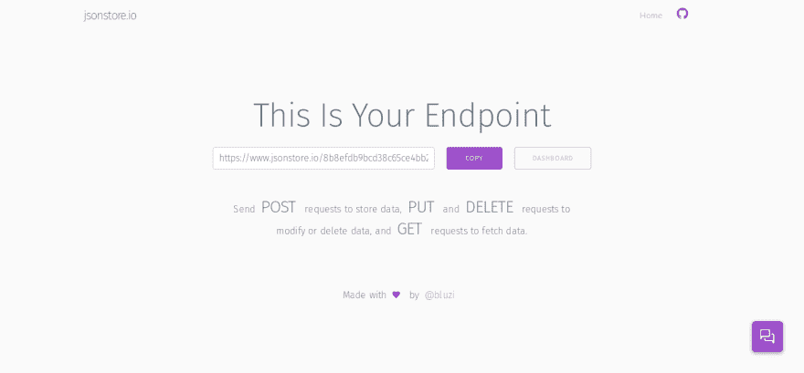

# 只用 HTML 和 Javascript 构建一个简单的网址缩写器

> 原文：<https://dev.to/bauripalash/building-a-simple-url-shortener-with-just-html-and-javascript-16o4>

[T2】](https://res.cloudinary.com/practicaldev/image/fetch/s--gGXLyRES--/c_limit%2Cf_auto%2Cfl_progressive%2Cq_auto%2Cw_880/https://palash.tk/asseimg/build_url_shortener.png)

网址缩写，你可能在生活中用过其中的一个，比如 [bit.ly](https://bit.ly) 、 [goo.gl](https://goo.gl) 等等。它们有助于缩短长网址，这样你就可以轻松地与你的朋友、家人或同事分享。

你可能想知道这些东西是如何工作的？为了理解这些东西是如何工作的，我们需要更仔细地看看 url 缩短器，所以我们将构建一个简单的 url 缩短器。有了这个任务，我们将学习一些新的东西，并了解 URL Shortener 是如何工作的。

今天，我们将构建一个简单的 url shortener，它不需要数据库系统来托管你自己，相反，我们将使用 [jsonstore.io](https://jsonstore.io) ，我将假设你已经知道一些基本的 HTML & Javascript。

所以不再多说，让我们开始建造吧。。。

## 以 HTML 部分开始:

我们只需要一个文本输入框、一个按钮和一个脚本标签来创建我们的 url 缩写器。

首先创建一个名为`index.html`的 HTML 文件，因为只需要两个元素，一个文本输入框和一个按钮。

所以让我们开始添加我们的三个主要元素，

```
<html>
    <body>
        <input type="url" id="urlinput">
        <button onclick="shorturl()">Short The URL</button>
        <script src="main.js"></script>
    </body>
</html> 
```

如上面的代码所示，我创建了一个简单的 HTML 文件。在 body 标签中，只有三个元素:一个`input`、一个`button`和一个`script`。

第一个元素是`input`,我们在这里输入/粘贴我们的长 url，我给了它一个 id 名`urlinput`,这样就可以很容易地在 javascript 中访问它。

下一个元素是一个`button`，当我们点击这个按钮时，我们的长 url 将被缩短，因为它有`onclick`函数，当我们点击这个按钮时，它将被执行，在`shorturl()`函数中，将有必要的命令来缩短 url。

最后，我们有一个名为`main.js`的`script`，所有主要的 javascript 代码都将在这里，上面提到的`shorturl()`函数也将在这里。

现在，我们的 HTML 部分已经完成了。所以让我们开始写一些 javascript

## 开始写一些 Javascript:

如上所示，我们需要一些 javascript 来创建我们的 url shortener。

**步骤 0:** 正如我首先提到的，我们将使用 **jsonstore.io** 来存储关于我们的长 url 的信息，我们将需要一个**JSON store . io**T6】endpointURL 来存储数据，请访问 [jsonstore.io](https://jsonstore.io) ，您将看到如下内容

[T2】](https://res.cloudinary.com/practicaldev/image/fetch/s--fU7nICzi--/c_limit%2Cf_auto%2Cfl_progressive%2Cq_auto%2Cw_880/https://palash.tk/asseimg/jsonstore_sshot.png)

在文本*这是你的终点*下，你可以看到一个带有长 url 的文本框，比如，

```
https://www.jsonstore.io/8ba4fd855086288421f770482e372ccb5a05d906269a34da5884f39eed0418a1 
```

点击紫色的*复制*按钮。

所以现在，让我们开始写一些 javascript。。。

创建一个名为`main.js`的 javascript 文件，并开始执行以下步骤

首先，我们必须将复制的链接保持为变量

```
var endpoint = "https://www.jsonstore.io/8ba4fd855086288421f770482e372ccb5a05d906269a34da5884f39eed0418a1"; 
```

然后，我们需要生成一些随机字符串，这样我们就可以在短 url 和长 url 之间创建一个链接。

> 假设，我们有一个随机的 url `abcd`，我们简单的 url 缩短器被托管在[https://shortner.com](https://shortner.com)上，我们用那个随机的 url 缩短了 URL[https://google.com](https://google.com)，所以无论何时我们去[https://shortner.com/#abcd](https://shortner.com/#abcd)我们都会被重定向到[https://google.com](https://google.com)

所以，现在我们创建一个名为`getrandom()`
的函数

```
function getrandom(){
    var random_string = Math.random().toString(32).substring(2, 5) + Math.random().toString(32).substring(2, 5);
    return random_string()
} 
```

别担心，我会帮你理解上面的代码，

首先，我们初始化一个名为`getrandom`的函数，然后初始化一个名为`random_string`的变量，并给它一个值。

Math 是一个内置的 javascript 对象，它允许我们对数字执行数学任务。首先我们从`Math`调用了`random`函数，`Math.random()`返回一个介于 0(含)和 1(不含)之间的随机数

> 你可以从[这里](https://www.w3schools.com/js/js_math.asp)了解更多关于`Math`物体的信息

然后我们使用`toString()`将返回的数字转换成一个字符串，我们给它一个参数 32，这样我们就得到一个正确的字符串，而不是二进制、十六进制或八进制，

然后我们也使用`substring(2,5)`来分割字符串并保持字符串的大小，然后我们再次遵循相同的过程来获得随机字符串的另一个块，最后我们使用`+`将字符串的两个块相加

不要忘记添加一个返回随机字符串的`return`语句。

> 记住，这不是生成随机字符串的唯一方法，你也可以使用下面提到的技术来实现目标

```
 function getrandom() {
    var text = "";
    var possible = "ABCDEFGHIJKLMNOPQRSTUVWXYZabcdefghijklmnopqrstuvwxyz0123456789";

    for (var i = 0; i < 5; i++)
        text += possible.charAt(Math.floor(Math.random() * possible.length));
    return text;
} 
```

现在返回到`index.html`并添加 JQuery，因为如果我们使用 JQuery，将很容易实现我们的目标。

添加到 body 标签的末尾，但在`main.js`脚本标签之前

现在再次返回到`main.js`

让我们创建一个名为`geturl`的函数，它将从输入框中获取值，验证它并返回值

```
 function geturl(){
    var url = document.getElementById("urlinput").value;
    var protocol_ok = url.startsWith("http://") || url.startsWith("https://") || url.startsWith("ftp://");
    if(!protocol_ok){
        newurl = "http://"+url;
        return newurl;
        }else{
            return url;
        }
} 
```

在`geturl`函数中，我们首先将输入框的值存储在`url`变量中。然后我们检查 url 协议是否正确，如果协议不是以`http://`、`https://`或`ftp://`开头，我们在 url 的开头添加`http://`，然后返回 url。

现在我们需要另一个函数来改变地址栏中的散列，让我们创建

```
function genhash(){
    if (window.location.hash == ""){
        window.location.hash = getrandom();
    }
} 
```

首先，我们检查散列位置是否为空，如果为空，我们就在地址栏中添加一个随机散列。

> 例如:如果我们的 url 是 https://example.com/#abcd 的，那么`window.location.hash`的值将是`#abcd`

接下来，我们将处理我们的主函数`shorturl()`，让我们开始吧...

```
function shorturl(){
    var longurl = geturl();
    genhash();
    send_request(longurl);
} 
```

首先，我们将长 url 存储在`longurl`变量中，然后我们将随机散列添加到地址栏中，这样我们就可以将该 url 用作短 url，然后我们调用带有参数`longurl`的`send_request()`，在这个函数中，我们将 JSON 请求发送到 **jsonstore** 以存储带有短 url 链接的长 url，所以现在让我们创建`send_request()`函数。

```
 function send_request(url) {
    this.url = url;
    $.ajax({
        'url': endpoint + "/" + window.location.hash.substr(1),
        'type': 'POST',
        'data': JSON.stringify(this.url),
        'dataType': 'json',
        'contentType': 'application/json; charset=utf-8'
})
} 
```

这里我们用 JQuery 发送 JSON 请求，我们将请求发送到**端点+"/" +我们的随机字符串 hash 来自地址栏**
为例，

```
https://www.jsonstore.io/8ba4fd855086288421f770482e372ccb5a05d906269a34da5884f39eed0418a1/abcd 
```

因此，每当我们向上述 url 发送 get 请求时，我们都会得到长 URL`data`

**重要**:在`shorturl()`功能之前加上`send_request()`功能，否则不起作用

> 要了解更多关于 JQuery 的 Ajax 功能，请点击[这里](https://www.w3schools.com/jquery/ajax_ajax.asp)T2【要了解更多关于 JSON 的信息，请点击[这里](https://developer.mozilla.org/en-US/docs/Learn/JavaScript/Objects/JSON)

现在我们将代码获取链接到地址栏
中输入的短 url 的长 url

```
var hashh = window.location.hash.substr(1)

if (window.location.hash != "") {
    $.getJSON(endpoint + "/" + hashh, function (data) {
        data = data["result"];

        if (data != null) {
            window.location.href = data;
        }

    }); 
```

然后，每当我们将短 url 放入地址栏时，就会执行上述代码(例如[https://shorturl.com/#abcd](https://shorturl.com/#abcd)

首先，我们将 url 的哈希值存储到`hashh`变量中。

> 例如:如果我们的短 url 是[https://shorted.com/#abcd](https://shorted.com/#abcd)，hash 的值将是 **#abcd**

然后我们检查散列位置是否为空，如果不为空，我们发送一个 get 请求到地址，`endpoint` + `hashh`

> 示例:

```
https://www.jsonstore.io/8ba4fd855086288421f770482e372ccb5a05d906269a34da5884f39eed0418a1/abcd 
```

和往常一样，如果一切正常，我们将从 JSON 数组数据中获取长 url，然后用`data["result"]`提取结果。

> 数据的值将类似于这个`{"result":longurl,"ok":true}`，其中长 url 是您缩短的 url

我们的网址缩短器就要完成了！在输入框中复制粘贴一个长 url，然后点击**短 URL** 按钮！从地址栏复制链接，这是你的短网址！

[T2】](https://res.cloudinary.com/practicaldev/image/fetch/s--6LrFiev---/c_limit%2Cf_auto%2Cfl_progressive%2Cq_66%2Cw_880/https://media1.tenor.cimg/00efa8c07f5a8b537b045544b6782e70/tenor.gif%3Fitemid%3D4180838)

## 一些有用的窍门

我们可以添加一个功能，当用户点击**短 url** 按钮时，使用像 [SimpleCopy](https://github.com/kyle-rb/simplecopy) 或 [ClipboardJS](https://clipboardjs.com/) 这样的库来复制当前地址栏中的短 URL，从而自动复制短 URL。

如果使用 SimpleCopy，我们可以在`shorturl()`函数的末尾添加`simplecopy(window.location.href);`,每当使用缩短 url 时，复制短 url

这个简单的 url 缩短器依赖于第三方库，如 **jsonstore** ，所以用它来缩短一些机密的长 Url 并不是一个好主意。

你可以在 Github/Gitlab 页面中托管整个项目，并设置一个简单的 CNAME，就这样你全新的个人 url shortener 已经准备好了，你可以使用任何静态站点托管服务来托管你的 url shortener。

你可以在 [GITHUB](https://github.com/bauripalash/simpleurlshortener) 中找到该项目的完整源代码

* * *

今天到此为止，这是我的第一篇技术指南文章，因此我为任何错误道歉，

如果你发现任何问题，错误，让我知道下面的评论👇。

* * *

如果你喜欢我的作品(我的文章、故事、软件、研究等等),考虑给我买一杯☕咖啡🤗