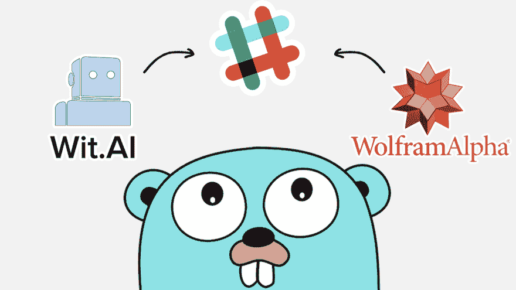

# 用 Go 和 Wit.ai 构建一个 Slack Bot

> 原文：<https://dev.to/plutov/building-a-slack-bot-with-go-and-witai-elb>

[T2】](https://res.cloudinary.com/practicaldev/image/fetch/s--9vpdjJoG--/c_limit%2Cf_auto%2Cfl_progressive%2Cq_auto%2Cw_880/http://pliutau.com/wit.jpg)

这是视频 [packagemain #9:用 Go 和 Wit.ai](https://www.youtube.com/watch?v=zkB_c3cgtd0) 构建 Slack Bot 的文字版。

我们将构建一个简单的具有 NLU 功能的 Slack Bot 来从 Wolfram 获取一些有用的信息。如果你以前没有使用过 Wolfram，不用担心，它是一个计算知识引擎，可以给你一个简短的答案。

NLU 有不同的平台，如 LUIS.ai，Wit.ai，RASA_NLU，我们将使用脸书收购的 NLU 平台 Wit.ai，为您提供解析文本和提取有用信息的功能。

我们的机器人将有最少的功能，如:“问候时回复用户”，然后“在 Wolfram 中搜索并回复”。为什么我们需要 NLU 在这里？因为我们不知道用户如何问候我们，也不知道用户会如何问我们的机器人，会不会像“你知道谁是美国总统吗？”或者“你能告诉我谁是美国总统吗？”。也可能是用户输入错误。NLU 会帮助我们从客户信息中提取有用的信息。

让我们从在 Slack 中创建我们的新机器人开始，为此我创建了新的 Slack 团队-[https://packagemain.slack.com/apps](https://packagemain.slack.com/apps)

*   搜索机器人
*   添加配置
*   用户名“packagemain”
*   如果需要，配置其他设置并获取令牌
*   现在我们可以检查 bot 是否存在:键入`Hi`

让我们写一些简单的程序，它将使用实时消息来接收用户输入。我们需要使用 Slack 令牌，我已经在本地设置了它。

让我们在单独的 go 例程中处理每个传入的消息。

```
go get github.com/nlopes/slack 
```

Enter fullscreen mode Exit fullscreen mode

```
var (
    slackClient   *slack.Client
)

func main() {
    slackClient = slack.New(os.Getenv("SLACK_ACCESS_TOKEN"))

    rtm := slackClient.NewRTM()
    go rtm.ManageConnection()

    for msg := range rtm.IncomingEvents {
        switch ev := msg.Data.(type) {
        case *slack.MessageEvent:
            go handleMessage(ev)
        }
    }
}

func handleMessage(ev *slack.MessageEvent) {
    fmt.Printf("%v\n", ev)
} 
```

Enter fullscreen mode Exit fullscreen mode

#### 设置 Wit.ai

在我们让 Bot 回复用户之前，我们应该配置 Wit.ai。我们现在要在那里创建一个应用程序。

*   前往[https://wit.ai/home](https://wit.ai/home)
*   新应用程序
*   定义实体

Wit.ai 有预定义的实体，我们将使用其中的两个。我们也可以自己定义，训练 Wit.ai 去理解，但我把它留给你们做作业。

1.  机智/问候:嗨，你好。
2.  wit/wolfram_search_query:白俄罗斯总统是谁，地球与火星的距离，乙醇的分子式。

我搜索了 Wit.ai Go 包，godoc.org 上有 5 个包，其中 4 个不兼容新 API。一个正在运行的在 GitHub 上有两个星。我们会使用它，但我不建议在生产环境中使用它。想要尝试创建 Go 包-请创建 Wit.ai SDK。

在设置中获取服务器访问令牌。

```
go get github.com/christianrondeau/go-wit 
```

Enter fullscreen mode Exit fullscreen mode

```
result, err := witClient.Message(ev.Msg.Text)
if err != nil {
    log.Printf("unable to get wit.ai result: %v", err)
    return
}

fmt.Printf("%v\n", result) 
```

Enter fullscreen mode Exit fullscreen mode

Wit.ai 将返回实体列表，每个实体包含值和置信度，因此让我们过滤低置信度的实体，为此我们将置信度阈值设置为 0.9。

```
const confidenceThreshold = 0.9 
```

Enter fullscreen mode Exit fullscreen mode

正如你所看到的，当我们键入“hi”wit . ai 返回我们 2 个成功的实体，因为“hi”也是一个有效的 wolfram 搜索。但是问候实体具有更高的置信度，让我们使用具有最高置信度的实体。

```
var (
    topEntity    wit.MessageEntity
    topEntityKey string
)

for key, entityList := range result.Entities {
    for _, entity := range entityList {
        if entity.Confidence > confidenceThreshold && entity.Confidence > topEntity.Confidence {
            topEntity = entity
            topEntityKey = key
        }
    }
} 
```

Enter fullscreen mode Exit fullscreen mode

现在我们可以根据输入回复用户:

```
func replyToUser(ev *slack.MessageEvent, topEntity wit.MessageEntity, topEntityKey string) {
    switch topEntityKey {
    case "greetings":
        slackClient.PostMessage(ev.User, "Hello user! How can I help you?", slack.PostMessageParameters{
            AsUser: true,
        })
        return
    case "wolfram_search_query":
        // TODO
    }

    slackClient.PostMessage(ev.User, "¯\\_(o_o)_/¯", slack.PostMessageParameters{
        AsUser: true,
    })
} 
```

Enter fullscreen mode Exit fullscreen mode

我们可以看到，我们的程序也处理自己发送的消息，让我们来解决这个问题。

```
if len(ev.BotID) == 0 {
    go handleMessage(ev)
} 
```

Enter fullscreen mode Exit fullscreen mode

#### 设置 Wolfram

我们可以说你好，现在让我们从 Wolfram 获得用户问题的答案:

*   前往[https://developer.wolframalpha.com/portal/myapps](https://developer.wolframalpha.com/portal/myapps)
*   点击获取应用 ID
*   复制应用 ID

```
go get github.com/Krognol/go-wolfram 
```

Enter fullscreen mode Exit fullscreen mode

```
res, err := wolframClient.GetSpokentAnswerQuery(topEntity.Value.(string), wolfram.Metric, 1000)
if err == nil {
    slackClient.PostMessage(ev.User, res, slack.PostMessageParameters{
        AsUser: true,
    })
    return
}

log.Printf("unable to get data from wolfram: %v", err) 
```

Enter fullscreen mode Exit fullscreen mode

#### 检测部分

> 我:你好
> Bot:你好用户！我怎么帮你？我:你好
> 机器人:你好用户！我怎么帮你？我:谁是美国总统？
> Bot:Donald Trump(20/01/2017 至今)
> 我:人生的意义是什么？
> Bot:42
> me:bye
> Bot:\*(o _ o)*/