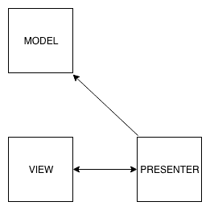

# 使用 MVP 构建 Android 应用程序

> 原文：<https://dev.to/adammc331/building-an-android-app-with-mvp-k2a>

原载于[安卓精华](https://androidessence.com/android/tutorial/building-an-app-with-mvp/)。

这是正在进行的系列文章中的第一篇，展示用于 Android 开发的几种不同的架构模式。通过跟踪[这个报告](https://github.com/AdamMc331/todo-monorepo)，你可以找到它们中每一个的代码，这些代码经常出现在博客文章之前。给它一颗星！

我们要走过的第一个架构模式是 MVP。

# MVP

MVP 代表模型视图演示者。该名称来自于该架构模式中涉及的三个组件。一个很好的起点是理解这些组件的含义:

## 型号

在这个上下文中，模型不一定指你写的模型类。我更愿意把它看作是您的应用程序的数据源。这可能是一个数据库、一个远程服务器，甚至只是您提供的虚拟数据。通常，你会看到开发人员将代码放在某种`Repository`类中。这就是我们所说的模型。

## 视图

视图是负责任何 UI 工作的组件。这包括显示数据和处理点击事件。它不包含那些点击事件的业务逻辑，我将在下一段中阐明。在许多情况下，您将拥有一个表示视图的活动或片段。

## 演示者

演示者负责应用程序中的大多数业务逻辑。这就是从“当视图第一次加载时我们做什么”到“当按钮被点击时我们做什么”的一切。演示者从视图得到这些事件的通知，执行一些动作，并告诉视图该做什么。一会儿我们会看到更多的解释。

# 沟通流程

为了更好地理解沟通流程，我们来看一个简短的流程图:

[T2】](https://res.cloudinary.com/practicaldev/image/fetch/s--ETVfTTJ5--/c_limit%2Cf_auto%2Cfl_progressive%2Cq_auto%2Cw_880/https://thepracticaldev.s3.amazonaws.com/i/rp1qt752vl2hd11pqgye.png)

解释完每个组件后，让我们来分解一下沟通:

*   模特和主持人之间的交流是单向的。通常这种交流非常迅速:演示者要求数据，模型把它递回来。注意:有些人可能会进行这种双向交流，但我们在这里不会这样做。
*   观众和演示者之间有双向交流。通常这是动作驱动的:视图说“发生了这件事”,演示者对此作出响应，然后告诉视图“显示这个数据”或“移动到这个屏幕”作为可能的动作。

所有这些的最大好处是认识到我们在这里有一个清晰的关注点分离。注意模型和视图是如何从不相互交流的？那是因为他们不需要。它们不应该如此紧密地结合在一起。

这种分离也使得我们的应用程序易于测试，我们将在后面的代码中看到这一点。

# 契约类

这个概念可能会因您与哪些开发人员交谈而有所不同，但我在这里会非常固执地说，我喜欢有一个契约类。这个类的目的是定义每个组件所需的行为。我们可以通过接口做到这一点。

假设我们想要创建一个 TODO 列表，从显示一个包含任务列表的活动开始。如果我们用 MVP 来构建这个，我们可能需要一个模型/视图/演示者来承担以下责任:

```
class TaskListContract {

    interface View {
        fun showTasks(tasks: List<BaseTask>)
        fun navigateToAddTask()
    }

    interface Presenter {
        fun addButtonClicked()
        fun viewCreated()
        fun viewDestroyed()
    }

    interface Model {
        fun getTasks(): List<BaseTask>
    }
} 
```

这非常清楚地划分了每个组件的职责:

*   该视图至少可以显示任务列表并导航到新屏幕。
*   演示者需要处理视图中发生的任何动作，比如创建/销毁视图，以及单击按钮。
*   模型的唯一职责是获取我们的任务。

现在我们已经有了每个组件，让我们一起来编写每个组件。

# 型号

对于我们的模型，我们将创建一个像我前面提到的存储库类。这是最简单的组件，因为我们只是让它返回虚拟数据:

```
class TaskRepository : TaskListContract.Model {
    override fun getTasks(): List<BaseTask> {
        return listOf(
                BaseTask("Sample task 1"),
                BaseTask("Sample task 2"),
                BaseTask("Sample task 3"),
                BaseTask("Sample task 4"),
                BaseTask("Sample task 5"),
                BaseTask("Sample task 6"),
                BaseTask("Sample task 7"),
                BaseTask("Sample task 8"),
                BaseTask("Sample task 9"),
                BaseTask("Sample task 10")
        )
    }
} 
```

需要注意的关键是，这个模型没有引用表示者。这又回到了我之前说的他们是单向交流。

# 视图

我将在这里删除一些样板代码，以突出 MVP 组件:

```
class TaskListActivity : BaseTaskListActivity(), TaskListContract.View {
    private val presenter = TaskListPresenter(this, TaskRepository())

    override fun onCreate(savedInstanceState: Bundle?) {
        super.onCreate(savedInstanceState)

        initializeFAB()

        presenter.viewCreated()
    }

    private fun initializeFAB() {
        fab.setOnClickListener {
            presenter.addButtonClicked()
        }
    }

    override fun navigateToAddTask() {
        val intent = Intent(this, AddTaskActivity::class.java)
        startActivityForResult(intent, ADD_TASK_REQUEST)
    }

    override fun showTasks(tasks: List<BaseTask>) {
        taskAdapter.tasks = tasks
    }

    override fun onDestroy() {
        presenter.viewDestroyed()
        super.onDestroy()
    }
} 
```

从上面可以得到的关键信息:

*   我们的视图维护了对演示者的引用。这是双向交流所必需的:我们的演示者也有一个对我们将要看到的视图的引用。
*   我们的观点超越了合同要求的方法。
*   我们的视图在这里没有任何华而不实的业务逻辑或条件语句。这些通常应该避免出现在视图中。当你处理意图和查看相关的类时，有时会很困难，你会在 GitHub 上的样例代码中看到这一点。
*   与上面相关的是，视图从不告诉演示者该做什么。它只告诉演示者某些事件(创建/销毁/点击按钮),演示者决定如何响应。

请注意，虽然我们的视图确实向演示者提供了模型，但是两者之间仍然没有交流。

# 演示者

在这个例子中，我们的 presenter 类非常短:

```
class TaskListPresenter(
        private var view: TaskListContract.View?,
        private val model: TaskListContract.Model
) : TaskListContract.Presenter {

    override fun addButtonClicked() {
        view?.navigateToAddTask()
    }

    private fun getTasks() {
        val tasks = model.getTasks()
        view?.showTasks(tasks)
    }

    override fun viewCreated() {
        getTasks()
    }

    override fun viewDestroyed() {
        view = null
    }
} 
```

关键要点:

*   演示者拥有对模型和视图的引用，因此可以与它们进行交流。
*   模型和视图通过构造函数传入。这允许简单的单元测试，我们将在后面看到。它还遵守这种关注点分离模式，阐明了表示者不关心视图和模型的实现，而只是知道它必须具有契约类中每个定义的行为。
*   在视图被破坏时将其清空是一个好主意，所以我们不会在事后试图更新它。如果我们的演示者执行长时间运行的动作，这是很重要的。

# 更

关于多种特性的 MVP 模式的完整示例，请查看 [GitHub](https://github.com/AdamMc331/todo-monorepo/tree/master/todo-mvp) 中的示例代码。