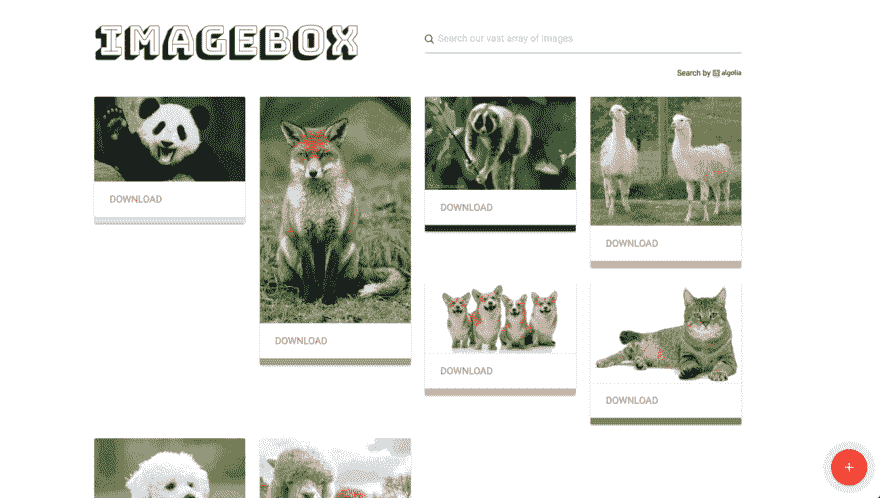

# 用 Algolia & Google 的 Vision API 构建图像搜索

> 原文：<https://dev.to/martyndavies/building-an-image-search-with-algolia--googles-vision-api-37gm>

能够搜索上传的内容总是有用的，但是搜索词的质量通常取决于上传内容的个人。他们的工作通常是要么将内容描述为自由文本，要么从预定义的标签中进行选择。

这很好，但是这通常是一个额外的步骤，会延迟用户体验，或者来自用户的输入是如此的随机(“lol doggos😆”)它不会成为非常有用的搜索数据。

谢天谢地，现在是 2018 年，技术已经足够进步，有办法缓解这种情况。因此，我开始创建一个简单的图像搜索应用程序，它使用了 [Algolia 的](https://www.algolia.com)强大的索引和搜索体验库，其中有一系列动物照片(只是因为)，这些照片由谷歌云的[视觉 API](%5BVision%20API%20-%20Image%20Content%20Analysis%20%C2%A0%7C%C2%A0%20Google%20Cloud%5D(https://cloud.google.com/vision/)) 自动分类。

[T2】](https://res.cloudinary.com/practicaldev/image/fetch/s--29Q1E83F--/c_limit%2Cf_auto%2Cfl_progressive%2Cq_66%2Cw_880/https://cl.ly/2k1m0i3R2F1L/Screen%2520Recording%25202018-03-26%2520at%252005.24%2520pm.gif)

这个示例应用程序允许用户上传图像，然后由 Vision API 自动分类(这实际上是一种有趣的“标记”方式)和颜色描述。这些结果被推到一个 Algolia 索引，然后允许他们立即搜索。

我们将在这里看一下该应用的三个关键元素，但所有的源代码都可以在 GitHub 上找到[，所以你可以在完整的上下文中查看整个应用。](https://github.com/martyndavies/cloud-vision-algolia)

## 1。分类

图像的分类是该应用程序最关键的部分，但由于谷歌工程师的努力，获得这些结果实际上非常简单，使云视觉 API 快速易用。

在设置了我们的帐户(附带 300 美元的免费使用信用)并完成了凭证设置过程(这并不难，只是比我希望的要长一点)之后，我们最终得到了这段代码来获取我们需要的信息:

```
const vision = require('@google-cloud/vision');
const imageClient = new vision.ImageAnnotatorClient();

// classifyImage() function
const classifyImage = (image, cb) => {

  // Use the locally stored image from the upload
  const imageToClassify = `./publimg/${image}`;

  // Ask Google Vision what it thinks this is an image of
  imageClient
  .labelDetection(imageToClassify)
  .then(results => {
    const imageLabels = results[0].labelAnnotations;

      // Also ask for the dominant colors to use as search attributes
      imageClient
      .imageProperties(imageToClassify)
      .then(results => {
        const properties = results[0].imagePropertiesAnnotation;
        const dominantColors = properties.dominantColors.colors;

        // Pass both lists back in the callback
        cb(imageLabels, dominantColors);
      })
      .catch(err => {
        console.error('Error:', err);
      })
  })
  .catch(err => {
    console.error('Error:', err);
  });
}; 
```

下面是上面发生的事情:

初始化 Google Cloud Vision 的 Node JS 库实例后，我们传递给它一个图像，并要求返回一个标签列表。然后，一旦我们有了这些，我们要求它也返回一个在图像中出现的颜色列表。

*注意:上面的代码直接取自我为你和一起玩而构建的[示例应用程序，但是它看起来有点长，所以从现在开始我将使用我编写的代码的简化版本。](https://github.com/martyndavies/cloud-vision-algolia)*

首先，只将标记记录到控制台的简化版本应该是:

```
function getImageLabels(image) {
  imageClient
  .imageProperties(image)
  .then(results => {
    // The labels
    const imageLabels = results[0].labelAnnotations;
    console.log(imageLabels);
  })
}

getImageLabels('./myPicture.jpg'); 
```

API 返回的是一个 JSON 对象数组，如下所示(如果你上传一张树上的熊猫图片🐼):

[T2】](https://res.cloudinary.com/practicaldev/image/fetch/s--98ZTPuqs--/c_limit%2Cf_auto%2Cfl_progressive%2Cq_auto%2Cw_880/https://www.telegraph.co.uk/content/dam/news/2016/08/23/106598324PandawaveNEWS_trans_NvBQzQNjv4Bqeo_i_u9APj8RuoebjoAHt0k9u7HhRJvuo-ZLenGRumA.jpg%3Fimwidth%3D300)

```
[{
  locations: [],
  properties: [],
  mid: '/m/03bj1',
  locale: '',
  description: 'giant panda',
  score: 0.9907882809638977,
  confidence: 0,
  topicality: 0.9907882809638977,
  boundingPoly: null
}] 
```

正如你所看到的，你得到的细节是非常广泛的，可以包括位置信息，边界信息，甚至作物建议，如果你想要的话。不过现在，我们只需要这个应用程序的`description`和`score`(这是谷歌对图像的确定程度)。

现在，如果您愿意，可以将所有这些传递到 Algolia 索引中，特别是如果您正在处理的图像确实返回了更多关于地区和位置等方面的数据。这将成为很好的搜索数据！

在本演示中，我们将只使用标签，所以让我们取出`score`和`description`标签，并创建一个新对象，稍后我们将把它传递给 Algolia 进行索引:

```
function reduceLabelsToObject(labels) {
  // Construct a new object with a couple of pre-defined keys
  // and a link to our uploaded image
  const algoliaData = {
    labels: [],
    upload_date: Date.now(),
    image_url:img/image.jpg'
  };

  // Loop through the labels and add each one to the
  // 'labels' array in the object
  labels.forEach(attribute => {
    algoliaData.labels.push({
      classification: attribute.description,
      score: attribute.score
    });
  });
} 
```

## 2。索引

一旦我们有了来自 Vision API 的结果，就应该把数据放到更有用的地方，以便可以搜索。我们将通过他们的 JavaScript SDK 将其存储在 Algolia 中。

上面，我们为我们想要存储的信息创建了一个 JavaScript 对象，它被称为`algoliaData`，所以让我们把它推到我们的索引中:

首先，通过加载库、设置 API 键、指定要查看和使用的索引以及*最重要的是*用户可以搜索的属性，确保您的 Algolia 设置是正确的:

```
// Require the library
const algolia = require('algoliasearch');
// Init the client with your APP ID and API KEY
const client = algolia('your_app_id', 'your_admin_api_key');
// Assing which index you want to use
const index = client.initIndex('images');

// Set some settings on the index, make sure only the
// labels array is searchable
index.setSettings({
  'searchableAttributes': [
    'labels.classification'
  ]
}); 
```

然后将数据推送到索引:

```
const addToAlgoliaIndex = (algoliaData) => {
  index.addObject(algoliaData, function(err, content) {
    if (err) {
        console.log(`Error: ${err}`
    } else {
      console.log(`All good: ${content}`
    } 
  });
} 
```

那实际上是一切。Algolia 可以索引任何形式的 JSON，所以你的键和值可以是你喜欢的。最简单的是，`index.addObject()`方法可以快速方便地完成向索引添加单个对象所需的一切工作。

在这一点上，我们已经设置了图像识别和后续分类(标记)，我们已经将图像信息上传到 Algolia，这意味着它现在是可搜索的。

## 3。显示结果

这个应用程序的最后一块拼图是如何显示上传回用户的图像，并允许用户搜索它们。

Algolia 确实允许我们使用他们的 API 构建搜索体验，我们可以根据自己的喜好进行调整和定制。不过，出于时间的考虑，我们将使用他们提供的优秀的 [InstantSearch.js](%5BInstantSearch.js%5D(https://community.algolia.com/instantsearch.js/)) 库，使用一系列我们可以根据自己的喜好定制的预定义小部件来创建出色的搜索体验。

### 设置即时搜索

您可以通过下载、通过包管理器添加或从 CDN 加载来将 InstantSearch 添加到您的前端。您可以在[文档](%5BInstantSearch.js%20%7C%20Getting%20started%5D(https://community.algolia.com/instantsearch.js/v1/documentation/))中查看所有这些安装选项。

一旦你加载了 InstantSearch.js，你可以在一个单独的 js 文件中初始化它，或者在一个`<script>`标签中初始化它:

```
const search = instantsearch({
  appId: 'your_app_id',
  apiKey: 'your_api_key',
  indexName: 'images'
});

search.start(); 
```

### 添加搜索框

…再简单不过了。我们将使用 InstantSearch 小部件中的一个[将其添加到我们的应用程序中。](%5BDocumentation%20-%20instantsearch.js%5D(https://community.algolia.com/instantsearch.js/v1/documentation/#widgets))

在我们的 HTML 中，在添加 InstantSearch.js 文件和 CSS 之后，我们添加:

```
<div id=“search-box”></div> 
```

然后在我们的 JS 文件中:

```
search.addWidget(
  instantsearch.widgets.searchBox({
    container: '#search-box',
    placeholder: 'Search for images'
  })
); 
```

上面，我们将搜索框小部件添加到`search`实例中，并告诉它将所有元素加载到 ID 为`search-box`的`<div>`中。

搜索框很酷，但是如果结果没有任何地方可以显示，它还是没什么用。让我们来设置当在搜索框中输入内容时，如何显示返回的搜索结果。

首先在 HTML 中添加另一个`<div>`来存放结果:

```
<div id=“hits></div> 
```

然后在您的 JS 文件中，添加 Hits 小部件:

```
search.addWidget(
  instantsearch.widgets.hits({
    container: '#hits',
    templates: {
      empty: `<p>Sorry, we couldn't find any matches.</p>`,
      item: function(hit) {
        return `
        <div class="card">
          <div class="card-image">
            
          </div>

          <div class="card-action">
            <a href="${hit.image_url}" download="${hit.image_url}">Download</a>
          </div>
          <div class="card-footer" style="height:10px; background-color:${hit.most_dominant_color}"></div>
        </div>
      `
      }
    }
  })
); 
```

Algolia 返回的每个结果被称为*‘命中’*。Hits 小部件允许我们指定这些结果应该显示在 HTML 中的什么位置，以及它们应该是什么样子。

在我们的示例应用程序中，点击使用[物化 CSS](%5BDocumentation%20-%20Materialize%5D(http://materializecss.com/)) 进行样式化，它们看起来像这样:

[T2】](https://res.cloudinary.com/practicaldev/image/fetch/s--VeAvxz21--/c_limit%2Cf_auto%2Cfl_progressive%2Cq_auto%2Cw_880/https://cl.ly/1q2i21081a13/Image%25202018-03-26%2520at%25203.44.03%2520pm.png)

上面的代码中使用了两个模板。第一个是如果没有任何结果应该显示什么。第二个是如果有结果(点击)要显示，每个结果应该是什么样子。

每个结果都作为对象传递到函数中，您可以引用 HTML 中的任何属性。正如您在模板中看到的，我们需要`image_url`属性和`most_dominant_color`属性来填写我们的卡片内容。

## 就是这样。鳍。

通过这些示例，您已经了解了如何做到以下几点:

*   通过传递图像从 Google Cloud 的 Vision API 返回分类数据
*   在 Algolia 中存储关于此图像的相关信息，并使其可搜索
*   如何使用 InstantSearch.js 将搜索界面和搜索结果快速添加到应用程序中

如果你看一看示例应用程序的[完整源代码，你也会看到如何使用 JavaScript 和名为](https://github.com/martyndavies/cloud-vision-algolia) [Multer](%5BGitHub%20-%20expressjs/multer:%20Node.js%20middleware%20for%20handling%20%7B%%20raw%20%%7D%60multipart/form-data%60%7B%%20endraw%20%%7D.%5D(https://github.com/expressjs/multer)) 的 NodeJS 库来处理图片上传。您还将看到如何使用[物化 CSS](%5BDocumentation%20-%20Materialize%5D(http://materializecss.com/)) 提供的一些动态组件，比如模态和通知。

如果你对此有任何问题，请随时通过 GitHub 或 T2 的 Twitter 联系我。