# 使用 React 和 Cloudinary 构建离线 PWA 相机应用程序

> 原文：<https://dev.to/ore/building-an-offline-pwa-camera-app-with-react-and-cloudinary-5b9k>

> **注意:**这个项目是为所有那些参加即将到来的 [React Riot](https://www.reactriot.com/) 48 小时黑客马拉松的人设计的。关于代码的细节，请参见 [GitHub](https://github.com/oreHGA/cl-react-pwa) 库。您可以在 [CodeSandbox](https://codesandbox.io/s/5xnvnn80xk) 上查看和编辑实时代码，或者查看[演示](https://5xnvnn80xk.codesandbox.io/)。希望你喜欢！

本教程将带您完成使用 React 和 Cloudinary 构建离线渐进式 Web 应用程序(PWA)相机应用程序的过程，该应用程序可以用您的相机拍照，然后将其上传到您的 Cloudinary 媒体库。该应用程序的一个了不起的功能是，当你离线时，应用程序会将你的图像存储在浏览器的本地存储中(`localStorage`)。一旦互联网连接可用，该应用程序会自动将所有保存的图片上传到 Cloudinary 上的媒体库。

[](https://res.cloudinary.com/practicaldev/image/fetch/s--jez0w_66--/c_limit%2Cf_auto%2Cfl_progressive%2Cq_66%2Cw_880/https://d2mxuefqeaa7sj.cloudfront.net/s_CB1529C18383F5548EDF13217A823CEEA09EC3BDFA57AD577E213213DCE5B3F4_1536456626058_ezgif.com-video-to-gif.gif)
[T6】](https://res.cloudinary.com/practicaldev/image/fetch/s--ap9_mIhh--/c_limit%2Cf_auto%2Cfl_progressive%2Cq_66%2Cw_880/https://d2mxuefqeaa7sj.cloudfront.net/s_CB1529C18383F5548EDF13217A823CEEA09EC3BDFA57AD577E213213DCE5B3F4_1536456664229_ezgif.com-video-to-gif%2B1.gif)

## 安装先决条件

首先，在您的机器上安装以下软件:

*   [节点](https://nodejs.org/) [。js](https://nodejs.org/) (版本 6 或更高)
*   [纱](https://yarnpkg.com/)和 [NPM](https://www.npmjs.com/)

## 入门

接下来，创建一个 React 应用程序。

**注意:**如果你用 Yarn 管理机器上的依赖项，下载包运行器`npx`。然而，如果您使用 NPM 进行依赖管理，您可以跳过这一步，因为`npx`已经与 NPM 捆绑在一起(版本 5.2 或更高)。

要将`npx`添加到 Yarn，在您的终端上运行这个命令:

```
 yarn global add npx 
```

Enter fullscreen mode Exit fullscreen mode

然后，创建一个 starter React 项目，您将在继续本教程的过程中对其进行调整:

```
 npx create-react-app cloudy-cam-pwa 
```

Enter fullscreen mode Exit fullscreen mode

为了确保项目就位，转到应用程序目录并启动开发服务器:

```
 cd cloudy-cam-pwa
    yarn start # or npm start 
```

Enter fullscreen mode Exit fullscreen mode

上面的命令在`http://localhost:3000`上启动一个开发服务器。在浏览器上导航到该 URL 会显示 React 应用程序:

[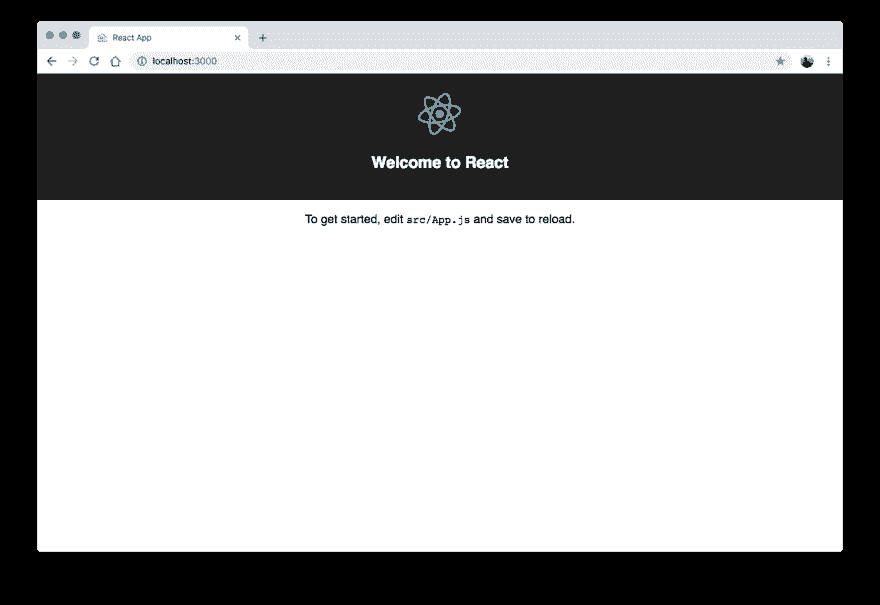T2】](https://res.cloudinary.com/practicaldev/image/fetch/s--jVxw6Mg7--/c_limit%2Cf_auto%2Cfl_progressive%2Cq_auto%2Cw_880/https://d2mxuefqeaa7sj.cloudfront.net/s_CB1529C18383F5548EDF13217A823CEEA09EC3BDFA57AD577E213213DCE5B3F4_1536456849174_Screen%2BShot%2B2018-09-09%2Bat%2B1.33.44%2BAM.png)

## 创建一个`Webcam`类

要授权应用程序访问你的相机，通过在`src`目录下创建一个`webcam.js`文件来为相机的主要功能构建一个`Webcam`类:

```
 // src/webcam.js
    export class Webcam {
      constructor(webcamElement, canvasElement) {
        this.webcamElement = webcamElement;
        this.canvasElement = canvasElement;
      }

      adjustVideoSize(width, height) {
        const aspectRatio = width / height;
        if (width >= height) {
            this.webcamElement.width = aspectRatio * this.webcamElement.height;
        } else  {
            this.webcamElement.height = this.webcamElement.width / aspectRatio;
        }
      }
    [...] 
```

Enter fullscreen mode Exit fullscreen mode

`Webcam`构造函数接受两个元素:`Web` `camElement` ( `videoElement`)和`CanvasElement`。`adjustVideoSize()`方法将视频元素调整为与您在创建`videoElement`时指定的大小成比例。

现在将其他方法添加到`Webcam`类中，如下所示:

```
 // src/webcam.js
    [...]
      async setup() {
        return new Promise((resolve, reject) => {
          if (navigator.mediaDevices.getUserMedia !== undefined) {
            navigator.mediaDevices.getUserMedia({
                audio: false, video: { facingMode: 'user' }
                })
                .then((mediaStream) => {
                    if ("srcObject" in this.webcamElement) {
                        this.webcamElement.srcObject = mediaStream;
                    } else {
                        // For older browsers without the srcObject.
                        this.webcamElement.src = window.URL.createObjectURL(mediaStream);
                    }
                    this.webcamElement.addEventListener(
                        'loadeddata',
                        async () => {
                            this.adjustVideoSize(
                                this.webcamElement.videoWidth,
                                this.webcamElement.videoHeight
                            );
                            resolve();
                        },
                        false
                    );
                });
          } else {
              reject();
          }
      });
      }

    [...] 
```

Enter fullscreen mode Exit fullscreen mode

`setup()`函数从浏览器初始化摄像机，并将视频流分配给组件中的`VideoElement`。这意味着允许使用相机，并把`videoStream`功能还给你。

以下是捕捉图像的方法:

```
 // src/webcam.js
    [...]
      _drawImage() {
        const imageWidth = this.webcamElement.videoWidth;
        const imageHeight = this.webcamElement.videoHeight;

        const context = this.canvasElement.getContext('2d');
        this.canvasElement.width = imageWidth;
        this.canvasElement.height = imageHeight;

        context.drawImage(this.webcamElement, 0, 0, imageWidth, imageHeight);
        return { imageHeight, imageWidth };
      }

      takeBlobPhoto() {
        const { imageWidth, imageHeight } = this._drawImage();
        return new Promise((resolve, reject) => {
            this.canvasElement.toBlob((blob) => {
                resolve({ blob, imageHeight, imageWidth });
            });
        });
      }

      takeBase64Photo({ type, quality } = { type: 'png', quality: 1 }) {
        const { imageHeight, imageWidth } = this._drawImage();
        const base64 = this.canvasElement.toDataURL('image/' + type, quality);
        return { base64, imageHeight, imageWidth };
      }
    } 
```

Enter fullscreen mode Exit fullscreen mode

当调用该函数时，`_drawImage()`方法获取`videoElement`中的现有帧，并在`canvasElement`上显示图像。然后在`takeBlobPhoto()`和`takeBase64Photo()`方法中调用`_drawImage()`方法，分别处理二进制大对象(blob)图像或 Base64 图像。

## 创建一个`Notifier`组件

在`src`目录下创建一个`components`文件夹来保存应用程序的组件:

```
 mkdir components 
```

Enter fullscreen mode Exit fullscreen mode

为了支持离线使用和访问，您需要一个`Notifier`组件来标识与应用程序交互的模式。

首先，在你的`src/components`目录下创建一个`Notifier`文件夹:

```
 mkdir Notifier
    cd Notifier
    touch index.js Notifier.css # on Windows, run the following instead
    # copy NUL index.js
    # copy NUL Notifier.css 
```

Enter fullscreen mode Exit fullscreen mode

接下来，安装一个名为`classnames`的包，用于显示各种模式的不同颜色，即动态渲染不同的类:

```
 yarn add classnames # or npm install classnames 
```

Enter fullscreen mode Exit fullscreen mode

之后，编辑您的`Notifier/index.js`文件，如下所示:

```
 // src/components/Notifier/index.js
    import React, { Component } from "react";
    import "./Notifier.css";
    import classnames from 'classnames';

    class Notifier extends Component {
      render() {
        const notifyclass = classnames('notify', {
          danger: this.props.offline
        });
        const message = this.props.offline ?
      `CloudyCam is offline! Your images will be saved now and then uploaded to your Cloudinary Media Library once your Internet connection is back up.`
      :
      `Take a picture and it will be uploaded to your Cloudinary Media Library.`;
        return (
            <div className={notifyclass}>
                <p>
                    <em>{message}</em>
                </p>
            </div>
        );
      }
    }

    export default Notifier; 
```

Enter fullscreen mode Exit fullscreen mode

这里，检查调用`Notifier`时传递的`offline`属性的值。如果`offline`为`true`，则 app 处于离线模式，相应显示类别和消息。

编辑您的`Notifier/Notifier.css`文件，如下所示:

```
 /* src/components/Notifier/Notifier.css */

    .notify{
        background-color: #0066B2;
        padding: 20px;
        text-align: center;
        color: white;
        margin-bottom: 20px;
    }

    .danger{
        background-color: #D77623;
    } 
```

Enter fullscreen mode Exit fullscreen mode

要使用`Notifier`组件，请编辑`src/App.js`文件，如下所示:

```
 // src/App.js

    import React, { Component } from 'react';
    import logo from './logo.png';
    import './App.css';
    import Notifier from './components/Notifier';

    class App extends Component {
      constructor() {
        super();
        this.state = {
          offline: false
        }
      }

      componentDidMount() {
        window.addEventListener('online', () => {
          this.setState({ offline: false });
        });

        window.addEventListener('offline', () => {
          this.setState({ offline: true });
        });
      }

      componentDidUpdate() {
        let offlineStatus = !navigator.onLine;
        if (this.state.offline !== offlineStatus) {
          this.setState({ offline: offlineStatus });
        }
      }

      render() {
        return (
          <div className="App">
            <Notifier offline={this.state.offline} />
            <header className="App-header">
              
              <h1 className="App-title">CloudyCam</h1>
            </header>
          </div>
        );
      }
    }

    export default App; 
```

Enter fullscreen mode Exit fullscreen mode

`App.js`组件有一个状态`offline`，它指定应用程序是否处于离线模式。默认情况下，州名是`false`。当`App.js`被安装时，在应用程序被加载时执行的`componentDidMount`功能监听在线/离线事件并相应地更新`App.js`状态。

`render`函数定义了应用程序和`Notifier`组件的布局，将离线状态作为属性传递给`Notifier`进行显示。

从[这里](https://res.cloudinary.com/cloudinary/image/upload/c_scale,w_200/v1/logo/for_white_bg/cloudinary_vertical_logo_for_white_bg.png)取出 Cloudinary 的 logo，保存到你的`src`目录中作为`logo.png`。

现在你可能想知道所有这些是如何在应用程序中显示的。在`src/index.js`文件中，`App`组件呈现在一个 ID 为`root`的`<` `div` `>`标签上，如下:

```
 // src/index.js
    import React from 'react';
    import ReactDOM from 'react-dom';
    import './index.css';
    import App from './App';
    import registerServiceWorker from './registerServiceWorker';

    ReactDOM.render(<App />, document.getElementById('root'));
    registerServiceWorker(); 
```

Enter fullscreen mode Exit fullscreen mode

要查看您的应用程序，首先在您的开发服务器上运行以下命令:

```
 yarn start 
```

Enter fullscreen mode Exit fullscreen mode

之后，在浏览器上转到`http://localhost:3000`显示应用程序。切换您的互联网连接，您将看到两个版本中的一个，这取决于您是在线还是离线(见下文)。

[](https://res.cloudinary.com/practicaldev/image/fetch/s--pZtluTbv--/c_limit%2Cf_auto%2Cfl_progressive%2Cq_auto%2Cw_880/https://d2mxuefqeaa7sj.cloudfront.net/s_CB1529C18383F5548EDF13217A823CEEA09EC3BDFA57AD577E213213DCE5B3F4_1536299240543_Screen%2BShot%2B2018-09-07%2Bat%2B5.47.13%2BAM.png)
[T6】](https://res.cloudinary.com/practicaldev/image/fetch/s--PR5SnzBM--/c_limit%2Cf_auto%2Cfl_progressive%2Cq_auto%2Cw_880/https://d2mxuefqeaa7sj.cloudfront.net/s_CB1529C18383F5548EDF13217A823CEEA09EC3BDFA57AD577E213213DCE5B3F4_1536299240565_Screen%2BShot%2B2018-09-07%2Bat%2B5.46.50%2BAM.png)

## 创建一个`ClCamera`组件

为了使用`Webcam`，创建一个名为`ClCamera`的云相机组件。首先，在你的`src/components`文件夹:
中创建一个新的`ClCamera`文件夹

```
 mkdir ClCamera
    cd ClCamera
    touch index.js ClCamera.css # on Windows, run the command
    # copy NUL index.js
    # copy NUL ClCamera.css 
```

Enter fullscreen mode Exit fullscreen mode

安装`axios`，使您能够在应用程序中发出 HTTP 请求:

```
 yarn add axios # or npm install axios 
```

Enter fullscreen mode Exit fullscreen mode

之后，编辑`ClCamera/index.js`文件，如下所示:

```
 // src/components/ClCamera.js

    import React, { Component } from 'react';
    import { Webcam } from '../../webcam';
    import './ClCamera.css';
    import axios from 'axios';

    class ClCamera extends Component {
      constructor() {
        super();
        this.webcam = null;
        this.state = {
          capturedImage: null,
          captured: false,
          uploading: false
        }
      }

      componentDidMount() {
        // initialize the camera
        this.canvasElement = document.createElement('canvas');
        this.webcam = new Webcam(
            document.getElementById('webcam'),
            this.canvasElement
        );
        this.webcam.setup().catch(() => {
            alert('Error getting access to your camera');
        });
      }

      componentDidUpdate(prevProps) {
        if (!this.props.offline && (prevProps.offline === true)) {
          // if its online
          this.batchUploads();
        }
      }

      render() {
            const imageDisplay = this.state.capturedImage ?
                
                :
                <span />;

            const buttons = this.state.captured ?
                <div>
                    <button className="deleteButton" onClick={this.discardImage} > Delete Photo </button>
                    <button className="captureButton" onClick={this.uploadImage} > Upload Photo </button>
                </div> :
                <button className="captureButton" onClick={this.captureImage} > Take Picture </button>

            const uploading = this.state.uploading ?
                <div><p> Uploading Image, please wait ... </p></div>
                :
                <span />

            return (
                <div>
                    {uploading}
                    <video autoPlay playsInline muted id="webcam" width="100%" height="200" />
                    <br />
                    <div className="imageCanvas">
                        {imageDisplay}
                    </div>
                    {buttons}
                </div>
            )
        }

    [...] 
```

Enter fullscreen mode Exit fullscreen mode

`ClCamera`组件包含三种状态:

*   `capturedImage`状态，保存图像的 Base64 版本。
*   布尔`captured`状态，指定图像是否已被捕获。
*   一个`uploading`状态，指定图像是否正在上传到 Cloudinary。

当`ClCamera`组件被挂载时，`componentDidMount()`函数创建一个`canvas`元素和一个`Webcam`对象，将`videoElement`和`canvasElement`元素作为参数传递。随后，您初始化摄像机馈送。

当应用程序从离线模式转为在线模式时，`componentDidUpdate`方法调用`batchUpload()`方法来上传应用程序离线时保存在浏览器缓存中的图像。

以下是在应用中执行任务的其他方法:

*   当点击`captureImage()`函数时，调用`takeBase64Photo()`方法来捕获图像。

*   Base64 图像存储在`ClCamera`的`capturedImage`状态。并且组件的`captured`状态被设置为`true`。

*   显示两个按钮，分别触发`discardImage`方法和`uploadImage`方法，提示您放弃或上传图像。`discardImage()`方法从`ClCamera`状态丢弃图像，然后将`captured`状态设置为`false`。

```
 // src/components/ClCamera/index.js
    [...]
        captureImage = async () => {
            const capturedData = this.webcam.takeBase64Photo({ type: 'jpeg', quality: 0.8 });
            this.setState({
                captured: true,
                capturedImage: capturedData.base64
            });
        }

        discardImage = () => {
            this.setState({
                captured: false,
                capturedImage: null
            })
        }

    [...] 
```

Enter fullscreen mode Exit fullscreen mode

`uploadImage`功能首先检查您的连接状态，并执行以下操作:

*   如果连接是离线的，`uploadImage`创建一个新的带有前缀`cloudy_pwa_`的唯一字符串，然后将您的 Base64 图像以组件的`this.state.capturedImage`状态存储在浏览器的`localStorage`中。最后，`uploadImage`调用了`discardImage()`方法。

*   如果连接是在线的，`uploadImage`发出一个`POST`请求来上传你的 Base64 图像以及一个作为参数的 Cloudinary 预置。

> **注意:** Cloudinary 上传预设将在本教程的后面部分详细介绍。

```
 // src/components/ClCamera/index.js
    [...]

        uploadImage = () => {
            if (this.props.offline) {
                console.log("you're using in offline mode sha");
                // create a random string with a prefix
                const prefix = 'cloudy_pwa_';
                // create random string
                const rs = Math.random().toString(36).substr(2, 5);
                localStorage.setItem(`${prefix}${rs}`, this.state.capturedImage);
                alert('Image saved locally, it will be uploaded to your Cloudinary media library once internet connection is detected');
                this.discardImage();
                // save image to local storage
            } else {
                this.setState({ 'uploading': true });
                axios.post(
                    `https://api.cloudinary.com/v1_1/CLOUDINARY_CLOUD_NAME/image/upload`,
                    {
                        file: this.state.capturedImage,
                        upload_preset: 'CLOUDINARY_CLOUD_PRESET'
                    }
                ).then((data) => this.checkUploadStatus(data)).catch((error) => {
                    alert('Sorry, we encountered an error uploading your image');
                    this.setState({ 'uploading': false });
                });
            }
        }

    [...] 
```

Enter fullscreen mode Exit fullscreen mode

> **注意:**确保用您设置中的实际值替换`CLOUDINARY_CLOUD_NAME`和`CLOUDINARY_UPLOAD_PRESET`。关于如何获取这些值，请参见下一节。

* *当`ClCamera`检测到您的互联网连接已恢复时，会调用`batchUploads`方法，该方法会使用`findLocalItems`方法在`localStorage`中搜索任何之前存储的图像。如果没有找到图像，该函数退出。否则，通过对上传端点的`POST`请求，以图像和预设为参数，将图像上传到云媒体库。`checkUploadStatus`方法接受来自 Cloudinary 的 API 的数据响应，然后检查上传是否成功。如果出现错误，`checkUploadStatus`会显示一条消息，大意是图像会保留在`localStorage`中，以备下一次批量上传。

```
 findLocalItems = (query) => {
            let i;
            let results = [];
            for (i in localStorage) {
                if (localStorage.hasOwnProperty(i)) {
                    if (i.match(query) || (!query && typeof i === 'string')) {
                        const value = localStorage.getItem(i);
                        results.push({ key: i, val: value });
                    }
                }
            }
            return results;
        }

        checkUploadStatus = (data) => {
            this.setState({ 'uploading': false });
            if (data.status === 200) {
                alert('Image Uploaded to Cloudinary Media Library');
                this.discardImage();
            } else {
                alert('Sorry, we encountered an error uploading your image');
            }
        }

        batchUploads = () => {
            // this is where all the images saved can be uploaded as batch uploads
            const images = this.findLocalItems(/^cloudy_pwa_/);
            let error = false;
            if (images.length > 0) {
                this.setState({ 'uploading': true });
                for (let i = 0; i < images.length; i++) {
                    // upload
                    axios.post(
                        `https://api.cloudinary.com/v1_1/CLOUDINARY_CLOUD_NAME/image/upload`,
                        {
                            file: images[i].val,
                            upload_preset: 'CLOUDINARY_CLOUD_PRESET'
                        }

                    ).then(
                      (data) => this.checkUploadStatus(data)
                    ).catch((error) => {
                        error = true;
                    })
                }
                this.setState({ 'uploading': false });
                if (!error) {
                    alert("All saved images have been uploaded to your Cloudinary Media Library");
                }
            }
        }
    }

    export default ClCamera; 
```

Enter fullscreen mode Exit fullscreen mode

> **注意:**同样，用设置中的实际值替换`CLOUDINARY_CLOUD_NAME`和`CLOUDINARY_UPLOAD_PRESET`。关于如何获取这些值，请参见下一节。

`ClCamera`组件包含这些样式属性:

```
 /* src/components/ClCamera/ClCamera.css */

    .captureButton{
      margin-top: 20px;
      padding: 10px;
      padding-left: 20px;
      padding-right: 20px;
      background-color: #0066B2;
      color: white;
      border-radius: 5px;
    }

    .deleteButton{
      margin-top: 20px;
      padding: 10px;
      padding-left: 20px;
      padding-right: 20px;
      background-color: #D77623;
      color: white;
      border-radius: 5px;
    }

    .imageCanvas{
      margin-top: 20px;
      width: 100%;
      height: 200px;
      display: flex;
      justify-content: center;
    } 
```

Enter fullscreen mode Exit fullscreen mode

## 设置云端账户

[T2】](https://res.cloudinary.com/practicaldev/image/fetch/s--FHYoq-gp--/c_limit%2Cf_auto%2Cfl_progressive%2Cq_auto%2Cw_880/https://d2mxuefqeaa7sj.cloudfront.net/s_CB1529C18383F5548EDF13217A823CEEA09EC3BDFA57AD577E213213DCE5B3F4_1536349995882_Screen%2BShot%2B2018-09-06%2Bat%2B7.09.31%2BAM.png)

要在这个应用程序中处理图像上传，请利用 [Cloudinary](https://cloudinary.com) 。首先，[在那里创建一个账户](https://cloudinary.com/signup)。

[T2】](https://res.cloudinary.com/practicaldev/image/fetch/s--osEl7sF3--/c_limit%2Cf_auto%2Cfl_progressive%2Cq_auto%2Cw_880/https://d2mxuefqeaa7sj.cloudfront.net/s_CB1529C18383F5548EDF13217A823CEEA09EC3BDFA57AD577E213213DCE5B3F4_1536350242110_Screen%2BShot%2B2018-09-07%2Bat%2B7.56.54%2BPM.png)

**找出你的云名**
Cloudinary 然后带你去你的**仪表盘**(媒体控制台)，在这里你的云名在**账户详情**下指定(见下文)。用该名称替换前面代码段中的`ClCamera`组件中的`CLOUDINARY_CLOUD_NAME`变量。

[T2】](https://res.cloudinary.com/practicaldev/image/fetch/s--dZ-JpdOI--/c_limit%2Cf_auto%2Cfl_progressive%2Cq_auto%2Cw_880/https://d2mxuefqeaa7sj.cloudfront.net/s_CB1529C18383F5548EDF13217A823CEEA09EC3BDFA57AD577E213213DCE5B3F4_1536350595670_Screen%2BShot%2B2018-09-06%2Bat%2B7.10.15%2BAM.png)

**创建云上传预设**
云上传预设使您能够设置图像上传的默认行为。这意味着，您可以从 Cloudinary 控制台定义标签、转换和其他分析预设，而不是每次上传图像时都必须添加参数来应用于您的图像。只需在代码中指定预设名称，就可以开始了！

要创建预设，进入[上传设置](https://cloudinary.com/console/settings/upload)屏幕，点击**添加上传预设**链接:

[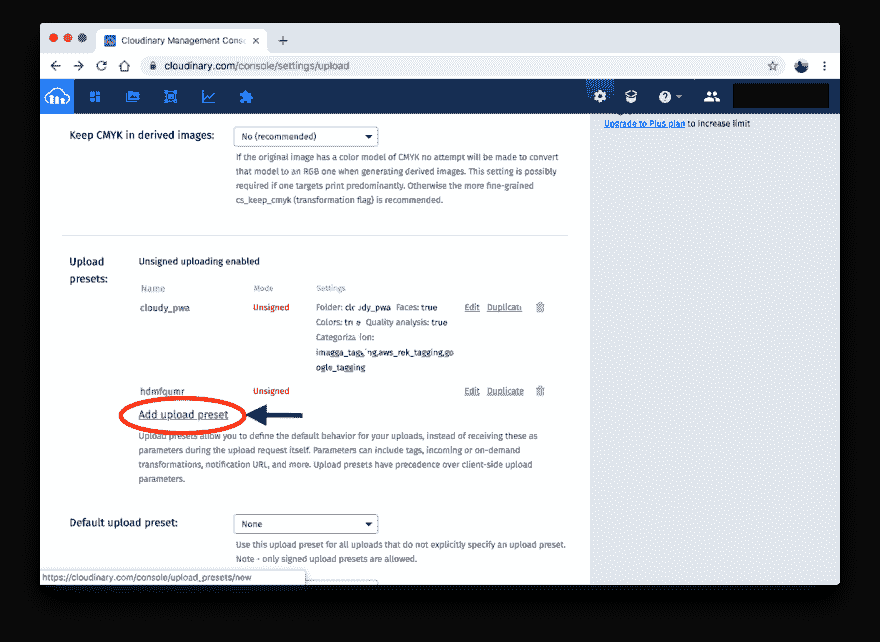T2】](https://res.cloudinary.com/practicaldev/image/fetch/s--W7J_bnRa--/c_limit%2Cf_auto%2Cfl_progressive%2Cq_auto%2Cw_880/https://d2mxuefqeaa7sj.cloudfront.net/s_CB1529C18383F5548EDF13217A823CEEA09EC3BDFA57AD577E213213DCE5B3F4_1536352009847_Screen%2BShot%2B2018-09-06%2Bat%2B7.11.06%2BAM.png)

然后显示**添加上传预设**屏幕。

[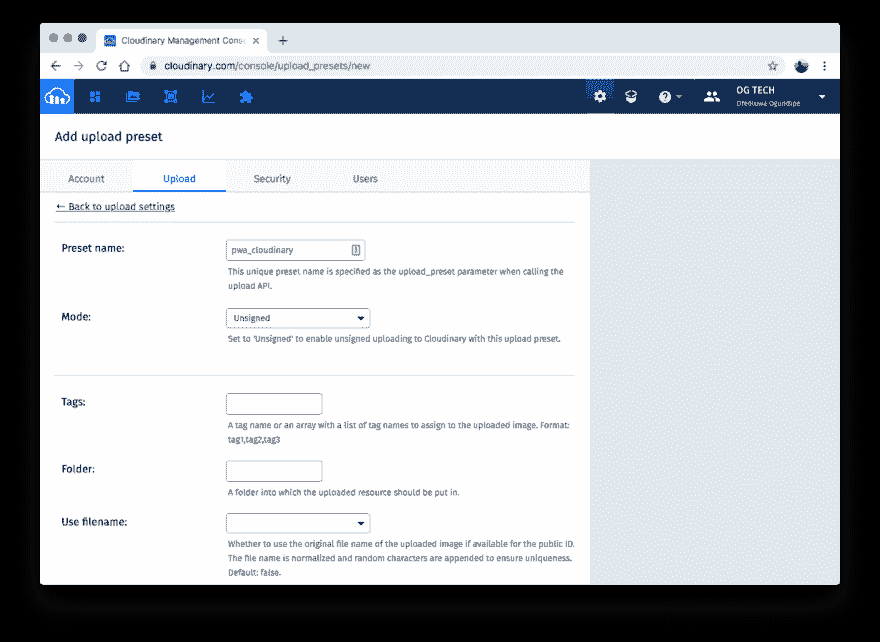T2】](https://res.cloudinary.com/practicaldev/image/fetch/s--bPC6VY0l--/c_limit%2Cf_auto%2Cfl_progressive%2Cq_auto%2Cw_880/https://d2mxuefqeaa7sj.cloudfront.net/s_CB1529C18383F5548EDF13217A823CEEA09EC3BDFA57AD577E213213DCE5B3F4_1536352218873_Screen%2BShot%2B2018-09-06%2Bat%2B7.11.34%2BAM.png)

在**预设名称**下输入一个名称，将**模式**设置为**无符号**，然后根据需要指定其他细节。

[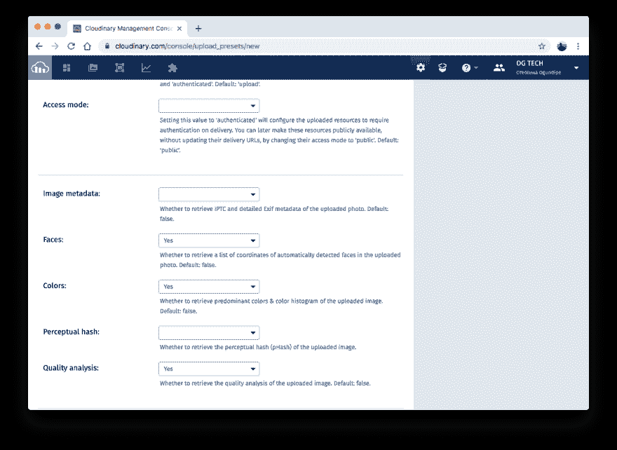T2】](https://res.cloudinary.com/practicaldev/image/fetch/s--ubr4XmBM--/c_limit%2Cf_auto%2Cfl_progressive%2Cq_auto%2Cw_880/https://d2mxuefqeaa7sj.cloudfront.net/s_CB1529C18383F5548EDF13217A823CEEA09EC3BDFA57AD577E213213DCE5B3F4_1536352218890_Screen%2BShot%2B2018-09-06%2Bat%2B7.11.54%2BAM.png)

当`ClCamera`组件从您的应用上传一张图片时，Cloudinary 返回一个数据元素，其中包含与图片相关的信息。这样，如果您设置了一个上传预设来执行面部检测、图像颜色分析和对象检测等任务，Cloudinary 会将结果返回给您，供您在认为合适的时候使用。默认情况下，Cloudinary 会返回你上传的图片的 URL。

## 测试和审计 CloudyCam

现在可以使用了。更新你的`App.js`文件来渲染组件，如下:

```
 // src/App.js

    // other imports
    [...]
    import ClCamera from "./components/ClCamera";

    class App extends Component {

      // other component methods
      [...]
      render() {
        return (
          <div className="App">
            <Notifier offline={this.state.offline} />
            <header className="App-header">
              
              <h1 className="App-title">CloudyCam</h1>
            </header>
            <ClCamera offline={this.state.offline} />
          </div>
        );
      }
    }

    export default App; 
```

Enter fullscreen mode Exit fullscreen mode

接下来，确保您的开发服务器正在`http://localhost:3000`上运行。在浏览器上导航到该 URL，并验证是否显示了应用程序的各种版本:

[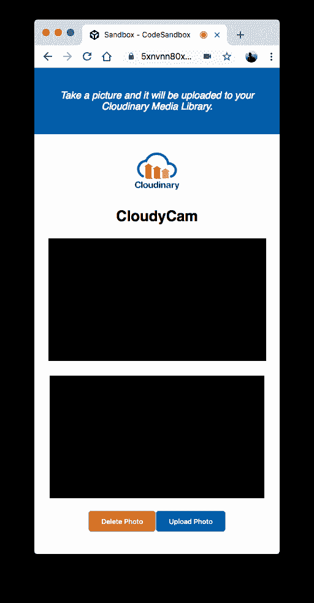](https://res.cloudinary.com/practicaldev/image/fetch/s--Puf2xWU6--/c_limit%2Cf_auto%2Cfl_progressive%2Cq_auto%2Cw_880/https://d2mxuefqeaa7sj.cloudfront.net/s_CB1529C18383F5548EDF13217A823CEEA09EC3BDFA57AD577E213213DCE5B3F4_1536451882895_Screen%2BShot%2B2018-09-09%2Bat%2B12.02.40%2BAM.png)
[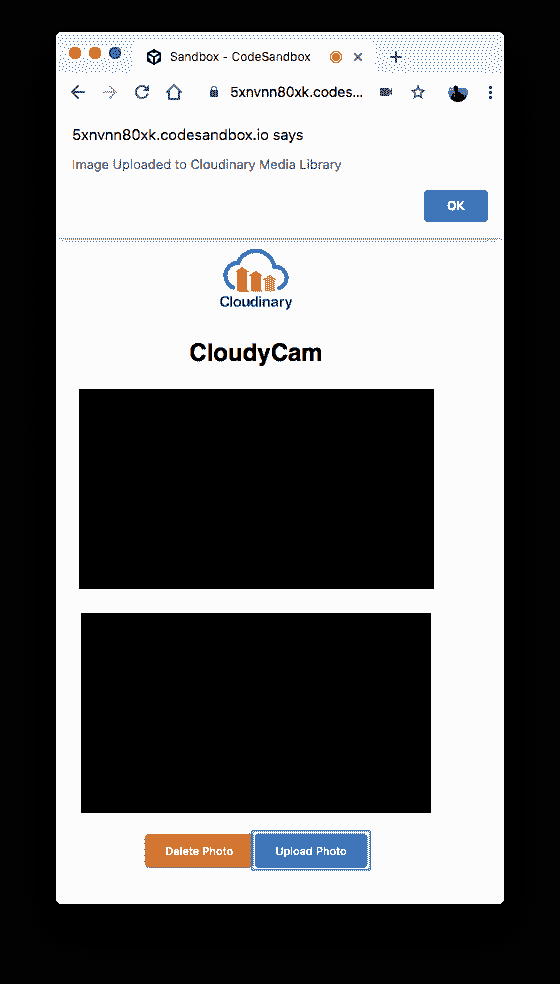](https://res.cloudinary.com/practicaldev/image/fetch/s--V3gWAA9j--/c_limit%2Cf_auto%2Cfl_progressive%2Cq_auto%2Cw_880/https://d2mxuefqeaa7sj.cloudfront.net/s_CB1529C18383F5548EDF13217A823CEEA09EC3BDFA57AD577E213213DCE5B3F4_1536451882901_Screen%2BShot%2B2018-09-09%2Bat%2B12.05.35%2BAM.png)
[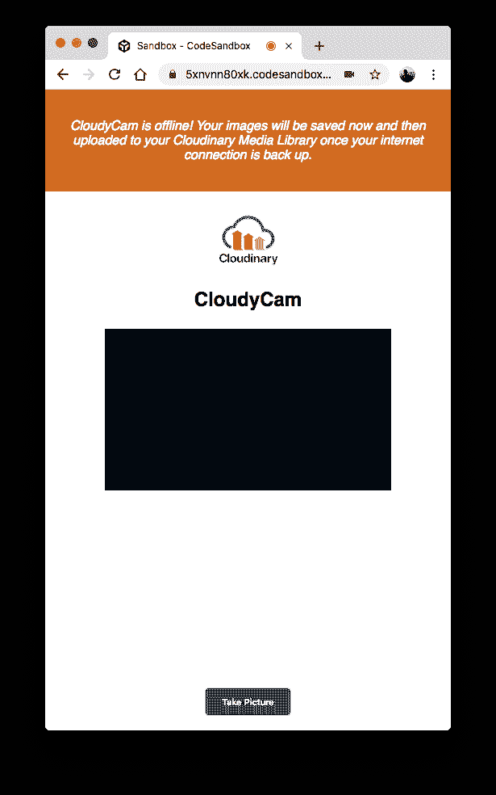](https://res.cloudinary.com/practicaldev/image/fetch/s--uBZ6Vk95--/c_limit%2Cf_auto%2Cfl_progressive%2Cq_auto%2Cw_880/https://d2mxuefqeaa7sj.cloudfront.net/s_CB1529C18383F5548EDF13217A823CEEA09EC3BDFA57AD577E213213DCE5B3F4_1536451883113_Screen%2BShot%2B2018-09-09%2Bat%2B12.07.34%2BAM.png)

[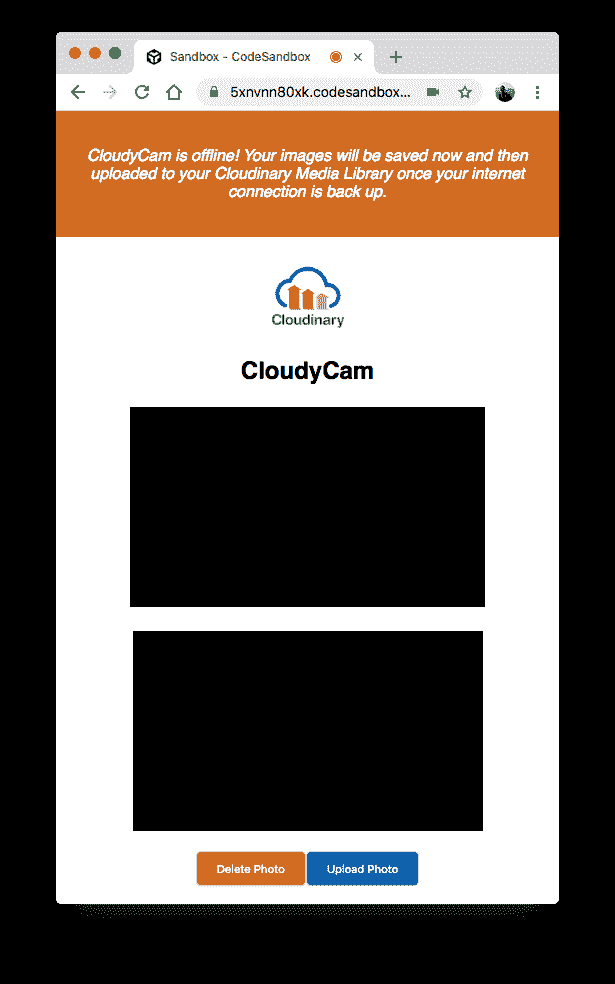](https://res.cloudinary.com/practicaldev/image/fetch/s--bMy0CQ5b--/c_limit%2Cf_auto%2Cfl_progressive%2Cq_auto%2Cw_880/https://d2mxuefqeaa7sj.cloudfront.net/s_CB1529C18383F5548EDF13217A823CEEA09EC3BDFA57AD577E213213DCE5B3F4_1536451883117_Screen%2BShot%2B2018-09-09%2Bat%2B12.07.38%2BAM.png)
[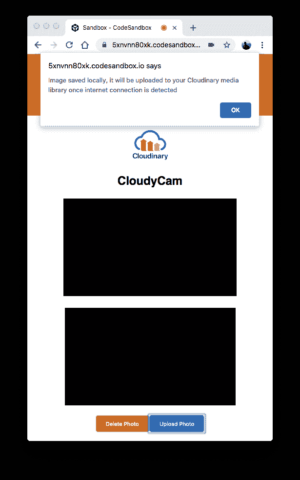T6】](https://res.cloudinary.com/practicaldev/image/fetch/s--qCGXYXmg--/c_limit%2Cf_auto%2Cfl_progressive%2Cq_auto%2Cw_880/https://d2mxuefqeaa7sj.cloudfront.net/s_CB1529C18383F5548EDF13217A823CEEA09EC3BDFA57AD577E213213DCE5B3F4_1536451883121_Screen%2BShot%2B2018-09-09%2Bat%2B12.07.48%2BAM.png)

**访问上传的图像**
要访问所有上传的图像，请前往您的 [Cloudinary 媒体库](https://cloudinary.com/console/media_library):

[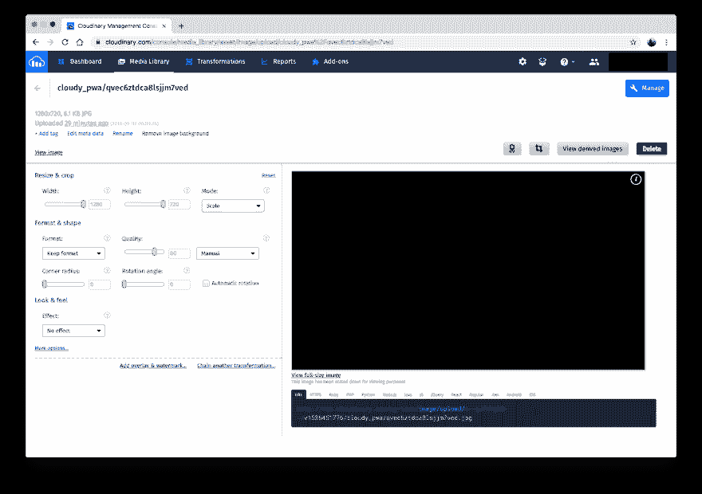T2】](https://res.cloudinary.com/practicaldev/image/fetch/s--Gw4p4Jtl--/c_limit%2Cf_auto%2Cfl_progressive%2Cq_auto%2Cw_880/https://d2mxuefqeaa7sj.cloudfront.net/s_CB1529C18383F5548EDF13217A823CEEA09EC3BDFA57AD577E213213DCE5B3F4_1536453623753_Screen%2BShot%2B2018-09-09%2Bat%2B12.39.08%2BAM.png)

你可以随心所欲地在你的应用中使用这些图片。关于 Cloudinary 现有用法的 [Cloudinary 文档](https://cloudinary.com/documentation)是一个方便的参考。

**创建生产版本**
为了向用户提供您的应用，首先编辑 CloudyCam 清单，如下所示:

```
 #  public/manifest.json  {  "short_name":  "CloudyCam",  "name":  "Clodinary Offline PWA Camera",  "icons":  [  {  "src":  "favicon.ico",  "sizes":  "512x512 192x192 64x64 32x32 24x24 16x16",  "type":  "image/x-icon"  }  ],  "start_url":  "./index.html",  "display":  "standalone",  "theme_color":  "#000000",  "background_color":  "#ffffff"  } 
```

Enter fullscreen mode Exit fullscreen mode

回想一下，`index.js`文件包含这一行代码:

```
 registerServiceWorker(); 
```

Enter fullscreen mode Exit fullscreen mode

它创建了一个服务工作者，缓存应用程序的各种资产和部分，以便即使用户离线或互联网连接不良，他们仍可以与 CloudyCam 交互并使用它。

通过运行以下命令创建生产版本:

```
 yarn build # or npm run build 
```

Enter fullscreen mode Exit fullscreen mode

然后 Yarn 为你的应用创建一个优化的产品版本，并把它放在`build`目录中，为你的用户做好准备。

通过运行这两个命令:
，使用`serve` JavaScript 包服务于生产构建

```
 yarn global add serve # or npm install -g serve
    serve -s build 
```

Enter fullscreen mode Exit fullscreen mode

之后，Yarn 在`http://localhost:5000`上创建了一个简单的静态服务器。导航到应用程序生产版本的 URL。

请注意，谷歌 Chrome 的开发者控制台上有一个由 [Lighthouse](https://developers.google.com/web/tools/lighthouse/) 驱动的面板，可以让你验证网页的质量。单击开发人员控制台的**审计**选项卡，对生产构建运行审计。然后显示结果:

[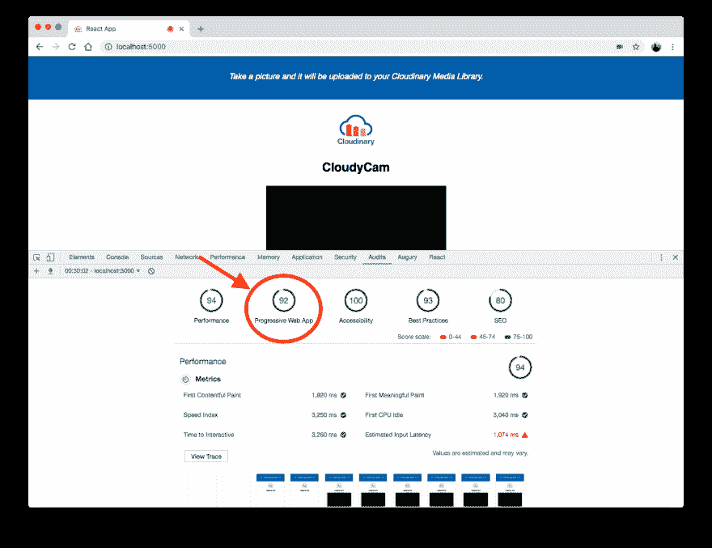T2】](https://res.cloudinary.com/practicaldev/image/fetch/s--4IYr0zkU--/c_limit%2Cf_auto%2Cfl_progressive%2Cq_auto%2Cw_880/https://d2mxuefqeaa7sj.cloudfront.net/s_CB1529C18383F5548EDF13217A823CEEA09EC3BDFA57AD577E213213DCE5B3F4_1536453175757_Screen%2BShot%2B2018-09-09%2Bat%2B12.30.31%2BAM.png)

[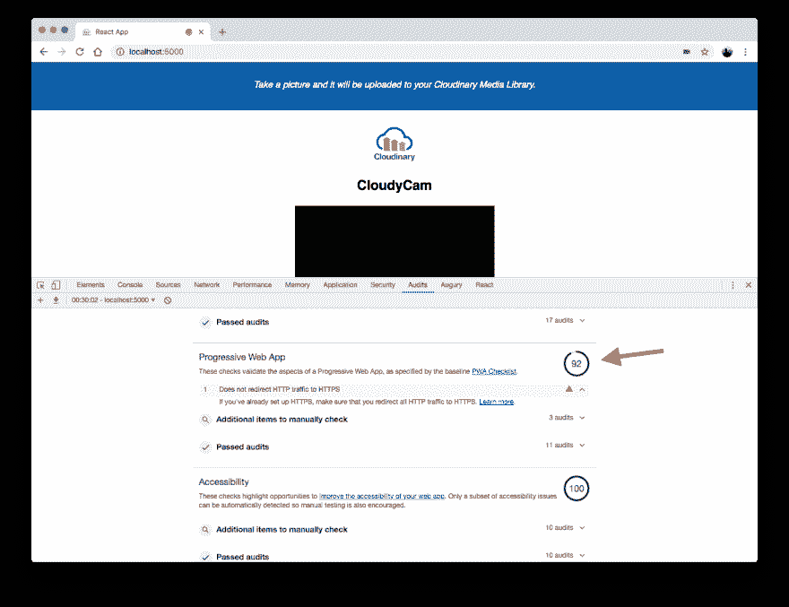T2】](https://res.cloudinary.com/practicaldev/image/fetch/s--vGj-ORKq--/c_limit%2Cf_auto%2Cfl_progressive%2Cq_auto%2Cw_880/https://d2mxuefqeaa7sj.cloudfront.net/s_CB1529C18383F5548EDF13217A823CEEA09EC3BDFA57AD577E213213DCE5B3F4_1536453175770_Screen%2BShot%2B2018-09-09%2Bat%2B12.30.41%2BAM.png)

在这里，CloudyCam 显示为 100% PWA 应用程序，尽管分数为 92。剩下的 8%将在您的生产服务器为所有应用流量运行 HTTPS 时实现。

## 继续前进

您现在已经了解了如何使用 React 和 Cloudinary 构建一个简单的 PWA 相机应用程序。有关代码的详细信息，请参见 [GitHub](https://github.com/oreHGA/cl-react-pwa) 资源库。

请随意使用这里解释的概念来构建其他应用程序。Cloudinary 提供了一系列出色的功能，使 web 和移动应用程序中的图像和视频管理变得直观、无缝和快速。做[检查](https://cloudinary.com/solutions) [出来](https://cloudinary.com/solutions)。黑客快乐！