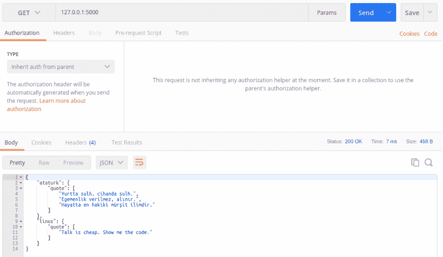
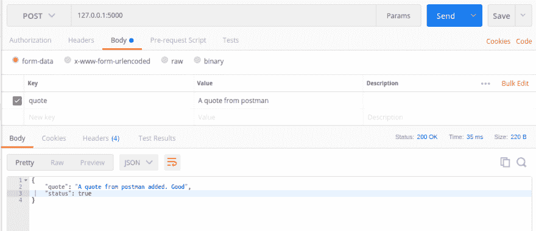
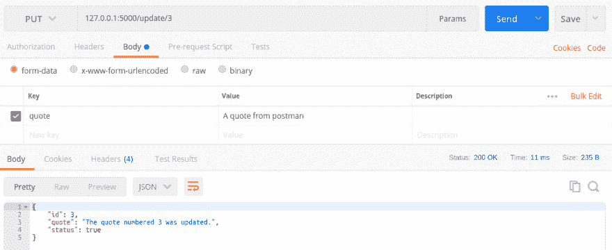

# 用 Flask-RESTful 构建基本的 RESTful API

> 原文：<https://dev.to/aligoren/building-basic-restful-api-with-flask-restful-57oh>

[T2】](https://res.cloudinary.com/practicaldev/image/fetch/s--oWHuIjOQ--/c_limit%2Cf_auto%2Cfl_progressive%2Cq_auto%2Cw_880/https://thepracticaldev.s3.amazonaws.com/i/308nhtj1smmx0sn1ebui.png)

[这篇文章最初发表在我的博客上](https://aligoren.com/building-basic-restful-api-with-flask/)

你好。在这篇文章中，我将谈论用 Flask 框架构建基本的 RESTful API。在开始之前，我们将安装 Flask RESTful 库。在这个例子中不会使用任何数据库。但是你可以用你自己的。我将展示如何用 Flask 创建 Rest API。

## 用 Flask 构建基本的 RestFul API

我们可能需要 [Postman](https://www.getpostman.com/) 或类似的软件来请求。我们将使用 virtualenv 来使用开发环境。好了，让我们安装 flask-restful 库。

```
virtualenv .

. bin/activate 
```

我们激活了虚拟人。让我们安装 flask-restful 库。

```
pip install flask-restful 
```

现在，我们安装了 flask-restful 库。我们需要创建一个名为 **main.py** 的文件。它的名字可以是任何东西。我们将首先导入 **flask** 及其 **flask_restful** 库。

```
from flask import Flask
from flask_restful import Resource, Api

app = Flask(__name__)
api = Api(app) 
```

之后，我们将创建一个简单的类。它会这样:

```
class Quotes(Resource):
    def get(self):
        return {
            'ataturk': {
                'quote': ['Yurtta sulh, cihanda sulh.', 
                    'Egemenlik verilmez, alınır.', 
                    'Hayatta en hakiki mürşit ilimdir.']
            },
            'linus': {
                'quote': ['Talk is cheap. Show me the code.']
            }

        } 
```

在这个例子中，我们使用静态数据。如我所说，你可以使用你自己的数据库。现在我们需要将这个类作为资源添加到 API 库包装器中。

```
api.add_resource(Quotes, '/') 
```

最后，我们的代码应该是这样的:

```
# -*- coding: utf-8 -*- 
from flask import Flask
from flask_restful import Resource, Api

app = Flask(__name__)
api = Api(app)

class Quotes(Resource):
    def get(self):
        return {
            'ataturk': {
                'quote': ['Yurtta sulh, cihanda sulh.', 
                    'Egemenlik verilmez, alınır.', 
                    'Hayatta en hakiki mürşit ilimdir.']
            },
            'linus': {
                'quote': ['Talk is cheap. Show me the code.']
            }

        }

api.add_resource(Quotes, '/')

if __name__ == '__main__':
    app.run(debug=True) 
```

在上面的代码中，我们为 HTTP get 请求创建了一个名为 Get 的方法。我们试着联系了邮递员

[T2】](https://res.cloudinary.com/practicaldev/image/fetch/s--KRJbYFr5--/c_limit%2Cf_auto%2Cfl_progressive%2Cq_auto%2Cw_880/https://thepracticaldev.s3.amazonaws.com/i/9uttstif5hzgmqcfo75q.png)

当您尝试未实现的 HTTP 请求时，您会看到如下警告消息:

```
{  "message":  "The method is not allowed for the requested URL."  } 
```

## 发布方法

例如，您想要处理该类的 post 请求。您必须创建一个名为 **post** 的方法。让我们为 HTTP post 请求创建一个 Post 方法。首先，我们需要导入 reqparse。因此，我们的导入语句将发生如下变化:

```
from flask import Flask
from flask_restful import Resource, Api, reqparse

app = Flask(__name__)
api = Api(app)

parser = reqparse.RequestParser() 
```

之后，我们的 post 方法会是这样的:

```
def post(self):
        parser.add_argument('quote', type=str)
        args = parser.parse_args()

        return {
            'status': True,
            'quote': '{} added. Good'.format(args['quote'])
        } 
```

让我们用邮递员尝试一个简单的 HTTP Post 请求:

[T2】](https://res.cloudinary.com/practicaldev/image/fetch/s--PkrXOY3D--/c_limit%2Cf_auto%2Cfl_progressive%2Cq_auto%2Cw_880/https://thepracticaldev.s3.amazonaws.com/i/wrhocz6jvjdpwknavbqg.png)

## 放法

让我们创建一个 PUT 方法来更新资源。我们的 put 方法将是这样的:

```
def put(self, id):
        parser.add_argument('quote', type=str)
        args = parser.parse_args()

        return {
            'id': id,
            'status': True,
            'quote': 'The quote numbered {} was updated.'.format(id)
        } 
```

之后，我们需要像这样改变我们的资源:

```
api.add_resource(Quotes, '/', '/update/<int:id>') 
```

感谢邮递员，我们创建了一个 HTTP Put 请求。

[T2】](https://res.cloudinary.com/practicaldev/image/fetch/s--rwe6lzzK--/c_limit%2Cf_auto%2Cfl_progressive%2Cq_auto%2Cw_880/https://thepracticaldev.s3.amazonaws.com/i/0ohbzpqvqgkc50j6itmo.png)

如果你想问 PUT vs POST，你可以查看这个[链接](https://restfulapi.net/rest-put-vs-post/)。我们可以创建一个删除方法。在这篇文章中，我不会创建 HTTP Delete 方法。感谢这个[链接](https://flask-restful.readthedocs.io/en/latest/)，你可以访问关于 Flask-RESTful 的更多细节。

在这篇文章中，我们讨论了用 Flask 构建基本的 RestFul API。我希望这篇文章能帮助你设计出优秀的 RESTful API。

感谢您的阅读。