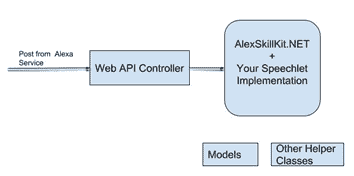
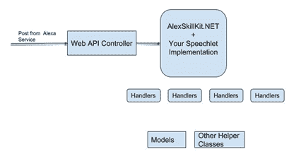

# 为 Alexa - 3 构建-构建您的代码

> 原文：<https://dev.to/anandmukundan/building-for-alexa-ndash-3-ndash-structuring-your-code-4i8j>

在这篇文章中，我想讨论一下在开发技能处理后端时，我喜欢如何组织我的代码。如前所述，该处理程序基于 ASP.NET WebAPI 项目模板，该模板基于 MVC。开箱后的结构如下所示:

[](http://manand.typepad.com/.a/6a00d83451a61969e2022ad38e45df200d-pi) 我喜欢以一种我认为更易于维护和调试的方式来组织意图处理代码。再次强调，这只是我个人的方法，并不以任何方式受 MVC 或其他模式的支配。

AlexaSKillKit.net GitHub 页面有一个入门部分，可以带你进入上面的结构和一个工作技能处理后端。

因此，如果您遵循这种结构，您将拥有一个基本的 Speechlet 类，它处理您的所有意图并向控制器返回一个 speech let 响应。该控制器是非常轻量级的，只包含接收 POST 并返回的代码，在将它转换为 API 响应(HTTPResponseMessage)后，返回 Speechlet 实现返回的内容。

因为所有意图都在单个 speechlet 实现类中，所以我更喜欢为每个意图创建单独的处理程序。我通常会声明一个 IHandler 接口，它包含了一个如下所示的方法:

```
public virtual SpeechletResponse handleIntent(IntentRequest request, Session session, 
Context context, Dictionary<string, string> options=null) 
```

Enter fullscreen mode Exit fullscreen mode

因此，对于每一类意图(并不总是每一个意图，但在很多情况下，最终都是这样)，都有一个处理程序。然后，Speechlet 实现根据收到的意图移交给处理程序。

所以我们的结构变成了这样:

[](http://manand.typepad.com/.a/6a00d83451a61969e2022ad38e45e5200d-pi) 这有一些好处。因为处理程序逻辑被分离出来，所以维护和调试这段代码更容易，而不是所有东西都在一个大类中。另外，当你以后想做像国际奥委会这样的事情时，这种结构将有助于实现这一目标。

我也更喜欢有一组服务网关类，将我们的处理程序链接到您可能最终调用的实际业务服务。基于您的业务，这些可以是 SOAP 或 REST，但是大多数技能最终会调用某种业务服务。因此，拥有一个网关模式实现将使这些接口的未来扩展和管理变得更加容易。