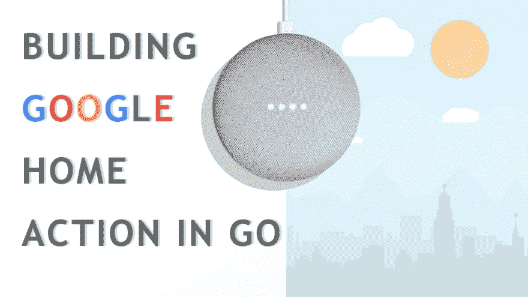

# 用 Go 构建 Google Home 动作

> 原文：<https://dev.to/plutov/building-google-home-action-with-go-4o4c>

[T2】](https://res.cloudinary.com/practicaldev/image/fetch/s--esRWOXYP--/c_limit%2Cf_auto%2Cfl_progressive%2Cq_auto%2Cw_880/https://thepracticaldev.s3.amazonaws.com/i/w9juaw9a2tcmppl56c2o.jpg)

### Google Home

这是这个视频的文字版: [packagemain #10:在 Go 中构建 Google Home 动作](https://youtu.be/LeGuJo7QBbI)。

Google Home 是一个语音助手，类似于亚马逊 Alexa，但与谷歌服务合作。它有很多内置的集成，但是对我们开发者来说有趣的是我们可以为它建立我们的程序。谷歌称之为行动。

我们将构建一个动作，它将帮助用户找到用户所在城市的空气质量指数。不一定要有 Google Home 设备才能构建和测试它，Google 有非常好的模拟器。

Google Home Actions 正在使用 DialogFlow(之前称为 api.ai)来设置使用 NLU 的对话流。我们将构建一个简单的后端 API 来获取数据，我们将把它部署到 Google Cloud。

### 安静

我们必须用我们的谷歌账户登录到 https://dialogflow.com。转到控制台并创建您的第一个项目。你可以选择使用现有的谷歌云项目或创建一个新的。

我们将使用 DialogFlow API V1，V2 在请求/响应格式方面略有不同。

现在我们来决定未来的用户流量。

有两种方法开始与我们的动作对话:显式调用和隐式调用。当我们告诉谷歌“与”交谈时，就会触发显性的一个。在隐式调用中，我们可以设置自定义消息，但是对于我们的演示程序，我们将跳过这个选项。基本上，你需要创造一个意图，并描述用户可能会说的句子。

我们需要知道用户的位置来获取信息，所以首先我们需要请求这个许可。Google Action 具有请求位置许可的功能。我们需要在用户开始对话后向 DialogFlow 发送特定的响应。

让我们用欢迎的意图来定义它。我们需要设置动作名`location_permission`，然后在我们的 webhook 中检查它。我们还需要`Enable webhook call for this intent`。

让我们用默认回退消息来描述我们的回退意图。当动作不理解用户想要什么时，这个意图将被执行。

`Sorry, I can't help you with this right now. Please try later.`。将意图设置为对话结束。

现在让我们定义一下获得空气质量的主要意图。这个意图不是由特定的单词触发，而是由预留事件触发:`actions_intent_PERMISSION`。因此，当用户被授权访问位置信息，这个意图将被执行。我们将动作名设置为`get`，稍后将在 API 中处理它。我们还需要为此启用 webhook 调用。结束谈话。

好了，我们差不多完成了配置，让我们定义一下 Google Action 将如何获取数据。

去实现。编写后端逻辑有两种选择:使用自定义 webhook 或使用 Firebase 上云功能支持的内嵌编辑器，但它是 node.js，所以我们将使用第一种方法，并为部署到 Google Cloud 的 API 提供端点。

### API

您应该已经安装了 Google Cloud project 和`gcloud` SDK，因此我们可以编写`app.yaml`文件来描述处理程序和运行时:

```
runtime: go
api_version: go1

handlers:
- url: /
  script: _go_app 
```

Dialogflow 将向 1 个端点发送 2 个不同的请求:1 个针对`location_permission`结果，2 个针对`get`结果。

```
package  app  import  (  "fmt"  "net/http"  )  func  init()  {  http.HandleFunc("/",  handle)  }  func  handle(w  http.ResponseWriter,  r  *http.Request)  {  dfReq  :=  DialogFlowRequest{}  dfErr  :=  json.NewDecoder(r.Body).Decode(&dfReq)  if  dfErr  ==  nil  &&  dfReq.Result.Action  ==  "location_permission"  {  handleLocationPermissionAction(w,  r,  dfReq)  return  }  if  dfErr  ==  nil  &&  dfReq.Result.Action  ==  "get"  {  handleGetAction(w,  r,  dfReq)  return  }  json.NewEncoder(w).Encode(DialogFlowResponse{  Speech:  unknownErrMsg,  })  } 
```

### 请求位置许可

在`handleLocationPermissionAction`中，我们需要发回一个具体的回复，告诉 Dialogflow 请求`DEVICE_PRECISE_LOCATION`的许可。我们设置了一条问题信息，告诉用户我们为什么需要位置。

```
func  handleLocationPermissionAction(w  http.ResponseWriter,  r  *http.Request,  dfReq  DialogFlowRequest)  {  json.NewEncoder(w).Encode(DialogFlowLocationResponse{  Speech:  "PLACEHOLDER_FOR_PERMISSION",  Data:  DialogFlowResponseData{  Google:  DialogFlowResponseGoogle{  ExpectUserResponse:  true,  IsSsml:  false,  SystemIntent:  DialogFlowResponseSystemIntent{  Intent:  "actions.intent.PERMISSION",  Data:  DialogFlowResponseSystemIntentData{  Type:  "type.googleapis.com/google.actions.v2.PermissionValueSpec",  OptContext:  "To get city for air quality check",  Permissions:  []string{"DEVICE_PRECISE_LOCATION"},  },  },  },  },  })  } 
```

### 得到结果

当用户回答可以检查位置时，dialogflow 将在`get`操作中向我们发送坐标，因此我们可以使用它来检查空气质量指数。

```
func  handleGetAction(w  http.ResponseWriter,  r  *http.Request,  dfReq  DialogFlowRequest)  {  lat  :=  dfReq.OriginalRequest.Data.Device.Location.Coordinates.Lat  long  :=  dfReq.OriginalRequest.Data.Device.Location.Coordinates.Long  if  lat  ==  0  ||  long  ==  0  {  json.NewEncoder(w).Encode(DialogFlowResponse{  Speech:  unknownErrMsg,  })  return  }  index,  levelDescription,  aqiErr  :=  getAirQualityByCoordinates(r,  lat,  long)  if  aqiErr  !=  nil  {  json.NewEncoder(w).Encode(DialogFlowResponse{  Speech:  apiErrMsg,  })  return  }  json.NewEncoder(w).Encode(DialogFlowResponse{  Speech:  fmt.Sprintf("The air quality index in your city is %d right now. %s",  index,  levelDescription),  })  } 
```

最后，让我们部署我们的应用程序:

```
gcloud app deploy 
```

如果一切正常，这个命令将给出我们应该添加到 Fulfillment 部分的端点。

### 用模拟器测试一下

现在是时候试试我说的这个不错的模拟器了。转到集成->助手，设置欢迎意图，然后单击测试。

模拟器可以使用键盘输入，也可以使用语音输入。目前，我们的操作只有我们可以访问，要将其公开，我们需要提交它进行验证。

类型`Talk to my test app`。

*   是的。
*   利润！

如果你的谷歌家庭设备使用相同的谷歌账户，我们也可以在那里测试。

我将把这个应用程序发送给 Google review，因为我发现这个空气质量信息对我来说非常必要，因为我住在亚洲。

[GitHub 上该程序的完整代码](https://github.com/plutov/packagemain/tree/master/10-ghome-aqi)