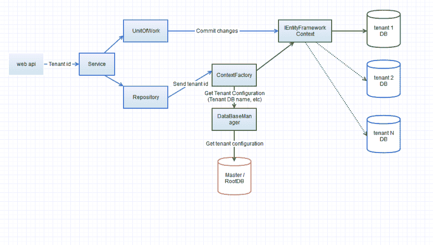
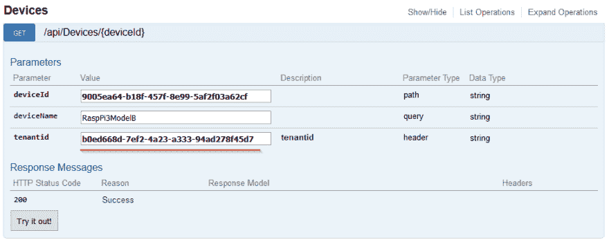

# 使用. net core 和最佳实践构建多租户 Web API(教程)

> 原文：<https://dev.to/boriszn/building-multi-tenant-web-api-using-dot-net-core-and-best-practices-tutorial-4m8h>

为了取得成功并处理越来越多的客户和合作伙伴，业务需要增长，如果一家公司没有准备好应对这一负载，那么机会就有可能被错过。这给游戏带来了可伸缩性的话题，作为公司应该解决的主要需求之一。因为解决这一需求的可能方法之一是构建多租户解决方案。随着这个话题变得越来越重要，有很多选择可以实现这一点，例如使用微软的弹性数据库(弹性工具)。然而在特殊的情况下，比如我在项目中遇到的情况，并不是所有的产品需求都可以用现有的选项来满足。这让我想到了收集我在这个话题上的经验并在下面展示出来。

众所周知，有两种主要方法来解决应用程序扩展问题——水平和垂直。水平扩展将为您带来动态扩展的好处，并意味着处理多个数据库，因为每个租户都有自己的数据库/碎片。纵向扩展方法假设有一个数据库为多个租户服务。

在我的文章中，我将通过如何构建多租户 web API 应用程序的分步指南来解决水平伸缩的方法。

如果您想更新多租户架构的某些方面，或者它有哪些优点和缺点

我建议您访问以下资源:

*   为什么云架构很重要:多实例相对于多租户的优势
*   为什么多租户应用架构在 2017 年至关重要
*   多租户 SaaS 应用和 Azure SQL 数据库的设计模式

## 建筑

我们先简单看一下架构。以下示例是基于 N-tire 设计的

体系结构，具有以下几层:

*   表示层或 web api
*   将容纳所有业务逻辑的服务层
*   使用 UnitOfWork 和存储库模式实现的数据访问层。作为这个例子中的 ORM，我使用了实体框架核心。

租户分离的关键组件是 ContextFactory，它包含从 HTTP 头获取租户 id、使用 DataBaseManager 检索租户数据库名称以及替换连接字符串中的数据库名称的逻辑。结果，创建了数据库上下文(实体框架上下文)。

下图演示了这种体系结构。

[T2】](https://res.cloudinary.com/practicaldev/image/fetch/s--ApKbMjF8--/c_limit%2Cf_auto%2Cfl_progressive%2Cq_auto%2Cw_880/https://cdn-images-1.medium.com/max/1000/1%2Ax3t-q0vFTY8L3Rn4J0pSAQ.png)

履行

如你所见，架构在这里并不复杂，浏览一下，我建议
关注实现它的步骤。

**1。创建上下文工厂**

正如我之前提到的，工厂是整个架构的关键组成部分。它构建特定于租户数据库
的实体框架上下文(在当前示例中为 DeviceApiContext)

```
/// <summary>
/// Entity Framework context service
/// (Switches the db context according to tenant id field)
/// </summary>
/// <seealso cref="IContextFactory" />
public class ContextFactory : IContextFactory
{
    private const string TenantIdFieldName = "tenantid";
    private const string DatabaseFieldKeyword = "Database";
    private readonly HttpContext httpContext;
    private readonly IOptions<ConnectionSettings> settings;
    private readonly IDataBaseManager dataBaseManager;
    public ContextFactory(
        IHttpContextAccessor httpContentAccessor,
        IOptions<ConnectionSettings> connectionSetting,
        IDataBaseManager dataBaseManager)
    {
        this.httpContext = httpContentAccessor.HttpContext;
        this.settings = connectionSetting;
        this.dataBaseManager = dataBaseManager;
    }

    public IDbContext DbContext
    {
        get
        {
        var dbOptionsBuidler = this.ChangeDatabaseNameInConnectionString();
        // Add new (changed) database name to db options
        var bbContextOptionsBuilder = new DbContextOptionsBuilder<TeleServiceApiContext>();
        bbContextOptionsBuilder.UseSqlServer(dbOptionsBuidler.ConnectionString);
        return new DevicesApiContext(bbContextOptionsBuilder.Options);
        }
    }

    // Gets tenant id from HTTP header
    private string TenantId
    {
        get
        {
        if (this.httpContext == null)
        {
            throw new ArgumentNullException(nameof(this.httpContext));
        }
        string tenantId = this.httpContext.Request.Headers[TenantIdFieldName].ToString();
        if (tenantId == null)
        {
            throw new ArgumentNullException(nameof(tenantId));
        }
        return tenantId;
        }
    }

    private SqlConnectionStringBuilder ChangeDatabaseNameInConnectionString()
    {
        var sqlConnectionBuilder = new SqlConnectionStringBuilder(this.settings.Value.DefaultConnection);
        string dataBaseName = this.dataBaseManager.GetDataBaseName(this.TenantId);
        if (dataBaseName == null)
        {
        throw new ArgumentNullException(nameof(dataBaseName));
        }
        // Remove old DataBase name from connection string AND add new one
        sqlConnectionBuilder.Remove(DatabaseFieldKeyword);
        sqlConnectionBuilder.Add(DatabaseFieldKeyword, dataBaseName);
        return sqlConnectionBuilder;
    }
} 
```

此处提供[的 ContextFactory 源代码](https://github.com/Boriszn/DeviceManager.Api/blob/master/src/DeviceManager.Api/Data/Management/ContextFactory.cs)

**2。添加数据库管理器**

数据库管理器协调所有租户元数据，如租户数据库名称、激活

租户的状态(激活/停用)和其他属性的集合。为了演示一个基本原理，我在当前的解决方案中使用了 dictionary。稍后，字典应该被更合适的解决方案所取代，比如包含租户元数据的 SQL 或 NoSQL 数据库。这个想法类似于微软弹性工具中使用的分片地图管理器。租户元数据还可以包括存储数据库名称的字段、激活/停用租户的选项，甚至是基于 CSS/SASS/LESS 文件的前端应用的租户样式等等

```
/// <summary>
/// Contains all tenants database mappings and options
/// </summary>
public class DataBaseManager : IDataBaseManager
{
    /// <summary>
    /// IMPORTANT NOTICE: The solution uses simple dictionary for demo purposes.
    /// The Best "Real-life" solutions would be creating 'RootDataBase' with 
    /// all Tenants Parameters/Options like: TenantName, DatabaseName, other configuration.
    /// </summary>
    private readonly Dictionary<Guid, string> tenantConfigurationDictionary = new Dictionary<Guid, string>
    {
        {
            Guid.Parse("b0ed668d-7ef2-4a23-a333-94ad278f45d7"), "DeviceDb"
        },
        {
            Guid.Parse("e7e73238-662f-4da2-b3a5-89f4abb87969"), "DeviceDb-ten2"
        }
    };
    /// <summary>
    /// Gets the name of the data base.
    /// </summary>
    /// <param name="tenantId">The tenant identifier.</param>
    /// <returns>db name</returns>
    public string GetDataBaseName(string tenantId)
    {
        var dataBaseName = this.tenantConfigurationDictionary[Guid.Parse(tenantId)];
        if (dataBaseName == null)
        {
            throw new ArgumentNullException(nameof(dataBaseName));
        }
        return dataBaseName;
    }
} 
```

`DataBaseManager`的源代码可在[这里](https://github.com/Boriszn/DeviceManager.Api/blob/master/src/DeviceManager.Api/Data/Management/DataBaseManager.cs)

**3。添加工作单元类(包含提交到特定上下文的方法)**

UnitOfWork 解决了两个任务。它提交实体框架在实体中所做的所有更改，并处理特定的上下文。

```
/// <summary>
/// The Entity Framework implementation of UnitOfWork
/// </summary>
public sealed class UnitOfWork : IUnitOfWork
{
    /// <summary>
    /// The DbContext
    /// </summary>
    private IDbContext dbContext;
    /// <summary>
    /// Initializes a new instance of the <see cref="UnitOfWork"/> class.
    /// </summary>
    /// <param name="context">The object context</param>
    public UnitOfWork(IDbContext context)
    {
         this.dbContext = context;
    }
    /// <summary>
    /// Saves all pending changes
    /// </summary>
    /// <returns>The number of objects in an Added, Modified, or Deleted state</returns>
    public int Commit()
    {
        // Save changes with the default options
        return this.dbContext.SaveChanges();
    }
    /// <inheritdoc/>
    public int Commit(IDbContext context)
    {
        // Change context
        this.dbContext = context;
        // Save changes with the default options
        return this.dbContext.SaveChanges();
    }
    /// <summary>
    /// Disposes the current object
    /// </summary>
    public void Dispose()
    {
        this.Dispose(true);
        GC.SuppressFinalize(obj: this);
    }
    /// <summary>
    /// Disposes all external resources.
    /// </summary>
    /// <param name="disposing">The dispose indicator.</param>
    private void Dispose(bool disposing)
    {
        if (disposing)
        {
            if (this.dbContext != null)
            {
                this.dbContext.Dispose();
                this.dbContext = null;
            }
        }
    }
} 
```

UnitOfWork 的源代码在这里[可用](https://github.com/Boriszn/DeviceManager.Api/blob/master/src/DeviceManager.Api/Data/Management/UnitOfWork.cs)

**4。添加通用存储库类。**

存储库将在 EF 实体中进行更改，工作单元将向租户数据库提交更改。请注意，EF 使用[跟踪机制在内存中进行更改。](https://docs.microsoft.com/en-us/ef/core/querying/tracking)

```
/// <summary>
/// Generic repository, contains CRUD operation of EF entity
/// </summary>
/// <typeparam name="T">Entity type</typeparam>
public class Repository<T> : IRepository<T>
    where T : class
{
    /// <summary>
    /// Used to query and save instances of
    /// </summary>
    private readonly DbSet<T> dbSet;
    /// <summary>
    /// Gets the EF context.
    /// </summary>
    /// <value>
    /// The context.
    /// </value>
    public IDbContext Context { get; }
    /// <summary>
    /// Initializes a new instance of the <see cref="Repository{T}" /> class.
    /// </summary>
    /// <param name="contextFactory">The context service.</param>
    public Repository(IContextFactory contextFactory)
    {
        this.Context = contextFactory.DbContext;
        this.dbSet = this.Context.Set<T>();
    }
    /// <inheritdoc />
    public void Add(T entity)
    {
        return this.dbSet.Add(entity);
    }
    /// <inheritdoc />
    public T Get<TKey>(TKey id)
    {
        return this.dbSet.Find(id);
    }
    /// <inheritdoc />
    public async Task<T> GetAsync<TKey>(TKey id)
    {
        return await this.dbSet.FindAsync(id);
    }
    /// <inheritdoc />
    public T Get(params object[] keyValues)
    {
        return this.dbSet.Find(keyValues);
    }
    /// <inheritdoc />
    public IQueryable<T> FindBy(Expression<Func<T, bool>> predicate)
    {
        return this.dbSet.Where(predicate);
    }
    /// <inheritdoc />
    public IQueryable<T> FindBy(Expression<Func<T, bool>> predicate, string include)
    {
        return this.FindBy(predicate).Include(include);
    }
    /// <inheritdoc />
    public IQueryable<T> GetAll()
    {
        return this.dbSet;
    }
    /// <inheritdoc />
    public IQueryable<T> GetAll(string include)
    {
        return this.dbSet.Include(include);
    }
    /// <inheritdoc />
    public bool Exists(Expression<Func<T, bool>> predicate)
    {
        return this.dbSet.Any(predicate);
    }
    /// <inheritdoc />
    public void Delete(T entity)
    {
        return this.dbSet.Remove(entity);
    }
    /// <inheritdoc />
    public void Update(T entity)
    {
        return this.dbSet.Update(entity);
    }
} 
```

此处提供了库的源代码

**5。添加租户标题操作过滤器。**

TenantHeaderOperationFilter 类将向所有 API 调用添加租户 id 字段(作为 HTTP 头)。在使用 auth0.com 服务的解决方案中，可以将身份服务器或租户注入 JWT 令牌。

```
/// <summary>
/// Adds Tenant Id field to API endpoints
/// </summary>
/// <seealso cref="Swashbuckle.AspNetCore.SwaggerGen.IOperationFilter" />
public class TenantHeaderOperationFilter : IOperationFilter
{
    /// <summary>
    /// Applies the specified operation.
    /// </summary>
    /// <param name="operation">The operation.</param>
    /// <param name="context">The context.</param>
    public void Apply(Operation operation, OperationFilterContext context)
    {
        if (operation.Parameters == null)
        {
            operation.Parameters = new List<IParameter>();
        }
        operation.Parameters.Add(new NonBodyParameter
        {
            Name = "tenantid",
            In = "header",
            Description = "tenantid",
            Required = true,
            Type = "string",
        });
    }
} 
```

这是应用过滤器后 API 的外观。

[T2】](https://res.cloudinary.com/practicaldev/image/fetch/s--7j4gq4XH--/c_limit%2Cf_auto%2Cfl_progressive%2Cq_auto%2Cw_880/https://cdn-images-1.medium.com/max/1000/1%2A2Lw0-R7Zn-_s7rzDcIejkg.png)

服务类(DeviceService.cs)的当前示例包含按 id 检索设备和为特定租户添加新设备的功能。此处提供[服务层的源代码](https://github.com/Boriszn/DeviceManager.Api/blob/master/src/DeviceManager.Api/Services/DeviceService.cs)

结论

在这篇文章中，我解释了如何构建“随时可用”的多租户解决方案，并给出了如何在您的产品/业务中使用它的一些建议。正如我之前提到的，这个解决方案是现成的，所以它可以作为“样板”项目或部分使用。

源代码

该项目的源代码可在 Git 资源库[这里](https://github.com/Boriszn/DeviceManager.Api)获得