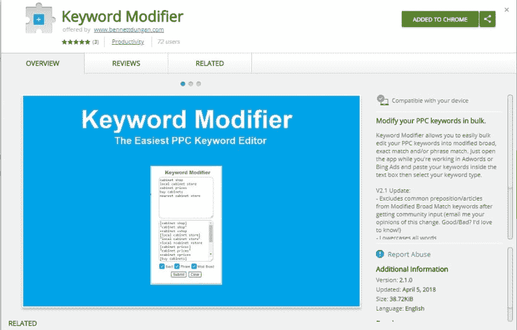

# 用有限的编码知识构建我的第一个应用

> 原文：<https://dev.to/beznet/building-my-first-app-with-limited-coding-knowledge-1p9j>

*原文发表[此处](https://www.bennettdungan.com/2018/06/23/building-my-first-app-the-process/)T3】*

[T2】](https://res.cloudinary.com/practicaldev/image/fetch/s--mHYIW3Ok--/c_limit%2Cf_auto%2Cfl_progressive%2Cq_auto%2Cw_880/https://thepracticaldev.s3.amazonaws.com/i/hbwiwjji3huy3669bon4.jpg)

###### 【weeblytutorials.com】图片来源-图片来源

许多初学者认为，他们需要学习大量的代码，然后才能构建任何有用的东西。我以前也有过这种感觉，我仍然会有那种极度自我怀疑的感觉，但是已经没有以前那么频繁了。我来这里是为了证明你可以用非常有限的编程知识构建一个服务于一个目的的应用。在你决定构建任何东西之前，你必须具备一些甚至与编码无关的先决条件。我将列出我认为最重要的几个:

*   你真的想解决问题，为人们创造出与众不同的东西吗？
*   你能确定你渴望解决的需求或愿望吗？
*   你愿意抛开休闲活动来解决这个问题吗？

我发现最成功的程序员并不是拥有最好编码技能的人，而是真正想有所作为的人。如果你仍然在这些方面挣扎，那么你可能需要重新审视你在这个游戏中的全部原因。

好了，如果你已经回答了上面的 3 个问题，那么我们可以继续了。作为一点背景，我目前在一家营销机构工作，我们使用一个名为 Google Adwords 的程序来设置和部署广告。在不涉及太多令人厌烦的细节的情况下，我们使用这些被称为“关键词”的东西来基本上确定当人们在谷歌上搜索东西时，我们想要向谁显示广告。我们可以对这些关键字做一些修改来改变它们的属性。例如，我可以使用单词“find a plumber”并以 3 种不同的方式更改其属性，如下所示:

`+find a +plumber`

`"find a plumber"`

`[find a plumber]`

我曾经一个接一个地手动调整这些关键词，所以要花很长时间才能完成。我知道肯定有更好的方法，所以我四处搜索，找到了这个很酷的网站，叫做[关键词烤面包机](http://keywordstoaster.worldofsolomon.com/)。这太棒了，因为我现在可以通过复制/粘贴我的大块关键词来节省大量时间，并让这个网站为我转换它们。不过，我发现了一些我认为可以改进的问题:

1.  介词不应该被包括在修饰过的宽泛的关键词中
2.  我宁愿在与 Adwords 相同的窗口中编辑关键字

所以我突然想到，如果我只是做一个 Chrome 扩展来满足这些需求会怎么样？这个应用程序本质上所做的就是获取一个字符串，修改它，然后在输出框中返回修改后的字符串。简单对吗？嗯，算是吧...

 我研究了创建一个 Chrome 扩展需要什么，发现我应该主要使用 Javascript。让我选择 Chrome 扩展的一个原因是:A)我可以在 Adwords 的同一个窗口中使用这个扩展，B)不需要后端/服务器端编码。我很少看到有人向新手建议创建一个 Chrome 扩展，但这是向世界推出我的简单应用程序的最简单、最直接的平台。

好了，我事先掌握了少量的 JS 知识，但我知道我真的需要温习一下基础知识。因此，我参加了一个被强烈推荐的关于 watchandcode.com 的课程，这个课程教会了我这些基本概念:

**1。如何阅读 Javascript**
**2？如何调试**
**3？函数/数组**
**4。基本的 DOM 操作**

该课程主要教你如何在浏览器中创建一个简单的待办事项应用程序。这是完美的，因为 Todo 应用程序所做的只是接受输入并显示输出。仔细想想，这几乎是大多数应用程序最基本的核心功能。所以我做的是把整个课程进行一遍，然后再进行一遍。在课程的第二阶段，我基本上掌握了所教的内容，并将其应用到我试图创建的应用程序的概念中。我能够将教授的 80%的代码用于创建我的应用程序。在这种情况下，唯一真正的区别是改变了输出，这是我用一点正则表达式完成的。

为了现场测试我写的代码，我使用了 glitch.com。对于这种大小的应用程序来说，这使得实时查看我的更改变得非常容易。我不太担心 CSS，所以它看起来很难看，但我所关心的是核心功能。相信我，我说得好像这是一个简单的过程，但即使我使用的大部分代码来自“观察和代码”课程，我也不得不接触不同 Slack 通道上的人，并无数次参考堆栈溢出来寻求帮助。

过了好几个月，我的第一个小应用，关键词修改器，在 Chrome 网上商店诞生了！

 
这里是我最初推出的第一个版本的链接。https://github.com/Beznet/keyword-mod:[。
经过一些重构和增加功能后，它现在变得更整洁了，所以如果你今天下载它](https://github.com/Beznet/keyword-mod)，你会看到它的一些小变化[。](https://chrome.google.com/webstore/detail/keyword-modifier/dhpaponoajbgfahgmcbchndpjbooapog?hl=en)

整篇文章的重点是要证明，如果你有创造和构建的欲望，不管你知道的有多少，它都会带你跨越编码的障碍。

如果你正在读这篇文章，并且正在为你的应用程序的想法而努力，请给我留言！我很乐意谈论你的过程并帮助你。