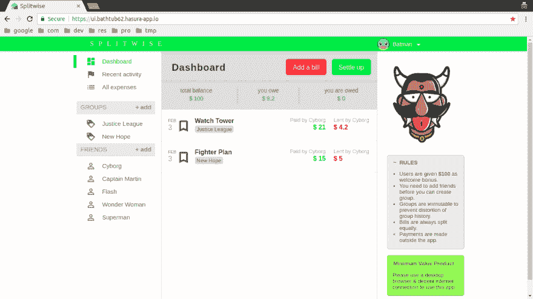

# 打造我的第一个最低价值产品

> 原文：<https://dev.to/rounakpolley/building-my-very-first-minimum-value-product--dn5>

 
关于该项目的更多技术细节: [Hasura Hub 提交](https://hasura.io/hub/project/rounak_polley/Splitwise(MVP))

最小可行产品是新产品的版本，它允许团队以最少的努力收集关于客户的最大量的经验证的知识。而分配给我们的任务是 Splitwise 的 **App 克隆。这个应用程序可以很容易地与朋友和家人分摊账单。它可以让你在一个地方整理你所有的分摊费用和欠条，这样每个人都可以看到他们欠谁的钱。
我们有一个最初的挫折，因为我们的 react-native 开发人员不活跃，只留下了小组中的两个成员，我自己是 ReactJS 开发人员和后端的 Node.js 开发人员。**

因此，作为一名 react 开发人员，我首先检查了原始 web 应用程序的用户界面和功能。我在纸上对页面进行了粗略的设计，然后我决定在 MVP 中包含哪些功能。此外，Hasura 还提供了一些指导原则。接下来，是制定行动计划，包括我们的最后期限、线框和数据库设计。剩下的就是从线框到 MVP 的旅程。

## 本 MVP 的特点

*   用户使用电子邮件、“用户名-密码”注册( *Hasura Auth API* )。
*   用户登录到他们的帐户，并在 **Hasura Auth API** 的帮助下进行身份验证。
*   登录后，用户可以从应用程序上的其他注册用户列表中进行选择，并将他们添加到好友列表中。
*   用户可以通过从他们的朋友列表中选择朋友来创建 5 人组，并可以与组中的其他成员平等地分享/分摊他们的费用。
*   在 **Hasura Filestore API** 的帮助下，还提供添加注释和上传账单附件(图片/pdf)的功能。
*   添加账单后，该群组的所有其他成员都欠用户(在现实世界中支付账单并添加到应用程序中的用户)的钱。
*   账单总是平均分配，并且不能修改群组(即添加更多好友或更改群组名称)，因为这样会使维护群组历史变得更加困难。
*   每个登录用户都与一个随机生成的 **Hasura 认证令牌**相关联，该认证令牌对于每个登录会话都是唯一的，用于在认证 API 中维护重要的用户凭证。
*   对于所有其他目的，我们使用了 **Hasura 数据 API**

## 使用 ReactJS 和 Material-UI 创建 UI

在大多数情况下，我只是坚持使用线框，除了一次我很难并排打开两个对话框，所以我最终将内容合并成一个。我把界面分成了几个部分，这样我可以更好地控制组件。用户界面有两个不同的部分:导航栏(AppBar)和主体的其余部分。登录和注册页面可以互换，唯一的另一个页面是仪表板。仪表板是所有操作发生的地方:添加朋友、群组、账单等。为了添加朋友、组、账单，我使用了三个材质 UI 对话框，为了显示朋友、组、费用历史，我使用了材质 UI 列表和菜单。所有的显示都是动态的，每次用户做一些改变时，api 调用一结束，显示就会在几分之一秒内
更新。我花了一些时间使用 react 生命周期方法来达到同样的效果。

这也是我第一次不得不为我在 github 上的项目写一份详细的描述(自述文件)。而且，这也是我第一次认真地使用*API*。所以，这是很多第一次，我很高兴我能度过难关。

[T2】](https://res.cloudinary.com/practicaldev/image/fetch/s--L6QPeSFZ--/c_limit%2Cf_auto%2Cfl_progressive%2Cq_auto%2Cw_880/https://thepracticaldev.s3.amazonaws.com/i/5ydnrwyrqm7oq844z9i4.png)

## 我们面临的挑战

老实说，如果不困难就没意思了。对我来说，编程真正令人兴奋的是解决这些问题。这项任务在许多方面都具有挑战性...
我们不得不偏离我最初想到的数据库设计。我们必须向表中添加新的列，因为出现了新的情况，例如在`groups`表中，我们添加了`no_of_members`，因为否则我每次处理组时都必须在 ReactJS 中编写更多的代码。
我遇到了一些我无法理解的逻辑错误，在被困了几天之后，我终于去掉了那些部分，并用一种完全不同的方法重新写了一遍。
但是，最大的挑战不是实际实现这些功能，而是与其他团队成员交流。因为，向一个随机的人传达你的想法需要一点耐心，如果不是沟通技巧的话。我们的大部分交流都很顺畅，因为在代码共享、给图片添加评论等方面非常方便。幸运的是，我的队友在 slack 上很积极，所以即使我们面临错误，我们也一起解决了它。

#### 总的来说，这对我来说是一次很棒的学习经历。

对于下一个任务，我们将通过添加更多的功能来扩展 MVP，例如选择用户头像。目前用户头像是从 5 个选项中随机挑选出来的。此外，我计划完善用户界面和 UX 等。