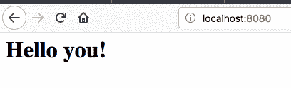
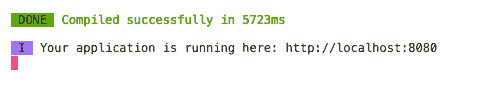
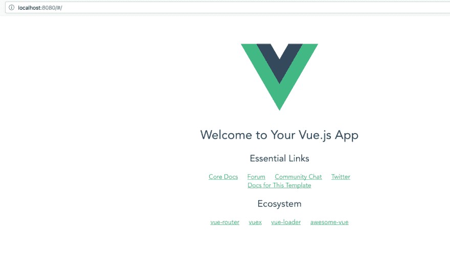
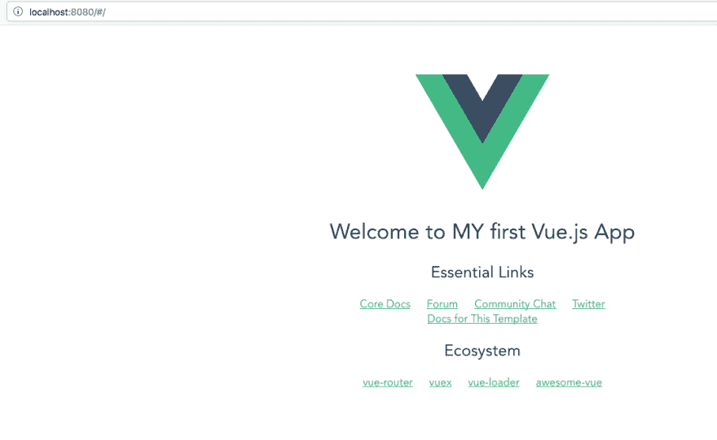
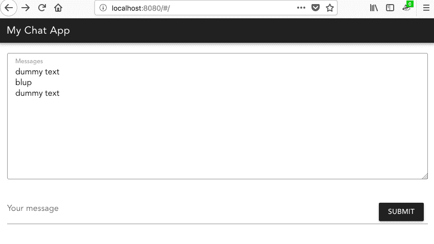
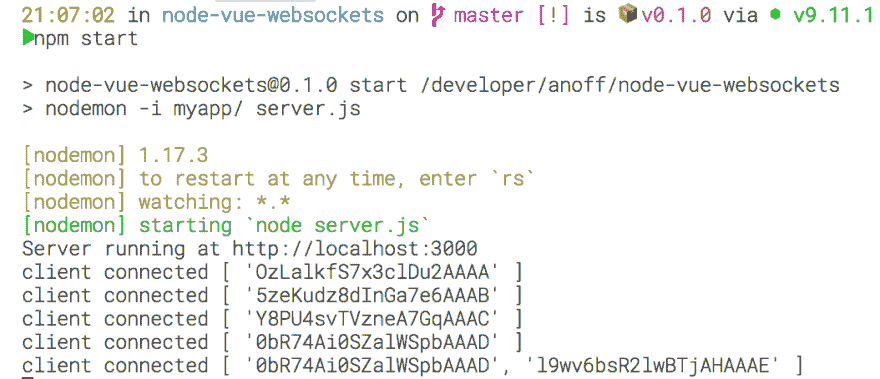
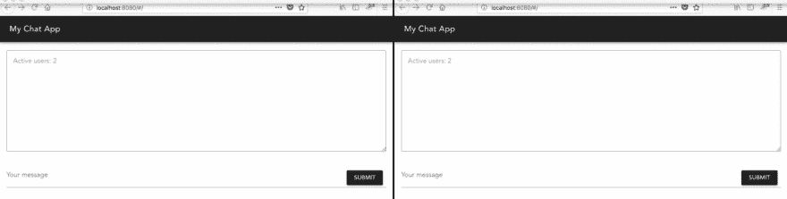

# 用 Vue 和 nodeJS 构建实时应用

> 原文：<https://dev.to/anoff/building-realtime-apps-with-vue-and-nodejs-33ol>

> 这是我的博客在 anoff.io/blog 的交叉发布

*   [建立一个基本的 Node.js 服务器](#set-up-a-basic-nodejs-server)
*   [初始化 Vue.js 项目](#initialize-vuejs-project)
*   [添加材料设计库](#adding-material-design-library)
*   [引入 websockets](#bring-in-websockets)
    *   前端:vista 套接字。我
    *   [后端:socket-io / server.js](#backend-socket-io--serverjs)
*   表演时间🍿

想要建立一个简单的 [SPA](https://en.wikipedia.org/wiki/Single-page_application) 作为一个附带项目，我努力解决一些可能会惹恼许多不想完全香草的新人的事情。哪个 *web 框架*，哪个*风格库*，哪个*服务器框架* -更重要的是，它们是如何协同工作的？

在本帖中，我们将把一些优秀的工具放在一起，用几行代码构建一个实时的 web 应用程序。将使用的工具的快速介绍:

*   [Node.js](https://nodejs.org/en/) :构建服务器应用的 Javascript 运行时
*   Vue.js :一个 webapp 框架
*   [素材设计](https://material.io/):谷歌使用 [vue-material](https://vuematerial.io/) 库设计的一组 web 组件
*   [socket . io](https://socket.io/):web sockets 的客户端&服务器库
*   [servers.js](https://serverjs.io/) :基于 [express](http://expressjs.com/) 的 Node.js 自以为是的服务器框架

## 设置一个基本的 Node.js 服务器

[T2】](https://res.cloudinary.com/practicaldev/image/fetch/s--wjYRzQF7--/c_limit%2Cf_auto%2Cfl_progressive%2Cq_auto%2Cw_880/https://anoff.io/blog/img/assets/node-vue-websockets/hello.png)

我们要做的第一件事是设置一个节点服务器来提供后端。使用 [servers.js](https://serverjs.io/) 库，只需几行代码就可以构建一个基本的 API 服务。

```
# in any empty directory
npm init # initialize npm project
npm install server 
```

Enter fullscreen mode Exit fullscreen mode

创建一个 *Hello World* 示例:

```
// server.js
// load the server resource and route GET method
const server = require('server')
const { get } = require('server/router')

// get server port from environment or default to 3000
const port = process.env.PORT || 3000

server({ port }, [
  get('/', ctx => '<h1>Hello you!</h1>')
])
  .then(() => console.log(`Server running at http://localhost:${port}`)) 
```

Enter fullscreen mode Exit fullscreen mode

使用`node server`运行代码会给出以下输出，并且网站会显示 *Hello World！*将在[localhost:3000](http://localhost:3000)T5 到达

```
Server running at http://localhost:3000 
```

Enter fullscreen mode Exit fullscreen mode

为了便于开发，在项目中安装`npm install nodemon`，并将启动命令改为:

```
// package.json
"scripts": {
  "start": "nodemon -i myapp/ server.js"
}, 
```

Enter fullscreen mode Exit fullscreen mode

💡如果你正在努力，看看这个[代码](https://github.com/anoff/node-vue-websockets/tree/4dc36fc8fac8ee3d179379c0286ee2dfe58f4261)作为参考

## 初始化 Vue.js 项目

建立 vue 项目最简单的方法是使用通过`npm install -g vue-cli`提供的`vue` -CLI。使用`webpack`作为捆绑器运行
来初始化项目

```
vue init webpack myapp 
```

Enter fullscreen mode Exit fullscreen mode

用默认问题回答调查问卷，或者禁用您不想实施的测试。对于本教程，我选择不安装任何测试框架。

Webpack 自带带有*热重装*功能的开发服务器，因此您可以立即在浏览器中看到变化。通过使用`npm run dev`(在`myapp/`目录中)启动服务器并打开位于 [localhost:8080](http://localhost:8080) 的 Vue.js 模板来尝试一下

[T2】](https://res.cloudinary.com/practicaldev/image/fetch/s--K8WxSmPS--/c_limit%2Cf_auto%2Cfl_progressive%2Cq_auto%2Cw_880/https://anoff.io/blog/img/assets/node-vue-websockets/vue.png)

> webpack 开发服务器的输出`npm run dev`

[T2】](https://res.cloudinary.com/practicaldev/image/fetch/s--EchtGbDr--/c_limit%2Cf_auto%2Cfl_progressive%2Cq_auto%2Cw_880/https://anoff.io/blog/img/assets/node-vue-websockets/vue-template.png)

> 模板 Vue.js 项目位于 [http://localhost:8080](http://localhost:8080)

修改 Vue.js 组件时，网页会自动重新加载

```
// myapp/src/components/HelloWorld.vue

// chnage the script content to
...
<script>
export default {
  name: 'HelloWorld',
  data () {
    return {
      msg: 'Welcome to MY first Vue.js App'
    }
  }
}
</script> ... 
```

Enter fullscreen mode Exit fullscreen mode

只需保存文件，开发服务器就会将更改传播到任何打开的浏览器窗口，该窗口会自动重新加载到

[T2】](https://res.cloudinary.com/practicaldev/image/fetch/s--h_6tPEMk--/c_limit%2Cf_auto%2Cfl_progressive%2Cq_auto%2Cw_880/https://anoff.io/blog/img/assets/node-vue-websockets/vue-template2.png)

> 带有自定义消息的已修改模板

💡如果你正在努力，看看这个[代码](https://github.com/anoff/node-vue-websockets/tree/3e19ae3fd902d719251cf42721ccc83fa27fb394)作为参考

## 添加材料设计库

要安装`vue-material`，在 Vue.js 目录下运行以下命令`myapp/`

```
npm install vue-material@beta --save 
```

Enter fullscreen mode Exit fullscreen mode

向`myapp/src/main.js`添加以下代码行，将`vue-material`组件加载到应用程序中。

```
import VueMaterial from 'vue-material'
import 'vue-material/dist/vue-material.css'
import 'vue-material/dist/theme/black-green-light.css'

Vue.use(VueMaterial) 
```

Enter fullscreen mode Exit fullscreen mode

ℹ️你可能需要重启开发服务器来让这个新插件生效

使用几个`vue-bootstrap`组件创建一个新的 Vue.js 组件，比如 [app](https://vuematerial.io/components/app) 容器。

```
<!-- myapp/src/components/Chat.vue-->
<template>
<div class="page-container">
    <md-app>
      <md-app-toolbar class="md-primary">
        <div class="md-toolbar-row">
          <span class="md-title">My Chat App</span>
        </div>
      </md-app-toolbar>
      <md-app-content>
        <md-field :class="messageClass">
          <label>Messages</label>
          <md-textarea v-model="textarea" disabled></md-textarea>
        </md-field>
        <md-field>
          <label>Your message</label>
          <md-input v-model="message"></md-input>
          <md-button class="md-primary md-raised">Submit</md-button>
        </md-field>
      </md-app-content>
    </md-app>
  </div>
</template>

<script>
export default {
  name: 'HelloWorld',
  data () {
    return {
      textarea: "dummy text\nblup\ndummy text"
    }
  }
}
</script>

<!-- Add "scoped" attribute to limit CSS to this component only -->
<style scoped>
.md-app {
  height: 800px;
  border: 1px solid rgba(#000, .12);
}
.md-textarea {
  height: 300px;
}
</style> 
```

Enter fullscreen mode Exit fullscreen mode

要加载新组件，请在`myApp/src/router/index.js`
处修改路由器

```
// change HelloWorld -> Chat
import Vue from 'vue'
import Router from 'vue-router'
import Chat from '@/components/Chat'

Vue.use(Router)

export default new Router({
  routes: [
    {
      path: '/',
      name: 'Chat',
      component: Chat
    }
  ]
}) 
```

Enter fullscreen mode Exit fullscreen mode

[T2】](https://res.cloudinary.com/practicaldev/image/fetch/s--nVYAy600--/c_limit%2Cf_auto%2Cfl_progressive%2Cq_auto%2Cw_880/https://anoff.io/blog/img/assets/node-vue-websockets/chat.png)

💡如果你正在努力，看看这个[代码](https://github.com/anoff/node-vue-websockets/tree/99fa39d4761ddaa779192a7f9751820ab7952356)作为参考

## 引入 websockets

对于下面的开发，web 应用程序将从两个不同的端点使用。`webpack-dev-server`发送 web 应用程序源(HTML、CSS、Javascript ),节点服务器将提供`socket-io`端点。这通常不是您在生产中想要做的事情，但是因为我们想要热重新加载节点服务器和 Vue 前端，所以我们需要两个系统——web pack 和 nodemon。

[T2】](https://res.cloudinary.com/practicaldev/image/fetch/s--1ZQkAvma--/c_limit%2Cf_auto%2Cfl_progressive%2Cq_auto%2Cw_880/https://www.plantuml.com/plantuml/png/NP0z3i8m34PtdyBgn58KYGKn8JX9sXWef77b12A4k3ik3RzBfBpdptQoZibAElSU0Zl2AbCpsFQ4ZYuOIIua5Tg8hUyef58pyVanue5ZUle95Ty8PmKLG1SIoSwsX8Ua8pxN72E07bWxpg5-vSUg5oeZeNJ3kfwDiHKEB0aNnfWVDKQBMvgbWNZgmc35zdW3n76nZRvhBtmERikU1Q_aFMULLhJFn1glHOhUc_w7VDVJZsTn9D_XEwmfEFtH1m00)

### 前端:vista socket . io

为了让 Vue 应用程序与 websocket 后端通信，socket.io 库需要安装到`cd myApp/`
中

```
npm install vue-socket.io 
```

Enter fullscreen mode Exit fullscreen mode

随着节点后端在端口`3000`上运行，在`myApp/src/main.js`中修改您的 vue 应用程序以连接到后端

```
import VueSocketIO from 'vue-socket.io'

Vue.use(VueSocketIO, 'http://localhost:3000') 
```

Enter fullscreen mode Exit fullscreen mode

为了给应用程序带来一些非常基本的功能，我们将在列表中显示从其他实例发送的消息，并添加发送消息的功能。
为了发送消息，我们需要通过添加一个`v-on:click`方法
来给`Submit`按钮一个动作

```
<md-button class="md-primary md-raised" v-on:click="sendMessage()">Submit</md-button> 
```

Enter fullscreen mode Exit fullscreen mode

`sendMessage()`函数和套接字交互在`<script>`标签
中指定

```
<script>
export default {
  name: 'Chat',
  data () {
    return {
      textarea: '',
      message: '',
      count: 0
    }
  }, sockets:{
    connect () {
      console.log('connected to chat server')
    },
    count (val) {
      this.count = val.count
    },
    message (data) { // this function gets triggered once a socket event of `message` is received
      this.textarea += data + '\n' // append each new message to the textarea and add a line break
    }
  }, methods: {
    sendMessage () {
      // this will emit a socket event of type `function`
      this.$socket.emit('message', this.message) // send the content of the message bar to the server
      this.message = '' // empty the message bar
    }
  }
}
</script> 
```

Enter fullscreen mode Exit fullscreen mode

### 后端:socket-io / server.js

Server.js 已经捆绑了 socket-io。在后端要实现一个基本的聊天操作，唯一要做的事情就是对 UI 发送的一个`message`事件做出反应，并将它传播到所有连接的套接字。

```
// modify server.js to include the socket methods
const { get, socket } = require('server/router')

...

server({ port }, [
  get('/', ctx => '<h1>Hello you!</h1>'),
  socket('message', ctx => {
    // Send the message to every socket
    ctx.io.emit('message', ctx.data)
  }),
  socket('connect', ctx => {
    console.log('client connected', Object.keys(ctx.io.sockets.sockets))
    ctx.io.emit('count', {msg: 'HI U', count: Object.keys(ctx.io.sockets.sockets).length})
  })
])
  .then(() => console.log(`Server running at http://localhost:${port}`)) 
```

Enter fullscreen mode Exit fullscreen mode

在服务器目录中运行`npm start`之后，服务器现在将为打开的每个网页创建日志。它记录当前打开的套接字列表。

> 注意，在本教程中还没有注册断开事件，所以只有当一个新的网站连接时才会发出`count`事件。

[T2】](https://res.cloudinary.com/practicaldev/image/fetch/s--q04VkL4l--/c_limit%2Cf_auto%2Cfl_progressive%2Cq_auto%2Cw_880/https://anoff.io/blog/img/assets/node-vue-websockets/clients.png)

## 表演时间🍿

在同一个网络中的两个浏览器/独立设备上运行演示，看起来会像这样。这是一个非常非常基本但完全匿名的聊天系统。

[T2】](https://res.cloudinary.com/practicaldev/image/fetch/s--7tiEO4pX--/c_limit%2Cf_auto%2Cfl_progressive%2Cq_66%2Cw_880/https://anoff.io/blog/img/assets/node-vue-websockets/2chats.gif)

您可以在 github 上找到包含该演示代码的[库。](https://github.com/anoff/node-vue-websockets/commits/master)

我希望这篇博客对你有所帮助:

1.  设置简易节点服务器
2.  用`vue-cli`引导一个 Vue 项目
3.  使用材料设计在 Vue 中获得精美的 UI 元素
4.  集成 websockets 以提供实时通信

下一步做什么:

*   向后端/前端添加测试
*   在前端存储状态/会话
*   可能添加身份验证
*   改进用户界面(例如消息栏上的注册输入按钮)

欢迎在 twitter 上发表评论或联系我们🐦