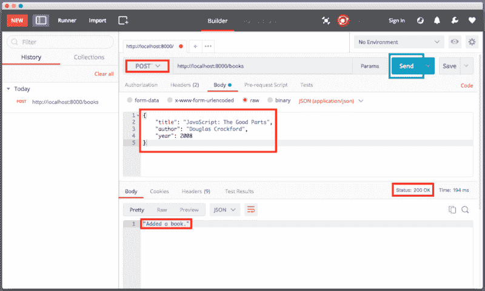

# 用 Dart、Aqueduct 和 PostgreSQL 构建 RESTful Web APIs 第 2 部分:路由

> 原文：<https://dev.to/graphicbeacon/building-restful-web-apis-with-dart-aqueduct-and-postgresqlpart-2-routing-53ip>

[T2】](https://res.cloudinary.com/practicaldev/image/fetch/s--PZk7TA-r--/c_limit%2Cf_auto%2Cfl_progressive%2Cq_auto%2Cw_880/https://thepracticaldev.s3.amazonaws.com/i/dv19znif0x9wpvdcdt13.jpg)

* * *

***请注意:从 Dart 2 开始，导水管的 API 发生了变化，导致了重大变化。本文基于 Dart v1 的 Aqueduct 2.5.0。**T3】*

***我已经更新了这个作为新的视频系列:【http://bit.ly/aqueduct-tutorial】***

* * *

在第 1 部分中，我们简要概述了 Aqueduct 及其特性，并学习了如何使用其 CLI 工具设置示例项目。

本文是系列文章的一部分，涵盖以下主题:

*   [第 1 部分:设置并运行示例](https://dev.to/graphicbeacon/building-restful-web-apis-with-dart-aqueduct-and-postgresql-55k)
*   **第 2 部分:用 CRUD 操作实现路由**(我们在这里)
*   [第 3 部分:将 Web APIs 连接到 PostgreSQL 数据库](https://dev.to/graphicbeacon/building-restful-web-apis-with-dart-aqueduct-and-postgresqlpart-3-postgres-9c7)
*   第 4 部分:编写自动化测试
*   [***奖励内容*** DB 迁移和模型关系](https://dev.to/graphicbeacon/building-restful-web-apis-with-dart-aqueduct-and-postgresqlbonus-content-551g)😄

在这一部分中，我们将实现一个具有 CRUD( *创建、读取、更新、删除*)功能的定制路由。

在开始之前，我们需要理解路由器和 HTTPControllers 的概念。这将告诉我们前进的方向。在这一部分的最后，我们将有我们的端点，有能力通过我们定义的 CRUD 操作来操作我们的数据源。

* * *

## 什么是路由器？

路由器负责捕获请求路径，并确定基于该路径运行的逻辑。当在提供给我们的`Router`对象上调用`route`方法时，通过注册一个路由来定义请求路径。注册发生在我们的***favereadsink***子类中的`setupRouter`方法被调用时:

```
// lib/fave_reads_sink.dart
@override
void setupRouter(Router router) {...} 
```

Enter fullscreen mode Exit fullscreen mode

`setupRouter`方法提供了一个路由器对象作为参数，然后我们用它来定义我们的每条路由:

```
@override
void setupRouter(Router router) {
  router.route('/router-1').listen(...);
  router.route('/router-2').listen(...);
  router.route('/router-3').listen(...); // and so on
} 
```

Enter fullscreen mode Exit fullscreen mode

调用 route 方法接受一个包含路径名的字符串，后跟一个`listen`方法，该方法允许我们定义向该路径发出请求时运行的逻辑。路由可以包含*路径变量*，这些变量是占位符标记，代表路径段中的任何值:

```
router.route('/items/:itemID'); 
```

Enter fullscreen mode Exit fullscreen mode

上面的例子声明了一个路径变量`itemID`，匹配“ **/items/0** ”、“ **/items/1** ”、“ **/items/foo** ”等等。`itemID`的值将分别为“ **0** ”、“ **1** ”和“ **foo** ”。

路径变量也可以是可选的，所以我们可以这样设置它们:

```
router.route('/items/[:itemID]'); 
```

Enter fullscreen mode Exit fullscreen mode

这意味着路线匹配也将包括“ **/items** ”作为路径名。

关于路由器的文档非常全面，我建议[去](https://aqueduct.io/docs/http/routing)看看。

## 那么，我该如何应用这个呢？

有了这些知识，让我们从项目中打开`lib/fave_reads_sink.dart`，并如下修改`setupRouter`实现:

```
@override
void setupRouter((Router router) async {
  router.route('/books[/:index]').listen((Request incomingRequest) async {
    return new Response.ok('Showing all books.');
  });
  router.route('/').listen((Request incomingRequest) async {
    return new Response.ok('<h1>Welcome to FaveReads</h1>')
      ..contentType = ContentType.HTML;
  });
}); 
```

Enter fullscreen mode Exit fullscreen mode

根路径(/)现在返回 HTML 内容。我们还定义了一个“ **/books** ”路由，它接受一个名为`index`的可选路径变量。这将是我们 CRUD 操作的终点。

调用 route 方法会返回一个`RouteController`，它公开了`listen`方法，让我们定义要运行的逻辑。我们还可以使用另外两种方法，即`pipe`和`generate`。后者允许我们创建一个新的 HTTPController 对象，该对象可以更好地处理我们的请求(稍后的将详细介绍*)。*

`listen`方法接受一个包含代表传入请求的`Request`对象的闭包。然后，我们可以从中提取我们需要的信息，执行转换，并返回响应。

不管请求动作如何，“ **/books** ”的当前逻辑返回相同的响应。让我们修改它，为我们的每个动作返回不同的响应:

```
router.route('/books[/:index]').listen((Request incomingRequest) async {
  String reqMethod = incomingRequest.innerRequest.method;
  String index = incomingRequest.path.variables["index"];

  if (reqMethod == 'GET') {
    if(index != null) {
      return new Response.ok('Showing book by index: $index');
    }
    return new Response.ok('Showing all books.');
  } else if (reqMethod == 'POST') {
    return new Response.ok('Added a book.');
  } else if (reqMethod == 'PUT') {
    return new Response.ok('Added a book.');
  } else if (reqMethod == 'DELETE') {
    return new Response.ok('Added a book.');
  }
  // If all else fails
  return new Response(405, null, 'Not sure what you\'re asking here');
}); 
```

Enter fullscreen mode Exit fullscreen mode

代码质量很快变得相当糟糕。这是重复的，容易把事情弄得一团糟:

[T2】](https://res.cloudinary.com/practicaldev/image/fetch/s--LWh_GNfZ--/c_limit%2Cf_auto%2Cfl_progressive%2Cq_66%2Cw_880/https://thepracticaldev.s3.amazonaws.com/i/e99xrgpufaerqzi0sdep.gif)

这可以用`HTTPController`清理！

## 什么是 HTTPController？

HTTPControllers 通过将 HTTP 请求映射到特定的“处理程序方法”来生成响应，从而对 HTTP 请求做出响应。只要路径匹配，路由器就会向 HTTPController 发送请求。

为了创建一个，我们将创建一个扩展`HTTPController`的`BooksController`，以便添加我们想要的行为。我们现在就开始吧。在`lib`目录下创建`controller/books_controller.dart`，内容如下:

```
import '../fave_reads.dart';

class BooksController extends HTTPController {
  // invoked for GET /books
  @httpGet // HTTPMethod meta data
  Future<Response> getAllBooks() async => new Response.ok('Showing all books');

  // invoked for GET /books/:index
  @httpGet // HTTPMethod meta data
  Future<Response> getBook(@HTTPPath("index") int idx) async => new Response.ok('Showing single book');

  // invoked for POST /books
  @httpPost // HTTPMethod meta data
  Future<Response> addBook() async => new Response.ok('Added a book');

  // invoked for PUT /books
  @httpPut // HTTPMethod meta data
  Future<Response> updateBook() async => new Response.ok('Updated a book');

  // invoked for DELETE /books
  @httpDelete  // HTTPMethod meta data
  Future<Response> deleteBook() async => new Response.ok('Deleted a book');
} 
```

Enter fullscreen mode Exit fullscreen mode

这是正在发生的事情的总结:

1.  BooksController 子类包含 5 个处理程序方法，称为 responder 方法。
2.  每个响应器方法都用一个常量来注释，该常量反映了适当的请求方法:`@httpGet`、`@httpPost`、`@httpPut`、`@httpDelete`。其他方法会使用`HTTPMethod`，比如`@HTTPMethod('PATCH')`。
3.  每个 responder 方法返回一个类型为`Response`的 Future。未来之于飞镖就像承诺之于 JavaScript 。
4.  responder 方法可以将请求中的值绑定到它的参数。我们在`getBook()` responder 方法参数中看到了这一点:`@HTTPPath("index") int idx`。它的路径变量`index`被转换成一个整数，并赋给一个名为`idx`的变量。

如果没有一个响应方法与请求方法匹配(*，例如补丁*)，则返回一个`405 Method Not Allowed`响应。

让我们转到`lib/fave_reads_sink.dart`并使用这个控制器:

```
import 'fave_reads.dart';
import 'controller/books_controller.dart'; // don't forget to import!
// ...
// ...
@override
void setupRouter((Router router) async {
  router
    .route('/books/[:index]')
    .generate(() => new BooksController()); // replaces `listen` method
// ... 
```

Enter fullscreen mode Exit fullscreen mode

并通过在终端中执行`aqueduct serve`或`dart bin/main.dart`来运行我们的项目。

我们可以通过使用 [Postman](https://www.getpostman.com/apps) 来测试我们的响应。

[T2】](https://res.cloudinary.com/practicaldev/image/fetch/s--CNBEbQG9--/c_limit%2Cf_auto%2Cfl_progressive%2Cq_auto%2Cw_880/https://thepracticaldev.s3.amazonaws.com/i/df8jwytrzh6lrr3agguz.png)

## 嘲讽我们的数据源

对于我们的数据源，让我们在`controller/books_controller.dart` :
中创建一个数组

```
import '../fave_reads.dart';

List books = [
  {
    'title': 'Head First Design Patterns',
    'author': 'Eric Freeman',
    'year': 2004
  },
  {
    'title': 'Clean Code: A handbook of Agile Software Craftsmanship',
    'author': 'Robert C. Martin',
    'year': 2008
  },
  {
    'title': 'Code Complete: A Practical Handbook of Software Construction',
    'author': 'Steve McConnell',
    'year': 2004
  },
];

class BooksController extends HTTPController {...} 
```

Enter fullscreen mode Exit fullscreen mode

然后，我们将更新`BooksController`中的 responder 方法来操作这个数据集:

```
class BooksController extends HTTPController {
  @httpGet
  Future<Response> getAll() async => new Response.ok(books);

  @httpGet
  Future<Response> getSingle(@HTTPPath("index") int idx) async {
    if (idx < 0 || idx > books.length - 1) { // index out of range
      return new Response.notFound(body: 'Book does not exist');
    }
    return new Response.ok(books[idx]);
  }

  @httpPost
  Future<Response> addSingle() async {
    var book = request.body.asMap(); // `request` represents the current request. This is a property inside HTTPController base class
    books.add(book);
    return new Response.ok(book);
  }

  @httpPut
  Future<Response> replaceSingle(@HTTPPath("index") int idx) async {
    if (idx < 0 || idx > books.length - 1) { // index out of range
      return new Response.notFound(body: 'Book does not exist');
    }
    var body = request.body.asMap();
    for (var i = 0; i < books.length; i++) {
      if (i == idx) {
        books[i]["title"] = body["title"];
        books[i]["author"] = body["author"];
        books[i]["year"] = body["year"];
      }
    }
    return new Response.ok(body);
  }

  @httpDelete
  Future<Response> delete(@HTTPPath("index") int idx) async {
    if (idx < 0 || idx > books.length - 1) { // index out of range
      return new Response.notFound(body: 'Book does not exist');
    }
    books.removeAt(idx);
    return new Response.ok('Book successfully deleted.');
  }
} 
```

Enter fullscreen mode Exit fullscreen mode

*[了解镖的数组/列表方法](https://api.dartlang.org/stable/1.24.3/dart-core/List-class.html)*

再次重启服务器，并用 [Postman](https://www.getpostman.com/apps) 进行测试。

请注意:这是在隔离状态下运行的，这意味着任何副作用只能在 Postman(*或任何工具*)会话中看到。打开一个单独的会话(*像浏览器*)不会显示这些变化。这是因为设计的隔离不共享状态。不过不要担心——这将在我们实现真正的数据库时得到解决。

## 重构方案

我应该已经完成了，但是这将在第 3 部分给我们带来更多的工作。我不希望这种情况发生，所以请在这最后一段时间里容忍我😊

还记得我说过可以将请求中的值绑定到 responder 方法的参数吗？嗯，我们可以重构我们的 POST 操作，通过`@HTTPBody()`元数据:
将它的有效负载转换成 map

```
@httpPost
Future<Response> addSingle(@HTTPBody() Map book) async {
  books.add(book);
  return new Response.ok('Added new book.');
} 
```

Enter fullscreen mode Exit fullscreen mode

这里，尝试将请求有效负载解析为`Map`类型。我们也可以指定一个自定义类型，而不仅仅是使用内置类型，只要自定义类型扩展了一个`HTTPSerializable`类型。让我们通过在`lib/model/book.dart` :
中引入一个图书模型来做到这一点

```
import '../fave_reads.dart';

class Book extends HTTPSerializable {
  String title;
  String author;
  int year;

  Book({this.title, this.author, this.year});

  @override
  Map<String, dynamic> asMap() => {
    "title": title,
    "author": author,
    "year": year,
  };

  @override
  void readFromMap(Map requestBody) {
    title = requestBody["title"];
    author = requestBody["author"];
    year = requestBody["year"];
  }
} 
```

Enter fullscreen mode Exit fullscreen mode

下面是正在发生的事情的总结:

1.  我们的图书模型实现了`HTTPSerializable`，这是一个用于解析 HTTP 请求信息的实用程序
2.  定义`asMap`和`readFromMap(Map requestBody)`方法。第一个将在 JSON 响应被发送回客户机时使用，而后者检索请求体并提取数据以填充模型的属性。

现在我们只需要使用这个模型:

```
// lib/controller/book_controller.dart

import '../fave_reads.dart';
import 'model/book.dart';

List books = [
  new Book(
    title: 'Head First Design Patterns',
    author: 'Eric Freeman',
    year: 2004
  ),
  new Book(
    title: 'Clean Code: A handbook of Agile Software Craftsmanship', 
    author: 'Robert C. Martin', 
    year: 2008
  ),
  new Book(
    title: 'Code Complete: A Practical Handbook of Software Construction',
    author: 'Steve McConnell',
    year: 2004
  ),
];

class BooksController extends HTTPController {
  // ...
  // ...
  Future<Response> addSingle(@HTTPbody() Book book) async { // note the `Book` type being used
    books.add(book);
    return new Response.ok(book);
  }
  //...
  //...
} 
```

Enter fullscreen mode Exit fullscreen mode

重启服务器，用 Postman 测试结果。

## 结论

通过充实 web APIs 的框架，我们已经取得了一些重大进展。我希望这次旅程到目前为止是一次有趣的挑战。我鼓励你浏览下面的进一步阅读材料，以掌握我们已经讨论过的概念。

一如既往**我乐于接受反馈**。让我知道你喜欢这个教程的什么，你不喜欢什么，你希望在未来看到什么。我真的很感激。

本系列的第 2 部分到此结束。源代码在 github 上[可以获得，并且会随着我们在这个系列中的进展而更新。敬请关注更多内容。](https://github.com/graphicbeacon/favereads)

* * *

## 进一步阅读

*   [路由和路径变量](https://aqueduct.io/docs/http/routing/)
*   [处理请求:HTTPController](https://aqueduct.io/docs/http/http_controller/)

* * *

[](/graphicbeacon) [## 用 Dart、Aqueduct 和 PostgreSQL 构建 RESTful Web APIs 第 3 部分:Postgres

### 杰梅因奥蓬 5 月 22 日 186 分钟阅读

#api #webdev #dart #sql](/graphicbeacon/building-restful-web-apis-with-dart-aqueduct-and-postgresqlpart-3-postgres-9c7)

* * *

*最初贴在[介质上](https://itnext.io/building-restful-web-apis-with-dart-aqueduct-and-postgresql-part-2-routing-with-crud-operations-629fe58114fa)T3】*