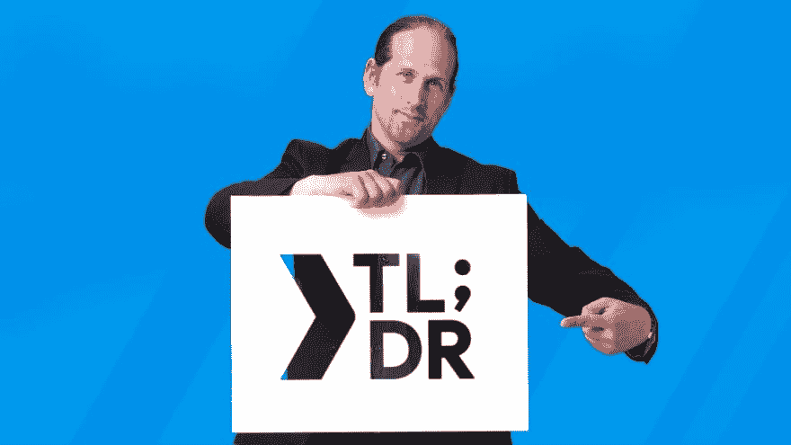
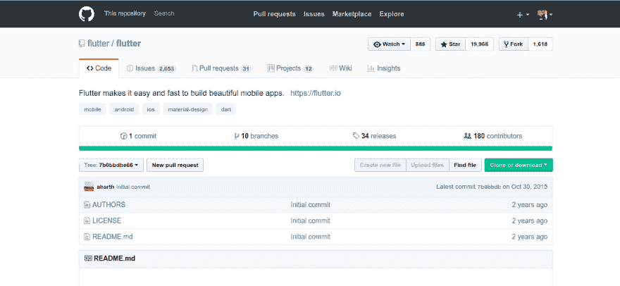
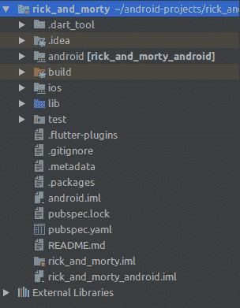
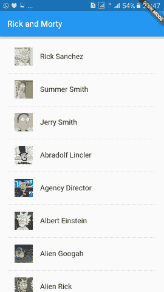

# 颤动的建筑！

> 原文：<https://dev.to/kingidee/building-with-flutter-59fc>

[T2】](https://res.cloudinary.com/practicaldev/image/fetch/s--nKLDp3AS--/c_limit%2Cf_auto%2Cfl_progressive%2Cq_auto%2Cw_880/https://thepracticaldev.s3.amazonaws.com/i/irchmco8kj5bakprezjh.jpg)

Flutter 是一个仍处于测试阶段的移动交叉开发平台。最重要的是，与竞争对手相比，Flutter 给我们带来了更好的性能。在这篇文章中，我们将学习为什么 Flutter 是一个很好的开发选项，我们也将用它创建一个简单的应用程序。您可以在这里找到这个示例[的 GitHub 资源库。](https://github.com/KingIdee/rickandmorty)

## 简介

很多公司更喜欢用“一石二鸟”。因此，选择跨平台开发是一个自然的决定。多年来，为了实现这一壮举，已经引入了交叉开发平台。做出这一选择的原因包括:

*   产品的快速原型。
*   更广泛的用户，投资更少等。

这一选择和决定显然节省了时间和成本，这是两个非常重要的实体。

早期发布的跨开发平台，如 PhoneGap、Cordova、Ionic 等，大多使用 JavaScript，因此它们存在一些瓶颈。这是因为 JavaScript 代码与本机代码通信需要额外的努力。据谷歌的一名高级软件工程师称，这些平台需要一个桥梁来与本地代码进行通信，从而导致过程中的性能下降。

## 为什么会飘起？

Flutter 是谷歌的一款开源移动应用 SDK，用于开发 Android 和 IOS 应用。Flutter 的目标是在利用单一代码库的同时，产生其竞争对手中罕见的原生感觉。Flutter 在将应用程序渲染到其平台时，会考虑对齐、滚动行为、排版、图标等方面的差异。Flutter 早在 2015 年就已经开始开发了——包含`AUTHORS`、`LICENSE`和`README.md`文件的第一次提交是在 2015 年 10 月 30 日。

[T2】](https://res.cloudinary.com/practicaldev/image/fetch/s--RMYKx6wC--/c_limit%2Cf_auto%2Cfl_progressive%2Cq_auto%2Cw_880/https://d2mxuefqeaa7sj.cloudfront.net/s_61C7FBFD62C749D5311201EA6851ED7FF4734742900C98F39AA870334E2A8E29_1522185117690_fio3.png)

但是，[在 2017 年 Google IO 期间](https://www.youtube.com/watch?v=w2TcYP8qiRI)正式公布并呈现在世人面前。因此，问题来了-*Flutter 与其他交叉开发平台有什么不同吗？*
是的！肯定！这里有一些你应该注意的特征:

1.  更好的性能:Flutter 成功和更好性能的主要原因之一是语言的选择——Dart。Dart 被“提前”(AOT)编译成本地代码，因此 Flutter 更容易与平台通信，而不是像 JavaScript 框架那样使用桥。同样，Flutter 的工作方式是，它需要非常快速地创建和销毁大量短命对象。Dart 的垃圾收集非常适合这样的用例。
2.  热重新加载:这是一个帮助你动态更新代码的特性，无需重启整个应用程序。
3.  小部件的新方法:在 Flutter 中，一切都是小部件。从布局到对齐再到填充等等。
4.  Flutter 是反应式的:Flutter 的灵感来自 React Native，就像 React Native 一样，它提供了反应式的视图。

## 设置完毕！

在我们开始编码之前。我们需要在系统上设置 Flutter。您可以按照以下步骤来完成:

1.  克隆 GitHub 存储库。

    `git clone -b beta https://github.com/flutter/flutter.git`

2.  给你的道路增添一丝颤动。[遵循这些说明](https://flutter.io/get-started/install/)

3.  在你的终端运行这个命令:

    `flutter doctor`

这是为了提醒您完成设置所需的任何其他必要的依赖项。如果在设置过程中遇到任何问题，您可以随时求助于[颤振文档](https://flutter.io/get-started/install/)。

在继续之前，您还应该具备以下条件:

*   集成开发环境。可以使用 [Intellij IDEA](https://www.jetbrains.com/idea/download) 、 [Android Studio](https://developer.android.com/studio/archive.html) 或者 [Visual Studio Code](https://code.visualstudio.com/download) 。你可以在这里学习如何配置它们[。](https://flutter.io/get-started/editor)
*   OOP(面向对象编程)的入门知识。

## 我们将建造什么

在这个演示中，我们将利用 Rick 和 Morty API 来构建一个简单的 Flutter 应用程序，它将执行以下操作:

*   从 API 获取所有字符并解析`JSON`响应。
*   设置一个列表视图来显示包括图像和角色名称的响应。

## 构建我们的应用

打开您的 IDE 并创建一个新的 Flutter 应用程序。我们将它命名为`rick_and_morty`。这符合 Flutter 项目的命名惯例(即只有下划线的小写字母)。项目将具有这样的文件结构。

[T2】](https://res.cloudinary.com/practicaldev/image/fetch/s--bKRTLcrd--/c_limit%2Cf_auto%2Cfl_progressive%2Cq_auto%2Cw_880/https://d2mxuefqeaa7sj.cloudfront.net/s_61C7FBFD62C749D5311201EA6851ED7FF4734742900C98F39AA870334E2A8E29_1522184970451_fio2.png)

我们在这里实现的唯一需要外部包的功能是加载图像。所以，继续，打开您的`pubspec.yaml`文件并添加`cached_network_image`包:

```
dependencies:
  flutter:
    sdk: flutter

  # The following adds the Cupertino Icons font to your application.
  # Use with the CupertinoIcons class for iOS style icons.
  cupertino_icons: ^0.1.0
  cached_network_image: "^0.3.0"
  # Other dependencies if you so which! 
```

Enter fullscreen mode Exit fullscreen mode

点击右上角的“获取包”按钮，以便获取包。我们对这个应用程序的其余修改将在`main.dart`文件中完成。默认应用程序附带了一大堆样板代码，我们在这个演示中并不需要。你应该把它们清除掉，只把这个放在文件里:

```
import 'package:flutter/cupertino.dart';
import 'package:flutter/material.dart';

void main() => runApp(new MyApp());
var httpClient = new HttpClient();

class MyApp extends StatelessWidget {
  @override
  Widget build(BuildContext context) {
    return new MaterialApp(
      title: 'Rick and Morty',
      home: new RickAndMorty(),
    );
  }
} 
```

Enter fullscreen mode Exit fullscreen mode

在这段代码中，我们有一个扩展无状态小部件的类。在被覆盖的`build`方法中，我们返回一个带有一些修改属性的 MaterialApp。标题属性更改为“里克和莫蒂”——这将反映为我们的应用程序栏上的文本。我们还修改了 home 属性，以返回我们稍后将实现的另一个小部件。该类在`main`方法中被调用，这是我们运行应用程序时显示的小部件。我们还创建了一个`HttpClient`的实例，将用于我们的网络调用。

通过 home 属性返回的`RickAndMorty`小部件将是一个有状态的小部件。Flutter 有两种类型的小部件，无状态和有状态小部件。无状态窗口小部件是属性不能改变的窗口小部件——相当于常量，而有状态窗口小部件是属性可以改变的窗口小部件。现在让我们设置我们的`RickAndMorty`小部件。将这个片段粘贴到您的`main.dart`文件中:

```
class RickAndMorty extends StatefulWidget {
  @override
  createState() => new RickAndMortyState();
}

class RickAndMortyState extends State<RickAndMorty> {
  var modelList = <Model>[];
  final _customFont = const TextStyle(fontSize: 18.0);

  @override
  void initState() {
    super.initState();
    _getRickAndMortyCharacters();
  }

  @override
  Widget build(BuildContext context) {
    return new Scaffold (
      appBar: new AppBar(
        title: new Text('Rick and Morty'),
      ),
      body: _buildListView()
    );
  }
} 
```

Enter fullscreen mode Exit fullscreen mode

> 前缀为 _ 的变量和方法是该类私有的。

为了创建一个有状态的小部件，我们创建了一个扩展了`StatefulWidget`的类，然后我们覆盖了`createState`方法来返回一个扩展了`State<RickAndMorty>`的新类。我们在上面的代码片段中正是这样做的。根据文件:

> 如果您想在一个小部件中可视化地呈现有状态数据，您应该将这些数据封装在一个`State`对象中。然后，您可以将您的`State`对象与扩展`StatefulWidget`类的小部件相关联。

在`RickAndMortyState`类中，我们创建了一个新的列表来保存定制数据。这个数据包含在存储在`model.dart`文件中的`Model`类中。创建一个新文件`model.dart`,设置如下:

```
class Model{
  String name;
  String imageUrl;
} 
```

Enter fullscreen mode Exit fullscreen mode

该类包含两个字符串，用于保存角色名称和图像 URL。

仍然在`RickAndMortyState`类中，我们重写了`initState`方法，并通过调用`_getRickAndMortyCharacters`函数在这里进行网络调用。像这样在类中设置函数:

```
_getRickAndMortyCharacters() async {
  var url = 'https://rickandmortyapi.com/api/character';

  Logger.root.level = Level.ALL;
  Logger.root.onRecord.listen((LogRecord rec) {
    print('${rec.level.name}: ${rec.time}: ${rec.message}');
  });
  var _LOG = new Logger("R&M");

  var httpClient = new HttpClient();

  List<Model> result = <Model>[];
  try {
    var request = await httpClient.getUrl(Uri.parse(url));
    var response = await request.close();
    if (response.statusCode == HttpStatus.OK) {
      var json = await response.transform(UTF8.decoder).join();
      var data = JSON.decode(json);

      for (var k in data['results']) {
        var model = new Model();
        model.name = k['name'].toString();
        model.imageUrl = k['image'].toString();
        result.add(model);
      }

      httpClient.close();
    } else {
      _LOG.severe(response.statusCode);
      _LOG.severe(response);
    }
  } catch (exception) {
    _LOG.severe(exception);
  }

  if (!mounted) return;

  setState(() {
    modelList = result;
  });

} 
```

Enter fullscreen mode Exit fullscreen mode

这个函数执行我们的网络调用，并将结果分配给我们的`modelList`。`setState`函数是一个内部函数，用于通知框架对象的变化。

最后，在`RickAndMortyState`类的`build`方法中，我们返回了一个小部件，其中仍然指定了标题和正文。这里，主体是另一个方法- `_buildListView`，它返回一个小部件并设置我们的列表视图。在类中创建一个函数，并像这样设置方法:

```
Widget _buildListView(){
  return new ListView.builder(
      padding: const EdgeInsets.all(16.0),
      itemCount: modelList.length,
      itemBuilder: (context, i) {
        // Add a one-pixel-high divider widget before each row in theListView.
        if (i.isOdd) return new Divider();

        return _buildRow(modelList[i]);
      }
  );
} 
```

Enter fullscreen mode Exit fullscreen mode

在`ListView.builder`中，我们向视图添加了填充，我们将长度设置为列表的大小，我们返回了一条分隔线来给列表添加一些大摇大摆的内容，我们通过调用`_buildRow`函数返回了另一个小部件。`_buildRow`函数描述了列表中单个项目的外观。在类中创建函数，并按如下方式设置它:

```
Widget _buildRow(Model model) {
  return new ListTile(

    title: new Text(
      model.name,
      style: _customFont,
    ),

    leading: new CachedNetworkImage(
      imageUrl: model.imageUrl,
      placeholder: new CircularProgressIndicator(),
      errorWidget: new Icon(Icons.error),
    )

  );
} 
```

Enter fullscreen mode Exit fullscreen mode

列表项将有一个图像和一个文本。使用 leading 属性添加图像。这个属性被配置为列表中水平方向上的第一项，它位于我们用于角色标题的 title 属性之前。我们使用了`CachedNetworkImage`包来加载图像。当我们运行我们的应用程序时，我们应该会看到类似这样的内容:

[T2】](https://res.cloudinary.com/practicaldev/image/fetch/s--DhyuEHMB--/c_limit%2Cf_auto%2Cfl_progressive%2Cq_auto%2Cw_880/https://d2mxuefqeaa7sj.cloudfront.net/s_61C7FBFD62C749D5311201EA6851ED7FF4734742900C98F39AA870334E2A8E29_1522179996250_fio1.png)

## 一些更牛逼的资源！

*   [https://github.com/Solido/awesome-flutter#introduction](https://github.com/Solido/awesome-flutter#introduction)
*   [https://codelabs.developers.google.com/codelabs/flutter](https://codelabs.developers.google.com/codelabs/flutter)
*   [https://medium . com/@ Matthew . Smith _ 66715/why-we-choose-flutter-how-changed-our-company for-the-better-271 DDD 25 da 60](https://medium.com/@matthew.smith_66715/why-we-chose-flutter-and-how-its-changed-our-company-for-the-better-271ddd25da60)
*   [https://hacker noon . com/why-native-app-developers-should-take-a-serious-look-at-flutter-e 97361 a 1c 073](https://hackernoon.com/why-native-app-developers-should-take-a-serious-look-at-flutter-e97361a1c073)

## 结论

在本文中，我们已经了解了另一个交叉开发平台——Flutter。我们能够评估为什么与早期发布的平台相比，Flutter 是开发移动应用程序的好选择。我们能够解开的一些原因包括更好的性能，它的反应性质，它的材料设计实现等。

我们同样能够构建一个简单的演示应用程序，其中我们使用了一个 API 来展示 Flutter 的一些令人敬畏的品质。Flutter 已经创造了一些成功的故事。随意使用 GitHub 库。我迫不及待地想看到您将利用这个平台构建的下一个伟大的东西。如果你被卡住了，你就欢呼吧！