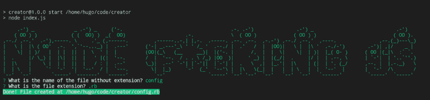

# 构建您的第一个交互式节点 JS CLI

> 原文：<https://dev.to/hugodias/building-your-first-interactive-node-js-cli-1g2c>

[最初发布于我的博客](https://blog.hdias.dev/interactive-cli-using-node-js)

在构建命令行界面(也称为 CLI)时，NodeJS 非常有用。

在这篇文章中，我将教你如何构建一个 CLI 来询问一些问题并根据答案创建一个文件。

### 入门

让我们从创建一个全新的 npm 包
开始

```
mkdir my-script
cd my-script
npm init 
```

Enter fullscreen mode Exit fullscreen mode

NPM 会问一些问题。之后，我们需要安装一些软件包。

```
npm install --save chalk figlet inquirer shelljs 
```

Enter fullscreen mode Exit fullscreen mode

这些软件包的作用:

*   **粉笔** -端子串造型正确
*   figlet 是一个用普通文本制作大字体的程序
*   **inquirer** -一组通用的交互式命令行用户界面
*   用于 Node.js 的可移植 Unix shell 命令

### index.js 文件

现在用以下内容创建一个`index.js`文件:

```
#!/usr/bin/env node 
const inquirer = require("inquirer");
const chalk = require("chalk");
const figlet = require("figlet");
const shell = require("shelljs"); 
```

Enter fullscreen mode Exit fullscreen mode

### 规划 CLI

在编写任何代码之前，计划 CLI 需要做什么总是好的。

这个 CLI 只做一件事:**创建一个文件**。

它应该问几个问题，然后显示一条成功消息，其中包含创建的文件路径。

问题是:文件名是什么，扩展名是什么。

```
// index.js

const run = async () => {
  // show script introduction
  // ask questions
  // create the file
  // show success message
};

run(); 
```

Enter fullscreen mode Exit fullscreen mode

第一个功能是剧本介绍。让我们使用`chalk`和`figlet`来完成这项工作。

```
 const init = () => {
  console.log(
    chalk.green(
      figlet.textSync("Node f*cking JS", {
        font: "Ghost",
        horizontalLayout: "default",
        verticalLayout: "default"
      })
    )
  );
}

const run = async () => {
  // show script introduction
  init();

  // ask questions
  // create the file
  // show success message
};

run(); 
```

Enter fullscreen mode Exit fullscreen mode

现在是时候写一个提问的函数了。

```
const askQuestions = () => {
  const questions = [
    {
      name: "FILENAME",
      type: "input",
      message: "What is the name of the file without extension?"
    },
    {
      type: "list",
      name: "EXTENSION",
      message: "What is the file extension?",
      choices: [".rb", ".js", ".php", ".css"],
      filter: function(val) {
        return val.split(".")[1];
      }
    }
  ];
  return inquirer.prompt(questions);
};

// ...

const run = async () => {
  // show script introduction
  init();

  // ask questions
  const answers = await askQuestions();
  const { FILENAME, EXTENSION } = answers;

  // create the file
  // show success message
}; 
```

Enter fullscreen mode Exit fullscreen mode

注意来自`inquirer`的常量文件名和扩展名。

下一步是创建文件。

```
const createFile = (filename, extension) => {
  const filePath = `${process.cwd()}/${filename}.${extension}`
  shell.touch(filePath);
  return filePath;
};

// ...

const run = async () => {
  // show script introduction
  init();

  // ask questions
  const answers = await askQuestions();
  const { FILENAME, EXTENSION } = answers;

  // create the file
  const filePath = createFile(FILENAME, EXTENSION);

  // show success message
}; 
```

Enter fullscreen mode Exit fullscreen mode

最后但同样重要的是，显示成功消息以及文件路径。

```
const success = (filepath) => {
  console.log(
    chalk.white.bgGreen.bold(`Done! File created at ${filepath}`)
  );
};

// ...

const run = async () => {
  // show script introduction
  init();

  // ask questions
  const answers = await askQuestions();
  const { FILENAME, EXTENSION } = answers;

  // create the file
  const filePath = createFile(FILENAME, EXTENSION);

  // show success message
  success(filePath);
}; 
```

Enter fullscreen mode Exit fullscreen mode

让我们通过运行`node index.js`来测试这个脚本。

[T2】](https://res.cloudinary.com/practicaldev/image/fetch/s--8p63e5rH--/c_limit%2Cf_auto%2Cfl_progressive%2Cq_auto%2Cw_880/https://thepracticaldev.s3.amazonaws.com/i/d42ns41x32i4bbkjwhyw.png)

耶！这是最后的代码:

### 最终代码

```
#!/usr/bin/env node 
const inquirer = require("inquirer");
const chalk = require("chalk");
const figlet = require("figlet");
const shell = require("shelljs");

const init = () => {
  console.log(
    chalk.green(
      figlet.textSync("Node f*cking JS", {
        font: "Ghost",
        horizontalLayout: "default",
        verticalLayout: "default"
      })
    )
  );
};

const askQuestions = () => {
  const questions = [
    {
      name: "FILENAME",
      type: "input",
      message: "What is the name of the file without extension?"
    },
    {
      type: "list",
      name: "EXTENSION",
      message: "What is the file extension?",
      choices: [".rb", ".js", ".php", ".css"],
      filter: function(val) {
        return val.split(".")[1];
      }
    }
  ];
  return inquirer.prompt(questions);
};

const createFile = (filename, extension) => {
  const filePath = `${process.cwd()}/${filename}.${extension}`
  shell.touch(filePath);
  return filePath;
};

const success = filepath => {
  console.log(
    chalk.white.bgGreen.bold(`Done! File created at ${filepath}`)
  );
};

const run = async () => {
  // show script introduction
  init();

  // ask questions
  const answers = await askQuestions();
  const { FILENAME, EXTENSION } = answers;

  // create the file
  const filePath = createFile(FILENAME, EXTENSION);

  // show success message
  success(filePath);
};

run(); 
```

Enter fullscreen mode Exit fullscreen mode

要在任何地方执行这个脚本，在您的`package.json`文件中添加一个 bin 部分，然后运行`npm link`

```
{  "name":  "creator",  "version":  "1.0.0",  "description":  "",  "main":  "index.js",  "scripts":  {  "test":  "echo \"Error: no test specified\" && exit 1",  "start":  "node index.js"  },  "author":  "",  "license":  "ISC",  "dependencies":  {  "chalk":  "^2.4.1",  "figlet":  "^1.2.0",  "inquirer":  "^6.0.0",  "shelljs":  "^0.8.2"  },  "bin":  {  "creator":  "./index.js"  }  } 
```

Enter fullscreen mode Exit fullscreen mode

```
$ npm link
$ creator 
```

Enter fullscreen mode Exit fullscreen mode

* * *

希望有帮助:)

* * *

[亚历山大·奈特在 Unsplash 上的照片](https://unsplash.com/@agkdesign)