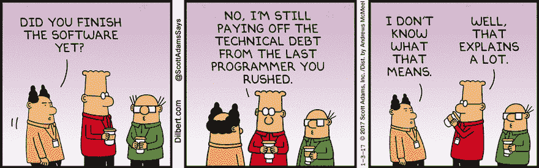
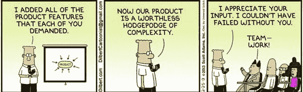

# 商业成果语言:软件工程师入门

> 原文：<https://dev.to/alediaferia/business-outcome-language-an-introduction-for-software-engineers-1678>

使用业务成果语言有助于将问题定义集中在您应该向客户交付的价值上。让我们一起探索如何确保我们的语言不被技术细节污染。

作为贵公司的技术领导者，你是两个世界的公民:商业世界和实施世界。每个世界都讲自己的语言，所以他们清楚明白地交流是至关重要的。

## 你在实现世界的第一天

软件工程师通常在**实现世界**开始他们的职业生涯，很少有机会接触**商业世界**。

作为一名软件工程师，让你兴奋的是解决问题的挑战。你渴望更多的问题，当你解决它们时，你会感到更满足。你的大脑被**问题定义**所触发，它开始吐出你能达到预期结果的所有可能的方法。

这个阶段的**问题定义**可能是面向实现的语言，很少指明公司正在寻找什么样的业务成果。很可能你并不关心这个，因为你只关心编码的挑战。

### 你的语言围绕着*如何演变*

在*实现世界*中，你开发一种特定于问题解决方案的语言，以及你用来解决问题的工具。

你通过关注*如何*实现解决方案来与你的同事交流。讨论通常围绕现有软件的技术细节展开。
生活在*实现世界之外的*外国人**带着惊讶和好奇看着你:从外面看你的话真的没有多大意义。

### 第一次接触*的外国人*

在你的职业生涯中，会有这样一个时刻，你不得不与来自商业世界的人互动并一起工作。

根据你的公司构建产品的方法，这种交互通常可以成为两个世界合作的机会，并找到一个可追求的合理结果。最有效的方法是使用一种通用语言:商业成果语言**。**

 **当然，这对于*实现人员*来说通常是具有挑战性的，因为他们的母语在他们的世界之外不能被很好地理解。对他们来说，使用实现语言是很自然的事情。解释*如何通过实施细节*实现某事，感觉非常简单。

## 实现语言的麻烦

让我们看几个例子，为什么在每次交互中使用*实现语言*会适得其反。

### *我们办不到！*

[T2】](https://res.cloudinary.com/practicaldev/image/fetch/s--dgitigUe--/c_limit%2Cf_auto%2Cfl_progressive%2Cq_66%2Cw_880/https://i1.wp.com/alediaferia.com/wp-content/uploads/2018/08/tech-debt-dilbert.gif%3Fzoom%3D1.7999999523162842%26w%3D900%26ssl%3D1)

> “你所要求的在那个日期之前是不可能做到的。我们积累的技术债务意味着我们需要 3 个月的时间来重构服务类，以支持这一新功能。我们还必须更新到数据库的最新版本，以支持这种变化……“
> –*一个实施世界本地*

虽然这些可能都是为什么具体的改变难以实现的正当理由，但它们为对话定下了错误的基调。

提出非常具体的技术问题会将对话转变为明确的技术谈判。
来自*商业世界*的人们将不可避免地，而且经常是下意识地，试图向*实施人员*请愿，寻求一个折中的解决方案。这实现了类似的结果，但是克服了已经提出的一些技术限制。

当谈判成功时，可能感觉像是双赢的局面，但事实并非如此。

首先，业务人员可能刚刚同意构建被变通办法污染的功能，并且**围绕技术约束而不是围绕客户**发展。
类似地，实现人员可能**已经接受在他们的世界**中构建更多的[技术债务](https://alediaferia.com/2018/02/14/technical-debt-kills-your-company/)。

### *我也会说你们的语言，我会告诉你到底该怎么做！*

[T2】](https://res.cloudinary.com/practicaldev/image/fetch/s--S9KTjI35--/c_limit%2Cf_auto%2Cfl_progressive%2Cq_auto%2Cw_880/https://i0.wp.com/alediaferia.com/wp-content/uploads/2018/08/dilbert_product_development.jpg%3Fw%3D600%26ssl%3D1)

> “我们需要在页面上添加一个新按钮，以便用户可以将数据导出为 PDF 格式。”
> –*一个讲实施语言的商业世界本地人*

上面的例子准确地描述了应该使用哪种技术解决方案，甚至没有具体说明要解决的问题是什么。
相反，想象下面的问题定义:*用户希望以最小的努力与他们的同事共享洞察数据。*

虽然“导出为 PDF”按钮可能会尝试解决这个问题，但它只能部分解决这个问题。导出为 PDF 格式，保存到你的磁盘，再次找到它并将其附加到电子邮件中并不一定意味着*最小的努力*。

明确了用户希望以最小的努力分享见解，有助于工程师提出一个更有效的解决方案。一种可能是向用户提供“分享”*行动号召*，将见解发送给期望的接收者，而不必导出任何内容。

阐明问题是什么，而不是强制要求一个特定的解决方案，将让工程师和设计师在当前的约束条件下探索最佳的方法。

## 一种技术语言锚定了思维

实现语言是描述解决方案的强大方式。它非常详细，有助于工程师明确需要做什么。然而，如果在错误的环境中使用，它的力量会使它变得危险。

在讨论中引入太多的实现细节会使想法停留在现状上，可能会妨碍为您的产品的用户确定正确的价值。重要的是将实施评估推迟到最后，以便让思维在公司想要实现的业务成果的空间中发展和表达。

## 帮助把语言从技术的束缚中解放出来

作为一名技术领导者，你应该精通这两种语言。利用这一点，通过确保所有相关人员都说业务成果语言，确保对话远离实施细节。

理解你的*同胞*提出的技术限制和顾虑，并将其翻译成适当的语言，权衡哪些内容真正值得包含在对话中。

确保不排除创新，避免将思维局限于技术限制的现状。这个练习将帮助您评估比以前更多的实施机会。

*封面照片由[车头](https://unsplash.com/photos/5QgIuuBxKwM?utm_source=unsplash&utm_medium=referral&utm_content=creditCopyText)上[车尾](https://unsplash.com/search/photos/business?utm_source=unsplash&utm_medium=referral&utm_content=creditCopyText)T5】*

*原载于[alediaferia.com](https://alediaferia.com/2018/08/20/business-outcome-language-software-engineers/)T3】***