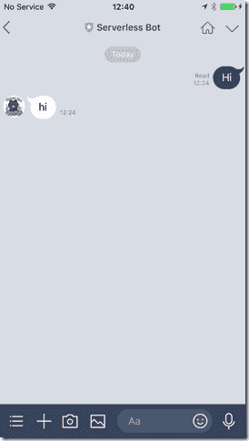
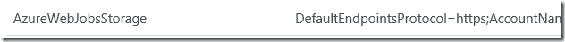

# 利用 Azure 功能进行跨平台的 C# LINE Bot 开发

> 原文：<https://dev.to/kenakamu/c-line-bot-development-with-azure-function-for-cross-platform-3jlp>

无服务器和机器人是这些天的流行语。但是当你在台湾、韩国、日本等国家提到 bot 时，很多人会想到 LINE 作为它的平台。在本文中，我解释了如何使用微软技术快速开发 LINE bot，并在最后在 Function App 上托管应用程序。

# 先决条件

您的首选操作系统。我使用 Windows，但这也适用于 Mac 和 Linux。

*   LINE developer 帐户。[https://developers.line.me/en/](https://developers.line.me/en/)
*   Azure 订阅。如果你还没有，免费试用[这里](https://azure.microsoft.com/en-us/free/)
*   Visual Studio 代码。在这里抢最新的
*   dotnet 核心库。 [Windows](https://www.microsoft.com/net/learn/get-started/windows) ， [MacOS](https://www.microsoft.com/net/learn/get-started/macos) ， [Linux](https://www.microsoft.com/net/learn/get-started/linux)
*   https://nodejs.org/en/
*   你走吧。 [https://git-scm.com/](https://git-scm.com/)
*   ngrok. [https://ngrok.com/](https://ngrok.com/)

# 设置行

如果您已经设置了您的应用程序，请跳过此步骤。

1.前往[https://developers.line.me/en/](https://developers.line.me/en/)并注册开发者账户。你也需要 LINE account，不过我想你已经有一个了。

2.单击“开始使用消息传递 API”。

[T2】](https://res.cloudinary.com/practicaldev/image/fetch/s--zaoTRABT--/c_limit%2Cf_auto%2Cfl_progressive%2Cq_auto%2Cw_880/https://msdnshared.blob.core.windows.net/media/2017/12/image_thumb28.png)

3.如果您有提供商，请选择它。否则，单击+图标。

[T2】](https://res.cloudinary.com/practicaldev/image/fetch/s--5997-2a5--/c_limit%2Cf_auto%2Cfl_progressive%2Cq_auto%2Cw_880/https://msdnshared.blob.core.windows.net/media/2017/12/image_thumb29.png)

4.输入姓名并添加。然后点击下一页。

[T2】](https://res.cloudinary.com/practicaldev/image/fetch/s--PznvphUn--/c_limit%2Cf_auto%2Cfl_progressive%2Cq_auto%2Cw_880/https://msdnshared.blob.core.windows.net/media/2017/12/image_thumb30.png)

5.提供应用程序图标、名称和描述。不要使用“LINE”作为应用程序名称的一部分。稍后你会看到错误。

[T2】](https://res.cloudinary.com/practicaldev/image/fetch/s--346afeJN--/c_limit%2Cf_auto%2Cfl_progressive%2Cq_auto%2Cw_880/https://msdnshared.blob.core.windows.net/media/2017/12/image_thumb31.png)

6.对于计划，选择“开发商试用”，因为我们是开发商。选择适当的类别和子类别。输入电子邮件，然后单击确认。

[T2】](https://res.cloudinary.com/practicaldev/image/fetch/s--FiM5-adB--/c_limit%2Cf_auto%2Cfl_progressive%2Cq_auto%2Cw_880/https://msdnshared.blob.core.windows.net/media/2017/12/image_thumb77.png)

7.然后根据需要接受条款和条件，然后单击创建。

[T2】](https://res.cloudinary.com/practicaldev/image/fetch/s--hXGxXmme--/c_limit%2Cf_auto%2Cfl_progressive%2Cq_auto%2Cw_880/https://msdnshared.blob.core.windows.net/media/2017/12/image_thumb33.png)

8.单击“配置尚未完成”。

[T2】](https://res.cloudinary.com/practicaldev/image/fetch/s--H9_Rh-Ap--/c_limit%2Cf_auto%2Cfl_progressive%2Cq_auto%2Cw_880/https://msdnshared.blob.core.windows.net/media/2017/12/image_thumb34.png)

9.在配置页面中，您已经有了所有需要的信息。转到“消息传递设置”，并单击“发布”获取通道访问令牌。

[T2】](https://res.cloudinary.com/practicaldev/image/fetch/s--FYN-_sxD--/c_limit%2Cf_auto%2Cfl_progressive%2Cq_auto%2Cw_880/https://msdnshared.blob.core.windows.net/media/2017/12/image_thumb35.png)

10.在弹出窗口中，阅读并点击“发布”。如果设置为 0 小时，就不会过期。

[T2】](https://res.cloudinary.com/practicaldev/image/fetch/s--zN4GGCp4--/c_limit%2Cf_auto%2Cfl_progressive%2Cq_auto%2Cw_880/https://msdnshared.blob.core.windows.net/media/2017/12/image_thumb36.png)

11.然后启用“使用 webhooks”和“允许 bot 加入群聊”。暂时保留 Webhook URL。

[T2】](https://res.cloudinary.com/practicaldev/image/fetch/s--7PPIOmPi--/c_limit%2Cf_auto%2Cfl_progressive%2Cq_auto%2Cw_880/https://msdnshared.blob.core.windows.net/media/2017/12/image_thumb37.png)

12.对于“使用 LINE@ feature”部分，禁用 bot“自动回复”和“问候语”。

[T2】](https://res.cloudinary.com/practicaldev/image/fetch/s--Vr1xaKZq--/c_limit%2Cf_auto%2Cfl_progressive%2Cq_auto%2Cw_880/https://msdnshared.blob.core.windows.net/media/2017/12/image_thumb38.png)

13.最后，你会在底部看到二维码，这是你从 iOS 或 Android 中的 LINE 应用程序扫描的，以便添加 bot 应用程序。

[T2】](https://res.cloudinary.com/practicaldev/image/fetch/s--1xyqrBgZ--/c_limit%2Cf_auto%2Cfl_progressive%2Cq_auto%2Cw_880/https://msdnshared.blob.core.windows.net/media/2017/12/IMG_1908_thumb.png)

暂时就这样了。

# 调配 Azure 环境

1.登录 Azure 门户[https://portal.azure.com](https://portal.azure.com)

2.对于内务管理，让我们首先创建资源组，它托管我们稍后使用的所有资源。单击“资源组”。

[T2】](https://res.cloudinary.com/practicaldev/image/fetch/s--IjokMcmv--/c_limit%2Cf_auto%2Cfl_progressive%2Cq_auto%2Cw_880/https://msdnshared.blob.core.windows.net/media/2017/12/image_thumb39.png)

3.单击[+添加]。

[T2】](https://res.cloudinary.com/practicaldev/image/fetch/s--14oyt4RF--/c_limit%2Cf_auto%2Cfl_progressive%2Cq_auto%2Cw_880/https://msdnshared.blob.core.windows.net/media/2017/12/image_thumb40.png)

4.输入名称并选择区域，然后单击页面底部的“创建”。

[T2】](https://res.cloudinary.com/practicaldev/image/fetch/s--IiMIos-G--/c_limit%2Cf_auto%2Cfl_progressive%2Cq_auto%2Cw_880/https://msdnshared.blob.core.windows.net/media/2017/12/image_thumb41.png)

5.创建后，刷新列表并选择您创建的资源组。

6.单击[+ Add]以便我们可以添加实际资源。

[T2】](https://res.cloudinary.com/practicaldev/image/fetch/s--nuL2uXuy--/c_limit%2Cf_auto%2Cfl_progressive%2Cq_auto%2Cw_880/https://msdnshared.blob.core.windows.net/media/2017/12/image_thumb42.png)

7.输入“功能”和搜索栏，选择“功能应用”。它在右边打开一个“刀片”，所以点击“创建”。

[T2】](https://res.cloudinary.com/practicaldev/image/fetch/s--bZ2iSJVr--/c_limit%2Cf_auto%2Cfl_progressive%2Cq_auto%2Cw_880/https://msdnshared.blob.core.windows.net/media/2017/12/image_thumb43.png)

8.输入必填字段并创建它。我确实喜欢跟踪。一个关键部分是让它为我们创造存储空间。

[T2】](https://res.cloudinary.com/practicaldev/image/fetch/s--5bn0qbl5--/c_limit%2Cf_auto%2Cfl_progressive%2Cq_auto%2Cw_880/https://msdnshared.blob.core.windows.net/media/2017/12/image_thumb44.png)

9.完成后，返回到资源组页面，选择资源组并确认您现在有三个资源。

[T2】](https://res.cloudinary.com/practicaldev/image/fetch/s--1dDMGK1O--/c_limit%2Cf_auto%2Cfl_progressive%2Cq_auto%2Cw_880/https://msdnshared.blob.core.windows.net/media/2017/12/image_thumb45.png)

保持浏览器打开以备后用。

# Azure Functions app 运行时

当我们开发函数应用程序时，我们需要运行时。

1.打开命令提示符或终端。

2.运行以下命令安装工具。

```
npm i -g azure-functions-core-tools@core 
```

Enter fullscreen mode Exit fullscreen mode

对于 Mac，

```
sudo npm i -g azure-functions-core-tools@core --unsafe-perm 
```

Enter fullscreen mode Exit fullscreen mode

3.运行 func 看看你是否安装成功。

[T2】](https://res.cloudinary.com/practicaldev/image/fetch/s--Dy6zl8_m--/c_limit%2Cf_auto%2Cfl_progressive%2Cq_auto%2Cw_880/https://msdnshared.blob.core.windows.net/media/2017/12/image_thumb46.png)

# Bot 应用代码

有两种方法可以获得模板代码。我们在 GitHub.com 托管了 C# SDK 和 LINE messaging api 的样本模板，以及 yeoman generator 模板。

## 准备钥匙

无论如何，它需要几把钥匙。所以先去拿吧。

1.转到 azure 门户网站。从列表中选择存储帐户，在我的例子中是“lineserverlessbab7d”。

[T2】](https://res.cloudinary.com/practicaldev/image/fetch/s--2aqpFPrS--/c_limit%2Cf_auto%2Cfl_progressive%2Cq_auto%2Cw_880/https://msdnshared.blob.core.windows.net/media/2017/12/image_thumb47.png)

2.选择“访问键”。

[T2】](https://res.cloudinary.com/practicaldev/image/fetch/s--LSW3Vfyp--/c_limit%2Cf_auto%2Cfl_progressive%2Cq_auto%2Cw_880/https://msdnshared.blob.core.windows.net/media/2017/12/image_thumb48.png)

3.列出了几个项目。我们需要一个“连接字符串”。随便抄一个。我在这里拿起第一个。

[T2】](https://res.cloudinary.com/practicaldev/image/fetch/s--KzQniJVF--/c_limit%2Cf_auto%2Cfl_progressive%2Cq_auto%2Cw_880/https://msdnshared.blob.core.windows.net/media/2017/12/image_thumb49.png)

4.然后获取 LINE ChannelSecret 和 ChannelAccessToken。去 LINE 开发者门户，从那里抓取。哦，我展示我的钥匙？别担心，我会在你注意到之前重新发行的。

[T2】](https://res.cloudinary.com/practicaldev/image/fetch/s--3ScC7-un--/c_limit%2Cf_auto%2Cfl_progressive%2Cq_auto%2Cw_880/https://msdnshared.blob.core.windows.net/media/2017/12/image_thumb50.png)

[T2】](https://res.cloudinary.com/practicaldev/image/fetch/s--BjrKI07F--/c_limit%2Cf_auto%2Cfl_progressive%2Cq_auto%2Cw_880/https://msdnshared.blob.core.windows.net/media/2017/12/image_thumb51.png)

### 从约曼处获取代码

1.运行下面的代码来安装 yeoman 和生成器。

```
npm install -g yo
npm install -g generator-line-bot 
```

Enter fullscreen mode Exit fullscreen mode

对于 Mac，您可能需要运行 sudo

```
sudo npm install -g yo
sudo npm install -g generator-line-bot 
```

Enter fullscreen mode Exit fullscreen mode

2.运行 yeoman 来创建项目。以下代码将使用 C#和 Azure 函数模板创建 MyBot 文件夹并生成解决方案。

```
yo line-bot MyBot --csharp --function 
```

Enter fullscreen mode Exit fullscreen mode

3.它会问你钥匙。输入您在前面步骤中获得的密钥。

4.生成解决方案后，移动到创建的文件夹。

5.打开 local.settings.json 以确认所有密钥信息都已正确存储。

### 从 GitHub 获取代码

1.打开命令提示符或终端。创建一个目录并转到那里。

2.运行以下命令来克隆一切。

```
git clone https://github.com/pierre3/LineMessagingApi 
```

Enter fullscreen mode Exit fullscreen mode

3.克隆完成后，将目录更改为 LineMessagingApi \ functionappsample . v2，为什么？因为里面有我们用的功能 app。或者你想知道 v1 和 v2 的区别？v1 仅适用于 Windows，v2 适用于基于的跨平台。网络核心技术。

4.类型代码。通过 Visual Studio 代码打开文件夹。

5.打开 local.settings.json 文件。填钥匙。

[T2】](https://res.cloudinary.com/practicaldev/image/fetch/s--J1V0ntQF--/c_limit%2Cf_auto%2Cfl_progressive%2Cq_auto%2Cw_880/https://msdnshared.blob.core.windows.net/media/2017/12/image_thumb52.png)

6.从“查看”菜单中，选择“集成终端”。

[T2】](https://res.cloudinary.com/practicaldev/image/fetch/s--rVO6sm3K--/c_limit%2Cf_auto%2Cfl_progressive%2Cq_auto%2Cw_880/https://msdnshared.blob.core.windows.net/media/2017/12/image_thumb53.png)

7.键入“dotnet build”来编译它们。

[T2】](https://res.cloudinary.com/practicaldev/image/fetch/s--33gh3lmo--/c_limit%2Cf_auto%2Cfl_progressive%2Cq_auto%2Cw_880/https://msdnshared.blob.core.windows.net/media/2017/12/image_thumb54.png)

在这两种情况下，大多数 bot 逻辑都在 LineBotApp.cs 文件中。继续修改你想要的。

# 本地测试一下

我们需要设置一些东西来在本地测试它。

1.打开新的命令提示符或终端，并改变目录，你储存 ngrok.exe。如果您已经添加了路径，那么不用担心。

2.运行以下命令打开从 ngrok 服务器到本地的连接。端口 7071 由函数 app 使用。

```
ngrok.exe http --host-header=localhost:7071 7071 
```

Enter fullscreen mode Exit fullscreen mode

3.确认 ngrok 服务器地址。本例中为“7cde9070.ngrok.io”。

[T2】](https://res.cloudinary.com/practicaldev/image/fetch/s--xOsVlrr4--/c_limit%2Cf_auto%2Cfl_progressive%2Cq_auto%2Cw_880/https://msdnshared.blob.core.windows.net/media/2017/12/image_thumb55.png)

4.返回 LINE 开发者门户，更新“Webhook URL”。不要忘记在应用程序实际等待的地方添加“/api/linebot”。

[T2】](https://res.cloudinary.com/practicaldev/image/fetch/s--JLl7Ye_f--/c_limit%2Cf_auto%2Cfl_progressive%2Cq_auto%2Cw_880/https://msdnshared.blob.core.windows.net/media/2017/12/image_thumb56.png)

5.现在运行应用程序。在命令提示符或终端中，转到应用程序目录/bin/Debug/netstandard2.0。如果您没有看到该目录，您忘记运行“dotnet build”或出现了错误。

6.运行以下命令启动函数应用程序。

```
func host start 
```

Enter fullscreen mode Exit fullscreen mode

7.如果你看到“绿色”线，告诉我们应用程序正在等待，我们准备好了。

[T2】](https://res.cloudinary.com/practicaldev/image/fetch/s--qgVfkBi2--/c_limit%2Cf_auto%2Cfl_progressive%2Cq_auto%2Cw_880/https://msdnshared.blob.core.windows.net/media/2017/12/image_thumb57.png)

8.接下来，让我们将 Visual Studio 代码附加到流程中。转到 Visual Studio 代码并单击“调试”图标。

[T2】](https://res.cloudinary.com/practicaldev/image/fetch/s--D5RvIwAF--/c_limit%2Cf_auto%2Cfl_progressive%2Cq_auto%2Cw_880/https://msdnshared.blob.core.windows.net/media/2017/12/image_thumb58.png)

9.从调试旁边的下拉列表中，选择“添加配置”。

[T2】](https://res.cloudinary.com/practicaldev/image/fetch/s--vUhcjNpc--/c_limit%2Cf_auto%2Cfl_progressive%2Cq_auto%2Cw_880/https://msdnshared.blob.core.windows.net/media/2017/12/image_thumb59.png)

10.键入“core”并选择。网芯。

[T2】](https://res.cloudinary.com/practicaldev/image/fetch/s--kP23JuQm--/c_limit%2Cf_auto%2Cfl_progressive%2Cq_auto%2Cw_880/https://msdnshared.blob.core.windows.net/media/2017/12/image_thumb60.png)

11.然后选择“连接到本地”。NET Core 控制台 App”。

[T2】](https://res.cloudinary.com/practicaldev/image/fetch/s--v07bRIyK--/c_limit%2Cf_auto%2Cfl_progressive%2Cq_auto%2Cw_880/https://msdnshared.blob.core.windows.net/media/2017/12/image_thumb61.png)

12.从下拉列表中，选择“”。NET Core Attach”。然后按 F5。

[T2】](https://res.cloudinary.com/practicaldev/image/fetch/s--jrimoLH2--/c_limit%2Cf_auto%2Cfl_progressive%2Cq_auto%2Cw_880/https://msdnshared.blob.core.windows.net/media/2017/12/image_thumb62.png)

13.从列表中选择“dotnet.exe”。然后它会附加到进程。

[T2】](https://res.cloudinary.com/practicaldev/image/fetch/s--nC-P7Ipy--/c_limit%2Cf_auto%2Cfl_progressive%2Cq_auto%2Cw_880/https://msdnshared.blob.core.windows.net/media/2017/12/image_thumb63.png)

# 调试

1.首先，从你的 LINE app 发送“Hi”。它应该返回行的答复，因为模板处理所有类型。

[T2】](https://res.cloudinary.com/practicaldev/image/fetch/s--Wk-GkaYD--/c_limit%2Cf_auto%2Cfl_progressive%2Cq_auto%2Cw_880/https://msdnshared.blob.core.windows.net/media/2017/12/IMG_1909_thumb.png)

2.现在把断点放在任何地方。我将断点放在消息出现的 run.cs 中的 Run 方法上。

[T2】](https://res.cloudinary.com/practicaldev/image/fetch/s--KsroUL-6--/c_limit%2Cf_auto%2Cfl_progressive%2Cq_auto%2Cw_880/https://msdnshared.blob.core.windows.net/media/2017/12/image_thumb64.png)

3.从线路客户端再次发送消息。您会看到断点命中。

[T2】](https://res.cloudinary.com/practicaldev/image/fetch/s--B7NEORLg--/c_limit%2Cf_auto%2Cfl_progressive%2Cq_auto%2Cw_880/https://msdnshared.blob.core.windows.net/media/2017/12/image_thumb65.png)

# 发布 app

好吧，一切都如我所料。最后，我们可以发布应用程序。

1.先停功能 app。

2.在命令提示符或终端中，键入以下内容以登录 azure。

```
func azure login 
```

Enter fullscreen mode Exit fullscreen mode

3.按照说明完成登录。

[T2】](https://res.cloudinary.com/practicaldev/image/fetch/s--KI42XGBx--/c_limit%2Cf_auto%2Cfl_progressive%2Cq_auto%2Cw_880/https://msdnshared.blob.core.windows.net/media/2017/12/image_thumb66.png)

4.打开浏览器，进入网址并输入代码。

[T2】](https://res.cloudinary.com/practicaldev/image/fetch/s--Np6jdGfd--/c_limit%2Cf_auto%2Cfl_progressive%2Cq_auto%2Cw_880/https://msdnshared.blob.core.windows.net/media/2017/12/image_thumb67.png)

5.登录完成后，运行以下命令发布它。您需要将功能应用名称替换为您的名称。I 选项将本地设置上传到 azure 环境，y 确实会覆盖它(如果存在的话)。

```
func azure functionapp publish lineserverlessbot -i -y 
```

Enter fullscreen mode Exit fullscreen mode

6.完成后，进入 Azure 门户，选择功能应用。

[T2】](https://res.cloudinary.com/practicaldev/image/fetch/s--tP4R1xbv--/c_limit%2Cf_auto%2Cfl_progressive%2Cq_auto%2Cw_880/https://msdnshared.blob.core.windows.net/media/2017/12/image_thumb68.png)

7.单击“应用程序设置”

[T2】](https://res.cloudinary.com/practicaldev/image/fetch/s--k1BNcOxn--/c_limit%2Cf_auto%2Cfl_progressive%2Cq_auto%2Cw_880/https://msdnshared.blob.core.windows.net/media/2017/12/image_thumb69.png)

8.确认 local.settings.json 中的三个设置被复制到应用程序设置中。

[T2】](https://res.cloudinary.com/practicaldev/image/fetch/s--VAXetts5--/c_limit%2Cf_auto%2Cfl_progressive%2Cq_auto%2Cw_880/https://msdnshared.blob.core.windows.net/media/2017/12/image_thumb70.png)

[T2】](https://res.cloudinary.com/practicaldev/image/fetch/s--PnC6RZ7K--/c_limit%2Cf_auto%2Cfl_progressive%2Cq_auto%2Cw_880/https://msdnshared.blob.core.windows.net/media/2017/12/image_thumb71.png)

9.选择“概览”和“功能应用设置”。为“运行时版本”选择“测试版”。这将启用 v2 功能。

[T2】](https://res.cloudinary.com/practicaldev/image/fetch/s--1TJSYhdD--/c_limit%2Cf_auto%2Cfl_progressive%2Cq_auto%2Cw_880/https://msdnshared.blob.core.windows.net/media/2017/12/image_thumb72.png)

10.从列表中选择 LINEBOT 功能。

[T2】](https://res.cloudinary.com/practicaldev/image/fetch/s--fhTWzYvE--/c_limit%2Cf_auto%2Cfl_progressive%2Cq_auto%2Cw_880/https://msdnshared.blob.core.windows.net/media/2017/12/image_thumb73.png)

11.单击页面右上角的“获取功能 URL”以获取端点 URL。

[T2】](https://res.cloudinary.com/practicaldev/image/fetch/s--LregmaXP--/c_limit%2Cf_auto%2Cfl_progressive%2Cq_auto%2Cw_880/https://msdnshared.blob.core.windows.net/media/2017/12/image_thumb74.png)

12.复制网址。

[T2】](https://res.cloudinary.com/practicaldev/image/fetch/s--NedDAWn8--/c_limit%2Cf_auto%2Cfl_progressive%2Cq_auto%2Cw_880/https://msdnshared.blob.core.windows.net/media/2017/12/image_thumb75.png)

13.返回到 LINE developer portal 并更新 Webhook URL。

[T2】](https://res.cloudinary.com/practicaldev/image/fetch/s--7Qpn9HB_--/c_limit%2Cf_auto%2Cfl_progressive%2Cq_auto%2Cw_880/https://msdnshared.blob.core.windows.net/media/2017/12/image_thumb76.png)

14.一旦你保存了所有的东西，试着从你的 LINE 客户端看看它是否工作。

# 总结

唷，一切都很顺利！(至少对我来说)。我知道所有的发展都是从这里开始的，但是你已经建立了所有的框架。

在下一篇文章中，我将介绍全新的模拟器，这样我们可以加快开发周期。

肯恩(男名)