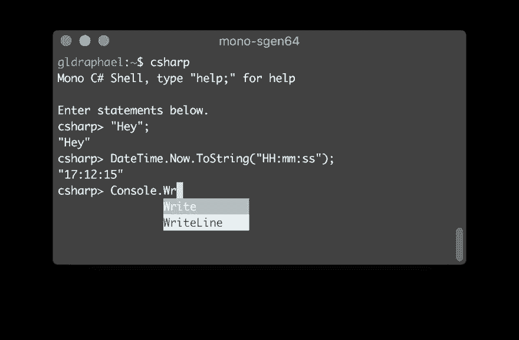
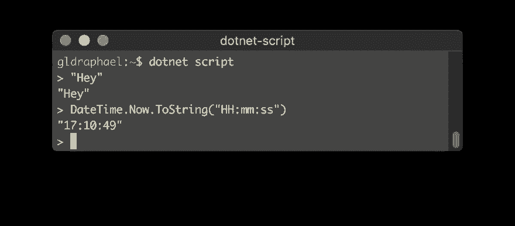

# 使用 mono 或 dotnet-script 的 C# REPL

> 原文：<https://dev.to/galdin/c-repl-using-mono-or-dotnet-script-nfe>

很多时候，我想做的就是检查一行代码是否如我所想的那样。对于这样的用例，我一直是 LinqPad 的超级粉丝。但它只适用于 Windows 系统，这很糟糕，因为我的大部分开发工作都是在 Macbook 上完成的。

几天前，我开始在谷歌上搜索，惊喜地发现了两个不错的选择:

## 单刀直入 REPL

1.  安装单声道。
2.  在您的终端中键入`csharp`启动 REPL。

它看起来是这样的:

[T2】](https://res.cloudinary.com/practicaldev/image/fetch/s--1Z7cpOdF--/c_limit%2Cf_auto%2Cfl_progressive%2Cq_auto%2Cw_880/https://gldraphael.com/conteimg/2018/10/Screen-Shot-2018-10-13-at-17.13.13.png)

REPL 在这里被记载为。

## 这个。NET Core dot NET-脚本全局工具

1.  安装。网芯。
2.  使用`dotnet tool install -g dotnet-script`安装全局工具。
3.  在你的终端输入`dotnet script`。

它看起来是这样的:

[T2】](https://res.cloudinary.com/practicaldev/image/fetch/s--RtgMJx55--/c_limit%2Cf_auto%2Cfl_progressive%2Cq_auto%2Cw_880/https://gldraphael.com/conteimg/2018/10/Screen-Shot-2018-10-13-at-17.10.51.png)

这个工具涵盖了基本 REPL 之外的许多用例，它们都记录在它的 [GitHub repo](https://github.com/filipw/dotnet-script) 中。

对我来说，一个简单的智能 REPL 就是我想要的！