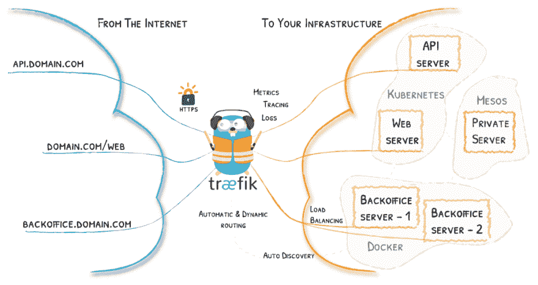
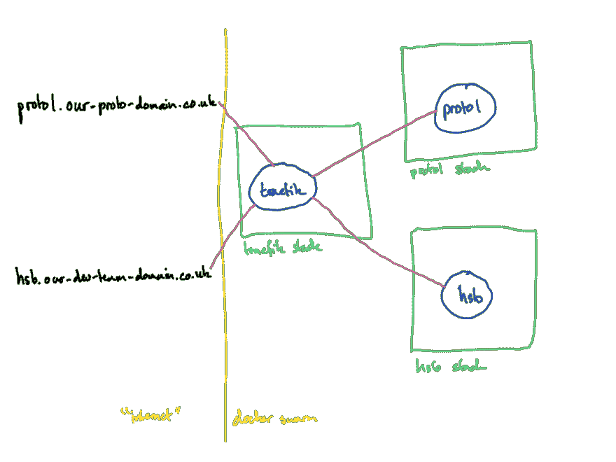

# 使用 trfik 缓解应用堵塞

> 原文：<https://dev.to/neilbartley/calming-app-jams-with-trfik-3b7b>

这最初发布在 FlexMR 开发博客上。

在 FlexMR 我们大量使用“原型优先”的方法。我们发现，与花费时间将第三方工具(或想法)整合到我们现有的工具(或想法)中相比，制作一个与第三方工具(或想法)集成的独立实现要容易得多，只是为了决定扔掉它并尝试不同的方式。

正如你所料，这会产生很多应用程序。NGINX(服务器的“接线盒”)的配置开始变得更加笨拙。新(旧)服务器配置和 SSL 证书开始堆积。将 NGINX 配置转移到一个单独的 git 存储库更整洁，但它没有解决底层问题。我开始四处寻找更适合我们用例的解决方案。

我们的原型基础设施设置(碰巧的是，一个名为 Hairy Slackbot 的内部工具——将来会有更多介绍)位于一个运行 Docker Swarm 模式的专用服务器上(因此它可以在我们需要时进行扩展)。

我对反向代理解决方案的愿望清单:

*   最少的配置，最好是在应用程序端
*   可攀登的
*   轻松使用 [LetsEncrypt](https://letsencrypt.org/) 生成证书(提供和更新)
*   很高兴拥有(只是因为我们现在不需要):负载平衡

我看了流行的 [nginx-proxy](https://github.com/jwilder/nginx-proxy) 和[docker-letsencrypt-nginx-proxy-companion](https://github.com/JrCs/docker-letsencrypt-nginx-proxy-companion)但是，本着实验的精神，我想我应该尝试一下新的。

### [树](#tr%C3%A6fik)

[T2】](https://res.cloudinary.com/practicaldev/image/fetch/s--j9l9t-lw--/c_limit%2Cf_auto%2Cfl_progressive%2Cq_auto%2Cw_880/https://cdn-images-1.medium.com/max/300/1%2AvmIbVVtdPASC7bHBvY7JAA.png)

> trfik 是一个现代化的 HTTP 反向代理和负载平衡器，使部署微服务变得简单。Træ fik 可与您现有的基础设施组件集成，并自动、动态地进行自我配置。将 trfik 指向您的 orchestrator 应该是您需要的唯一*配置步骤。*

[T2】](https://res.cloudinary.com/practicaldev/image/fetch/s--69nvStY_--/c_limit%2Cf_auto%2Cfl_progressive%2Cq_auto%2Cw_880/https://cdn-images-1.medium.com/max/1024/1%2AtxAxvAwECxvFKHMQBQ8zjw.png)

在下面的例子中，我们只涉及 Træ fik 功能的一小部分。我们的目标是:

*   新服务可以部署到我们的开发服务器上，而无需在应用程序存储库之外进行任何更改。
*   由 [LetsEncrypt](https://letsencrypt.org/) 自动提供(和更新)新的 SSL 证书。

### 给我看看一些代码！

或者，如果您真的感兴趣，下一节中有一个资源库和示例演练。

#### 我们拥有了什么

在我上面描述的例子中，我为 hsb 和 proto1 应用程序以及 nginx 定义了单独的栈。nginx 曾经是 hsb 堆栈的一部分，因为它是开发服务器上的第一个堆栈，一旦我们开始添加更多的应用程序，它就会被分离出来。

每个应用都有自己的 git 存储库，docker 堆栈文件定义了它在 swarm 中的运行方式(有多少实例、内存和 CPU 限制、网络细节)。我们通过 CI 进行部署。

#### 新世界

[T2】](https://res.cloudinary.com/practicaldev/image/fetch/s--k8qtvBcj--/c_limit%2Cf_auto%2Cfl_progressive%2Cq_auto%2Cw_880/https://cdn-images-1.medium.com/max/890/1%2Abn2gW_eYr5V9VXQoN4106w.png)

#### 堆栈 1:树

部署时使用:docker stack deploy-compose-file traefik-stack . yml-with-registry-auth traefik