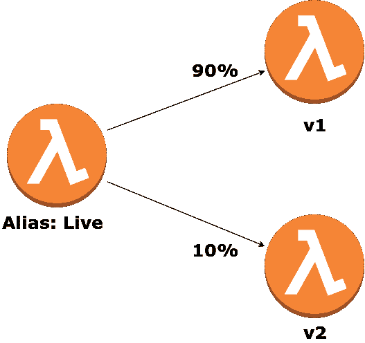
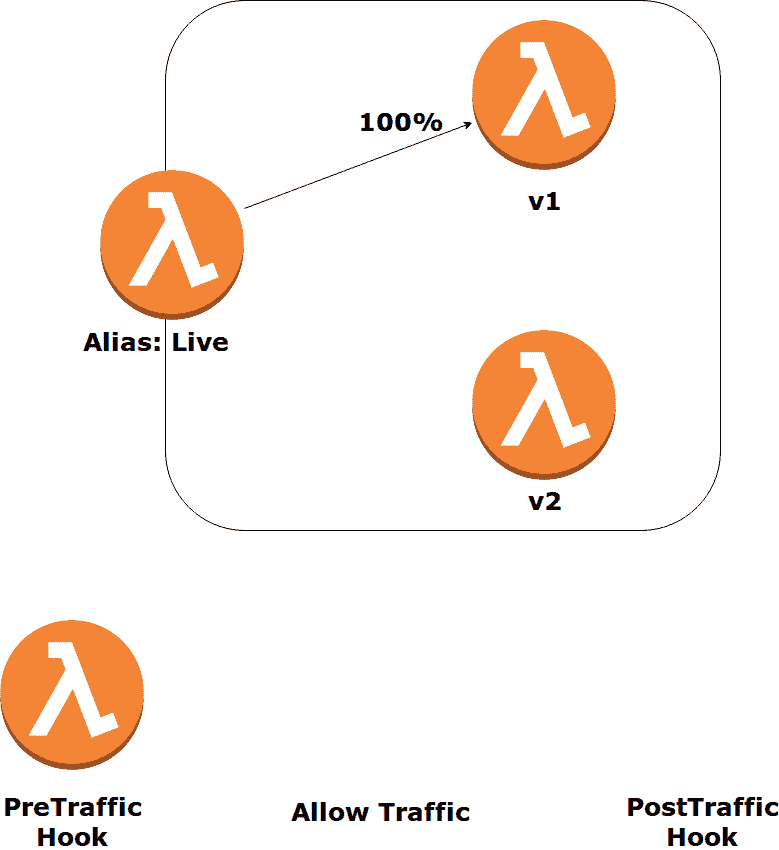

# 无服务器应用中的 Canary 部署

> 原文：<https://dev.to/davidgf/canary-deployments-in-serverless-applications-2n3d>

*本帖原载于[https://medium . com/@ Da _ vidgf/canary-deployments-in-server less-applications-b 0 f 47 fa 9b 409](https://medium.com/@Da_vidgf/canary-deployments-in-serverless-applications-b0f47fa9b409)*

在本帖中，我们将介绍不同的 AWS 服务和特性，这些服务和特性支持 Lambda 函数的 canary 部署，尽管如果你只是想安全地部署你的函数，而对细节不感兴趣，你可以查看 [Canary 部署无服务器插件](https://github.com/davidgf/serverless-plugin-canary-deployments)。

在无服务器应用程序中的部署是一个一次性的过程，当我们发布任何功能的新版本时，每个用户都会点击新版本。我们必须对新版本充满信心，因为如果出现任何问题，并且函数包含错误，我们所有的用户都将遇到糟糕的问题。然而，AWS 最近引入了一个新功能，可以使我们的部署过程更加可靠和安全:使用别名的流量转移。

## 别名流量转移如何帮助我们？

通常，部署 Lambda 函数涉及到所有的函数调用都将执行新代码，要么是因为我们正在更新$Latest，要么是因为我们正在将一个别名指向一个新版本。这意味着，如果出现任何问题，100%的调用都会出错，我们应该快速回滚到以前的版本，或者更糟的是，我们可能没有注意到错误，并使我们的系统处于不一致的状态。然而，随着别名流量转移的引入，我们现在可以在一个别名上指定**版本权重**，以便不是所有的调用都命中新版本，而是只有一定量的流量被路由到最新版本。这意味着 Lambda 将自动在两个最新版本之间**负载平衡**请求，允许我们在完全替换前一个版本之前检查新版本的行为，最大限度地减少可能的 bug 的影响。

[T2】](https://res.cloudinary.com/practicaldev/image/fetch/s--rc6a-ZN2--/c_limit%2Cf_auto%2Cfl_progressive%2Cq_auto%2Cw_880/https://cdn-images-1.medium.com/max/800/1%2Am6LCP4U5uvQYYJHuM4-MYQ.png)

当我们看到新版本行为正确时，我们可以逐渐更新它的权重，增加它接收的负载。我们可以在 AWS 控制台中，通过 [CLI](https://aws.amazon.com/cli/) 或使用一些自动处理权重更新的[开源工具](https://github.com/aws-samples/aws-lambda-deploy)来做到这一点，但有一种更好的方法来处理 Lambda 函数部署。

## 自动化部署流程

即使能够进行流量转移是一个巨大的飞跃，让我们承认手动更新权重(或部署我们自己的管理系统)并不方便。别担心，像往常一样 AWS 会保护我们。有了 **CodeDeploy** ，我们就可以指定我们希望流量如何随时间转移，它**会自动调整**的**权重**。有三种不同类型的部署首选项:

*   **Canary:** 我们指定我们希望转移的流量百分比以及我们希望部署持续的时间。因此，例如，如果我们通过 10%和 30 分钟，则这 10%的流量将在半小时内被路由到新版本。这段时间过后，所有流量都将转移到新版本。
*   **线性:**路由到新版本的流量将根据提供的百分比和间隔增加。因此，如果我们将其配置为每 5 分钟增加 10%的流量，CodeDeploy 将更新别名权重，以 5 分钟为间隔向新版本添加 10%,直到所有流量都已转移。
*   **一次全部:**所有流量立即转移到新版本。这样，我们让 CodeDeploy 完成部署过程中的所有繁重工作，并根据我们的偏好更改别名权重。流量将逐渐转移，与此同时，我们可以检查我们的新功能是否正常运行，如果发现任何异常，就取消部署。我们如何自动化回滚过程，以便我们不必手动检查系统的运行情况？CodeDeploy 也考虑到了这一点。

## 回滚到上一个 Lambda 函数版本

CodeDeploy 允许我们配置一个 **pre** 和一个 **post** 流量转移 **hook** ，这实际上是在流量转移过程之前和之后触发的 Lambda 函数。他们适合执行任务，比如运行**集成测试**。CodeDeploy 希望在一个小时内得到钩子[成功或失败的通知，否则它会认为钩子失败了。在任何情况下，如果挂钩因未调用 CodeDeploy 或显式调用它而失败，部署将被中止，所有流量将转移到旧的功能版本。](https://docs.aws.amazon.com/codedeploy/latest/userguide/reference-appspec-file-structure-hooks.html)

钩子并不是我们检查我们的函数是否按预期运行的唯一方法，因为我们可以为 CodeDeploy 提供一个 **CloudWatch 警报**列表来监控部署过程。当流量转移开始时，CodeDeploy 将跟踪这些警报，取消部署，如果其中任何一个**触发**，则**将**回滚到之前的功能版本。

[T2】](https://res.cloudinary.com/practicaldev/image/fetch/s--0uUl4Mpb--/c_limit%2Cf_auto%2Cfl_progressive%2Cq_66%2Cw_880/https://cdn-images-1.medium.com/max/800/1%2AMcMmpykg-8d2cSiaUDvPiw.gif)

挂钩和警报允许我们监控整个部署过程。我们可以在将任何流量路由到新功能版本之前执行一些测试，在流量转移过程中跟踪警报，并在所有流量到达新版本后立即运行更多测试。如果 CodeDeploy 注意到这些步骤中有任何错误，它将自动回滚到旧的、稳定的功能版本。

## 云形成万物

所有这些听起来都很好，但是我们如何设置它呢？好吧，手动做似乎不是一个合理的选择，但幸运的是 AWS 有一个定义和供应基础设施的出色服务: **CloudFormation** 。这个工具为我们提供了一种在 YAML 或 JSON 模板中建模系统的方法，我们可以用它来创建相关 AWS 资源的集合。正如你所猜测的，模板的语法非常复杂，我们可以在其中定义 AWS 生态系统中几乎任何可以想象的资源及其配置。他们甚至建立了一个简化的语法来定义无服务器应用程序，即[无服务器应用程序模型](https://docs.aws.amazon.com/lambda/latest/dg/serverless_app.html)，尽管它只支持 AWS 资源的一小部分。在无服务器环境中处理云形成的最佳方式无疑是[无服务器框架](https://github.com/serverless/serverless)，它提供了一个简单易用的 DSL，然后它变成了云形成模板，这样我们就不必处理它的复杂性。然而，当 DSL 不足时，我们仍然可以包含大量的 CloudFormation 模板语法来创建我们需要的资源。结果是框架没有实现 canary 部署特性，所以我们必须自己指定资源。因此，我们需要包括以下内容:

1.  CodeDeploy::应用程序。
2.  具有 CodeDeploy 的 AWSCodeDeployRoleForLambda 和 AWSLambdaFullAccess 权限的 IAM::Role。
3.  每个函数的 CodeDeploy::DeploymentGroup，其中我们将指定部署首选项类型和警报。
4.  包括 CodeDeployLambdaAliasUpdate 在内的每个函数的 Lambda::Alias，其中我们指定它所属的 CodeDeploy 应用程序和 DeploymentGroup，以及关联的钩子。
5.  无服务器框架总是在任何事件发生时触发$Latest Lambda 函数版本，因此我们必须用事件源中新创建的别名替换对该函数的任何引用。

如果这听起来很麻烦…那只是因为它是。幸运的是，无服务器框架是真正模块化的，有大量的插件来补充它的功能，所以你可以使用 **[无服务器插件金丝雀部署](https://github.com/davidgf/serverless-plugin-canary-deployments)** 以更方便的方式创建所有这些资源(注意:我是插件的作者，欢迎任何贡献、评论或功能请求)。

祝安全部署愉快！

*参考:*

*   [https://docs . AWS . Amazon . com/lambda/latest/DG/lambda-traffic-shift-using-aliases . html](https://docs.aws.amazon.com/lambda/latest/dg/lambda-traffic-shifting-using-aliases.html)
*   [https://AWS . Amazon . com/blogs/compute/implementing-canary-deployments-of-AWS-lambda-functions-with-alias-traffic-shift/](https://aws.amazon.com/blogs/compute/implementing-canary-deployments-of-aws-lambda-functions-with-alias-traffic-shifting/)
*   [https://docs . AWS . Amazon . com/lambda/latest/DG/automating-updates-to-server less-apps . html](https://docs.aws.amazon.com/lambda/latest/dg/automating-updates-to-serverless-apps.html)