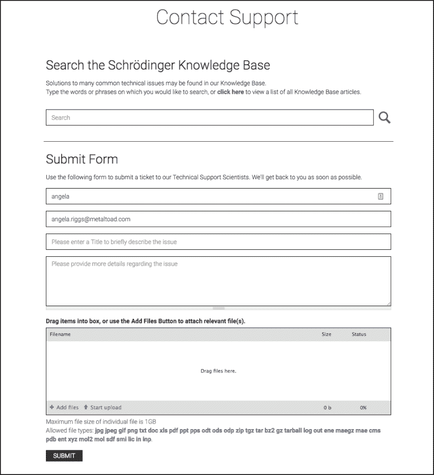
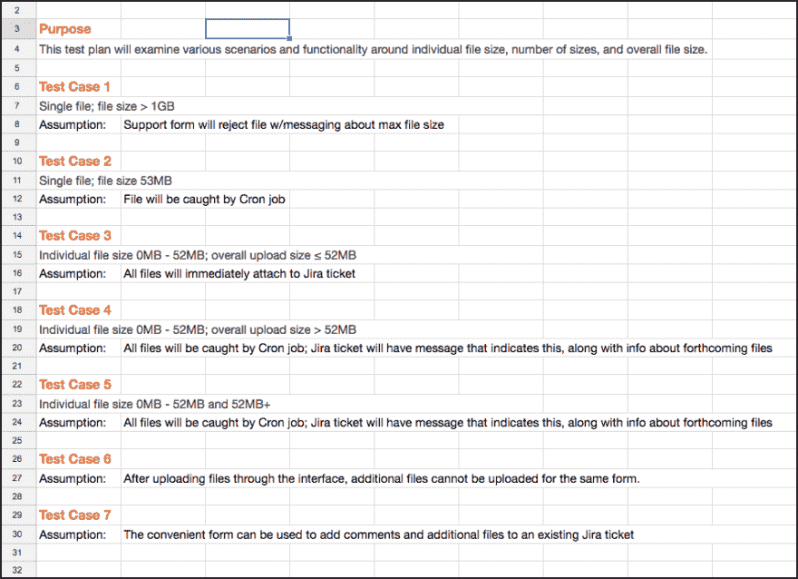
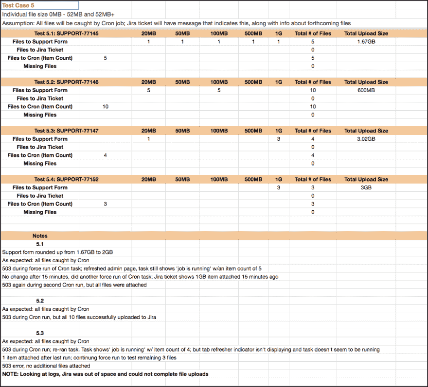

# 案例研究:薛定谔支持形式

> 原文：<https://dev.to/angelariggs/case-study-schrodinger-support-form-1b1>

*本文最初发表在我的博客上，[http://Angela Riggs . github . io](http://angelariggs.github.io/blog/schrodinger-testing-case-study)。*

* * *

去年，我们的工程副总裁向我提出了一个要求。我们的一个长期客户的网站功能一直存在问题，托尼需要我做一些调查，找出故障发生的原因，并提出修复建议。

## 特性

这个客户为科学家创建专有的建模软件，我们建立的网站包括一个支持表单，客户可以使用它来报告软件的问题。支持表单为他们的技术支持科学家创建吉拉票证，并且只对登录用户可用。登录后，用户必须填写姓名、电子邮件、职位和描述字段。他们可以选择添加和上传文件。

[T2】](https://res.cloudinary.com/practicaldev/image/fetch/s--SY9p3lCr--/c_limit%2Cf_auto%2Cfl_progressive%2Cq_auto%2Cw_880/https://thepracticaldev.s3.amazonaws.com/i/djaedddy94bcwjfb4rfq.png)

支持表单经历了几次迭代，以改进功能、用户体验和性能。在最初的实现中，提交带有附件的支持表单会立即完整地上传所有文件。这意味着表单一次上传多达 52GB 的文件。在后来的迭代中，我们将 Cloudfront 放在适当的位置来帮助文件存储。结果，一些文件提交开始失败——Cloudfront 有一个 30 秒的自动超时，多个或更大的文件上传需要更长的时间。为了应对这些失败，我们决定“分块”附件。当提交表单时，一张吉拉的机票立即被创建。上传的文件要么附加到票证，要么由 Cron 作业捕获，该作业上传部分文件，直到所有文件附件都完成。这种“分块”上传方法，而不是一次性上传，避免了 Cloudfront 超时。

当 Tony 来找我谈创建测试计划时，有一些我们的客户关心的问题。第一个是文件附件仍然无法上传，这些失败似乎是不一致的；也就是说，这些失败似乎没有一个模式或特定的场景。此外，负责检查文件附件的 Cron 任务没有持续运行。表单周围的行为不会被记录到任何地方，所以更难确定哪里出了问题(或者甚至它们在哪里正常工作)。最后，我们的客户最近要求能够为客户上传新的信息和文件到现有的吉拉门票通过一个单独的形式，可以通过电子邮件发送给他们。

总而言之，我们有:

*   客户问题升级
*   现有功能的最新更新
*   缺乏对预期功能的理解
*   不一致的故障
*   多种类型的故障

这看起来不是接手的好时机。那么我们从哪里开始呢？

## 客户端

除了任何技术问题，我们有一个客户感到担心，并对我们为他们建立的网站和功能失去了信心。所以我做的第一件事就是给我们的客户发电子邮件，让他们知道我正在优先考虑这件事。

## 期望

为了真正测试出错的地方，我必须知道对功能的期望是什么。我花了一些时间研究我们编写的相关模块中的代码，查阅了详细描述功能工作和验收标准的吉拉项目标签，并与主要负责该功能的开发人员进行了交谈。预计支持表的基本要求如下:

*   不管附加了多少文件，最大总文件大小为 1GB。
*   如果总文件大小小于 52MB，所有文件将在提交表单时上传到吉拉机票。
*   如果总文件大小为 52MB 或更大，一些文件将被立即上传到吉拉票证，而其他文件将被 Cron 作业捕获并分块上传，直到完成
*   Cron 作业的最大运行间隔为 10 分钟
*   客户可以通过电子邮件收到一个新表格的链接，以便上传更多文件，并在现有的吉拉门票上添加评论

## 测试计划

回到技术方面，我做的第一件事是创建一个测试计划。我写了一个快速总结，很像这篇博文的开头，列出了所有发生的失败。然后，我根据我们对支持表单的预期功能所做的假设，将该计划提炼为 7 个测试用例。测试案例包括:

*   关于最大文件大小的警告
*   单个文件附件，大小 53mb
*   多个文件附件，总大小小于 52mb
*   单个文件附件，总大小超过 52mb
*   多个文件附件，每个在 0-52mb 和 52mb+之间变化
*   在第一轮之后、提交表格之前上传附加文件
*   使用电子邮件表单向现有吉拉票证添加注释和附加文件

[T2】](https://res.cloudinary.com/practicaldev/image/fetch/s--3lVzNLkC--/c_limit%2Cf_auto%2Cfl_progressive%2Cq_auto%2Cw_880/https://thepracticaldev.s3.amazonaws.com/i/y5fyrhft2dsq6v40zvc5.png)

对于每一个测试用例，我都详细列出了至少两个具有不同参数的测试示例，包括边缘、边界和拐角情况。为了尽可能地模拟生产环境，我在我们的登台环境上运行了所有测试，因为这是唯一一个用 Cloudfront 设置的环境。该环境还与一个测试吉拉帐户集成在一起。

[T2】](https://res.cloudinary.com/practicaldev/image/fetch/s---b816AK8--/c_limit%2Cf_auto%2Cfl_progressive%2Cq_auto%2Cw_880/https://thepracticaldev.s3.amazonaws.com/i/8v64xkg8pajg2qky8ohe.png)

## 文档化

总之，我最终创建了大约 20 个测试用例场景，并在几天的时间内完成了测试。我为自己写了一份总结，以确保我理解了这些问题。当我测试时，我详细说明了每个测试的规格，以及它们背后的假设和实际结果。完成后，我创建了一份正式的报告，阐述了测试的结果，以及我们实施的解决方案。

概述并准备好所有的测试用例场景对我的生产力和效率非常重要。提前考虑场景确保我捕捉到表单可能成功或失败的所有可能和不可能的方式。

在测试过程中，我还发现并使用了一个非常方便的命令。`mkfile`命令创建指定大小的空文件，这在测试几十个文件附件和上传时显然很有帮助。我为我的每个测试用例创建了一个文件夹(例如`test-case-1`，然后使用`mkfile`命令来建立我每个测试需要的文件(例如`mkfile -n 20m ~/Desktop/test-case-5/test3.pdf`)。

一次又一次，我听说开发人员讨厌文档。我听说这需要太多的努力，远离实际的编码，很无聊，很痛苦。

没错。所有这些事情。但是文档是开发工作流程中非常重要的一部分。这对你自己很有用，当你回头迭代你写的代码时——无论是一个小时后还是一个月后，很容易忘记你在思考过程中的位置。文档有助于给你正在做的工作提供背景。如果给自己一个环境是有用的，你，沉浸在正在做的实际工作中的人，想想这对其他人有多有帮助！它让其他人了解你的背景和你对他们正在看的作品的思考过程。

## 结果

作为我的测试结果，我们发现了支持表单失败的位置和原因，并且重构了支持表单的代码以提供一致的行为。现在，当总文件大小超过 52MB 时，所有文件都将被 Cron 作业捕获，并分块上传，直到完成。此外，创建的吉拉票据将包括关于预期传入附件的消息。我们还意识到 1GB 的限制适用于单个文件，而不是整个文件的大小。

最有用的变化之一实际上也是最简单的——通过 Watchdog 设置支持表单来记录行为。成功和失败都将被记录，被跟踪的行为包括吉拉票证创建、票证更新和文件附件。日志使得确认预期行为、跟踪和排除错误变得更加容易。例如，当我在测试中开始得到 503 错误时，我可以查看日志，发现吉拉空间不足，无法接受更多文件。

一旦第一轮测试完成，改进完成并重新测试，我就在报告中写下一切。我包含了问题和测试目标的高层次视图，以及我的过程描述和结果总结。由于我的工作，支持表单成为了一个值得骄傲的特性——它更加一致，更容易理解，并且为我们的客户和他们的顾客改进了功能。测试和随后的改进也让客户对我们的承诺放心，让他们对我们的公司和我们的工作更有信心。