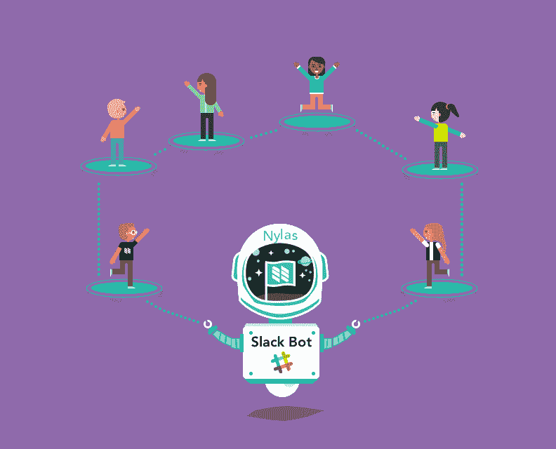
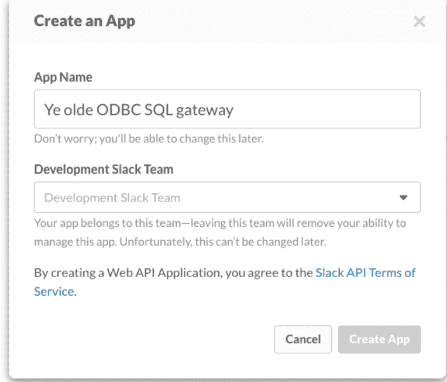

# 庆祝大规模成功:我们如何构建我们的 Salesforce Slackbot

> 原文：<https://dev.to/nylas/celebrating-success-at-scale-how-we-built-our-salesforce-slackbot-3jg>

[T2】](https://www.nylas.com/blog/celebrating-success-at-scale-how-we-built-our-salesforce-slackbot)

Nylas API 每天为客户处理超过 1 亿个 API 请求，从新兴的初创公司到财富 100 强公司。如果没有一个不仅一起努力工作，而且一起庆祝成功的紧密团结的团队，这是不可能的。

在一家快节奏的公司，这可能很难做到，尤其是在东西海岸都有办公室的公司。但是，通过一点代码和一些 API，我们连接了一个 Slackbot，让每个员工都可以实时了解加入 Nylas 社区的新客户。

[T2】](https://res.cloudinary.com/practicaldev/image/fetch/s--iMnQjOb7--/c_limit%2Cf_auto%2Cfl_progressive%2Cq_auto%2Cw_880/https://cdn2.hubspot.net/hubfs/3314308/slackbot-screenshot-edited.png)

## **摆脱销售锣**

如果销售锣响了，但周围没有人听到，这有什么不同吗？大概不会。

凝聚力和透明度对于建立一个高效、快乐的团队至关重要。Nylas 在纽约、旧金山和国外都有团队成员。因此，无论我们如何努力地敲销售锣，也不是每个员工都能听到。

我们制作了一个 Slackbot 来做销售人员做不到的事情——让每个人都实时了解情况。

## **slack bot 如何帮助推动 Nylas 前进**

刚刚 [完成了 1600 万美元的 B 轮融资](https://www.nylas.com/blog/announcing-our-16m-series-b) 在 [星火资本](http://www.sparkcapital.com/) 的带领下，我们正在继续壮大我们的团队，以更好地服务于我们快速增长的客户群。 ( [查看我们这里开放的职位](https://www.nylas.com/jobs/) 申请。当你加入时，准备好庆祝你的懈怠-莫吉游戏。)

作为一个公司，一个不断扩大的团队让良好的沟通和透明成为我们共享成功的重要因素。

另一方面，如果没有我们的客户，我们就不会有今天。我们的 Slackbot 有助于确保 Nylas 的每个人——从我们的运营团队到我们的工程师——都认可我们的客户，并感受到他们对我们公司发展的影响。

看到众多公司选择 Nylas 来支持他们的应用程序，团队为我们所做的一切感到自豪，并激励我们在未来继续提供卓越的客户体验。

## **如何构建自己的 sales force slack bot**

为了创建我们的 Slackbot，我们将我们的 Salesforce 实例连接到 Slack，并在 Salesforce 中构建了一个流程，以便每当 Salesforce 交易进入“Closed - Won”状态时，在我们的#general channel 中发布。现在，我们都可以发送👏交易结束时的表情符号。以下是你如何做同样的事情。

## **建立宽松的环境**

首先，让我们创建一个新的通道，在那里我们可以测试我们将要构建的机器人。这确保了我们在发送测试消息时不会意外地[@这里](https://dev.to/here)一个受欢迎的频道。

接下来，您将 [创建一个 Slack 应用](https://api.slack.com/slack-apps#creating_apps) ，并通过输入您组织的 Slack 凭证对其进行认证。

[T2】](https://res.cloudinary.com/practicaldev/image/fetch/s--DtnhXDCM--/c_limit%2Cf_auto%2Cfl_progressive%2Cq_auto%2Cw_880/https://cdn2.hubspot.net/hubfs/3314308/Screen%2520Shot%25202018-09-06%2520at%252011.58.49%2520AM.png)

现在，我们有了 Slack 频道来更新我们的 Salesforce 和 一个 Slack 应用来更新 。但是我们仍然需要让 Slack 和 Salesforce 互相交流。

为此， [为您的松弛测试通道创建一个传入的 webhook](https://api.slack.com/incoming-webhooks) 。这将允许 Salesforce 向 Slack 发送信息，以便 Slack 可以相应地采取行动。

## **设置您的 Salesforce 环境**

我们建立的那些 Slack webhooks 渴望获得一些 Salesforce 数据。我们将设置我们的 Salesforce 实例来实现这一点。创建一个 Apex 类，该类收集关于已完成交易的数据，构建 Slack 消息，并将消息发布到我们在 Slack 中创建的 webhook 地址。如果你在这方面需要一些指导，Taun Abdeen 写了一篇很棒的 LinkedIn 帖子，介绍了这一步的来龙去脉。

一旦您在 Slack 中设置了向测试 webhook 发送消息的类，我们将需要在 [Process Builder](https://help.salesforce.com/articleView?id=process_overview.htm) 中创建一个工作流。

我们正在构建的流程将基于特定事件采取特定行动。将 Process Builder 中的事件定义为机会变为“已结束-成功”时。接下来，创建一个从关闭的机会收集数据并将其传递给 Apex 类的操作，这样它就可以创建并发布时差消息。

一旦您在 Process Builder 中创建了事件和操作，激活流程，我们就可以开始比赛了。

## **测试你的 Slackbot**

一旦您的 Salesforce 环境和 Slack 应用程序相互对话，就该测试您的机器人了。尝试将演示机会移至“已达成交易”。您应该会在您设置的测试通道中看到一条消息。

现在，让我们把这些警报带到最重要的时刻——普通频道。

## **将所有这些整合在一起**

最后，为您的#general channel 创建一个新的 webhook，并更改您的 Apex 类，使其发布到与#general 相关的 webhook，而不是您的测试通道。

之后，是时候坐下来准备庆祝了。🎉