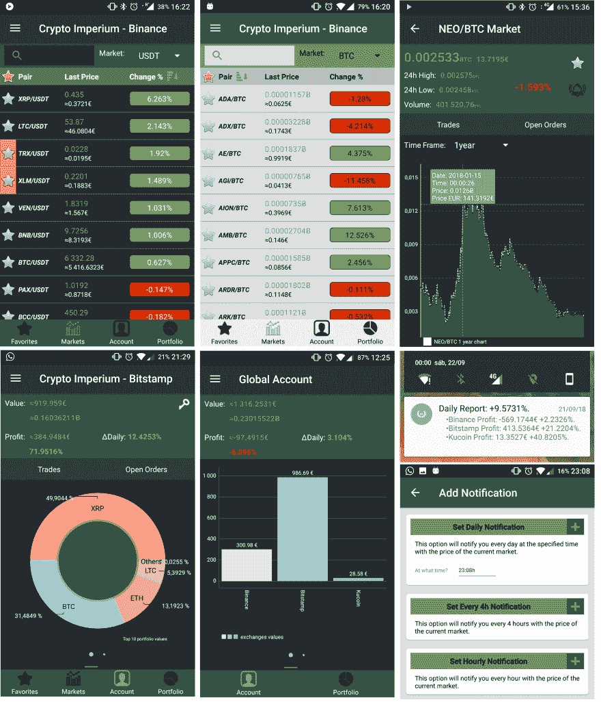

# 秘密帝国

> 原文::1230【https://dev . to/pina 14/crypto-empire-ma 3】

有一些投资组合管理应用程序具有良好的功能，如 Delta 或 BitUniverse，但在现实中，我不认为它们涵盖了一些重要的功能，这些功能对于在所有交易所跟踪您的投资组合至关重要。每个密码爱好者都知道，当你真正进入密码世界时，很难只停留在一个交易所。市场上的硬币种类繁多，一个交易所拥有所有硬币几乎是不可能的，所以每个人在多个交易所都有账户，从某种程度上来说，跟踪你所有的资产几乎是不可能的。随之而来的是投资组合管理应用的想法。作为一名软件开发学生，我决定自己创造一个更好的解决方案来追踪我的加密帝国。因此，开始开发加密帝国应用程序。

Crypto Imperium 允许您在一个应用程序中跟踪多个交易。
功能:

*   访问与用户账户相关的数据(账户价值、利润、交易、未结订单)。
*   检查市场利率和图表(1 小时，1 天，7 天，1 米，3 米，6 米，1 年)。
*   检查你拥有的每项资产的价值、利润和盈亏平衡。
*   设置每小时、每 4 小时和每天通知。
*   您所有已配置的交易所和全球账户的每日报告。
*   关于加密的新闻。
*   检查用 API 密钥配置的所有交易所的全球账户价值和利润。
*   通过图表查看交易所之间投资组合价值和利润的分布。
*   检查所有交易所拥有的资产及其在交易所之间的分布情况。

在上次更新中，我介绍了在所有交易所咨询您的全球帐户的可能性，您在应用程序中配置了 API 密钥。可以在没有配置 API 键的情况下使用该应用程序，但它不再是一个投资组合管理应用程序，而是一个咨询市场价格、新闻和接收通知的应用程序。

这里有一些应用程序的截图:

**注:图中所有数值均为示例值。**

如果你对这个应用感到好奇，你可以在这里下载:
[https://play.google.com/store/apps/details?id = app dev . pina . crypto imperium](https://play.google.com/store/apps/details?id=appdev.pina.cryptoImperium)

《帝国密码》仍处于早期阶段，因此在这个阶段，每一个反馈都很重要。您可以通过以下方式向我提供反馈:

*   电子邮件:[crypto.imperium.app@gmail.com](mailto:crypto.imperium.app@gmail.com)
*   推特:[https://twitter.com/Crypto_Imperium](https://twitter.com/Crypto_Imperium)
*   https://www.facebook.com/groups/389413551546434/[脸书集团](https://www.facebook.com/groups/389413551546434/)