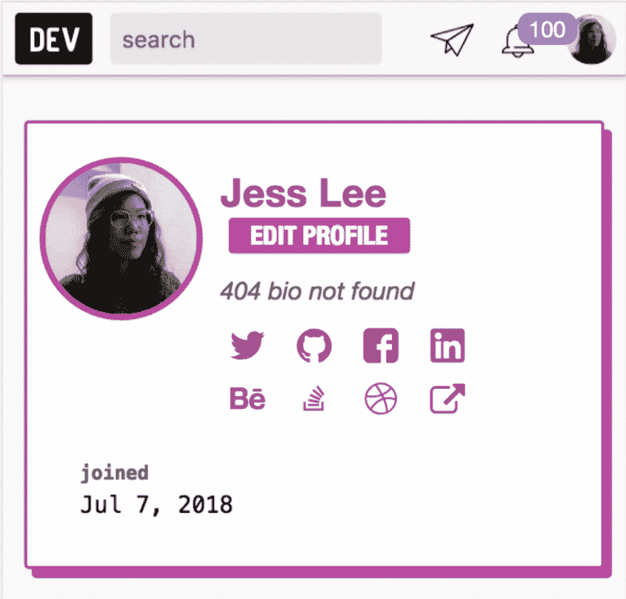

# Changelog:在您的个人资料中添加更多链接

> 原文：<https://dev.to/jess/changelog-add-more-links-to-your-profile-198e>

我们知道许多 DEV 成员也是其他平台的成员。因为您的开发人员档案旨在包含您的开发人员身份的所有元素，所以我们使从其他社区共享您的档案变得更加容易。

首先，我们添加了:Behance、Dribbble、Stack Overflow、LinkedIn 和脸书。你可以期待更多的选择。若要更新您的个人资料，[请访问您的设置](https://dev.to/settings/profile)。

我没有所有这些帐户，所以这是从开发截图😋

[T2】](https://res.cloudinary.com/practicaldev/image/fetch/s--9HiZ8tjN--/c_limit%2Cf_auto%2Cfl_progressive%2Cq_auto%2Cw_880/https://thepracticaldev.s3.amazonaws.com/i/t914ij8kgf6no6b5irfc.png)