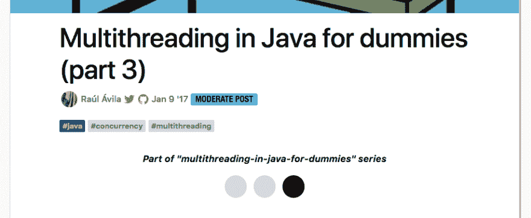

# Changelog:创建一系列帖子

> 原文：<https://dev.to/ben/changelog-create-series-of-posts-4o63>

更新:自从这篇文章发表以来，系列设计已经改变，但是文章的细节仍然是准确的。

这是一个有趣的问题。

这个功能是在模型层*构建的，但是为了寻找合适的用户体验，我们从来没有完全发布它。如果我没记错的话，这个基本特性在我开发 dev.to solo 的时候就已经存在了。*

我所说的功能是人们创建“系列”帖子的能力。

这是一个系列文章的例子(由管理员手动链接)

 [## Java 中的多线程技术(第 3 部分)

### 劳尔Á维拉 1 月 9 日 177 分钟阅读

#java #concurrency #multithreading](/raulavila/multithreading-in-java-for-dummies-part-3)

截图:

[T2】](https://res.cloudinary.com/practicaldev/image/fetch/s--K5q2Eurj--/c_limit%2Cf_auto%2Cfl_progressive%2Cq_auto%2Cw_880/https://duaw26jehqd4r.cloudfront.net/items/1m0B1v0P1l26353M413t/Image%25202018-10-29%2520at%25205.40.11%2520PM.png)

现在你可以创建自己的系列。如果你使用的是编辑器的“v1 ”,你可以将`series:`添加到 frontmatter 中。为应该出现在专题中的任何文章指定相同的系列名称。

如果您使用的是“v2 beta ”,您可以用一种用户界面更容易看到的方式添加系列名称。

相关:

 [## 我们有一个新的测试版编辑器，你可以试试

### 开发团队的 Ben Hal pern 10 月 9 日 181 分钟阅读

#changelog #meta](/devteam/changelog-we-have-a-new-beta-editor-you-can-try-4hl9)

你可能同意我的观点，这不是宇宙中最用户友好的管理方式，但是我认为这不应该永远等待下去。必须运送一些东西。

这绝对是在我心痒难耐的时候仓促发货的。快速移动，打破所有的东西。可以说。

因此，如果你有一系列的文章，自然地一个接一个。现在可以随意将它们添加到一个系列中。这还没有经过彻底的测试。如果你遇到了一个 bug，随时[提出一个问题](https://github.com/thepracticaldev/dev.to)，或者甚至提交一份 PR。没有压力😄

快乐编码