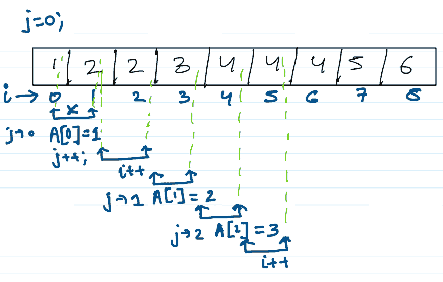
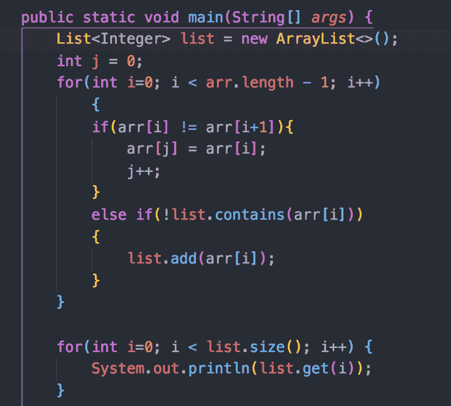

# 查找重复算法系列-一个排序后的数组作为输入。

> 原文：<https://dev.to/s_awdesh/check-if-duplicate-exists-inside-a-sorted-array-3aa5>

这是我们在早期文章中讨论的问题的延伸。

 [## 一个未排序的数组作为输入。

### 阿德什

#hashtable#array](/s_awdesh/finding-duplicates-inside-an-array---easy-version-37la)

我更喜欢这个问题，因为需要更多的思考，它迫使我们写下算法，而不需要额外的空间。解决这个问题的第一个提示是，我们如何利用输入数组已排序的事实？

每当我在一个问题语句中看到排序时，我首先想到的是“二分搜索法”,但在这种情况下不行，因为我们必须找到数组中存在的所有重复项，所以我们必须解析数组中的所有项。当数组包含“n”个元素时，解析数组中的所有元素会产生 O(n)的时间复杂度，这违背了使用二分搜索法的目的，该算法以其对数 **O(logn)** 的时间复杂度而闻名。

我们能不能利用数组中元素的排序行为得到线性时间算法，而不需要额外的空间和二分搜索法？

不如我们把每个元素和它的邻居进行比较，如果它们相似，那么把它们添加到重复元素的列表中，否则把不同的元素重新插入数组中。我们将使用两个指针来解决这个问题，一个指针用来比较元素和它的邻居，另一个用来维护不同的元素。

让我们用一个例子来看一下上面的代码:

[T2】](https://res.cloudinary.com/practicaldev/image/fetch/s--3FSt3AH7--/c_limit%2Cf_auto%2Cfl_progressive%2Cq_auto%2Cw_880/https://thepracticaldev.s3.amazonaws.com/i/52lin09gyxh2buezt879.jpeg)

[T2】](https://res.cloudinary.com/practicaldev/image/fetch/s--1Llky8Tn--/c_limit%2Cf_auto%2Cfl_progressive%2Cq_auto%2Cw_880/https://thepracticaldev.s3.amazonaws.com/i/8thjqbmgdbolcbhvbhdb.png)

**结论**

我们通过比较相邻元素来利用数组的排序属性。如果它是一个未排序的数组，我们必须使用额外的数据结构，如 Set，并且不能在线性时间内执行原地算法。

关于**寻找重复**的问题，我还有更多的变化，我想在接下来的几天里试着写出来。

敬请关注。:)