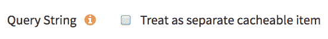
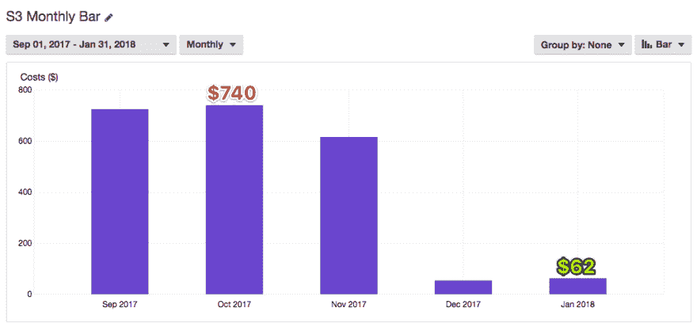
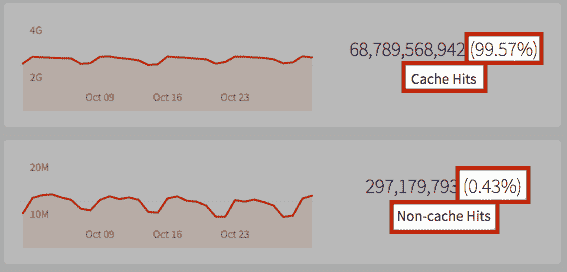
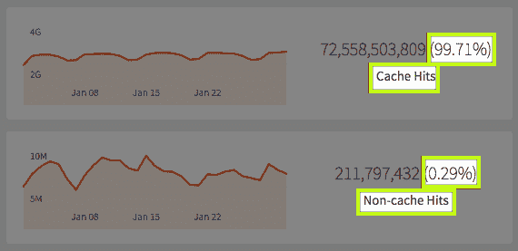

# 检查你的设置，保存疯狂的战利品

> 原文：<https://dev.to/jdorfman/check-your-settings-save-mad-loot--imn>

<small>照片由[克里斯汀罗伊](https://unsplash.com/@agent_illustrateur?utm_medium=referral&utm_campaign=photographer-credit&utm_content=creditBadge "Download free do whatever you want high-resolution photos from Christine Roy")T3】拍摄</small>

### TL；速度三角形定位法(dead reckoning)

我自 2012 年以来共同创立并领导了 [BootstrapCDN](https://www.bootstrapcdn.com/) 项目。我犯了很多错误，这里有一个我希望其他人能从中吸取教训。“一劳永逸”的 web 服务可能是福也可能是祸。无论您使用什么服务，登录并审核账单。

* * *

自 2013 年[以来，我们](https://github.com/MaxCDN/bootstrapcdn/graphs/contributors)一直将 S3 作为我们的目标商店来源。你看，S3 的魅力就在于它有多可靠/安全。那就是*的福气*。这个*诅咒*就是你很少需要登录。

去年 11 月下旬，我不得不登录检查一个设置，有一些时间消磨，所以决定检查成本浏览器。我一直知道我们的 S3 成本很高，但从来没有陷入其中，因为它从来就不是一个问题。所以我决定看看发生了什么，并在 S3 日志中挖掘，注意到奇怪的查询字符串(如`?v=1&v=2&v=3...&v=5409`)，它被视为一个独立的对象，无法缓存(在 CDN 上)，因为它一直在变化，可以说是“[缓存破坏](https://dev.to/search?q=Cache%20Busting)”。我登录 MaxCDN 控制面板，*禁用*“作为单独的可缓存项处理”。

[T2】](https://res.cloudinary.com/practicaldev/image/fetch/s--Uh_-FYuA--/c_limit%2Cf_auto%2Cfl_progressive%2Cq_auto%2Cw_880/https://thepracticaldev.s3.amazonaws.com/i/wplqb2ami7lw4ci55578.png)

这是一个简单的改变所做的:

[T2】](https://res.cloudinary.com/practicaldev/image/fetch/s--L2H-w1eT--/c_limit%2Cf_auto%2Cfl_progressive%2Cq_auto%2Cw_880/https://thepracticaldev.s3.amazonaws.com/i/ihovac3jr1cwi4pejiss.png)

### 我学到的东西

*   在我开始调查时，在我们的规模下，0.43%的非缓存命中率相当于 2.97 亿个以上的请求返回到原点，即 S3。
*   对一个月服务约 720 亿个请求的服务进行更改是很可怕的，但只要你有一个团队来帮助监控异常情况，就不要害怕。
*   不管事情进行得多顺利，登录和审计！

**变更前(2017 年 10 月)**:

[T2】](https://res.cloudinary.com/practicaldev/image/fetch/s--M2y5m4ee--/c_limit%2Cf_auto%2Cfl_progressive%2Cq_auto%2Cw_880/https://thepracticaldev.s3.amazonaws.com/i/clq81na7ltbsqv8ns5eu.png)

**变更后(2018 年 1 月):**

[T2】](https://res.cloudinary.com/practicaldev/image/fetch/s--Je2KdTjG--/c_limit%2Cf_auto%2Cfl_progressive%2Cq_auto%2Cw_880/https://thepracticaldev.s3.amazonaws.com/i/byjvlyq62fhyknmrbecq.png)

### 在关闭

写这篇文章并不容易。承认如此愚蠢的事情会让你自己被嘲笑，但我 99.57%肯定还有其他人在犯类似的错误。无论你使用什么服务，登录和审计。同时，我将找出为什么 211mm 以上的请求是缓存未命中。🤔