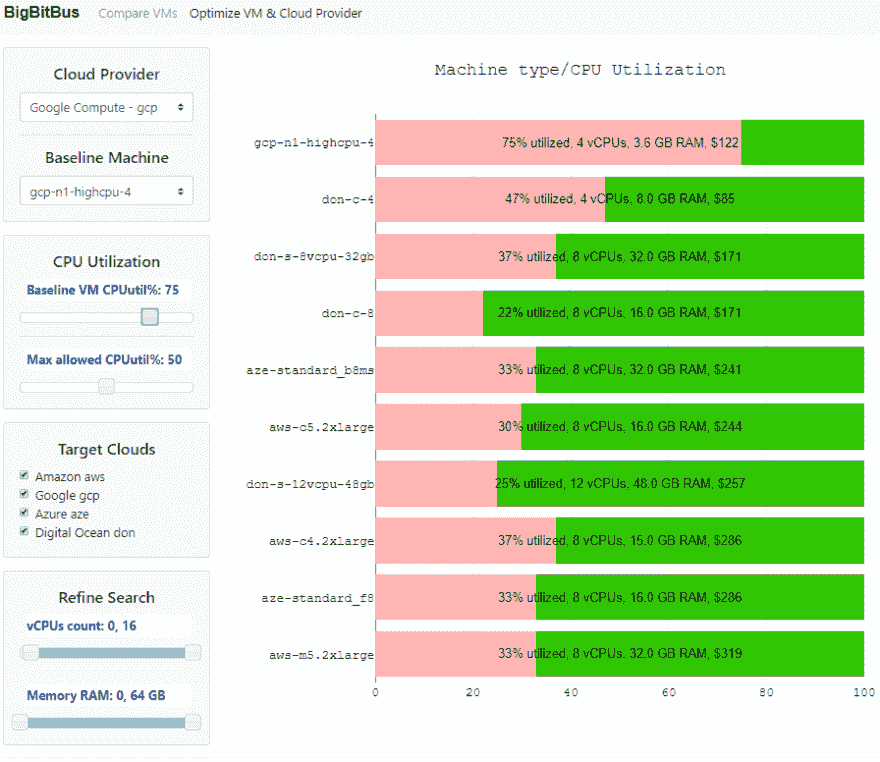

# 选择云提供商和虚拟机:简单的方法

> 原文：<https://dev.to/sachinkagarwal/choosing-cloud-providers-and-virtual-machines-the-easy-way-9f6>

*该工具可能无法在低分辨率的移动设备屏幕上正确呈现；为了获得最佳体验，请使用台式机。*

我们的[虚拟机和云提供商优化工具](https://tools.bigbitbus.com/optimizer/)显示了不同提供商的不同虚拟机的相对 CPU 性能。目前的工具涵盖了来自亚马逊 AWS、谷歌 GCP、微软 Azure 和数字海洋的多达 16 个虚拟 CPU 的许多虚拟机。CPU 性能报告基于我们的虚拟机 CPU 基准测试。其他虚拟机特征，如虚拟 CPU、RAM 和成本的数量，是通过提供商 API 提取的，或者是从云提供商文档中(网络)收集的；这些数据会定期更新，以反映提供商提供的最新数据。

## 工作原理

用户界面在左侧有一系列输入控件，在屏幕中央有一个堆叠条形图。堆叠条形图显示相应虚拟机的 CPU 利用率(粉色)和“未利用”的 CPU 数量(绿色)。关于虚拟机的信息，例如 vCPUs、RAM 和成本的数量，打印在与该虚拟机对应的每个条形上。当用户更改输入控制时，会查询后端，满足输入控制约束的最低成本虚拟机将呈现在堆积条形图上。

该工具的关键特性是，堆叠条形图中描绘的每个虚拟机的 CPU 利用率代表了应用于每个虚拟机的“相同”工作负载。例如，如果 VM_1 的 CPU 利用率(粉色条)为 50%,而另一个 VM_2 的 CPU 利用率为 25%,那么结论是，当将*相同的工作负载*应用于 VM_1 和 VM_2 时，相应的 CPU 利用率将分别为 50%和 25%。这一底层属性让我们可以比较不同虚拟机的 CPU 特征。

**图 BigBitBus 云提供商和虚拟机优化工具用户界面**

### 用户界面上的输入控件

用户可以通过更改左侧面板上的设置来查询我们收集的性能和目录数据。不同的设置解释如下:

#### 云提供商和基线机

选择基准虚拟机。云提供商下拉列表用于按提供商筛选可用的虚拟机；然后可以从显示的选项中选择基准机器。我们一直在努力增加这个目录的大小。图表上最上面的条形始终对应于基准虚拟机。

#### CPU 利用率

这个盒子里有两个滑块。CPU 利用率滑块表示基准虚拟机的 CPU 利用率。例如，如果您的监控仪表板指示基准虚拟机的峰值 CPU 利用率为 70%，那么您应该将此滑块设置为 70%。

第二个滑块用于设置工具将返回的目标(基准的替代)虚拟机的最大 CPU 利用率。例如，如果您希望目标虚拟机的 CPU 利用率不超过 50%，则可以将此滑块设置为 50%。如果您希望将 CPU 利用率提高，请将此滑块设置为较高的百分比，该工具将找到在处理应用的工作负载时运行“更热”的较小(通常更便宜)的虚拟机。

#### 目标云

通过目标云复选框，您可以选择该工具返回哪些云提供商的虚拟机。例如，如果您只想考虑 AWS 虚拟机，则选择 AWS 复选框，取消选择所有其他云提供商复选框。

#### 细化搜索

可以使用这些最小/最大范围滑块来限制 vcpu(RAM)的最小和最大数量。只有满足这些限制的目标机器才会显示。

## 用例

我们通过几个用例来说明该工具的可能用途。

### 用例 1:切换云提供商

希望研究不同云提供商并将一个云提供商中运行的基准虚拟机切换到另一个云提供商的用户可以使用该工具来查找不同云提供商上类似虚拟机的性能和成本。选择基准虚拟机并选择目标云，以及任何 CPU 利用率或 vCPU 数量/RAM 限制，该工具将以最低的成本返回最多 9 个满足所有要求限制的目标虚拟机。

### 用例 2:通过缩减虚拟机规模来降低成本

如果用户发现某个虚拟机处于空闲状态(CPU 利用率低)，他/她可以选择该虚拟机类型作为基准虚拟机，并将 CPU 利用率设置为较低的数值。然后，从图表中显示的选项中，可以选择更适合相同工作负载的较小虚拟机。这是减少云支出的一个好方法。

### 用例 3:选择具有更大 CPU 扩展空间的虚拟机

假设用户发现他/她的虚拟机运行过热(高 CPU 利用率)，那么该工具可以帮助找到运行较冷的合适虚拟机。用户无需猜测并切换到更大的虚拟机(最终导致不必要的低利用率)，而是可以将“最大 CPU 利用率”滑块固定到所需的峰值“热度”，该工具将返回满足约束条件的最低成本虚拟机。

## 常见问题

*   *为什么工具过一会儿就停止响应了？*
    我们抑制请求以保护我们的服务器。如果您达到了节流极限，请等到一个小时后再使用该工具。

*   *为什么其他云提供商没有被纳入比较？*
    我们正在努力将更多提供商的数据整合到我们的系统中；当我们扩大我们的提供者覆盖范围时，请回来查看。如果您代表云提供商，请联系我们，以便我们能够加速将您的产品纳入我们的工具。

*   *为什么我看不到所有供应商的数据？*
    我们目前专注于拥有 16 个或更少 vCPUs 的虚拟机(因为这些虚拟机占已部署虚拟机的绝大多数)；我们还排除了高内存或存储优化的虚拟机(因为我们目前所有的测试都是基于 CPU 的)；当我们扩大我们的虚拟机覆盖范围时，请回来查看。

*   *该工具有多精确？*
    通用 CPU 性能指标评测，如构成该工具基础的那些，很少能代表实际生产工作负载的性能。该工具的数据是比较不同虚拟机的基础，并为我们提供了不同虚拟机之间的“经验法则”或“信封背面”比较，以快速减少云提供商之间的无数虚拟机选择。我们鼓励用户根据其定制测试的定制工作负载彻底调查入围的虚拟机，以便放心地更换虚拟机和提供商。

*   我在工具中发现了不一致/错误。怎么报修/修？
    妙极了！该工具是新的，正在测试中，请通过电子邮件将任何错误、想法、意见或担忧发送给 contact@bigbitbus.com*[来帮助我们。](mailto:contact@bigbitbus.com)*

*   *我们的测试中使用了哪些云提供商数据中心/区域？*
    我们主要使用美国东部云区来执行所有性能测试；成本数据也仅限于该地区。让用户能够在不同的云提供商区域选择特定的数据中心是我们的产品路线图。

*   该工具显示了哪些价格？
    我们展示零售成本(无折扣)。我们知道云提供商向客户提供持续的使用折扣、批量折扣、协商的客户特定折扣和其他促销活动。我们的产品路线图允许用户将此类折扣应用于工具中显示的成本数字。

*   *该工具是否比较 IO 和网络延迟等其他特征？*
    该工具根据 CPU 利用率比较虚拟机。为 IO 和网络比较构建类似的工具在我们的产品路线图中。

*   页面顶部的[虚拟机比较器](https://tools.bigbitbus.com/comparer/)工具链接是什么？我们正在开发另一款工具，用于比较不同云提供商的 2 台虚拟机。当我们收集更好的数据时，这个工具仍然是在 alpha 中。请随意尝试一下，并通过电子邮件将任何错误、想法、评论或担忧发送给 contact@bigbitbus.com[T4 来帮助我们。](mailto:contact@bigbitbus.com)

回到[虚拟机和云提供商优化工具](https://tools.bigbitbus.com/optimizer/)

*BigBitBus 的使命是提高公共云和托管大数据及分析服务的透明度。*